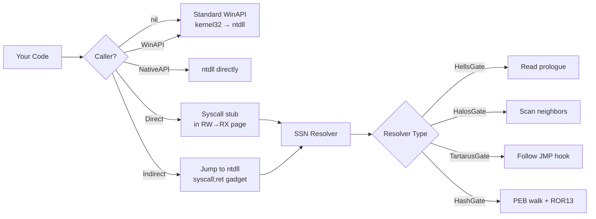
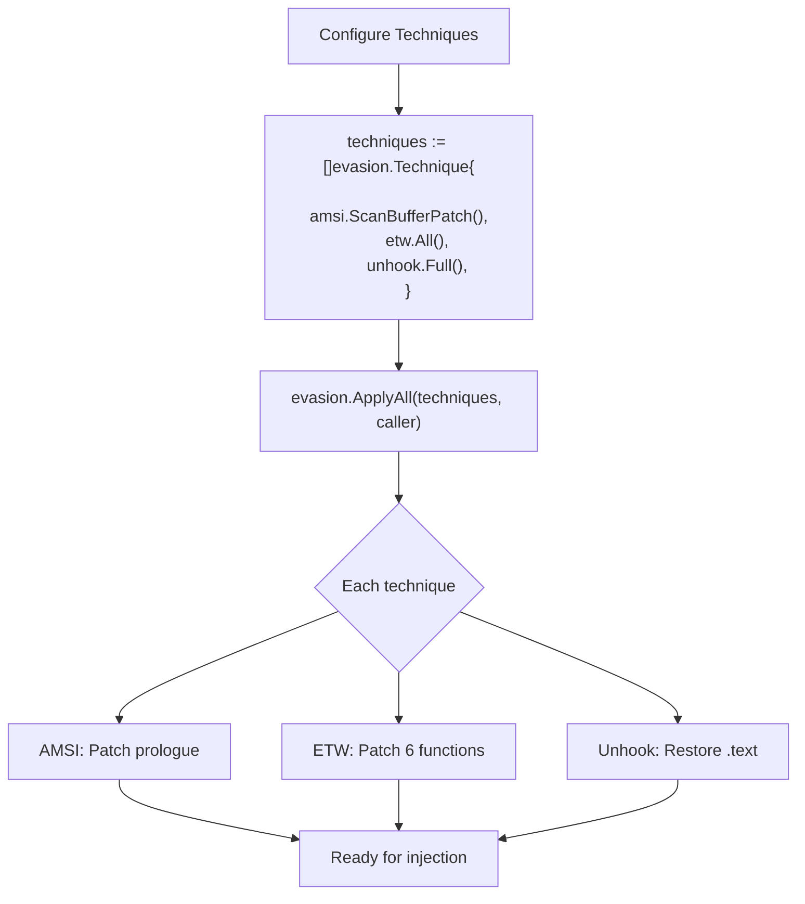
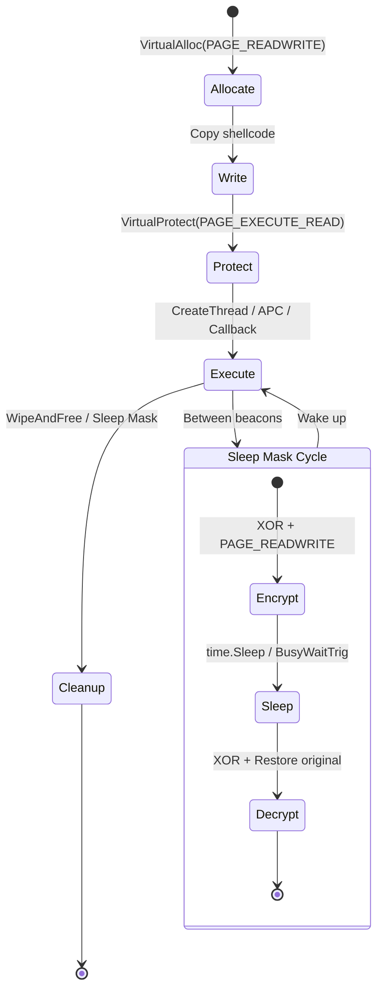

# Architecture

[← Back to README](../README.md)

## Layered Design

maldev follows a strict bottom-up dependency model. Each layer only depends on layers below it.

```mermaid
graph TD
    subgraph "Layer 0 — Pure Go (no OS calls)"
        crypto["crypto/"]
        encode["encode/"]
        hash["hash/"]
        random["random/"]
        useragent["useragent/"]
    end

    subgraph "Layer 1 — OS Primitives"
        api["win/api<br/>DLL handles, PEB walk, API hashing"]
        syscall["win/syscall<br/>Direct/Indirect syscalls, HashGate"]
        ntapi["win/ntapi<br/>Typed NT wrappers, handle enum"]
        token["win/token<br/>Token manipulation"]
        privilege["win/privilege<br/>Elevation helpers"]
        impersonate["win/impersonate<br/>Thread impersonation"]
        version["win/version<br/>Version detection"]
        domain["win/domain<br/>Domain membership"]
        kerneldriver["kernel/driver<br/>BYOVD primitives (Reader/Writer/Lifecycle)"]
    end

    subgraph "Layer 2 — Techniques"
        inject["inject/<br/>15 injection methods"]
        evasion["evasion/<br/>active evasion (amsi, etw, unhook, sleepmask, callstack, kcallback, …)"]
        recon["recon/<br/>read-only discovery (antidebug, antivm, sandbox, timing, hwbp, dllhijack, drive, folder, network)"]
        cleanup["cleanup/<br/>memory, files, timestamps, ads, bsod"]
        pe["pe/<br/>parse, strip, morph, srdi, cert, masquerade, imports"]
        runtime["runtime/<br/>in-process loaders (clr, bof)"]
        process_tamper["process/tamper/<br/>hideprocess, herpaderping, fakecmd, phant0m"]
        process["process/<br/>enum, session"]
        ui["ui/<br/>MessageBox + sounds"]
        credentials["credentials/<br/>lsassdump (LSASS dump + PPL unprotect)"]
        privesc["privesc/<br/>uac (4 bypass) + cve202430088 (kernel LPE)"]
        persistence["persistence/<br/>registry, startup, scheduler, service, lnk, account"]
    end

    subgraph "Layer 3 — Orchestration"
        shell["c2/shell<br/>Reverse shell + state machine"]
        meterpreter["c2/meterpreter<br/>Metasploit staging"]
        transport["c2/transport<br/>TCP, TLS, uTLS, Malleable HTTP"]
        cert["c2/cert<br/>Certificate generation"]
    end

    %% Dependencies
    api --> hash
    syscall --> api
    ntapi --> api
    inject --> api
    inject --> syscall
    evasion --> api
    evasion --> syscall
    evasion --> kerneldriver
    kerneldriver --> api
    credentials --> kerneldriver
    privesc --> ntapi
    privesc --> token
    privesc --> inject
    process_tamper --> api
    shell --> transport
    shell --> evasion
    meterpreter --> transport
    meterpreter --> inject
    meterpreter --> useragent
```

## Caller Pattern

The `*wsyscall.Caller` is the central OPSEC mechanism. Any function that calls NT syscalls accepts an optional Caller parameter:

## Evasion Composition

Evasion techniques compose via the `evasion.Technique` interface:

## Memory Protection Lifecycle

All injection methods follow the RW→RX pattern (never RWX):

## Per-Package Quick-Reference

One-line "what's in here" for every shipping package, grouped by layer.
Click any package name to jump to its area-doc or technique page.

### Layer 0 — Pure Go (no OS calls)

| Package | Surface |
|---|---|
| [`crypto/`](techniques/crypto/README.md) | AES-GCM, ChaCha20, RC4, XOR, TEA/XTEA, S-box, matrix, arith — payload encryption + obfuscation primitives |
| [`encode/`](techniques/encode/README.md) | Base64 (std + URL), UTF-16LE, PowerShell `-EncodedCommand`, ROT13 |
| [`hash/`](techniques/hash/fuzzy-hashing.md) | MD5/SHA1/SHA256/SHA512, ROR13 (API hashing), ssdeep, TLSH |
| `random/` | Crypto-secure random bytes, XOR-shift PRNG |
| `useragent/` | Browser-realistic User-Agent strings |

### Layer 1 — OS Primitives

| Package | Surface |
|---|---|
| `win/api` | DLL handles (`User32`, `Kernel32`, …), `PEB` walk, API hashing |
| `win/syscall` | Direct + Indirect syscalls, `HashGate` lookup |
| `win/ntapi` | Typed `Nt*` wrappers, handle enumeration |
| `win/token` | Token open/duplicate/info |
| `win/privilege` | Elevation helpers (`SeDebugPrivilege`, …) |
| `win/impersonate` | Thread impersonation |
| `win/version`, `win/domain` | Version + domain membership |
| `kernel/driver` | `KernelReader` / `KernelReadWriter` BYOVD interfaces (`rtcore64` impl) |
| `process/enum`, `process/session` | Process enumeration + session helpers |

### Layer 2 — Techniques (active)

| Package | Surface |
|---|---|
| [`evasion/amsi`](techniques/evasion/amsi-bypass.md) | `PatchScanBuffer`, `PatchOpenSession`, `All` |
| [`evasion/etw`](techniques/evasion/etw-patching.md) | `EtwEventWrite` patch, `EtwTi` patch, `All` |
| [`evasion/unhook`](techniques/evasion/ntdll-unhooking.md) | Restore ntdll text section |
| [`evasion/sleepmask`](techniques/evasion/sleep-mask.md) | Ekko, Foliage, multi-region rotation |
| [`evasion/callstack`](techniques/evasion/callstack-spoof.md) | `SpoofCall` synthetic frames |
| [`evasion/kcallback`](techniques/evasion/kernel-callback-removal.md) | `Enumerate`, `Remove`, `Restore` (BYOVD) |
| [`evasion/preset`](techniques/evasion/preset.md) | `Apply`, `ApplyAll` orchestration |
| [`evasion/byovd`](techniques/evasion/byovd-rtcore64.md) | RTCore64 BYOVD driver lifecycle |
| [`evasion/stealthopen`](techniques/evasion/stealthopen.md) | `Opener` interface + transactional NTFS |
| [`process/tamper/fakecmd`](techniques/evasion/fakecmd.md) | PEB CommandLine spoof |
| [`process/tamper/hideprocess`](techniques/evasion/hideprocess.md) | Process Hacker / Explorer in-memory patch |
| [`process/tamper/phant0m`](techniques/evasion/phant0m.md) | Suspend EventLog threads |
| [`recon/*`](recon.md) | antidebug, antivm, sandbox, timing, hwbp, dllhijack, drive, folder, network |
| [`inject/`](injection.md) | 15 injection methods (CRT, EarlyBird, ETW thread, KernelCallbackTable, ModuleStomp, NtQueueApcEx, RemoteThread, SectionMap, ThreadHijack, ThreadPool, …) |
| [`pe/*`](pe.md) | parse, strip, morph (UPX), srdi, cert, masquerade, imports |
| [`cleanup/*`](cleanup.md) | memory wipe, self-delete, timestomp, ADS |
| [`runtime/clr`](runtime.md) | In-process .NET CLR host |
| [`runtime/bof`](runtime.md) | Beacon Object File loader |
| [`credentials/lsassdump`](techniques/collection/lsass-dump.md) | LSASS minidump producer + PPL bypass |
| [`credentials/sekurlsa`](techniques/credentials/sekurlsa.md) | MINIDUMP → MSV1_0 NT-hash extractor (cross-platform) |
| [`privesc/uac`](privilege.md) | 4 UAC bypass primitives |
| [`privesc/cve202430088`](privilege.md) | Kernel LPE PoC |

### Layer 2 — Post-exploitation

| Package | Surface |
|---|---|
| [`persistence/registry`](techniques/persistence/registry.md) | `Run`, `RunOnce`, image-file-execution-options |
| [`persistence/startup`](techniques/persistence/startup-folder.md) | `.lnk` drop in user/all-users Startup |
| [`persistence/scheduler`](techniques/persistence/task-scheduler.md) | `schtasks` wrapper with trigger options |
| [`collection/clipboard`](techniques/collection/clipboard.md) | `ReadText`, `Watch` |
| [`collection/keylog`](techniques/collection/keylogging.md) | Low-level WH_KEYBOARD_LL hook + Ctrl+V capture |
| [`collection/screenshot`](techniques/collection/screenshot.md) | Per-monitor + virtual-desktop PNG capture |
| [`collection/ads`](techniques/collection/alternate-data-streams.md) | NTFS Alternate Data Streams |

### Layer 3 — Orchestration

| Package | Surface |
|---|---|
| [`c2/shell`](techniques/c2/reverse-shell.md) | Reverse-shell state machine + PPID-spoofer |
| [`c2/meterpreter`](techniques/c2/meterpreter.md) | Metasploit reverse-staging (TCP/HTTP/HTTPS/TLS) |
| [`c2/transport`](techniques/c2/transport.md) | TCP, TLS, uTLS, malleable HTTP, named-pipe |
| [`c2/multicat`](techniques/c2/multicat.md) | Operator-side multi-session listener |
| [`c2/cert`](techniques/c2/malleable-profiles.md) | Self-signed cert generation |

## Build Pipeline

