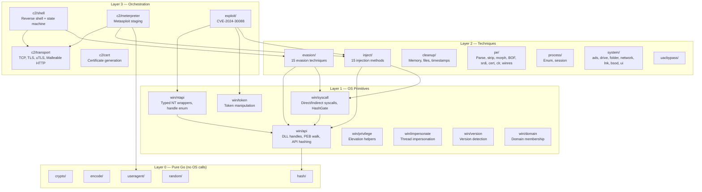
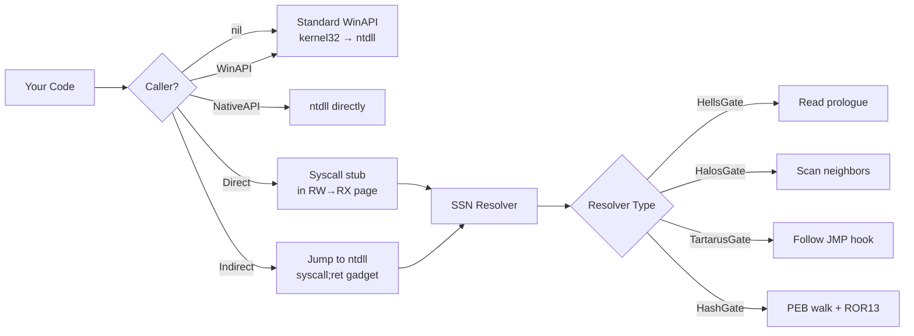
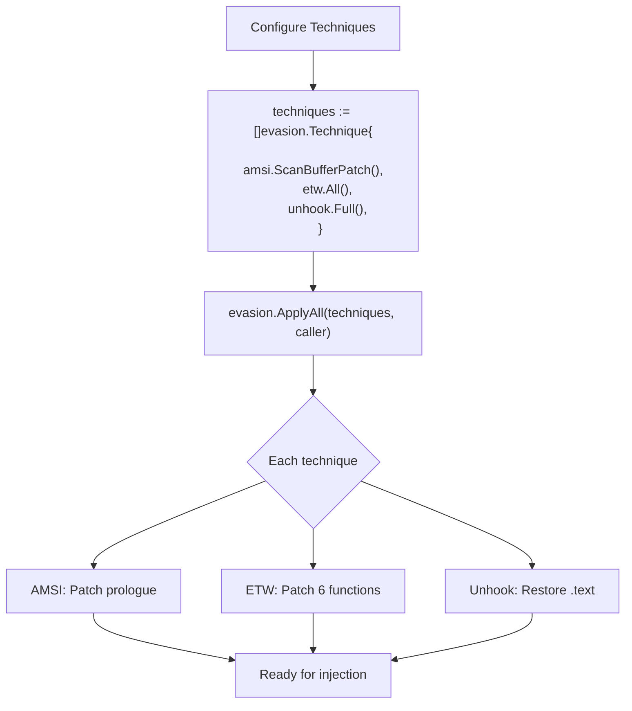
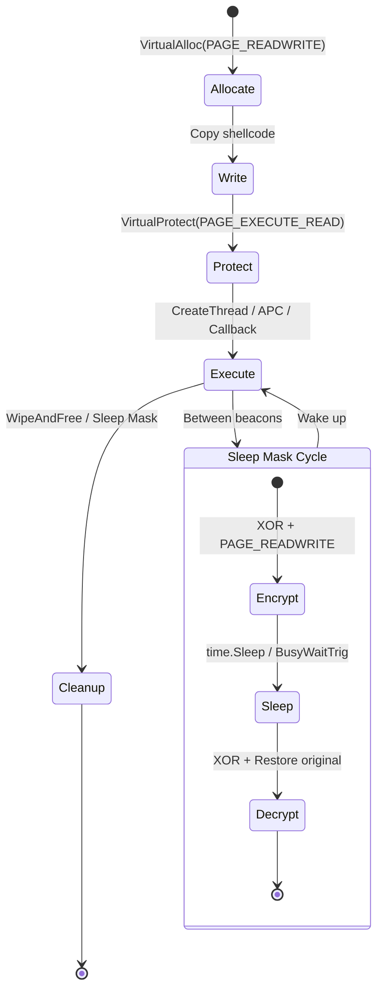

# Architecture

[← Back to README](../README.md)

## Layered Design

maldev follows a strict bottom-up dependency model. Each layer only depends on layers below it.

## Caller Pattern

The `*wsyscall.Caller` is the central OPSEC mechanism. Any function that calls NT syscalls accepts an optional Caller parameter:

## Evasion Composition

Evasion techniques compose via the `evasion.Technique` interface:

## Memory Protection Lifecycle

All injection methods follow the RW→RX pattern (never RWX):

## Build Pipeline

