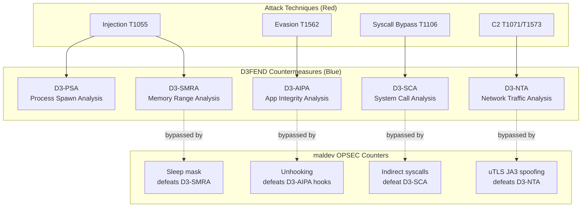

# MITRE ATT&CK + D3FEND Coverage

[← Back to README](../README.md)

## ATT&CK Techniques

| ATT&CK ID | Technique Name | Package(s) | D3FEND Countermeasure |
|-----------|---------------|------------|----------------------|
| T1027 | Obfuscated Files or Information | `evasion/sleepmask`, `pe/strip` | D3-SMRA (System Memory Range Analysis) |
| T1027.002 | Software Packing | `pe/morph` | D3-SEA (Static Executable Analysis) |
| T1036.005 | Masquerading: Match Legitimate Name or Location | `evasion/fakecmd` | D3-PLA (Process Listing Analysis) |
| T1047.001 | Boot or Logon Autostart Execution: Registry Run Keys | `persistence/registry` | D3-SBV (Service Binary Verification) |
| T1053.005 | Scheduled Task/Job: Scheduled Task | `persistence/scheduler` | D3-SBV (Service Binary Verification) |
| T1055 | Process Injection | `inject` (15 methods), `evasion/herpaderping` | D3-PSA (Process Spawn Analysis) |
| T1055.001 | DLL Injection | `pe/srdi`, `inject/phantomdll` | D3-SICA (System Image Change Analysis) |
| T1055.003 | Thread Execution Hijacking | `inject` (ThreadHijack) | D3-PSA |
| T1055.004 | Asynchronous Procedure Call | `inject` (QueueUserAPC, EarlyBirdAPC, NtQueueApcThreadEx) | D3-PSA |
| T1055.012 | Process Hollowing | `inject` (SpawnWithSpoofedArgs) | D3-PSMD (Process Spawn Monitoring) |
| T1056.001 | Input Capture: Keylogging | `collection/keylog` | D3-KBIM (Keyboard Input Monitoring) |
| T1057 | Process Discovery | `process/enum` | D3-PLA (Process Listing Analysis) |
| T1059 | Command and Scripting Interpreter | `c2/shell`, `c2/meterpreter`, `pe/bof` | D3-EFA (Executable File Analysis) |
| T1070 | Indicator Removal on Host | `cleanup/memory` | D3-SMRA |
| T1070.004 | File Deletion | `cleanup/selfdelete`, `cleanup/wipe` | D3-FRA (File Removal Analysis) |
| T1070.006 | Timestomp | `cleanup/timestomp` | D3-FHA (File Hash Analysis) |
| T1071.001 | Web Protocols | `c2/transport/malleable` | D3-NTA (Network Traffic Analysis) |
| T1082 | System Information Discovery | `win/domain`, `win/version` | D3-SYSIP (System Information Profiling) |
| T1083 | File and Directory Discovery | `system/folder` | D3-FDA (File Discovery Analysis) |
| T1106 | Native API | `win/api` (PEB walk, API hashing), `win/syscall`, `win/ntapi` | D3-SCA (System Call Analysis) |
| T1113 | Screen Capture | `collection/screenshot` | D3-DA (Dynamic Analysis) |
| T1115 | Clipboard Data | `collection/clipboard` | D3-DA (Dynamic Analysis) |
| T1120 | Peripheral Device Discovery | `system/drive` | D3-PDD (Peripheral Device Discovery) |
| T1134 | Access Token Manipulation | `win/token`, `win/privilege` | D3-TAAN (Token Auth Normalization) |
| T1134.001 | Token Impersonation/Theft | `win/impersonate`, `win/token` | D3-TAAN |
| T1134.002 | Create Process with Token | `process/session` | D3-TAAN |
| T1136.001 | Create Account: Local Account | `win/user` | D3-UAP (User Account Profiling) |
| T1204.002 | User Execution: Malicious File | `system/lnk` | D3-EFA (Executable File Analysis) |
| T1497 | Virtualization/Sandbox Evasion | `evasion/sandbox` | D3-DA (Dynamic Analysis) |
| T1497.001 | System Checks | `evasion/antivm` | D3-DA |
| T1497.003 | Time Based Evasion | `evasion/timing` | D3-DA |
| T1529 | System Shutdown/Reboot | `system/bsod` | D3-DA (Dynamic Analysis) |
| T1543.003 | Create or Modify System Process: Windows Service | `persistence/service`, `cleanup/service` | D3-SBV (Service Binary Verification) |
| T1547.009 | Shortcut Modification | `system/lnk`, `persistence/startup` | D3-FDA (File Discovery Analysis) |
| T1548.002 | Bypass UAC | `uacbypass` | D3-UAP (User Account Profiling) |
| T1553.002 | Subvert Trust Controls: Code Signing | `pe/cert` | D3-SEA (Static Executable Analysis) |
| T1562.001 | Disable or Modify Tools | `evasion/amsi`, `evasion/etw`, `evasion/unhook`, `evasion/acg`, `evasion/blockdlls` | D3-AIPA (Application Integrity Analysis) |
| T1562.002 | Disable Windows Event Logging | `evasion/phant0m` | D3-EAL (Execution Activity Logging) |
| T1564 | Hide Artifacts | `cleanup/service` | D3-FRA |
| T1573.002 | Asymmetric Cryptography | `c2/transport` (TLS, uTLS) | D3-DNSTA (DNS Traffic Analysis) |
| T1622 | Debugger Evasion | `evasion/antidebug`, `evasion/hwbp` | D3-DICA (Debug Instruction Analysis) |

## D3FEND Defensive Techniques

The D3FEND column above indicates which defensive technique a blue team would use to detect each maldev capability. This helps red teamers understand what they're evading and blue teamers understand what to implement.

