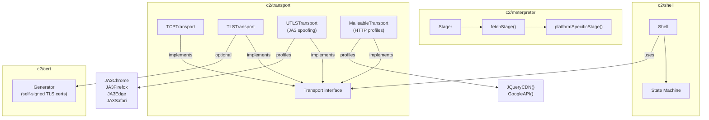

# Command & Control (C2)

[<- Back to Techniques](../../../docs/)

The `c2/` package tree provides a complete C2 communication stack: transport layer (TCP, TLS, uTLS with JA3 spoofing), reverse shell with automatic reconnection, Meterpreter staging, and malleable HTTP profiles for traffic blending.

---

## Architecture Overview

## Documentation

| Document | Description |
|----------|-------------|
| [Reverse Shell](reverse-shell.md) | Shell lifecycle, reconnection with exponential backoff |
| [Meterpreter Stager](meterpreter.md) | TCP/HTTP/HTTPS staging for Metasploit |
| [Transport Layer](transport.md) | TCP, TLS, uTLS with JA3 spoofing, cert pinning |
| [Malleable Profiles](malleable-profiles.md) | HTTP traffic disguise with JQueryCDN and GoogleAPI profiles |

## MITRE ATT&CK

| Technique | ID | Description |
|-----------|-----|-------------|
| Command and Scripting Interpreter: Unix Shell | [T1059.004](https://attack.mitre.org/techniques/T1059/004/) | Reverse shell execution |
| Command and Scripting Interpreter | [T1059](https://attack.mitre.org/techniques/T1059/) | Meterpreter staging |
| Encrypted Channel: Asymmetric Cryptography | [T1573.002](https://attack.mitre.org/techniques/T1573/002/) | TLS/uTLS transport |
| Application Layer Protocol: Web Protocols | [T1071.001](https://attack.mitre.org/techniques/T1071/001/) | Malleable HTTP profiles |

## D3FEND Countermeasures

| Countermeasure | ID | Description |
|----------------|-----|-------------|
| Outbound Connection Analysis | [D3-OCA](https://d3fend.mitre.org/technique/d3f:OutboundConnectionAnalysis/) | Detect reverse shell callbacks |
| DNS Traffic Analysis | [D3-DNSTA](https://d3fend.mitre.org/technique/d3f:DNSTrafficAnalysis/) | Detect C2 DNS patterns |
| Network Traffic Analysis | [D3-NTA](https://d3fend.mitre.org/technique/d3f:NetworkTrafficAnalysis/) | Detect anomalous HTTP patterns |
