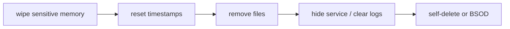

# Cleanup techniques

[← maldev README](../../../README.md) · [docs/index](../../index.md)

On-host **artifact removal** and **anti-forensics** primitives applied at
the end of an operation. Each package targets one specific class of
artifact (file on disk, memory region, NTFS timestamp, service registration,
in-memory state). Compose them as the implant tears itself down.

## TL;DR

A typical end-of-mission chain: `memory.WipeAndFree` keys → `timestomp` any
artefacts you can't delete → `wipe.File` what you can → `service.HideService`
or unregister → `selfdelete.Run` (or `bsod.Trigger` if egress is critical).

> **Where to start (novice path):**
> 1. [`memory-wipe`](memory-wipe.md) — applies during the
>    operation (not just at end). Wipe keys / decrypted bytes
>    as soon as you're done with them.
> 2. [`self-delete`](self-delete.md) — most common end-of-op
>    cleanup. Drop the running EXE from disk while the process
>    keeps executing.
> 3. [`wipe`](wipe.md) + [`timestomp`](timestomp.md) — pair
>    when you can't delete (loaded library, reference held by
>    another process).
> 4. [`ads`](ads.md) — for stashing payloads / state during ops,
>    not just cleanup.
> 5. [`bsod`](bsod.md) — last-resort kill switch only.
>    Destructive + irreversible.

## Packages

| Package | Tech page | Detection | One-liner |
|---|---|---|---|
| [`cleanup/ads`](https://pkg.go.dev/github.com/oioio-space/maldev/cleanup/ads) | [ads.md](ads.md) | quiet | NTFS Alternate Data Streams CRUD |
| [`cleanup/bsod`](https://pkg.go.dev/github.com/oioio-space/maldev/cleanup/bsod) | [bsod.md](bsod.md) | very-noisy | Trigger BSOD via NtRaiseHardError — last-resort kill switch |
| [`cleanup/memory`](https://pkg.go.dev/github.com/oioio-space/maldev/cleanup/memory) | [memory-wipe.md](memory-wipe.md) | very-quiet | SecureZero / WipeAndFree / DoSecret for in-process secrets |
| [`cleanup/selfdelete`](https://pkg.go.dev/github.com/oioio-space/maldev/cleanup/selfdelete) | [self-delete.md](self-delete.md) | moderate | Delete the running EXE via NTFS ADS rename + delete-on-close |
| [`cleanup/service`](https://pkg.go.dev/github.com/oioio-space/maldev/cleanup/service) | [service.md](service.md) | noisy | Hide a Windows service via DACL manipulation |
| [`cleanup/timestomp`](https://pkg.go.dev/github.com/oioio-space/maldev/cleanup/timestomp) | [timestomp.md](timestomp.md) | quiet | Reset `$STANDARD_INFORMATION` MAC timestamps |
| [`cleanup/wipe`](https://pkg.go.dev/github.com/oioio-space/maldev/cleanup/wipe) | [wipe.md](wipe.md) | quiet | Multi-pass random overwrite then `os.Remove` |

## Quick decision tree

| You want to… | Use |
|---|---|
| …forget keys/credentials still in process memory | [`memory.SecureZero`](memory-wipe.md#securezero) or [`memory.WipeAndFree`](memory-wipe.md#wipeandfree) |
| …make a dropped artefact's mtime match `notepad.exe` | [`timestomp.CopyFrom`](timestomp.md#copyfrom) |
| …shred a file before removing it | [`wipe.File`](wipe.md#file) (low-volume forensics) or pair it with [`timestomp`](timestomp.md) |
| …delete the running EXE and exit cleanly | [`selfdelete.Run`](self-delete.md#run) |
| …terminate the host immediately to stop log shipping | [`bsod.Trigger`](bsod.md) (last resort) |
| …hide a Windows service from `services.msc` | [`service.HideService`](service.md#hideservice) |
| …stash a payload on disk where Explorer can't see it | [`ads.Write`](ads.md#write) |

## MITRE ATT&CK

| T-ID | Name | Packages | D3FEND counter |
|---|---|---|---|
| [T1070](https://attack.mitre.org/techniques/T1070/) | Indicator Removal | `cleanup/memory`, `cleanup/timestomp`, `cleanup/wipe`, `cleanup/selfdelete` | D3-RAPA, D3-PFV |
| [T1070.004](https://attack.mitre.org/techniques/T1070/004/) | File Deletion | `cleanup/wipe`, `cleanup/selfdelete` | D3-PFV |
| [T1070.006](https://attack.mitre.org/techniques/T1070/006/) | Timestomp | `cleanup/timestomp` | D3-FH (File Hashing) |
| [T1529](https://attack.mitre.org/techniques/T1529/) | System Shutdown/Reboot | `cleanup/bsod` | D3-PSEP |
| [T1543.003](https://attack.mitre.org/techniques/T1543/003/) | Create or Modify System Process: Windows Service | `cleanup/service` | D3-RAPA |
| [T1564](https://attack.mitre.org/techniques/T1564/) | Hide Artifacts | `cleanup/service`, `cleanup/ads` | D3-RAPA |
| [T1564.004](https://attack.mitre.org/techniques/T1564/004/) | NTFS File Attributes | `cleanup/ads` | D3-FCR (File Content Rules) |

## See also

- [Operator path: cleanup checklist](../../by-role/operator.md#opsec-checklist)
- [Detection eng path: cleanup artifacts](../../by-role/detection-eng.md#cleanup--cleanup)
