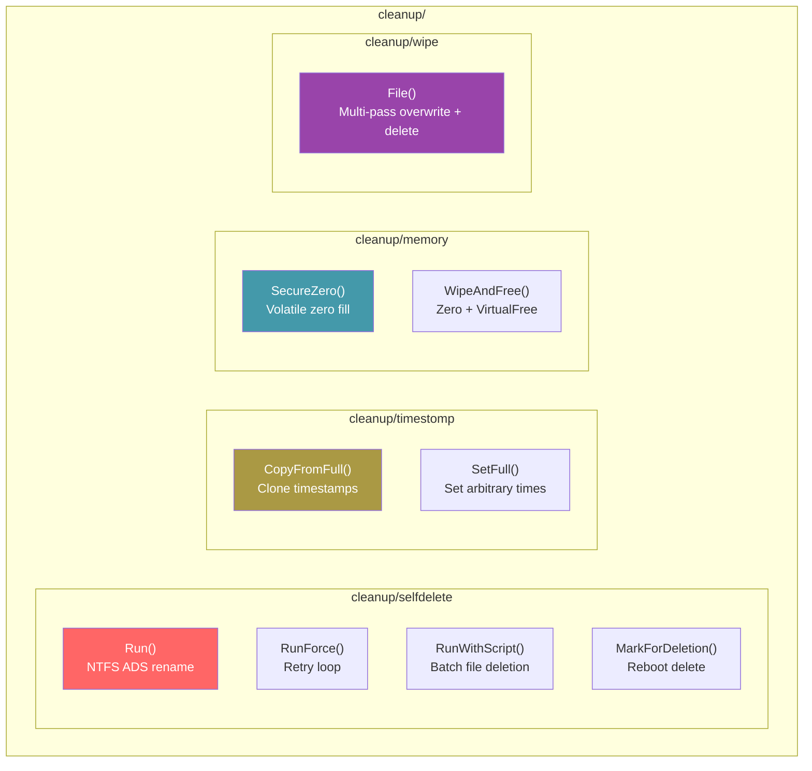

# Cleanup & Anti-Forensics

[<- Back to Techniques](../../../docs/)

The `cleanup/` package tree provides post-operation cleanup techniques: self-deletion of the running executable, timestomping to manipulate file metadata, and secure memory wiping to eliminate forensic evidence.

---

## Architecture Overview

## Documentation

| Document | Description |
|----------|-------------|
| [Self-Deletion](self-delete.md) | Delete the running executable from disk |
| [Timestomping](timestomp.md) | Manipulate file creation/modification times |
| [Memory Wipe](memory-wipe.md) | Secure zeroing of memory and files |

## MITRE ATT&CK

| Technique | ID | Description |
|-----------|-----|-------------|
| Indicator Removal: File Deletion | [T1070.004](https://attack.mitre.org/techniques/T1070/004/) | Self-deletion |
| Indicator Removal: Timestomp | [T1070.006](https://attack.mitre.org/techniques/T1070/006/) | Timestomping |
| Indicator Removal on Host | [T1070](https://attack.mitre.org/techniques/T1070/) | Memory/file wiping |

## D3FEND Countermeasures

| Countermeasure | ID | Description |
|----------------|-----|-------------|
| File Removal Analysis | [D3-FRA](https://d3fend.mitre.org/technique/d3f:FileRemovalAnalysis/) | Detect self-deletion patterns |
| File Hash Analysis | [D3-FHA](https://d3fend.mitre.org/technique/d3f:FileHashAnalysis/) | Detect timestamp inconsistencies |
