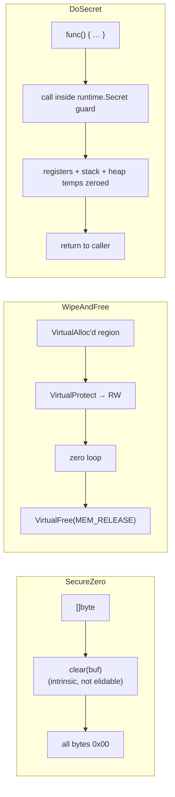

# Secure memory cleanup

[← cleanup index](README.md) · [docs/index](../../index.md)

## TL;DR

Three primitives to erase sensitive data from process memory before it
shows up in a crash dump, a debugger inspection, or a kernel-level
process scan: `SecureZero` (slice), `WipeAndFree` (VirtualAlloc'd
region), `DoSecret` (function-call scope).

## Primer

After your shellcode runs, its decrypted bytes, encryption keys, and C2
addresses sit in process memory. If the process is dumped — by an
analyst, EDR memory scanner, or LSASS-style live snapshot — that data is
exposed.

Naïve approaches fail:

- **`for i := range buf { buf[i] = 0 }`** — Go's optimizer happily
  removes the writes if it sees you don't read the buffer afterwards.
- **`copy(buf, make([]byte, len(buf)))`** — same problem.

Go's `clear` builtin is treated as an intrinsic the compiler must NOT
optimize away. `SecureZero` wraps it. `WipeAndFree` adds the
`VirtualProtect → write zeros → VirtualFree` sequence required when the
memory came from `windows.VirtualAlloc`. `DoSecret` is the experimental
Go 1.26 `runtimesecret` mode: register/stack/heap erasure on function
return.

## How it works



`SecureZero` is the everyday tool. `WipeAndFree` is for the post-shellcode
RWX page. `DoSecret` is the new hotness — wrap any sensitive computation
unconditionally; without `runtimesecret` it's a no-op call.

## API Reference

### `SecureZero(b []byte)`

[godoc](https://pkg.go.dev/github.com/oioio-space/maldev/cleanup/memory#SecureZero)

Overwrite `b` with zeros via `clear`.

**Parameters:** `b` — slice to zero. Length unchanged. Cap unchanged.

**Returns:** none. Slice is mutated in place.

**Side effects:** none beyond the write.

**OPSEC:** invisible to user-mode hooks. Kernel ETW sees nothing.

### `WipeAndFree(addr uintptr, size uint32) error` (Windows-only)

[godoc](https://pkg.go.dev/github.com/oioio-space/maldev/cleanup/memory#WipeAndFree)

Re-protect `addr..addr+size` to RW, write zeros, then `VirtualFree(MEM_RELEASE)`.

**Parameters:** `addr` — base of a `VirtualAlloc`'d region. `size` — bytes
to wipe (typically the original allocation size).

**Returns:** `error` — wraps `VirtualProtect` / `VirtualFree` failures.

**Side effects:** the region becomes inaccessible after `VirtualFree`.
Reading `addr` afterwards faults.

**OPSEC:** standard `VirtualProtect` + `VirtualFree` — high-volume
legitimate calls.

### `DoSecret(f func())`

[godoc](https://pkg.go.dev/github.com/oioio-space/maldev/cleanup/memory#DoSecret)

Run `f` inside a runtime-secret scope. With Go 1.26+ and
`GOEXPERIMENT=runtimesecret`, registers/stack/heap-temporaries used
during `f` are zeroed on return. Without that toolchain, `DoSecret` is a
plain function call.

**Parameters:** `f` — function performing the secret computation.
Side-effects (writes to outer scope) are preserved.

**Returns:** none.

**Side effects:** with the experiment, scratch memory used during `f`
is destroyed.

**OPSEC:** invisible to user-mode hooks; the runtime erasure happens
inside the Go runtime.

## Examples

### Simple

```go
key := crypto.RandomKey(32)
defer memory.SecureZero(key)
// use key …
```

### Composed (with `crypto`)

```go
plaintext := decrypt(payload, key)
defer memory.SecureZero(plaintext)
defer memory.SecureZero(key)
// run shellcode …
```

### Advanced (post-injection cleanup)

```go
addr, _ := windows.VirtualAlloc(0, size,
    windows.MEM_COMMIT|windows.MEM_RESERVE,
    windows.PAGE_EXECUTE_READWRITE)
copy(unsafe.Slice((*byte)(unsafe.Pointer(addr)), size), shellcode)
runShellcode(addr)
_ = memory.WipeAndFree(addr, uint32(size))
```

### Complex (DoSecret for key derivation)

```go
var derived []byte
memory.DoSecret(func() {
    tmp := pbkdf2(password, salt, 100_000, 32)
    derived = make([]byte, len(tmp))
    copy(derived, tmp)
    memory.SecureZero(tmp) // belt + braces while DoSecret-experiment is non-default
})
// derived is the only surviving copy; password / pbkdf2 internals erased on Go 1.26+
```

## OPSEC & Detection

| Artefact | Where defenders look |
|---|---|
| `VirtualProtect(RWX → RW)` then `VirtualFree(MEM_RELEASE)` | EDR call-stack inspection — pattern is benign on its own |
| Process memory scanner finding zeroed pages where shellcode used to be | Periodic memory scanning (hard for blue at scale) |
| Crash dump captured BEFORE `WipeAndFree` runs | Out of scope for this primitive — guard with `defer` early |

**D3FEND counter:** [D3-PMA](https://d3fend.mitre.org/technique/d3f:ProcessMemoryAnalysis/)
(Process Memory Analysis) — defeated by timely cleanup; remains
effective when defender captures dump before cleanup runs.

## MITRE ATT&CK

| T-ID | Name | Sub-coverage |
|---|---|---|
| [T1070](https://attack.mitre.org/techniques/T1070/) | Indicator Removal | in-memory variant |

## Limitations

- **Cannot cover what's already on disk.** If a paged-out region was
  swapped to `pagefile.sys`, `SecureZero` doesn't reach the swap copy.
  Mitigation: `windows.VirtualLock` the region, then `VirtualUnlock` +
  zero before free.
- **`DoSecret` register erasure** requires `GOEXPERIMENT=runtimesecret`
  + Go 1.26+ + linux/amd64 or arm64. Without these, it's a plain call.
- **Compiler tail-call elision** can leak registers across `DoSecret`
  scope on certain architectures — confirm with `go tool objdump` for
  high-stakes uses.
- **Crash dumps** captured before the `defer` runs include the secrets
  in plain text.

## See also

- [`cleanup/wipe`](wipe.md) — same intent, on disk.
- [Go 1.26 release notes — runtimesecret experiment](https://go.dev/doc/go1.26)
  (link valid once 1.26 ships).
- [OWASP — Memory Management Cheat Sheet](https://cheatsheetseries.owasp.org/cheatsheets/Cryptographic_Storage_Cheat_Sheet.html#protect-secrets-in-memory).
