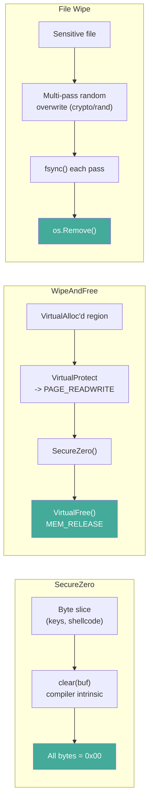
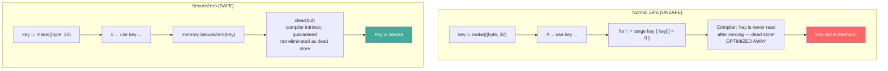

# Secure Memory Cleanup

[<- Back to Cleanup Overview](README.md)

**MITRE ATT&CK:** [T1070 - Indicator Removal on Host](https://attack.mitre.org/techniques/T1070/)
**D3FEND:** [D3-SMRA - System Memory Resident Analysis](https://d3fend.mitre.org/technique/d3f:SystemMemoryResidentAnalysis/)

---

## Primer

After your shellcode runs, its decrypted bytes, encryption keys, and C2 addresses all sit in memory. If the process is dumped (by an analyst or an EDR), all that sensitive data is exposed.

**Shredding the documents before leaving the building.** Secure memory cleanup overwrites sensitive regions with zeros in a way the Go compiler cannot optimize away, then releases the memory pages back to the OS. For files, multi-pass random overwrite ensures data cannot be recovered even with disk forensics.

---

## How It Works

### Memory Wipe Flow



### Why SecureZero is Necessary

The Go compiler performs **dead-store elimination**: if it can prove a variable is never read after being written, it removes the write entirely. A naive zeroing loop at the end of a function is a textbook dead store.



### How SecureZero is Implemented

`SecureZero` delegates to Go's `clear` builtin, introduced in Go 1.21. The compiler treats `clear` as an intrinsic and **never** eliminates it as a dead store, regardless of whether the slice is read afterwards.

```
SecureZero(buf)
    └── memclear.Clear(buf)
          └── clear(buf)    ← Go 1.21+ builtin intrinsic, zero-safe, always emitted
```

The module baselines at `go 1.21` (for Windows 7 binary compatibility), so `clear` is always available. The `internal/compat/memclear` package also keeps a `//go:build !go1.21` fallback using `unsafe.Pointer` writes + `runtime.KeepAlive`, which is effectively dead code under this `go.mod` but documents intent.

### DoSecret — runtime/secret integration (opt-in, Go 1.26+)

`DoSecret(f func())` wraps a function call and, on supported builds, asks the Go runtime to erase the **registers, stack frames, and heap temporaries** used inside `f`. This is a different primitive than `SecureZero`: instead of zeroing a slice you point at, it scrubs everything the wrapped computation touched — including CPU registers and stack locals you cannot address directly from Go.

```
DoSecret(f)
    ├── [go1.26 && goexperiment.runtimesecret build] → runtime/secret.Do(f)
    │       └── effective erasure only on linux/amd64 and linux/arm64
    └── [otherwise]                                   → f()    (no erasure, stub)
```

Two files implement this behind mutually-exclusive build tags:

| File | Build tags | Behavior |
|---|---|---|
| `secret_experimental.go` | `go1.26 && goexperiment.runtimesecret` | Calls `runtime/secret.Do(f)` |
| `secret_stub.go` | `!go1.26 \|\| !goexperiment.runtimesecret` | Calls `f()` directly |

**Enable the real erasure path at build time:**

```bash
GOEXPERIMENT=runtimesecret go build ./...
```

Without that flag (or on Go < 1.26), `DoSecret` is a no-op wrapper — same API, no erasure. This lets callers wrap sensitive computations unconditionally and opt into runtime erasure by rebuilding.

**API:**

```go
// DoSecret invokes f. When built with Go 1.26+ and GOEXPERIMENT=runtimesecret,
// the registers, stack, and heap temporaries used by f are erased on return
// (including on panic or runtime.Goexit).
func DoSecret(f func())

// SecretEnabled reports whether a DoSecret call is on the current goroutine's
// stack. Always false in the stub build.
func SecretEnabled() bool
```

**How DoSecret differs from SecureZero:**

| | `SecureZero(buf)` | `DoSecret(f)` |
|---|---|---|
| What it clears | A specific byte slice you point it at | All of f's stack locals, registers, and GC-reclaimed heap |
| You must identify the secret | Yes | No — the runtime erases everything f touched |
| Catches intermediate values | No | Yes (registers, stack temporaries) |
| Min Go | 1.21 | 1.21 (stub) / 1.26 + `GOEXPERIMENT=runtimesecret` (real) |
| Effective platforms | All | Linux amd64/arm64 only (stub call everywhere else, even on the experimental build) |
| Status | Stable | Experimental |

**Usage pattern** — construct outputs outside, copy from inside:

```go
var result []byte
memory.DoSecret(func() {
    temp := deriveKey(masterSecret)   // temp and intermediates erased on return
    result = make([]byte, len(temp))
    copy(result, temp)
    // result lives outside DoSecret — not erased
})
```

**Key limitations of the runtime-backed path:**

- Global variables and new goroutines spawned inside `f` are **not** erased
- Heap allocations are erased only after the GC reclaims them, not immediately
- Performance overhead grows with the number of allocations inside `f`
- Pointer addresses may leak into GC data structures
- Still experimental upstream — API and behavior may change

**Relationship to the rest of the package:** `DoSecret` and `SecureZero` are complementary. Use `SecureZero` (or `WipeAndFree`) for explicit zeroing of byte buffers you own — that works everywhere and is immediate. On Linux 1.26+ builds with the experiment enabled, wrap sensitive computations in `DoSecret` as well to catch intermediate register/stack values you cannot address directly.

---

## Usage

### SecureZero: Wipe a Byte Slice

```go
import "github.com/oioio-space/maldev/cleanup/memory"

// Wipe an encryption key from memory
key := []byte("my-secret-32-byte-key-here!!!!!")
// ... use key for decryption ...
memory.SecureZero(key)
// key is now all zeros — compiler cannot optimize this away
```

### WipeAndFree: Wipe and Release VirtualAlloc'd Memory

```go
import (
    "golang.org/x/sys/windows"
    "github.com/oioio-space/maldev/cleanup/memory"
)

// Allocate memory for shellcode
size := uintptr(4096)
addr, _ := windows.VirtualAlloc(0, size,
    windows.MEM_COMMIT|windows.MEM_RESERVE,
    windows.PAGE_READWRITE,
)

// ... write shellcode, execute ...

// Secure wipe: zero all bytes, then VirtualFree
if err := memory.WipeAndFree(addr, size); err != nil {
    log.Fatal(err)
}
```

### File Wipe: Multi-Pass Overwrite + Delete

```go
import "github.com/oioio-space/maldev/cleanup/wipe"

// Overwrite with 3 passes of random data, then delete
if err := wipe.File("sensitive-log.txt", 3); err != nil {
    log.Fatal(err)
}
// File is securely deleted
```

### DoSecret: Erase Registers, Stack, and Heap Temporaries

```go
import "github.com/oioio-space/maldev/cleanup/memory"

var sessionKey []byte
memory.DoSecret(func() {
    // All temporaries in this closure (stack slots, registers, heap temps)
    // are erased on return when built with GOEXPERIMENT=runtimesecret.
    master := loadMasterKey()
    defer memory.SecureZero(master)

    tmp := deriveSessionKey(master)      // tmp erased by DoSecret
    sessionKey = make([]byte, len(tmp))  // sessionKey lives outside — kept
    copy(sessionKey, tmp)
})

// Build normally: DoSecret is a no-op wrapper (same API, no erasure).
// Build with GOEXPERIMENT=runtimesecret on Go 1.26+ linux/amd64|arm64
// for real register/stack/heap erasure.
```

---

## Combined Example: Inject, Execute, Clean Up

```go
package main

import (
    "unsafe"

    "golang.org/x/sys/windows"

    "github.com/oioio-space/maldev/cleanup/memory"
    "github.com/oioio-space/maldev/crypto"
)

func main() {
    // Decrypt shellcode
    key, _ := crypto.NewAESKey()
    encPayload := []byte{/* encrypted shellcode */}
    shellcode, _ := crypto.DecryptAESGCM(key, encPayload)

    // Wipe the key immediately after use
    memory.SecureZero(key)

    // Allocate RW memory for shellcode
    size := uintptr(len(shellcode))
    addr, _ := windows.VirtualAlloc(0, size,
        windows.MEM_COMMIT|windows.MEM_RESERVE,
        windows.PAGE_READWRITE,
    )

    // Copy shellcode to allocated memory
    dst := unsafe.Slice((*byte)(unsafe.Pointer(addr)), len(shellcode))
    copy(dst, shellcode)

    // Wipe the Go-managed shellcode slice
    memory.SecureZero(shellcode)

    // Change to RX and execute
    var oldProtect uint32
    windows.VirtualProtect(addr, size, windows.PAGE_EXECUTE_READ, &oldProtect)

    // ... execute shellcode (CreateThread, etc.) ...

    // After execution: wipe and free the executable memory
    memory.WipeAndFree(addr, size)
}
```

---

## Advantages & Limitations

### Advantages

- **Compiler-proof zeroing**: `SecureZero` uses Go's `clear` builtin, a compiler intrinsic that is never eliminated as a dead store
- **Permission-aware**: `WipeAndFree` changes protection to RW before zeroing (handles RX pages)
- **Multi-pass file wipe**: `wipe.File` uses `crypto/rand` for cryptographic randomness
- **fsync per pass**: Each overwrite pass is flushed to physical media
- **Register/stack erasure (opt-in)**: `DoSecret` delegates to `runtime/secret.Do` under a build tag, catching intermediate values you cannot address as a slice
- **Clean API**: `SecureZero(buf)` for slices, `WipeAndFree(addr, size)` for VirtualAlloc'd regions, `DoSecret(f)` for computation scopes

### Limitations

- **No guarantee against swap**: If the OS swapped the page to the pagefile, the data may persist on disk
- **No memory-mapped file support**: `WipeAndFree` only works with `VirtualAlloc`'d regions
- **GC copies**: Go's garbage collector may have copied the data to other heap locations before zeroing
- **SSD wear leveling**: Multi-pass file overwrite may not overwrite the same physical NAND cells on SSDs
- **Process memory dumps**: An EDR may have already captured a memory snapshot before wipe runs

---

## Compared to Other Implementations

| Feature | maldev (memory + wipe) | runtime/secret.Do | RtlSecureZeroMemory | SecureString (.NET) | memset_s (C11) |
|---------|----------------------|------------------|--------------------|--------------------|---------------|
| Language | Go | Go | C (Windows) | C# | C |
| Compiler-proof | Yes (`clear` builtin) | Yes (runtime-level) | Yes (volatile) | Yes (pinned) | Yes (standard) |
| Erases registers/stack | No | Yes | No | No | No |
| VirtualFree integration | Yes | No | No | No | No |
| File wipe | Yes (multi-pass) | No | No | No | No |
| Platform | Windows + Linux | Linux amd64/arm64 | Windows only | .NET only | C11+ |
| Status | Stable | Experimental (Go 1.26+) | Stable | Stable | Stable |

---

## API Reference

### cleanup/memory

Build matrix:

| Symbol | Min Go | Extra | Platforms | Notes |
|---|---|---|---|---|
| `SecureZero` | 1.21 | — | all | `clear` builtin |
| `WipeAndFree` | 1.21 | — | windows | VirtualProtect + VirtualFree |
| `DoSecret` (stub) | 1.21 | — | all | no-op wrapper |
| `DoSecret` (runtime) | 1.26 | `GOEXPERIMENT=runtimesecret` | all build-wise; effective erasure on linux/amd64 + linux/arm64 | wraps `runtime/secret.Do` |
| `SecretEnabled` | same as `DoSecret` | same | same | always `false` in stub build |

```go
// SecureZero overwrites a byte slice with zeros (compiler cannot optimize away).
func SecureZero(buf []byte)

// WipeAndFree zeros a VirtualAlloc'd region and releases it. (windows)
func WipeAndFree(addr, size uintptr) error

// DoSecret invokes f; on the experimental build path, registers, stack, and
// heap temporaries used by f are erased on return.
func DoSecret(f func())

// SecretEnabled reports whether a DoSecret call is on the current goroutine's stack.
func SecretEnabled() bool
```

### cleanup/wipe (cross-platform)

```go
// File securely overwrites a file with random data, then deletes it.
// passes controls the number of overwrite passes (minimum 1).
func File(path string, passes int) error
```

---

## Module-Wide Go Version Policy

The `maldev` module's `go.mod` sets `go 1.21` — the last Go release that produces binaries compatible with Windows 7 and Server 2008 R2. Under that baseline, features requiring a newer Go version are gated behind build tags rather than raising the module's minimum:

| Feature | Tag(s) to opt in | Fallback behavior |
|---|---|---|
| `runtime/secret.Do` (register/stack/heap erasure) | `go1.26 && goexperiment.runtimesecret` | stub: plain call, no erasure |

Any future additions that require a newer Go version must follow the same pattern (two files with mutually-exclusive build tags, a stub that preserves the API). Do not bump the module's `go` directive just to unlock a single feature.
