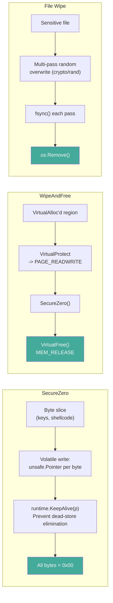

# Secure Memory Cleanup

[<- Back to Cleanup Overview](README.md)

**MITRE ATT&CK:** [T1070 - Indicator Removal on Host](https://attack.mitre.org/techniques/T1070/)
**D3FEND:** [D3-SMRA - System Memory Resident Analysis](https://d3fend.mitre.org/technique/d3f:SystemMemoryResidentAnalysis/)

---

## For Beginners

After your shellcode runs, its decrypted bytes, encryption keys, and C2 addresses all sit in memory. If the process is dumped (by an analyst or an EDR), all that sensitive data is exposed.

**Shredding the documents before leaving the building.** Secure memory cleanup overwrites sensitive regions with zeros in a way the Go compiler cannot optimize away, then releases the memory pages back to the OS. For files, multi-pass random overwrite ensures data cannot be recovered even with disk forensics.

---

## How It Works

### Memory Wipe Flow



### Why SecureZero is Necessary

```mermaid
flowchart TD
    subgraph "Normal Zero (UNSAFE)"
        A1["key := make([]byte, 32)"] --> A2["// ... use key ..."]
        A2 --> A3["for i := range key { key[i] = 0 }"]
        A3 --> A4["Compiler: 'key is never read\nafter zeroing -- dead store'\nOPTIMIZED AWAY"]
        A4 --> A5["Key still in memory!"]
    end

    subgraph "SecureZero (SAFE)"
        B1["key := make([]byte, 32)"] --> B2["// ... use key ..."]
        B2 --> B3["memory.SecureZero(key)"]
        B3 --> B4["Writes via unsafe.Pointer\n(compiler cannot prove dead store)"]
        B4 --> B5["runtime.KeepAlive(p)\n(prevents GC/optimization)"]
        B5 --> B6["Key is zeroed"]
    end

    style A5 fill:#f66,color:#fff
    style B6 fill:#4a9,color:#fff
```



---

## Usage

### SecureZero: Wipe a Byte Slice

```go
import "github.com/oioio-space/maldev/cleanup/memory"

// Wipe an encryption key from memory
key := []byte("my-secret-32-byte-key-here!!!!!")
// ... use key for decryption ...
memory.SecureZero(key)
// key is now all zeros -- compiler cannot optimize this away
```

### WipeAndFree: Wipe and Release VirtualAlloc'd Memory

```go
import (
    "golang.org/x/sys/windows"
    "github.com/oioio-space/maldev/cleanup/memory"
)

// Allocate memory for shellcode
size := uintptr(4096)
addr, _ := windows.VirtualAlloc(0, size,
    windows.MEM_COMMIT|windows.MEM_RESERVE,
    windows.PAGE_READWRITE,
)

// ... write shellcode, execute ...

// Secure wipe: zero all bytes, then VirtualFree
if err := memory.WipeAndFree(addr, size); err != nil {
    log.Fatal(err)
}
```

### File Wipe: Multi-Pass Overwrite + Delete

```go
import "github.com/oioio-space/maldev/cleanup/wipe"

// Overwrite with 3 passes of random data, then delete
if err := wipe.File("sensitive-log.txt", 3); err != nil {
    log.Fatal(err)
}
// File is securely deleted
```

---

## Combined Example: Inject, Execute, Clean Up

```go
package main

import (
    "context"
    "unsafe"

    "golang.org/x/sys/windows"

    "github.com/oioio-space/maldev/cleanup/memory"
    "github.com/oioio-space/maldev/crypto"
)

func main() {
    // Decrypt shellcode
    key, _ := crypto.NewAESKey()
    encPayload := []byte{/* encrypted shellcode */}
    shellcode, _ := crypto.DecryptAESGCM(key, encPayload)

    // Wipe the key immediately after use
    memory.SecureZero(key)

    // Allocate RW memory for shellcode
    size := uintptr(len(shellcode))
    addr, _ := windows.VirtualAlloc(0, size,
        windows.MEM_COMMIT|windows.MEM_RESERVE,
        windows.PAGE_READWRITE,
    )

    // Copy shellcode to allocated memory
    dst := unsafe.Slice((*byte)(unsafe.Pointer(addr)), len(shellcode))
    copy(dst, shellcode)

    // Wipe the Go-managed shellcode slice
    memory.SecureZero(shellcode)

    // Change to RX and execute
    var oldProtect uint32
    windows.VirtualProtect(addr, size, windows.PAGE_EXECUTE_READ, &oldProtect)

    // ... execute shellcode (CreateThread, etc.) ...

    // After execution: wipe and free the executable memory
    memory.WipeAndFree(addr, size)
}
```

---

## Advantages & Limitations

### Advantages

- **Compiler-proof zeroing**: `SecureZero` uses `unsafe.Pointer` writes + `runtime.KeepAlive` to prevent dead-store elimination
- **Permission-aware**: `WipeAndFree` changes protection to RW before zeroing (handles RX pages)
- **Multi-pass file wipe**: `wipe.File` uses `crypto/rand` for cryptographic randomness
- **fsync per pass**: Each overwrite pass is flushed to physical media
- **Clean API**: `SecureZero(buf)` for slices, `WipeAndFree(addr, size)` for VirtualAlloc'd regions

### Limitations

- **No guarantee against swap**: If the OS swapped the page to the pagefile, the data may persist on disk
- **No memory-mapped file support**: `WipeAndFree` only works with `VirtualAlloc`'d regions
- **GC copies**: Go's garbage collector may have copied the data to other heap locations before zeroing
- **SSD wear leveling**: Multi-pass file overwrite may not overwrite the same physical NAND cells on SSDs
- **Process memory dumps**: An EDR may have already captured a memory snapshot before wipe runs

---

## Compared to Other Implementations

| Feature | maldev (memory + wipe) | RtlSecureZeroMemory | SecureString (.NET) | memset_s (C11) |
|---------|----------------------|--------------------|--------------------|---------------|
| Language | Go | C (Windows) | C# | C |
| Compiler-proof | Yes (unsafe + KeepAlive) | Yes (volatile) | Yes (pinned) | Yes (standard) |
| VirtualFree integration | Yes | No | No | No |
| File wipe | Yes (multi-pass) | No | No | No |
| Cross-platform | Partial (memory: Windows, wipe: all) | Windows only | .NET only | C11+ |

---

## API Reference

### cleanup/memory (Windows)

```go
// SecureZero overwrites a byte slice with zeros (compiler cannot optimize away).
func SecureZero(buf []byte)

// WipeAndFree zeros a VirtualAlloc'd region and releases it.
func WipeAndFree(addr, size uintptr) error
```

### cleanup/wipe (Cross-platform)

```go
// File securely overwrites a file with random data, then deletes it.
// passes controls the number of overwrite passes (minimum 1).
func File(path string, passes int) error
```
