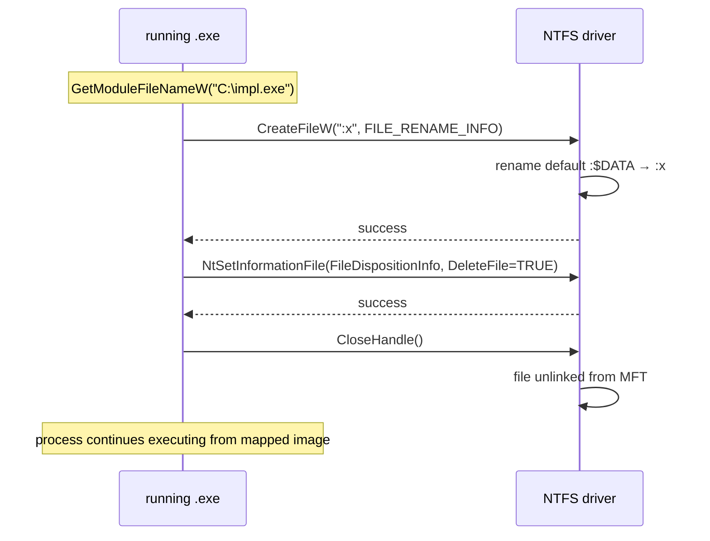

# Self-deletion (running EXE)

[← cleanup index](README.md) · [docs/index](../../index.md)

## TL;DR

Delete the running executable from disk while the process keeps
executing from its in-memory mapped image. The trick: rename the file's
default `:$DATA` stream, then mark for deletion. Windows considers the
file "empty" and tolerates deletion of the running EXE. Four entry
points trade stealth for portability.

## Primer

Windows holds an open handle on a running EXE's image file (it's mapped
into the process). `os.Remove` on a running EXE returns "in use".

The NTFS quirk this package exploits: every file has an unnamed default
data stream `:$DATA` that holds the file's content. NTFS allows you to
**rename** that default stream to a named stream (e.g. `:x`). After
rename, the file from the kernel's perspective has zero bytes in its
default stream — and Windows happily deletes the file even though our
process still has its image mapped.

Three other paths exist when ADS isn't workable:

- `RunForce(retry, duration)` — same trick, retry loop for transient
  locks.
- `RunWithScript` — drop a `.bat` file that polls until the process
  exits, then deletes the EXE. Universal, but the batch script is a
  signature.
- `MarkForDeletion` — `MoveFileEx(MOVEFILE_DELAY_UNTIL_REBOOT)`. No
  on-disk write, but the `PendingFileRenameOperations` registry value
  retains the artefact until next reboot.

## How it works

The ADS-rename path:



Step-by-step:

1. Resolve own path via `GetModuleFileNameW(NULL, …)`.
2. `CreateFileW(path, DELETE | SYNCHRONIZE, FILE_SHARE_READ|WRITE|DELETE, …, OPEN_EXISTING, …)`.
3. `SetFileInformationByHandle(FileRenameInfo, ":x")` — rename
   default stream.
4. `SetFileInformationByHandle(FileDispositionInfo, DeleteFile=TRUE)`
   — schedule deletion at handle close.
5. `CloseHandle()` — file vanishes.
6. The process continues; its image stays mapped.

## API Reference

### `Run() error`

[godoc](https://pkg.go.dev/github.com/oioio-space/maldev/cleanup/selfdelete#Run)

Canonical ADS-rename + delete-on-close path. Quietest variant.

**Parameters:** none — operates on the running EXE.

**Returns:** `error` — wraps `CreateFileW` / `SetFileInformationByHandle`
failures. `nil` on success.

**Side effects:** EXE file disappears from disk; running process
unaffected.

**OPSEC:** rename + DELETE on a running EXE is unusual; EDR with MFT
awareness can flag the FileRenameInfo event.

### `RunForce(retry int, duration time.Duration) error`

[godoc](https://pkg.go.dev/github.com/oioio-space/maldev/cleanup/selfdelete#RunForce)

`Run` with a retry loop for transient `ERROR_SHARING_VIOLATION`.

### `RunWithScript(wait time.Duration) error`

[godoc](https://pkg.go.dev/github.com/oioio-space/maldev/cleanup/selfdelete#RunWithScript)

Drop a batch script alongside the EXE; the script polls until the
process exits, then deletes. Works on FAT/exFAT and on systems where
ADS is locked down. Less stealthy.

### `MarkForDeletion() error`

[godoc](https://pkg.go.dev/github.com/oioio-space/maldev/cleanup/selfdelete#MarkForDeletion)

Schedule deletion at next reboot via `MoveFileEx(MOVEFILE_DELAY_UNTIL_REBOOT)`.
The `HKLM\SYSTEM\CurrentControlSet\Control\Session Manager\
PendingFileRenameOperations` registry value carries the entry until reboot.

### `DeleteFile(path string) error`

Same primitive applied to an arbitrary path (not the running EXE).

### `DeleteFileForce(path string, retry int, duration time.Duration) error`

`DeleteFile` + retry loop.

### `var ErrInvalidHandle error`

Sentinel returned when `CreateFileW` returns `INVALID_HANDLE_VALUE`.

## Examples

### Simple

```go
//go:build windows
package main

import "github.com/oioio-space/maldev/cleanup/selfdelete"

func main() {
    defer selfdelete.Run()
    // implant work …
}
```

### Composed (with `cleanup/memory`)

Wipe in-memory state before disappearing from disk:

```go
defer selfdelete.Run()
defer memory.SecureZero(c2State)
// work …
```

### Advanced (full end-of-mission chain)

```go
defer func() {
    // 1. Reset timestamps so any disk forensic sees a "stale" file.
    _ = timestomp.CopyFrom(`C:\Windows\System32\notepad.exe`, droppedFile)
    // 2. Wipe + delete dropped artefacts.
    _ = wipe.File(droppedFile, 3)
    // 3. Wipe in-memory state.
    memory.SecureZero(stateBuf)
    // 4. Self-delete the running EXE.
    _ = selfdelete.Run()
}()
```

### Complex (RunWithScript fallback)

```go
if err := selfdelete.Run(); err != nil {
    // ADS path failed (FAT volume, locked-down server) — fall back.
    _ = selfdelete.RunWithScript(2 * time.Second)
}
```

## OPSEC & Detection

| Artefact | Where defenders look |
|---|---|
| `FileRenameInfo` on a default-stream rename of a running EXE | Sysmon Event 2 (file creation timestamp change) — partial signal |
| `FileDispositionInfo` setting DELETE on a running EXE | Sysmon Event 23 (FileDelete) |
| MFT entry with `$BITMAP` change (file freed but still in mapping) | Forensic-grade MFT analysis |
| Batch script in `%TEMP%` (RunWithScript) | Sysmon Event 11 + clear signature |
| `PendingFileRenameOperations` registry value (MarkForDeletion) | Reboot-time analysis |

**D3FEND counter:** [D3-FRA](https://d3fend.mitre.org/technique/d3f:FileRemovalAnalysis/)
(File Removal Analysis) — defeats casual deletion patterns; the ADS-rename
variant defeats most file-deletion-watch rules. Hardening: monitor for
`FileRenameInfo` on PE files in writable directories.

## MITRE ATT&CK

| T-ID | Name | Sub-coverage |
|---|---|---|
| [T1070.004](https://attack.mitre.org/techniques/T1070/004/) | Indicator Removal: File Deletion | self-delete-while-running variant |

## Limitations

- **NTFS-only** — `Run` requires ADS support. FAT32, exFAT, ext4 (mounted
  via WSL), or any mounted SMB share without ADS pass-through fail. Use
  `RunWithScript` as fallback.
- **Win11 24H2 (build 26100+)** — `MoveFileEx(MOVEFILE_DELAY_UNTIL_REBOOT)`
  semantics changed; the `PendingFileRenameOperations` value is still
  written but kernel-level processing differs. `MarkForDeletion` may
  silently fail on this build. Track in [docs/testing.md](../../testing.md#cleanup).
- **Defender realtime scan** — if the EXE is in a directory with
  realtime monitoring (anything not in the exclusion list) the rename may
  trigger an AV scan that holds the handle long enough to fail
  `SetFileDisposition`. Use `RunForce`.
- **Process Mitigation** — some EDRs apply `Process Mitigation Policy:
  ProhibitDynamicCode` which doesn't affect this primitive directly,
  but the same EDR likely watches for the unusual rename pattern.

## See also

- [`cleanup/ads`](ads.md) — primitive ADS CRUD; `selfdelete` is its
  highest-leverage user.
- [Original technique writeup — LloydLabs/delete-self-poc](https://github.com/LloydLabs/delete-self-poc).
- [Microsoft — `FileDispositionInfo`](https://learn.microsoft.com/windows/win32/api/winbase/ne-winbase-file_info_by_handle_class).
