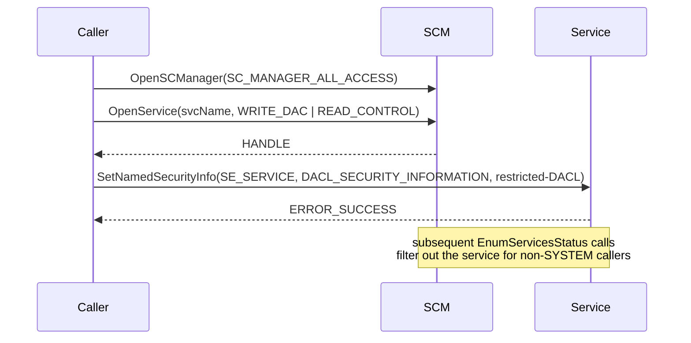

# Hide Windows services via DACL

[← cleanup index](README.md) · [docs/index](../../index.md)

## TL;DR

Apply a restrictive DACL (Discretionary Access Control List) to a Windows
service so users — even Administrators — can't query its config or status
through the SCM. The service still runs. `services.msc`, `sc.exe query`,
`Get-Service`, and most EDR enumerators come up blank.

## Primer

Every Windows service has a security descriptor controlling who can
query, start, stop, change config, or change ACL on it. The default
DACL grants `SERVICE_QUERY_CONFIG | SERVICE_QUERY_STATUS |
SERVICE_INTERROGATE | SERVICE_USER_DEFINED_CONTROL` to interactive users
and admins. Replacing that DACL with one that **denies** those rights
makes the service invisible to standard listing tools without affecting
its execution.

The persistence side (creating + starting the service) lives in
[`persistence/service`](../persistence/README.md). This package handles
the **hiding** side, applied AFTER install.

## How it works



The restricted DACL the package applies:

```
D:(D;;CCSWLOLCRC;;;IU)
 (D;;CCSWLOLCRC;;;SU)
 (D;;CCSWLOLCRC;;;BA)
 (A;;LCRPRC;;;SY)
```

- **D** entries deny `CCSWLOLCRC` (query config / status / control / read
  control) to Interactive Users (IU), Service users (SU), Built-in
  Admins (BA).
- **A** entry allows `LCRPRC` (read DACL + read control + start) to
  SYSTEM only.

Result: the service runs as SYSTEM, but only SYSTEM can enumerate it.

## API Reference

### `Mode` constants

```go
const (
    Native  Mode = iota // SetNamedSecurityInfo (in-process)
    SC_SDSET            // sc.exe sdset (works remotely with hostname)
)
```

### `HideService(mode Mode, host, name string) (string, error)`

[godoc](https://pkg.go.dev/github.com/oioio-space/maldev/cleanup/service#HideService)

Apply the restrictive DACL to `name`.

**Parameters:**

- `mode` — `Native` (preferred for in-process) or `SC_SDSET` (preferred
  for remote — accepts a `\\hostname` UNC).
- `host` — empty for local, `\\REMOTE` for cross-machine via
  `SC_SDSET`.
- `name` — service short name (the value passed to `sc create NAME`).

**Returns:**

- `string` — captured stdout of `sc.exe sdset` when `SC_SDSET`,
  otherwise empty.
- `error` — wraps API failures.

**Side effects:** rewrites the service security descriptor. Reversible
via `UnHideService`.

**OPSEC:** Security event 4670 (DACL change) when object-access auditing is on; `SC_SDSET` adds an `sc.exe` child process.

**Required privileges:** admin (`WRITE_DAC` on the service object).

**Platform:** Windows-only.

### `UnHideService(mode Mode, host, name string) (string, error)`

[godoc](https://pkg.go.dev/github.com/oioio-space/maldev/cleanup/service#UnHideService)

Restore the default DACL on `name`.

**OPSEC:** another DACL change — symmetrical to `HideService`.

**Required privileges:** admin.

**Platform:** Windows-only.

## Examples

### Simple

```go
import "github.com/oioio-space/maldev/cleanup/service"

if _, err := service.HideService(service.Native, "", "MyService"); err != nil {
    log.Fatal(err)
}
// MyService runs but does not appear in services.msc / sc query / Get-Service.

// Restore at end of mission:
_, _ = service.UnHideService(service.Native, "", "MyService")
```

### Composed (with `persistence/service`)

```go
// Install + start
_ = persistenceService.InstallAndStart("MyService", "C:\\Path\\to\\impl.exe")
// Hide
_, _ = service.HideService(service.Native, "", "MyService")
```

### Advanced — remote hide via UNC

```go
out, err := service.HideService(service.SC_SDSET, `\\TARGET-HOST`, "MyService")
if err != nil {
    log.Fatalf("hide on TARGET-HOST: %v\noutput: %s", err, out)
}
```

## OPSEC & Detection

| Artefact | Where defenders look |
|---|---|
| Security event 4670 (DACL change on object) | Audit Object Access policy must be enabled |
| Sysmon Event 4697 (service control change) | Always logged when Sysmon configured |
| Service still listed in `HKLM\SYSTEM\CurrentControlSet\Services\<name>` | Registry-based enumeration sees through DACL |
| `EnumServicesStatusEx` from SYSTEM context returns the service | EDR running as SYSTEM is unaffected |

**D3FEND counter:** [D3-RAPA](https://d3fend.mitre.org/technique/d3f:ResourceAccessPatternAnalysis/)
(Resource Access Pattern Analysis) — registry-based service enumeration
defeats DACL hiding. **Hardening:** scan `HKLM\SYSTEM\CurrentControlSet\
Services\` directly, not via SCM.

## MITRE ATT&CK

| T-ID | Name | Sub-coverage |
|---|---|---|
| [T1564](https://attack.mitre.org/techniques/T1564/) | Hide Artifacts | DACL-based service hiding |
| [T1543.003](https://attack.mitre.org/techniques/T1543/003/) | Create or Modify System Process: Windows Service | hide-side companion to install/start |

## Limitations

- **Requires SeTakeOwnership / WRITE_DAC.** Standard admin OK; non-admin
  cannot rewrite the security descriptor.
- **Defeated by registry enumeration.** Anyone who reads `HKLM\SYSTEM\
  CurrentControlSet\Services\` directly sees the service regardless.
- **SYSTEM-context EDR is unaffected.** The DACL allows SYSTEM read.
- **Audit policy on object access** logs Event 4670 for the DACL change
  itself; not always enabled by default but trivial for blue to enable.
- **`SC_SDSET` mode shells out to `sc.exe`** — leaves a child-process
  artefact that `Native` mode avoids.

## See also

- [`persistence/service`](../persistence/README.md) — install/start side.
- [Microsoft — Service security and access rights](https://learn.microsoft.com/windows/win32/services/service-security-and-access-rights).
- [Sigma rule: service DACL change](https://github.com/SigmaHQ/sigma/blob/master/rules/windows/builtin/security/win_security_dacl_change.yml)
  (illustrative — exact rule path may vary).
