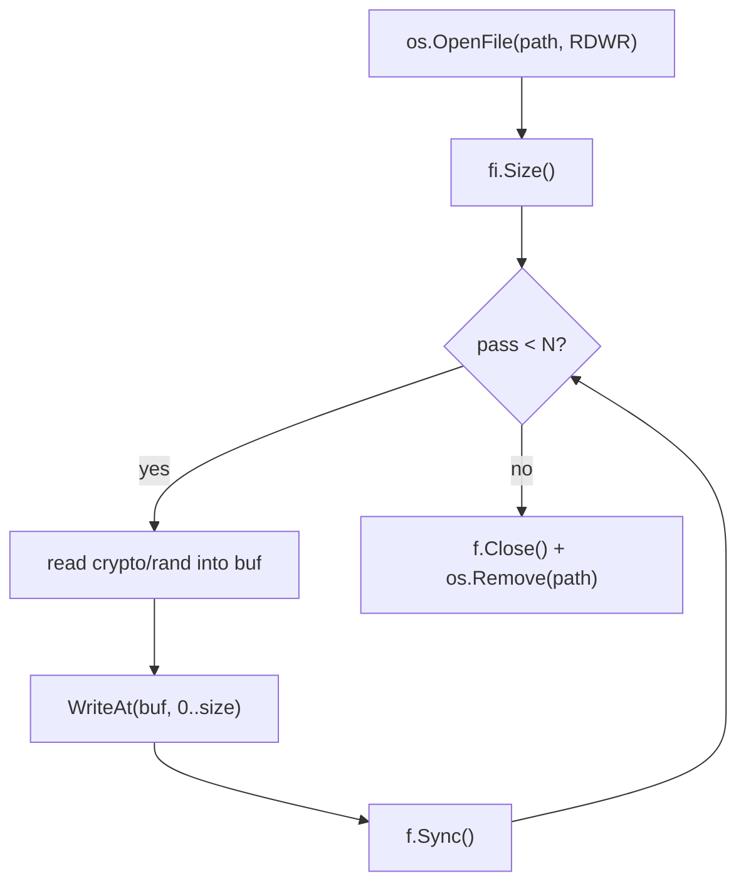

# Secure file wipe

[← cleanup index](README.md) · [docs/index](../../index.md)

## TL;DR

Multi-pass overwrite a file with `crypto/rand` bytes, then `os.Remove`.
Cross-platform. Defeats undelete utilities and partition recovery; does
NOT defeat physical-layer recovery (residual magnetism on HDDs, SSD wear-
levelling remap pools).

## Primer

When you `os.Remove` a file, the OS unlinks the directory entry but the
underlying disk blocks remain readable until reused. Tools like
PhotoRec, Recuva, and `ntfsundelete` walk the MFT and recover those
blocks. A multi-pass random overwrite makes the recovered content
indistinguishable from random — useful for keys, configs, and any
short-lived artefact you want to leave behind cleanly.

The countermeasure isn't perfect: SSDs remap blocks transparently, so
overwriting "the same file" may write to fresh cells while the original
data sits in the wear-levelling pool until the controller rewrites it.
For SSD targets, paired host-level encryption (BitLocker, LUKS) is the
real answer.

## How it works



Each pass reads a new random buffer (no buffer reuse — fresh randomness
forces the filesystem to actually rewrite blocks rather than dedup
identical writes). `f.Sync()` after each pass forces the page cache to
flush to disk.

## API Reference

### `File(path string, passes int) error`

[godoc](https://pkg.go.dev/github.com/oioio-space/maldev/cleanup/wipe#File)

Overwrite `path` with random data `passes` times, then delete it.

**Parameters:**

- `path` — file to wipe. Must exist and be writable.
- `passes` — number of overwrite passes. 1 is sufficient for casual
  defeat of undelete; 3 is the DoD 5220.22-M minimum (largely
  superstition for modern SSDs but standard contract). 7+ is gold-plated.

**Returns:**

- `error` — wraps `os.OpenFile` / `WriteAt` / `Sync` / `os.Remove`
  failures. `nil` on success (file no longer exists).

**Side effects:** writes `passes × file_size` random bytes to disk.

**OPSEC:** generates write events of the same size as the file. Pair with
[`timestomp`](timestomp.md) on the parent directory if directory mtime
matters.

**Required privileges:** unprivileged (caller's write rights on `path`).

**Platform:** cross-platform.

## Examples

### Simple

```go
import "github.com/oioio-space/maldev/cleanup/wipe"

if err := wipe.File("/tmp/secret.bin", 3); err != nil {
    log.Fatal(err)
}
```

### Composed (with `cleanup/timestomp`)

```go
import (
    "github.com/oioio-space/maldev/cleanup/timestomp"
    "github.com/oioio-space/maldev/cleanup/wipe"
)

// Reset parent dir mtime BEFORE wiping the child — otherwise the child
// removal updates the parent dir.
ref := `C:\Windows\System32\notepad.exe`
_ = timestomp.CopyFrom(ref, filepath.Dir(target))

_ = wipe.File(target, 3)

// Re-stomp parent (the unlink we just did updated it again).
_ = timestomp.CopyFrom(ref, filepath.Dir(target))
```

### Advanced

End-of-mission cleanup chain:

```go
// 1. Wipe payload droppers
for _, f := range []string{"impl.dll", "loader.exe", "config.json"} {
    _ = wipe.File(filepath.Join(workDir, f), 3)
}

// 2. Reset workdir parent mtime
_ = timestomp.CopyFrom(`C:\Windows\System32\notepad.exe`, filepath.Dir(workDir))

// 3. Self-delete the running EXE
_ = selfdelete.Run()
```

## OPSEC & Detection

| Artefact | Where defenders look |
|---|---|
| Repeated full-file writes of the same size | EDR file-IO event aggregation |
| `crypto/rand` reads driving large writes | `RtlGenRandom` / `BCryptGenRandom` event volume |
| Final unlink event | NTFS `$LogFile` / Sysmon Event 11 |

**D3FEND counter:** [D3-PFV](https://d3fend.mitre.org/technique/d3f:PersistentFileVolume/)
(Persistent File Volume Inspection) — file-recovery tooling against
journaled filesystems. Mitigates partial overwrites, defeated by complete
multi-pass overwrites only on rotational disks.

## MITRE ATT&CK

| T-ID | Name | Sub-coverage |
|---|---|---|
| [T1070.004](https://attack.mitre.org/techniques/T1070/004/) | Indicator Removal: File Deletion | overwrite-then-delete variant |

## Limitations

- **Not effective on SSDs** at the physical layer (wear levelling).
- **Not effective on copy-on-write filesystems** (ZFS, Btrfs, ReFS) — old
  blocks survive in the volume's snapshot space until garbage-collected.
- **Filesystem journaling** (NTFS `$LogFile`, ext4 jbd2) may retain
  metadata copies of file size and name even after the data blocks are
  overwritten.
- **Antivirus realtime scan** may already have copied the file to its
  scan cache; wiping the original doesn't reach those copies.

## See also

- [`cleanup/selfdelete`](self-delete.md) — for the running EXE itself.
- [`cleanup/timestomp`](timestomp.md) — pair to reset parent-dir mtime.
- [`cleanup/memory`](memory-wipe.md) — same intent, in-memory.
- [DoD 5220.22-M historical reference](https://www.esd.whs.mil/Portals/54/Documents/DD/issuances/dodm/522022M.pdf)
  — the canonical "secure delete" standard.
