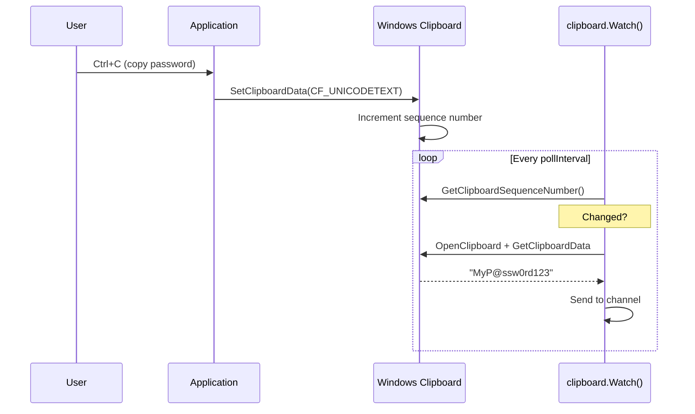

# Clipboard Capture

[<- Back to Collection Overview](README.md)

**MITRE ATT&CK:** [T1115 - Clipboard Data](https://attack.mitre.org/techniques/T1115/)
**Package:** `collection/clipboard`
**Platform:** Windows
**Detection:** Medium

---

## For Beginners

Users frequently copy passwords, credentials, and sensitive data to the clipboard. This technique reads clipboard text on demand or monitors it for changes, capturing everything the user copies.

---

## How It Works



---

## Usage

```go
import "github.com/oioio-space/maldev/collection/clipboard"

// One-shot read
text, err := clipboard.ReadText()

// Continuous monitoring
for content := range clipboard.Watch(ctx, 500*time.Millisecond) {
    fmt.Println("Copied:", content)
}
```

---

## API Reference

See [collection.md](../../collection.md#collectionclipboard----clipboard-monitoring)
