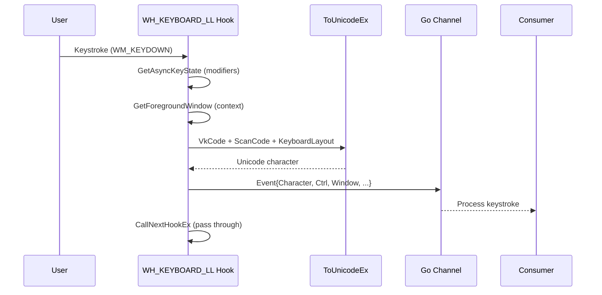

# Keylogging

[<- Back to Collection Overview](README.md)

**MITRE ATT&CK:** [T1056.001 - Input Capture: Keylogging](https://attack.mitre.org/techniques/T1056/001/)
**Package:** `collection/keylog`
**Platform:** Windows
**Detection:** High

---

## For Beginners

A keylogger captures every keystroke typed by the user. This implementation uses a low-level Windows keyboard hook (`SetWindowsHookExW` with `WH_KEYBOARD_LL`) that intercepts keystrokes system-wide before they reach any application.

Each captured keystroke includes the translated character, which window was active, which process owned it, and whether Ctrl/Shift/Alt were held. On Ctrl+V (paste), the clipboard content is also captured.

---

## How It Works



**Key features:**
- `AttachThreadInput` for accurate modifier state from foreground thread
- `ToUnicodeEx` with `wFlags=0x4` to preserve dead key state (OPSEC)
- Foreground window cache (re-queries only on hwnd change)
- Special key labels: `[Enter]`, `[Backspace]`, `[Tab]`, `[F1]`-`[F12]`, arrows, etc.
- Ctrl shortcut detection: `[Ctrl+V]` with clipboard capture

---

## Usage

```go
import "github.com/oioio-space/maldev/collection/keylog"

ch, err := keylog.Start(ctx)
if err != nil {
    log.Fatal(err)
}

for ev := range ch {
    fmt.Printf("%s", ev.Character)
    if ev.Clipboard != "" {
        fmt.Printf(" [pasted: %s]", ev.Clipboard)
    }
}
```

---

## API Reference

See [collection.md](../../collection.md#collectionkeylog----keyboard-hook)
