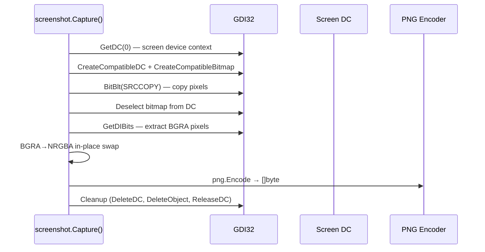

# Screen Capture

[<- Back to Collection Overview](README.md)

**MITRE ATT&CK:** [T1113 - Screen Capture](https://attack.mitre.org/techniques/T1113/)
**Package:** `collection/screenshot`
**Platform:** Windows
**Detection:** Medium

---

## For Beginners

Screen capture takes a screenshot of the user's display and returns it as PNG bytes. This is useful for reconnaissance — seeing what the user is working on, reading documents on screen, or capturing credentials displayed in browser windows.

---

## How It Works



**Multi-monitor:** `DisplayCount()` and `DisplayBounds()` enumerate monitors via `EnumDisplayMonitors`. `CaptureDisplay(index)` captures a specific monitor.

---

## Usage

```go
import "github.com/oioio-space/maldev/collection/screenshot"

// Primary display
png, err := screenshot.Capture()
os.WriteFile("screen.png", png, 0644)

// Specific region
png, err = screenshot.CaptureRect(0, 0, 1920, 1080)

// Specific monitor
count := screenshot.DisplayCount()
for i := 0; i < count; i++ {
    png, _ := screenshot.CaptureDisplay(i)
    os.WriteFile(fmt.Sprintf("monitor_%d.png", i), png, 0644)
}
```

---

## API Reference

See [collection.md](../../collection.md#collectionscreenshot----screen-capture)
