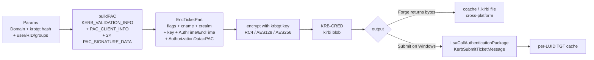

# Kerberos Golden Ticket

[← credentials index](README.md) · [docs/index](../../index.md)

## TL;DR

Forge a long-lived Kerberos TGT off a stolen `krbtgt` hash. `Forge`
marshals a `KRB-CRED` blob with a custom PAC (Domain Admins,
arbitrary lifetime) and signs it with the krbtgt's RC4-HMAC /
AES128-CTS / AES256-CTS key. `Submit` injects the kirbi into the
calling user's LSA cache so subsequent Kerberos auth uses the
forged TGT.

## Primer

Kerberos TGTs are signed by `krbtgt`, a domain-wide service account
whose long-term key never leaves a domain controller. Anyone
holding the krbtgt key can mint a TGT for any principal — there is
no online check until the next krbtgt rotation. Microsoft
recommends rotating krbtgt twice per year; in the wild it is
typically rotated never.

The forged TGT carries a Privilege Attribute Certificate (PAC)
inside its `EncTicketPart`. The PAC is the authorization data: it
declares *which* groups the principal belongs to. By forging the
PAC the operator claims `Domain Admins`, `Enterprise Admins`,
`Schema Admins`, and `Group Policy Creator Owners` regardless of
what the AD database says. The PAC also fixes a `LogonTime` and
`KickoffTime` — set the kickoff 10 years in the future and the
ticket is valid for a decade.

Two PAC signatures (server checksum + KDC checksum) protect the
PAC from tampering; both are computed with the krbtgt key, so once
you have the key you control the signatures too. Member servers
typically don't validate the KDC checksum (the
`PAC_VALIDATE_TICKET` callback is rarely wired up), making the
ticket usable everywhere.

The package supports the three crypto suites Active Directory
shipped with NT 4 → today: RC4-HMAC (NT hash, 16 bytes; legacy but
universally present), AES128-CTS-HMAC-SHA1-96 (16 bytes), and
AES256-CTS-HMAC-SHA1-96 (32 bytes). Modern AES-only domains accept
RC4 tickets only when `RC4_HMAC` is explicitly enabled — check
`msDS-SupportedEncryptionTypes` on the krbtgt object before
choosing.

## How It Works



Implementation details:

- The PAC server signature covers the encrypted ticket bytes; the
  KDC signature covers the server signature. Both are HMAC-MD5
  for RC4 / HMAC-SHA1-96 for AES — keyed on the krbtgt long-term
  key, which is also the ticket-encryption key.
- `default_templates.go` ships `DefaultAdminGroups` —
  `{512, 513, 518, 519, 520}` (Domain Admins, Domain Users,
  Schema Admins, Enterprise Admins, Group Policy Creator Owners).
- `Forge` is deterministic for a fixed `Params` + a fixed
  `Params.NowFunc` — useful for tests and reproducibility.
- `Submit` calls `LsaCallAuthenticationPackage` with
  `KerbSubmitTicketMessage`. The kirbi is written into the
  calling user's per-LUID cache; the next outbound Kerberos
  operation from the process picks it up. No domain controller
  contact is required.

## API Reference

Package: `github.com/oioio-space/maldev/credentials/goldenticket`.
Two-step model — `Forge` builds the kirbi from a krbtgt key
(cross-platform pure Go); `Submit` injects the kirbi into LSA's
per-LUID TGT cache (Windows-only). Forge is deterministic when
`Params.Now` is set, which is the seam the test suite uses for
golden-file diffs.

### Types

#### `type EType int` + 3 constants

- godoc: encryption type for the krbtgt long-term key.
- Description: closed-set enum mapping IANA Kerberos etype numbers to the krbtgt key family. `ETypeRC4HMAC = 23` (RFC 4757 — 16-byte NT hash, weak, but accepted everywhere); `ETypeAES128CTS = 17` (RFC 3962 — 16-byte AES128 long-term key); `ETypeAES256CTS = 18` (RFC 3962 — 32-byte AES256 long-term key, Win10+/Server 2016+ default).
- Side effects: pure data.
- OPSEC: forging an RC4 ticket against an AES-only domain triggers Event 4769 with anomalous etype — modern AD telemetry catches this immediately. Match the etype to the domain's krbtgt key.
- Required privileges: none (data).
- Platform: cross-platform.

#### `(EType).String() string`

- godoc: returns the canonical IANA name — `"rc4-hmac"`, `"aes128-cts-hmac-sha1-96"`, `"aes256-cts-hmac-sha1-96"`, `"etype-unknown"`.
- Description: switch over the three constants. Used by logs/diagnostics, not by the Kerberos wire format itself.
- Parameters: receiver.
- Returns: ASCII string.
- Side effects: none.
- OPSEC: silent.
- Required privileges: none.
- Platform: cross-platform.

#### `type Hash struct`

- godoc: the krbtgt long-term key. `Type` selects the algorithm; `Bytes` must be the canonical size for that EType (16 for RC4/AES128, 32 for AES256). Validated in `Params.normalize`.
- Description: pure data — fields are `Type EType` + `Bytes []byte`. Source the bytes from `lsadump::trust /patch` (mimikatz), `secretsdump.py` (impacket), or this package's `credentials/sekurlsa` extractor on a DC.
- Side effects: pure data.
- OPSEC: the bytes themselves are the most sensitive material in the whole AD compromise — anyone holding the krbtgt key forges domain-level TGTs at will.
- Required privileges: none (data).
- Platform: cross-platform.

#### `type Params struct`

- godoc: Forge inputs. Required: `Domain`, `DomainSID`, `Hash`. Every other field has a sensible default — minimal usage is just those three.
- Description: full field semantics — `Domain` (FQDN of the target AD domain); `DomainSID` (`S-1-5-21-...` prefix shared by every account in Domain); `User` (sAMAccountName impersonated, default `"Administrator"`); `UserRID` (default 500 — built-in Administrator); `Groups` (default `DefaultAdminGroups` when nil/empty); `Hash` (krbtgt key); `PrincipalName` (default `"krbtgt/<Domain uppercase>"`); `Lifetime` (default 10 years — historical mimikatz default, well over any AD policy ceiling); `Now` (default `time.Now()` at Forge time, exposed for deterministic golden-file tests); `LogonID` (default 0, meaningful only post-Submit).
- Side effects: pure data.
- OPSEC: a Lifetime > the domain's MaxTicketAge GPO triggers Event 4769 anomalies on every renewal attempt. The 10-year default is intentional ("god ticket") but loud in any monitored environment.
- Required privileges: none (data).
- Platform: cross-platform.

#### `var DefaultAdminGroups []uint32`

- godoc: `{RIDDomainUsers (513), RIDDomainAdmins (512), RIDGroupPolicyAdmins (520), RIDSchemaAdmins (518), RIDEnterpriseAdmins (519)}` — the canonical mimikatz `kerberos::golden` group set when `/groups` is omitted.
- Description: equivalent to membership in every domain-wide privileged group. Used when `Params.Groups` is nil or empty.
- Side effects: pure data — slice may be appended to by callers (mutating the package-level var would surprise other goroutines, so callers should copy first).
- OPSEC: this five-RID claim in a PAC is a Sigma-rule fingerprint of forged TGTs from public tooling. Custom group sets are stealthier.
- Required privileges: none.
- Platform: cross-platform.

#### Group RID constants

```go
RIDDomainAdmins      uint32 = 512
RIDDomainUsers       uint32 = 513
RIDDomainComputers   uint32 = 515
RIDDomainControllers uint32 = 516
RIDSchemaAdmins      uint32 = 518
RIDEnterpriseAdmins  uint32 = 519
RIDGroupPolicyAdmins uint32 = 520
```

Standard well-known AD group RIDs. Use these instead of magic
numbers in `Params.Groups`.

#### Sentinel errors

```go
ErrInvalidParams              // pre-flight validation failure (missing Domain/DomainSID, zero-length Hash.Bytes, hash size != EType.keyLen)
ErrPACBuild                   // PAC marshaler failed (NDR encoding, struct alignment, signature placeholder)
ErrTicketBuild                // EncTicketPart / KRB-CRED marshaler failed
ErrSubmit                     // LsaCallAuthenticationPackage returned non-success or kirbi unparseable into KERB_SUBMIT_TKT_REQUEST
ErrPlatformUnsupported        // returned by Submit on non-Windows

ErrPACMissingServerSignature  // ValidatePAC: parsed PAC has no server-checksum buffer
ErrPACMissingKDCSignature     // ValidatePAC: parsed PAC has no KDC-checksum buffer
ErrInvalidServerSignature     // ValidatePAC: server signature does not match the supplied krbtgt key
ErrInvalidKDCSignature        // ValidatePAC: KDC signature does not match the server-signature bytes
```

`errors.Is(err, ErrInvalidParams)` lets callers branch on
validation vs marshalling failures without parsing the wrapped
`%w` chain.

### Producers

#### `Forge(p Params) ([]byte, error)`

- godoc: build and encrypt a Golden Ticket kirbi from the supplied parameters.
- Description: validates `p` via `Params.normalize` (rejects missing required fields and mismatched hash sizes), builds the PAC (`KerberosValidationInfo` + `PACClientInfo` + Server/KDC checksum placeholders), wraps the PAC into the EncTicketPart authdata, encrypts the EncTicketPart under the krbtgt key, computes the PAC server signature (HMAC-MD5 for RC4, AES-CTS-HMAC for AES) and KDC signature, then marshals the whole thing into the KRB-CRED ASN.1 envelope. Pure Go, cross-platform.
- Parameters: `p` Params with at minimum `Domain` + `DomainSID` + `Hash` set.
- Returns: `[]byte` KRB-CRED blob (kirbi format — binary-compatible with mimikatz `kerberos::golden /ticket:`, Rubeus `asktgt`, and `klist` parsing). Wrapped errors `ErrInvalidParams` / `ErrPACBuild` / `ErrTicketBuild`.
- Side effects: none — pure compute, no I/O, no syscalls.
- OPSEC: the forged ticket is detectable post-hoc by any of: anomalous etype (RC4 in an AES domain), Lifetime > MaxTicketAge, missing pre-auth on the originating logon (Event 4768 not present before the 4769 service-ticket request). The bytes themselves are indistinguishable from a legitimate kirbi.
- Required privileges: none — Forge is offline.
- Platform: cross-platform.

#### `ValidatePAC(pacBytes []byte, h Hash) error`

- godoc: verify the server + KDC signatures embedded in `pacBytes` against the supplied krbtgt key.
- Description: parses the PAC, locates the server (type 0x06) + KDC (type 0x07) signature buffers, saves their current values, zeroes them in a working copy, recomputes the server checksum over the zeroed bytes, then recomputes the KDC checksum over the saved server-signature bytes. Returns `nil` when both match. The dance mirrors MS-PAC §2.8 in reverse, using the same `pacChecksum` helper that `Forge` uses, so a forged-then-validated round-trip is bit-identical.
- Parameters: `pacBytes` raw PAC blob (typically obtained via the unexported `buildPAC` from a forge round-trip, or extracted from a captured-from-DC ticket); `h` krbtgt secret + etype.
- Returns: `nil` on success; one of the four sentinels above on signature mismatch / missing-buffer; wrapped parse / FSCTL error otherwise.
- Side effects: none — pure compute, no I/O, no syscalls. Constant-time comparison via `hmac.Equal`.
- OPSEC: invisible. Use cases: round-trip self-test (forge → validate → confirm before submission), operator pre-flight (validate a captured-from-DC PAC against a stolen krbtgt to confirm the key works), defensive sanity check (assert the blue team's verification path would accept the forged PAC).
- Limitations: does NOT validate `TicketChecksum` (type 0x10) or `ExtendedKDCChecksum` (type 0x13). Most golden tickets don't carry them; their inclusion is a 2022+ Kerberos hardening concern out of scope for the current `Forge` path. Logical PAC validity (well-formed UNICODE_STRING fields, plausible RIDs, group-membership coherence) is the consumer's concern; ValidatePAC only verifies the cryptographic signatures.
- Required privileges: none — pure offline compute over caller-supplied bytes.
- Platform: cross-platform.

#### `Submit(kirbi []byte) error`

- godoc: inject the kirbi into the calling user's per-LUID LSA TGT cache via `LsaCallAuthenticationPackage(KerbSubmitTicketMessage)`.
- Description: parses the kirbi back into a `KERB_SUBMIT_TKT_REQUEST`, then calls `Secur32!LsaCallAuthenticationPackage` with the Kerberos package handle (auto-resolved via `LsaLookupAuthenticationPackage("Kerberos")`). The caller's process must already hold a logon session — typically any interactive or non-anonymous process satisfies this. The injected ticket persists in the LUID's cache until process exit, krbtgt rotation, or `klist purge`. Does **not** contact a DC.
- Parameters: `kirbi` the byte blob from `Forge` (or any compatible source).
- Returns: nil on success; `ErrSubmit` on `LsaCallAuthenticationPackage` non-success (status surfaced in the wrapped chain); `ErrPlatformUnsupported` on non-Windows builds.
- Side effects: writes one TGT into the calling user's per-LUID cache. Stays for the lifetime of the LUID (typically: until logoff).
- OPSEC: `LsaCallAuthenticationPackage` itself is unremarkable — the same path legitimate Kerberos consumers use. Detection focuses on the resulting **use** of the ticket, not the submission. After Submit, any KRB-AP-REQ generated from the LUID will use the forged TGT — observable in Event 4769 with the forged ticket's anomalies (above).
- Required privileges: none beyond holding a logon session. `Submit` injects into the **calling** LUID; SYSTEM context injects into SYSTEM's cache, user context into the user's. Use `impersonate.ImpersonateToken` first to target a specific LUID.
- Platform: Windows. Linux/macOS stub returns `ErrPlatformUnsupported`.

## Examples

### Simple — forge with defaults, write to disk

```go
import (
    "os"

    "github.com/oioio-space/maldev/credentials/goldenticket"
)

p := goldenticket.Params{
    Domain:    "corp.example.com",
    DomainSID: "S-1-5-21-1111-2222-3333",
    Hash: goldenticket.Hash{
        EType: goldenticket.ETypeAES256CTSHMACSHA196,
        Bytes: aes256KrbtgtKey,
    },
}
kirbi, err := goldenticket.Forge(p)
if err != nil {
    panic(err)
}
_ = os.WriteFile("admin.kirbi", kirbi, 0600)
```

### Composed — forge + inject into current process

```go
kirbi, err := goldenticket.Forge(p)
if err != nil {
    panic(err)
}
if err := goldenticket.Submit(kirbi); err != nil {
    panic(err)
}
// any subsequent Kerberos call (SMB, LDAP, RDP) from this process
// authenticates as p.User with the forged group memberships.
```

### Composed — pre-flight validation (operator sanity check)

```go
import (
    "errors"
    "log"

    "github.com/oioio-space/maldev/credentials/goldenticket"
)

// Use case: I just stole a krbtgt key from a DC LSASS dump. Did
// the dump survive the round-trip cleanly? Does my key actually
// produce a PAC that re-validates? Run a self-test before risking
// detection by submitting the kirbi.
//
// `pacBytes` here is the raw PAC blob from a captured ticket or a
// round-tripped Forge → extract-PAC sequence. ValidatePAC is the
// reverse of buildPAC's signature dance.
err := goldenticket.ValidatePAC(pacBytes, krbtgtHash)
switch {
case err == nil:
    log.Println("PAC signatures valid — krbtgt key works")
case errors.Is(err, goldenticket.ErrInvalidServerSignature):
    log.Println("server signature mismatch — wrong key or tampered PAC body")
case errors.Is(err, goldenticket.ErrInvalidKDCSignature):
    log.Println("KDC signature mismatch — server sig was tampered after forge")
default:
    log.Printf("PAC validation failed: %v", err)
}
```

### Advanced — chained off the sekurlsa extractor

```go
import (
    "github.com/oioio-space/maldev/credentials/goldenticket"
    "github.com/oioio-space/maldev/credentials/sekurlsa"
)

res, _ := sekurlsa.ParseFile(`C:\dc01-lsass.dmp`, nil)
defer res.Wipe()

// Find the krbtgt session in the parsed dump.
var krbtgtKey []byte
for _, sess := range res.Sessions {
    if sess.UserName == "krbtgt" {
        for _, c := range sess.Credentials {
            if msv, ok := c.(*sekurlsa.MSVCredential); ok {
                krbtgtKey = msv.NTHash
            }
        }
    }
}

p := goldenticket.Params{
    Domain:    "corp.example.com",
    DomainSID: "S-1-5-21-1111-2222-3333",
    Hash: goldenticket.Hash{
        EType: goldenticket.ETypeRC4HMAC,
        Bytes: krbtgtKey,
    },
}
kirbi, _ := goldenticket.Forge(p)
_ = goldenticket.Submit(kirbi)
```

See [`ExampleForge`](../../../credentials/goldenticket/goldenticket_example_test.go)
+ [`ExampleSubmit`](../../../credentials/goldenticket/goldenticket_example_test.go)
for the runnable variants.

## OPSEC & Detection

| Artefact | Where defenders look |
|---|---|
| TGT lifetime > `MaxTicketLifetime` (default 10h) | Kerberos audit (Event 4769); long-lived tickets stand out trivially |
| `Domain Admins` membership for an account that doesn't have it in AD | LDAP cross-checks against actual `memberOf` |
| RC4 etype on a domain that enforces AES | Event 4769 with `Ticket Encryption Type 0x17` — anomalous on modern domains |
| `LsaCallAuthenticationPackage` from non-Lsass process | EDR API telemetry (Defender for Identity, MDE) |
| Ticket reuse from atypical workstations | Authentication-source IP correlation |

**D3FEND counters:**

- [D3-AZET](https://d3fend.mitre.org/technique/d3f:AuthorizationEventThresholding/)
  — flags long-lived TGTs and unexpected admin-group access.
- [D3-NTA](https://d3fend.mitre.org/technique/d3f:NetworkTrafficAnalysis/)
  — correlates Kerberos traffic to authentication-source anomalies.

**Hardening for the operator:**

- Set `Lifetime` to a value the domain's policy actually allows
  (`MaxTicketLifetime`, default 10h) at the cost of frequent
  refreshes — reduces the loudest indicator.
- Use the actual etype the domain expects; AES256 is the modern
  default.
- Forge for a non-admin principal that legitimately needs broad
  access (Backup Operator, Replicator) instead of `Administrator`
  to dodge naive group-name allowlists.
- Forge `Forge` on a Linux launchpad and only ship the kirbi to
  the target — the binary size on the Windows host stays minimal.

## MITRE ATT&CK

| T-ID | Name | Sub-coverage | D3FEND counter |
|---|---|---|---|
| [T1558.001](https://attack.mitre.org/techniques/T1558/001/) | Steal or Forge Kerberos Tickets: Golden Ticket | full — Forge + Submit | D3-AZET, D3-NTA |
| [T1550.003](https://attack.mitre.org/techniques/T1550/003/) | Use Alternate Authentication Material: Pass the Ticket | partial — `Submit` is the inject side; `Forge` produces the ticket | D3-NTA |

## Limitations

- **krbtgt rotation defeats the ticket.** AD silently retires
  forged TGTs after the second rotation — no error, the ticket
  simply stops decrypting.
- **No Diamond / Sapphire variants.** This package forges classic
  Golden Tickets only; Diamond Tickets (modify-don't-forge) and
  Sapphire Tickets (modify a real TGT's PAC via S4U2Self) are not
  in scope.
- **No Silver Ticket support.** Silver Tickets target a service
  account's NTLM hash and forge service-specific TGS tickets;
  algorithm overlaps but `PrincipalName` and the encryption key
  are different — separate package.
- **Submit is per-process, per-LUID.** The injected ticket only
  helps Kerberos calls from *this* process; child processes
  inherit the cache but unrelated processes do not.
- **PAC structural validation gap (logical only).** `Forge` does
  not validate the produced PAC against MS-PAC §2 except by
  checksumming. Hand-crafted group RIDs that don't exist won't be
  rejected by the package itself — defenders can. The new
  `ValidatePAC` covers cryptographic signature integrity (server +
  KDC) but NOT logical field validity (RID plausibility,
  UNICODE_STRING shape, group-membership coherence).
- **`ValidatePAC` does not check `TicketChecksum` (type 0x10) or
  `ExtendedKDCChecksum` (type 0x13).** Most golden tickets don't
  carry them; their inclusion is a 2022+ Kerberos hardening
  concern out of scope for the current `Forge` path. When/if Forge
  starts emitting them, ValidatePAC must be extended in the same
  commit.

## See also

- [`credentials/sekurlsa`](sekurlsa.md) — extracts krbtgt hashes
  from a DC LSASS dump.
- [`credentials/lsassdump`](lsassdump.md) — produces the LSASS
  dump consumed by sekurlsa.
- [Operator path](../../by-role/operator.md#credential-harvest)
  — where Golden Ticket fits in the harvest chain.
- [Detection eng path](../../by-role/detection-eng.md#credential-access)
  — Kerberos audit signals.
- [MS-PAC §2](https://learn.microsoft.com/en-us/openspecs/windows_protocols/ms-pac/166d8064-c863-41e1-9c23-edaaa5f36962)
  — public PAC structure spec.
