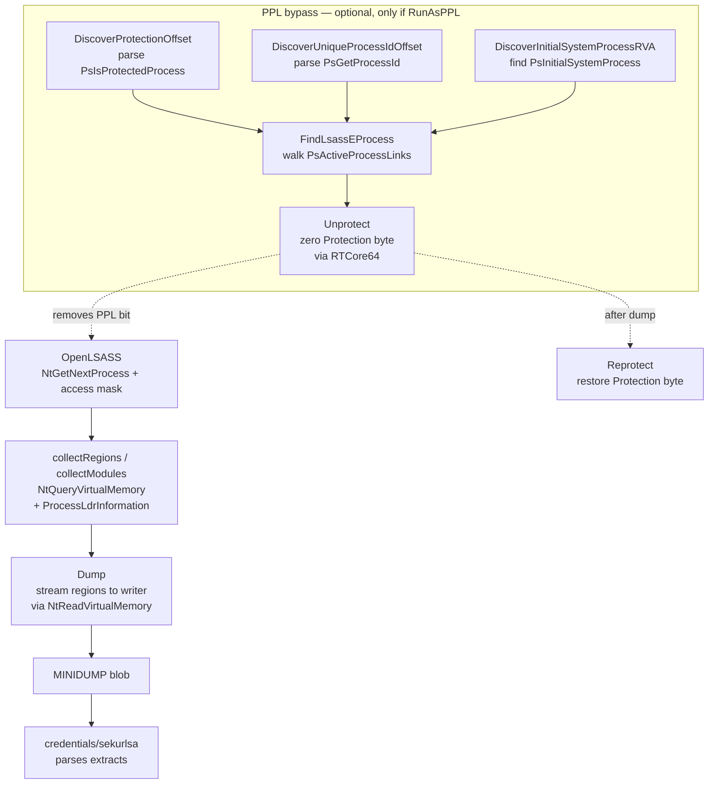

# LSASS minidump (live)

[← credentials index](README.md) · [docs/index](../../index.md)

## TL;DR

Produce a Windows MINIDUMP of `lsass.exe`'s memory in-process —
without calling `MiniDumpWriteDump` (the heavily-hooked DbgHelp
export). Walks regions + modules with `NtReadVirtualMemory`,
emits the canonical 6-stream MINIDUMP layout, and ships a
RTCore64-driven kernel path to flip lsass out of PPL when
`RunAsPPL=1`. The dump is consumed by [`credentials/sekurlsa`](sekurlsa.md).

## Primer

LSASS holds the cleartext Kerberos password material, NTLM hashes,
DPAPI master keys, TGT cache, CloudAP PRT, and TSPkg/RDP plaintext.
Every credential-dumping tool eventually wants its memory.

The classic path is `MiniDumpWriteDump` from `dbghelp.dll`; modern
EDRs hook every interesting call inside that function. The
`lsassdump` package skips the hook surface entirely:

1. Locate lsass via `NtGetNextProcess` (no `OpenProcess` /
   `CreateToolhelp32Snapshot` / `EnumProcesses`).
2. Walk the target's VAD via `NtQueryVirtualMemory` to enumerate
   committed regions.
3. Walk the loaded modules via `NtQueryInformationProcess(ProcessLdr…)`
   parsing the PEB's `Ldr.InMemoryOrderModuleList`.
4. Read each region's bytes with `NtReadVirtualMemory`.
5. Emit a 6-stream MINIDUMP (Header, SystemInfo, ModuleList,
   Memory64List, MemoryInfoList, ThreadList stub) directly to an
   `io.Writer`.

Every Nt* call accepts an optional `*wsyscall.Caller` (nil =
WinAPI fallback) so the operator can route through direct or
indirect syscalls and bypass user-mode hooks.

PPL stands separate: when `RunAsPPL=1` (Win 11 default) the
kernel rejects `PROCESS_VM_READ` regardless of token privileges.
The package ships a kernel-level bypass via
`kernel/driver/rtcore64`: zero `EPROCESS.Protection` byte
(temporarily), open lsass, restore the byte. The Discover*
helpers parse `ntoskrnl.exe` PE prologues to derive the EPROCESS
field offsets without hand-curated tables.

## How It Works



Implementation details:

- `OpenLSASS` walks the system's process list with
  `NtGetNextProcess` — no public-API call ever names lsass by
  string. The PID is resolved by reading the EPROCESS or via
  `NtQueryInformationProcess(ProcessBasicInformation)`.
- The Memory64List stream is the bulk of the dump — every
  committed region's `BaseAddress + RegionSize + RawData`. The
  package writes the directory entry first, then streams payload
  bytes through the writer to keep RAM usage flat regardless of
  lsass size (~80–600 MB on modern boxes).
- `Stats` reports per-pass counters (regions, modules, bytes
  read, bytes skipped) so the operator can spot incomplete dumps
  before parsing.
- `DiscoverProtectionOffset` cross-validates two prologue
  patterns (`PsIsProtectedProcess` + `PsIsProtectedProcessLight`)
  and returns the EPROCESS byte offset only when both agree —
  falsey matches at runtime would otherwise corrupt EPROCESS.
- `Unprotect` keeps the original Protection value in `PPLToken`
  so `Reprotect` can restore it. Aborting between the two leaves
  lsass unprotected; defer the call.

## API Reference

Package: `github.com/oioio-space/maldev/credentials/lsassdump`. Two
operational modes: **userland** (OpenLSASS + Dump + CloseLSASS — works
when LSASS is not PPL-protected) and **kernel-assisted PPL bypass**
(driver.ReadWriter + Unprotect + Dump + Reprotect — required on Win10
1903+ default-PPL builds). The pure-Go `Discover*` family runs
cross-platform so offset tables can be precomputed offline from a
collected `ntoskrnl.exe`.

### Types

#### `type Stats struct`

- godoc: counters returned by every `Dump*` / `Build` call.
- Description: `Regions int` (committed regions enumerated), `Modules int` (loaded modules in MODULE_LIST_STREAM), `BytesRead int64` (bytes copied into the dump), `BytesSkipped int64` (region bytes that `NtReadVirtualMemory` refused — guard pages, deleted views, kernel-blocked ranges).
- Side effects: pure data; the field names match what the test suite asserts on.
- OPSEC: `BytesSkipped > 0` is normal — guard pages always skip. Skipped > 25% of total may indicate the dump tripped on EDR-protected ranges and is incomplete.
- Required privileges: none (returned value).
- Platform: cross-platform (data type).

#### `type PPLOffsetTable struct`

- godoc: per-build EPROCESS field offsets needed by `Unprotect` / `FindLsassEProcess`. Populate with the `Discover*Offset` helpers (or pre-canned offsets for known builds).
- Description: zero-value fields trigger auto-discovery inside the kernel-helpers. Concrete fields: `ProtectionOffset uint32`, `UniqueProcessIDOffset uint32`, `ActiveProcessLinksOffset uint32` — see `ppl_windows.go`.
- Side effects: pure data.
- OPSEC: per-build offsets baked into a binary remove the runtime PE parse cost on the target — small enough to ship as a per-Windows-build lookup table.
- Required privileges: none (data).
- Platform: cross-platform.

#### `type PPLToken struct` + `(PPLToken).IsZero() bool`

- godoc: opaque return value from `Unprotect`. Carries the original Protection byte + SignatureLevel + SectionSignatureLevel needed by `Reprotect` to restore the kernel state. `IsZero()` reports whether the token is the zero value (e.g., when `Reprotect` is called on a never-Unprotected token — it becomes a no-op).
- Description: must be passed verbatim to `Reprotect` — do not zero or modify intermediate fields.
- Parameters: `IsZero` takes the receiver; no other args.
- Returns: `IsZero` returns true for zero-value tokens.
- Side effects: none.
- OPSEC: silent.
- Required privileges: none (data).
- Platform: Windows.

#### Sentinel errors

```go
ErrLSASSNotFound            // NtGetNextProcess walked to completion without matching lsass.exe
ErrOpenDenied               // OpenProcess refused — likely missing SeDebugPrivilege or running medium-IL
ErrPPL                      // lsass is PPL-protected; VM_READ denied — caller must use the driver path
ErrLsassEProcessNotFound    // PsActiveProcessLinks walk completed without matching the lsass PID
ErrInvalidEProcess          // Unprotect was passed eprocess == 0 — upstream FindLsassEProcess failed silently
ErrInvalidProtectionOffset  // PPLOffsetTable.ProtectionOffset == 0 and auto-discovery also returned 0
ErrProtectionOffsetNotFound // PsIsProtectedProcess prologue did not match `movzx eax, [rcx+disp32]` — kernel build mismatch
```

The boundary is meaningful: `errors.Is(err, ErrPPL)` lets operator
code branch into the byovd-rtcore64 path without parsing wrapped
strings.

### Userland handle lifecycle

#### `OpenLSASS(caller *wsyscall.Caller) (uintptr, error)`

- godoc: walk `NtGetNextProcess` (with `PROCESS_QUERY_LIMITED_INFORMATION`) until `ProcessImageFileName` matches `lsass.exe`, then re-`NtOpenProcess(pid, QUERY_LIMITED|VM_READ)`. Returns a raw `uintptr` (cast for cross-package interop with `driver.ReadWriter`).
- Description: caller may pass `nil` for `caller` to use the default WinAPI path; pass a `*wsyscall.Caller` configured with `MethodIndirectAsm + Tartarus` for stealth-mode resolution. The `NtGetNextProcess` enumeration is steathier than `CreateToolhelp32Snapshot` (no PsetWmi event).
- Parameters: `caller` optional; nil = WinAPI fallback.
- Returns: open handle as `uintptr`; sentinel `ErrLSASSNotFound` if the walk completed without matching; sentinel `ErrOpenDenied` if `NtOpenProcess` returned `STATUS_ACCESS_DENIED` (admin? PPL?); sentinel `ErrPPL` specifically when the `VM_READ` access bit is what was denied.
- Side effects: opens a kernel handle (caller must `CloseLSASS`). Triggers Sysmon Event 10 with `GrantedAccess=0x1010` (QUERY_LIMITED|VM_READ).
- OPSEC: `OpenProcess(lsass)` is the highest-fidelity Sysmon Event 10 trigger. Mitigation: bridge through the syscall.Caller indirect modes so the call originates from inside ntdll's `.text`.
- Required privileges: SYSTEM (or admin + `SeDebugPrivilege`). PPL-protected lsass refuses `VM_READ` regardless.
- Platform: Windows. Stub returns `errUnsupported`.

#### `CloseLSASS(h uintptr) error`

- godoc: `NtClose` wrapper for the handle returned by `OpenLSASS`.
- Description: thin shim. Idempotent only if the caller respects the contract — calling on a zero handle returns `STATUS_INVALID_HANDLE` not nil.
- Parameters: `h` the handle from `OpenLSASS`.
- Returns: nil on success; underlying NTSTATUS-mapped error.
- Side effects: closes the kernel handle.
- OPSEC: silent.
- Required privileges: none (already held the handle).
- Platform: Windows.

#### `LsassPID(caller *wsyscall.Caller) (uint32, error)`

- godoc: resolve lsass.exe's PID without opening it.
- Description: same `NtGetNextProcess` walk as `OpenLSASS` but stops at the PID — never calls `NtOpenProcess`. Used by the PPL bypass path which needs the PID to feed `FindLsassEProcess`, but cannot legitimately open lsass yet (Unprotect must run first).
- Parameters: `caller` optional.
- Returns: lsass PID; `ErrLSASSNotFound` on miss.
- Side effects: enumerates processes; opens a transient `PROCESS_QUERY_LIMITED_INFORMATION` handle on each candidate (released before returning).
- OPSEC: stealthier than the open path — no VM_READ event. The query-limited probes are noisy if frequent but rare on a one-shot.
- Required privileges: unprivileged for query-limited probes; works from medium-IL.
- Platform: Windows.

### Dump producers

#### `Dump(h uintptr, w io.Writer, caller *wsyscall.Caller) (Stats, error)`

- godoc: emit MINIDUMP bytes to `w` for the process referenced by `h`. Stream-friendly — `w` may be a file, `bytes.Buffer`, or an encrypted/transport pipeline.
- Description: enumerates committed regions via `NtQueryVirtualMemory(MemoryBasicInformation)`, modules via `NtQueryInformationProcess(ProcessImageFileName)` + PEB walk, threads via `NtGetNextThread` + `NtQueryInformationThread`, then writes the canonical MDMP header + directory + four streams (`MemoryListStream` / `ModuleListStream` / `ThreadListStream` / `SystemInfoStream`). Streaming layout — no full buffer materialised in process memory.
- Parameters: `h` open lsass handle; `w` destination; `caller` optional Caller for syscall routing.
- Returns: `Stats` summarising what landed; first error from any region/module/thread enumeration step.
- Side effects: many `NtReadVirtualMemory` calls (one per region). Allocates per-region read buffers (released before next region).
- OPSEC: the read pattern (sequential walk through committed regions) is fingerprinted by EDR. Routing through `MethodIndirectAsm` blunts the call-stack-origin signal but not the access pattern.
- Required privileges: `VM_READ` on `h`.
- Platform: Windows.

#### `DumpToFile(path string, caller *wsyscall.Caller) (Stats, error)`

- godoc: convenience — `OpenLSASS` + `Dump(h, file, caller)` + `file.Sync` + `file.Close`. File mode 0o600.
- Description: best for one-shot operator scripts. Removes the file on `Dump` failure.
- Parameters: `path` destination on disk; `caller` optional.
- Returns: `Stats` on success; underlying error from any of the wrapped steps.
- Side effects: cleartext MDMP file at `path`. The file is removed on failure; left intact on success.
- OPSEC: cleartext MDMP on disk is a flat YARA hit (`MDMP` magic). Lab/CTF only — production paths should use `Dump` with an encrypting writer or `DumpToFileVia` with a stealth Creator.
- Required privileges: as `OpenLSASS`.
- Platform: Windows.

#### `DumpToFileVia(creator stealthopen.Creator, path string, caller *wsyscall.Caller) (Stats, error)`

- godoc: `DumpToFile` variant that routes the on-disk landing through the operator-supplied [`stealthopen.Creator`](../evasion/stealthopen.md).
- Description: nil falls back to `*StandardCreator` (plain `os.Create` — identical to `DumpToFile`). Non-nil layers transactional NTFS, encrypted streams, ADS sinks, or any operator-controlled write primitive on top of the minidump landing. The minidump byte stream itself is unchanged — `Dump(h, w, caller)` writes into the `WriteCloser` the Creator returns. *os.File-only* `Sync` is best-effort: when the Creator returns something other than `*os.File`, durability semantics are delegated to the Creator's `Close`.
- Parameters: `creator` write-side strategy (nil = standard); `path` passed to the Creator (interpretation is Creator-defined — for ADS, `path = "C:\\file.txt:stream"`); `caller` optional.
- Returns: `Stats` on success; first error from the Creator + Dump pipeline.
- Side effects: per the Creator strategy. Standard creator leaves a 0o600 file; ADS creator leaves a hidden stream; transactional NTFS leaves nothing visible until commit.
- OPSEC: completely Creator-dependent. The `stealthopen` page enumerates the OPSEC trade-off per strategy.
- Required privileges: as `OpenLSASS`; Creator may require additional access (e.g., kernel-transactional NTFS needs SYSTEM).
- Platform: Windows.

### Kernel-assisted PPL bypass

#### `Unprotect(rw driver.ReadWriter, eprocess uintptr, tab PPLOffsetTable) (PPLToken, error)`

- godoc: zero EPROCESS.Protection (and the SignatureLevel/SectionSignatureLevel siblings) via the supplied kernel `ReadWriter` (typically `kernel/driver/rtcore64`). Returns a `PPLToken` carrying the original bytes for `Reprotect`.
- Description: when `tab.ProtectionOffset == 0`, auto-discovers the offset by parsing the on-disk ntoskrnl. Reads the three current bytes (Protection at offset N, SignatureLevel at N-2, SectionSignatureLevel at N-1 — the `SignatureLevelOffset(prot)` / `SectionSignatureLevelOffset(prot)` arithmetic), saves them in the PPLToken, then writes 0x00 to all three. After this call, lsass becomes openable with `VM_READ` from a regular admin token.
- Parameters: `rw` kernel ReadWriter (RTCore64 or any equivalent BYOVD primitive); `eprocess` EPROCESS VA from `FindLsassEProcess`; `tab` populated PPLOffsetTable.
- Returns: `PPLToken` (always pass to `Reprotect`); `ErrInvalidEProcess` if `eprocess == 0`; `ErrInvalidProtectionOffset` if both `tab.ProtectionOffset` and auto-discovery returned 0; underlying ReadWriter errors.
- Side effects: writes 3 bytes of kernel memory. The change persists until `Reprotect` is called or the host reboots.
- OPSEC: kernel writes are invisible to userland telemetry. PatchGuard does NOT cover EPROCESS by default — the write is durable. Defender's "Driver block list" updated periodically may neuter RTCore64 specifically; check `kernel/driver/rtcore64.md` for current status.
- Required privileges: SYSTEM + `SeLoadDriverPrivilege` (to load RTCore64) + admin to write the EPROCESS bytes.
- Platform: Windows + amd64. The offset arithmetic is x64-specific.

#### `Reprotect(rw driver.ReadWriter, tok PPLToken) error`

- godoc: restore Protection / SignatureLevel / SectionSignatureLevel from `tok`. Always `defer` this call after `Unprotect`.
- Description: writes the three saved bytes back. No-op if `tok.IsZero()`. Returns `ErrNotLoaded` if `rw == nil` (defensive — easy to forget).
- Parameters: `rw` kernel ReadWriter; `tok` from `Unprotect`.
- Returns: nil on success or no-op; ReadWriter errors otherwise.
- Side effects: writes 3 bytes of kernel memory. Lsass becomes PPL-protected again immediately after.
- OPSEC: leaving lsass unprotected is the loudest possible footprint — Defender / EDRs scan the EPROCESS Protection byte specifically. **Always defer Reprotect**.
- Required privileges: same as `Unprotect`.
- Platform: Windows.

#### `FindLsassEProcess(rw driver.ReadWriter, lsassPID uint32, opener stealthopen.Opener, caller *wsyscall.Caller) (uintptr, error)`

- godoc: walk `PsActiveProcessLinks` via the kernel ReadWriter and return the EPROCESS VA matching `lsassPID`.
- Description: composes the `Discover*` family internally — `DiscoverInitialSystemProcessRVA` to find the list head, `DiscoverUniqueProcessIdOffset` + `DiscoverActiveProcessLinksOffset` to know which fields to read, then walks the doubly-linked list comparing each entry's PID against `lsassPID`. Pure kernel reads; no kernel writes.
- Parameters: `rw` kernel ReadWriter; `lsassPID` from `LsassPID`; `opener` for the on-disk ntoskrnl PE parse (nil = `os.Open`); `caller` for ntoskrnl base-address resolution.
- Returns: EPROCESS VA; `ErrLsassEProcessNotFound` if the walk completed without matching.
- Side effects: many kernel reads (4–8 bytes each) traversing the active-process list — typically 50–500 entries depending on host load.
- OPSEC: kernel reads are invisible. The walk is read-only.
- Required privileges: as `Unprotect`.
- Platform: Windows + amd64.

### Pure-Go offset discovery

These helpers parse `ntoskrnl.exe` on disk — they run cross-platform
so offset tables can be precomputed offline from a collected kernel
image. Each accepts a `stealthopen.Opener` (nil = `os.Open`) so the
read can route through an EDR-bypass file strategy.

#### `DiscoverProtectionOffset(path string, opener stealthopen.Opener) (uint32, error)`

- godoc: extract the EPROCESS.Protection byte offset from `PsIsProtectedProcess`'s prologue.
- Description: parses the PE export table to find `PsIsProtectedProcess`, reads the function bytes, and looks for the canonical `movzx eax, [rcx+disp32]` prologue. The disp32 IS the offset. Returns `ErrProtectionOffsetNotFound` if the prologue does not match (kernel build mismatch — the function may have been inlined or rewritten).
- Parameters: `path` to ntoskrnl.exe (typically `C:\Windows\System32\ntoskrnl.exe`); `opener` nil for `os.Open`.
- Returns: byte offset within EPROCESS; `ErrProtectionOffsetNotFound` on prologue mismatch; underlying PE-parse / file-open errors.
- Side effects: opens + reads ntoskrnl.exe (read-only).
- OPSEC: reading ntoskrnl is benign on its own (countless legitimate tools do). The follow-on kernel writes are the loud part.
- Required privileges: read on `path` (typically requires admin since System32 has restrictive ACLs on the file).
- Platform: cross-platform (pure-Go PE parse). Useful from a Linux build host that pre-collected ntoskrnl.

#### `SignatureLevelOffset(protectionOff uint32) uint32`

- godoc: returns `protectionOff - 2` — the SignatureLevel field is two bytes before Protection in EPROCESS on every shipped Win10/11 build.
- Description: arithmetic helper, no I/O.
- Parameters: `protectionOff` from `DiscoverProtectionOffset`.
- Returns: SignatureLevel field offset.
- Side effects: none.
- OPSEC: silent.
- Required privileges: none.
- Platform: cross-platform.

#### `SectionSignatureLevelOffset(protectionOff uint32) uint32`

- godoc: returns `protectionOff - 1` — SectionSignatureLevel is one byte before Protection.
- Description / Parameters / Returns / Side effects / OPSEC / Required privileges / Platform: as `SignatureLevelOffset`.

#### `DiscoverUniqueProcessIdOffset(path string, opener stealthopen.Opener) (uint32, error)`

- godoc: extract the EPROCESS.UniqueProcessId byte offset by static analysis of an ntoskrnl helper that references the field.
- Description: parses the PE, finds the helper (typically `PsGetProcessId`), looks for the canonical `mov rax, [rcx+disp32]` pattern. The disp32 IS the offset.
- Parameters: as `DiscoverProtectionOffset`.
- Returns: byte offset; underlying PE-parse errors on miss.
- Side effects / OPSEC / Required privileges / Platform: as `DiscoverProtectionOffset`.

#### `DiscoverActiveProcessLinksOffset(uniqueProcessIDOff uint32) uint32`

- godoc: returns `uniqueProcessIDOff + sizeof(HANDLE)` (8 on x64) — `ActiveProcessLinks` always immediately follows `UniqueProcessId` in EPROCESS on every shipped Win10/11 build.
- Description: arithmetic helper.
- Parameters: `uniqueProcessIDOff` from `DiscoverUniqueProcessIdOffset`.
- Returns: ActiveProcessLinks (LIST_ENTRY) offset.
- Side effects / OPSEC / Required privileges / Platform: as `SignatureLevelOffset`.

#### `DiscoverInitialSystemProcessRVA(path string, opener stealthopen.Opener) (uint32, error)`

- godoc: returns the RVA of the `PsInitialSystemProcess` exported symbol in ntoskrnl. Combined with the kernel base, this gives the head of `PsActiveProcessLinks` (the symbol points at the System EPROCESS).
- Description: PE export-table lookup by name. Pure-Go, cross-platform.
- Parameters: as `DiscoverProtectionOffset`.
- Returns: RVA; export-not-found error on miss.
- Side effects / OPSEC / Required privileges / Platform: as `DiscoverProtectionOffset`.

### MINIDUMP builder (low-level)

#### `Build(w io.Writer, cfg Config) (Stats, error)`

- godoc: emit a MINIDUMP from a fully-described `Config` instead of walking a live process. Used for test fixtures, replay from snapshots, or building synthetic dumps.
- Description: `cfg` carries `[]MemoryRegion`, `[]Module`, `[]Thread`, and a `SystemInfo` populated from any source. `Dump` itself uses `Build` internally after walking lsass — `Build` is exported so callers can supply pre-collected memory.
- Parameters: `w` destination; `cfg` complete description of the dump contents.
- Returns: `Stats`; layout-planning or writer errors.
- Side effects: writes the MDMP byte stream to `w`. Does not read external memory.
- OPSEC: same on-disk concerns as `Dump` if `w` is a file.
- Required privileges: depends on where `cfg`'s contents came from.
- Platform: cross-platform (pure-Go).

#### Builder data shapes

```go
type MemoryRegion struct{ BaseAddress uintptr; Data []byte; Protect uint32; State uint32; Type uint32 }
type Module struct{ BaseAddress uintptr; Size uint32; Path string /* + version fields */ }
type Thread struct{ ID uint32; SuspendCount uint32; PriorityClass uint32; Priority uint32; Teb uintptr; Stack []byte; Context []byte }
type SystemInfo struct{ ProcessorArchitecture uint16; NumberOfProcessors uint8; ProductType uint8; MajorVersion, MinorVersion, BuildNumber uint32; CSDVersion string }
type Config struct{ ProcessID uint32; Regions []MemoryRegion; Modules []Module; Threads []Thread; System SystemInfo }
```

All fields are public so callers can construct synthetic dumps for
testing the parser side without needing a live process.

## Examples

### Simple — dump unprotected lsass to file

```go
import (
    "fmt"

    "github.com/oioio-space/maldev/credentials/lsassdump"
    wsyscall "github.com/oioio-space/maldev/win/syscall"
)

caller := wsyscall.New(wsyscall.MethodIndirect, nil)
stats, err := lsassdump.DumpToFile(`C:\Users\Public\lsass.dmp`, caller)
if err != nil {
    panic(err)
}
fmt.Printf("dumped %d regions, %d MB\n", stats.Regions, stats.BytesRead>>20)
```

### Composed — dump in-memory + parse without disk

Pipe the MINIDUMP through a `bytes.Buffer` straight into
[`sekurlsa.Parse`](sekurlsa.md):

```go
import (
    "bytes"
    "github.com/oioio-space/maldev/credentials/lsassdump"
    "github.com/oioio-space/maldev/credentials/sekurlsa"
    wsyscall "github.com/oioio-space/maldev/win/syscall"
)

caller := wsyscall.New(wsyscall.MethodIndirect, nil)
h, err := lsassdump.OpenLSASS(caller)
if err != nil {
    panic(err)
}
defer lsassdump.CloseLSASS(h)

var buf bytes.Buffer
if _, err := lsassdump.Dump(h, &buf, caller); err != nil {
    panic(err)
}
res, err := sekurlsa.Parse(bytes.NewReader(buf.Bytes()), int64(buf.Len()))
if err != nil {
    panic(err)
}
defer res.Wipe()
```

### Advanced — PPL bypass via RTCore64

When `RunAsPPL=1`, drop the protection byte through a kernel
ReadWriter, dump, restore.

```go
import (
    "github.com/oioio-space/maldev/credentials/lsassdump"
    "github.com/oioio-space/maldev/kernel/driver/rtcore64"
    wsyscall "github.com/oioio-space/maldev/win/syscall"
)

drv, err := rtcore64.Load(rtcore64.LoadOptions{})
if err != nil {
    panic(err)
}
defer drv.Unload()

caller := wsyscall.New(wsyscall.MethodIndirect, nil)
pid, _ := lsassdump.LsassPID(caller)

ep, err := lsassdump.FindLsassEProcess(drv, pid, nil, caller)
if err != nil {
    panic(err)
}

protOff, _ := lsassdump.DiscoverProtectionOffset("", nil)
tab := lsassdump.PPLOffsetTable{Protection: protOff}

tok, err := lsassdump.Unprotect(drv, ep, tab)
if err != nil {
    panic(err)
}
defer lsassdump.Reprotect(drv, tok) //nolint:errcheck

if _, err := lsassdump.DumpToFile(`C:\Users\Public\ppl-lsass.dmp`, caller); err != nil {
    panic(err)
}
```

See [`ExampleDumpToFile`](../../../credentials/lsassdump/lsassdump_example_test.go).

## OPSEC & Detection

| Artefact | Where defenders look |
|---|---|
| `OpenProcess(lsass, PROCESS_VM_READ)` | Sysmon Event 10 (process access); the canonical "credential dumping" signal — fires regardless of which API surfaced the open |
| Sustained `NtReadVirtualMemory` against lsass | EDR memory-access telemetry |
| Driver load (RTCore64) | Sysmon Event 6 (driver loaded), Microsoft vulnerable-driver blocklist |
| Write of a `.dmp` file | EDR file-write heuristics flagging dump files in user-writable paths |
| Calls to `MiniDumpWriteDump` | DbgHelp hook (we don't use it — but the absence is itself a tell) |
| EPROCESS.Protection byte transition | ETW Threat-Intelligence provider (Win11 22H2+) |

**D3FEND counters:**

- [D3-PSA](https://d3fend.mitre.org/technique/d3f:ProcessSpawnAnalysis/) — flags driver-load + lsass-open combos.
- [D3-SICA](https://d3fend.mitre.org/technique/d3f:SystemConfigurationDatabaseAnalysis/) — kernel-driver load auditing.
- [D3-FCA](https://d3fend.mitre.org/technique/d3f:FileContentAnalysis/) — MINIDUMP magic on disk.

**Hardening for the operator:**

- Stream the dump through a `bytes.Buffer` + `sekurlsa.Parse`
  in-process — no `.dmp` file ever lands.
- Route Nt* through indirect syscalls (`wsyscall.MethodIndirect`).
- Open lsass with the minimum access mask the dump needs
  (`PROCESS_VM_READ | PROCESS_QUERY_LIMITED_INFORMATION`).
- Defer `Reprotect` — never leave lsass unprotected on a crash
  path.

## MITRE ATT&CK

| T-ID | Name | Sub-coverage | D3FEND counter |
|---|---|---|---|
| [T1003.001](https://attack.mitre.org/techniques/T1003/001/) | OS Credential Dumping: LSASS Memory | full — region walk + MINIDUMP build | D3-PSA, D3-SICA |
| [T1068](https://attack.mitre.org/techniques/T1068/) | Exploitation for Privilege Escalation | partial — PPL bypass via signed-but-vulnerable driver | D3-SICA |

## Limitations

- **Windows-only build/dump pipeline.** Pure Go on-disk PE
  parsing (`Discover*`) runs cross-platform — analysts can
  resolve EPROCESS offsets from a captured `ntoskrnl.exe` on
  Linux/CI.
- **No WoW64 dumps.** Modern lsass is x64; legacy WoW64 not
  supported.
- **Driver visibility.** RTCore64 is a Microsoft-blocklisted
  vulnerable driver as of recent vulnerable-driver blocklist
  updates; on hardened systems the driver load itself is
  blocked. Plan for vBO (very few alternative drivers) or
  alternative PPL bypasses.
- **No thread context capture.** ThreadList is a stub — full
  per-thread context is not emitted. sekurlsa doesn't need it;
  some legacy tooling (windbg `!analyze`) does.
- **Protection-byte race.** Between `Unprotect` and `OpenLSASS`
  there is a microsecond window where lsass is unprotected.
  Defenders with continuous EPROCESS monitoring (rare) can spot
  the transition.
- **`LsassPID` requires elevation.** The walk uses
  `NtGetNextProcess` with `PROCESS_QUERY_LIMITED_INFORMATION`,
  which the kernel silently denies for lsass.exe (a PPL) when
  the caller has no elevation/`SeDebugPrivilege`. The loop runs
  to `STATUS_NO_MORE_ENTRIES` without ever seeing lsass and
  surfaces `ErrLSASSNotFound` — the same error you would see if
  lsass were genuinely absent. From a non-elevated context use
  `NtQuerySystemInformation(SystemProcessInformation)` directly
  (different syscall, returns names without opening handles)
  if PID-only enumeration is needed; the rest of the dump path
  can't proceed under lowuser anyway.

## See also

- [`credentials/sekurlsa`](sekurlsa.md) — parses the produced
  MINIDUMP.
- [`credentials/goldenticket`](goldenticket.md) — downstream
  consumer of an extracted krbtgt hash.
- [`kernel/driver/rtcore64`](../kernel/byovd-rtcore64.md) —
  PPL-bypass driver primitive.
- [`evasion/stealthopen`](../evasion/stealthopen.md) —
  path-based file-hook bypass for `ntoskrnl.exe` reads.
- [`win/syscall`](../syscalls/) — direct/indirect syscall
  caller used throughout this package.
- [Operator path](../../by-role/operator.md#credential-harvest).
- [Detection eng path](../../by-role/detection-eng.md#credential-access)
  — LSASS dump telemetry.
