# SAM hive dump

[← credentials index](README.md) · [docs/index](../../index.md)

## TL;DR

Decrypt local NT hashes from a Windows `SAM` hive (with `SYSTEM`
supplying the boot key). Pure-Go REGF parser + AES/RC4/DES crypto;
runs cross-platform once the operator has the hive bytes in hand.
LiveDump shells out to `reg save` for live acquisition (Windows-only,
loud on EDR).

## Primer

Local Windows accounts live in the `SAM` registry hive under
`SAM\Domains\Account`. Each user's NT/LM hash is stored encrypted —
two layers of crypto stand between the on-disk bytes and a usable
hash:

1. The **boot key** (syskey) is split across four `Lsa\{JD,Skew1,GBG,Data}`
   class strings in the `SYSTEM` hive, permuted at boot to defeat
   trivial copies. Reassembling it requires the SYSTEM hive.
2. The boot key encrypts the **hashed bootkey** stored in
   `SAM\Domains\Account\F` — itself an AES-128-CBC blob keyed on
   `MD5(bootKey || rid_str || qwerty || rid_str)` (legacy revision
   uses RC4).
3. The hashed bootkey then derives per-user keys (RC4 or AES-128-CBC
   depending on the revision tag in `F`). Per-user keys decrypt the
   16-byte LM and NT hash blobs in `SAM\Domains\Account\Users\<RID>\V`.
4. Modern Windows (10 1607+) also wraps the hashes in a final DES
   permutation keyed on the RID — same algorithm Windows itself
   uses to look up the hash at logon.

`samdump.Dump` runs the entire chain in process memory with no
syscalls. The hive bytes can come from anywhere — `reg save`, VSS
shadow copy, raw NTFS read, recon/shadowcopy, or pulled offline
from a backup. The package itself opens nothing.

## How It Works

```mermaid
flowchart TD
    SYS[SYSTEM hive bytes] --> EBK[extractBootKey<br/>permute Lsa class strings]
    EBK -->|16-byte boot key| HBK
    SAM[SAM hive bytes] --> RDF[readDomainAccountF<br/>AES-encrypted blob]
    RDF --> HBK[deriveDomainKey<br/>AES-128-CBC]
    HBK -->|hashed bootkey| LU
    SAM --> LU[listUserRIDs<br/>walk Users key]
    LU --> PV[parseUserV<br/>extract username + LM/NT enc]
    PV --> DEC[decryptUserNT / decryptUserLM<br/>per-RID DES-permute<br/>+ AES-128-CBC or RC4]
    DEC --> ACC[Account&#123;Username, RID, NT, LM&#125;]
```



Implementation details:

- The REGF reader (`hive.go`) walks named keys and value records
  through `nk` / `vk` cells without depending on `golang.org/x/sys`
  or any Windows-only API — cross-platform out of the box.
- Per-user failures are accumulated on `Result.Warnings` rather
  than aborting the dump; structural failures (missing boot key,
  malformed `F`, no `Users` key) return `ErrDump`.
- `Account.Pwdump` renders the canonical `username:RID:LM:NT:::`
  format consumed by hashcat (`-m 1000`), John (`--format=NT`),
  CrackMapExec NTLM hash auth, and impacket secretsdump.

## API Reference

Package: `github.com/oioio-space/maldev/credentials/samdump`. Two
modes: **offline** (`Dump` against `io.ReaderAt` for SYSTEM + SAM
hive bytes — pure Go, cross-platform) and **live** (`LiveDump` which
shells out to `reg.exe save` and feeds the files to `Dump`).

### Types

#### `type Account struct`

- godoc: one decrypted user record from the SAM hive.
- Description: fields — `Username string` (UTF-16 decoded sAMAccountName), `RID uint32` (relative identifier, the numeric tail of the user SID), `LM []byte` (16-byte LM hash or nil when inactive), `NT []byte` (16-byte NT/MD4 hash or nil when inactive). LM is nil on Vista+ unless explicitly enabled by GPO; NT is nil only for accounts with truly empty passwords.
- Side effects: pure data.
- OPSEC: silent (data type).
- Required privileges: none (data).
- Platform: cross-platform.

#### `(Account).Pwdump() string`

- godoc: format the account as one secretsdump-style pwdump line: `Username:RID:LM-hex:NT-hex:::`.
- Description: renders the all-zeros sentinel `aad3b435b51404eeaad3b435b51404ee` (LM) / `31d6cfe0d16ae931b73c59d7e0c089c0` (NT empty-password MD4) when the corresponding hash is nil. Compatible with mimikatz / impacket consumers.
- Parameters: receiver.
- Returns: single ASCII line, no trailing newline.
- Side effects: none.
- OPSEC: pure formatting.
- Required privileges: none.
- Platform: cross-platform.

#### `type Result struct`

- godoc: aggregate output of a successful dump.
- Description: fields — `Accounts []Account` (one entry per user RID found in `SAM\\Domains\\Account\\Users`), `Warnings []string` (non-fatal per-user anomalies — parse failures on individual records, missing optional fields, unsupported encryption variants). Warnings allow partial-success dumps to surface what worked alongside what didn't.
- Side effects: pure data.
- OPSEC: silent (data).
- Required privileges: none.
- Platform: cross-platform.

#### `(Result).Pwdump() string`

- godoc: render the multi-line pwdump file — one `Account.Pwdump()` per line, joined with `\n`.
- Description: convenience for piping the whole result to a `*os.File` or stdout.
- Parameters: receiver.
- Returns: ASCII multi-line string. Trailing newline included.
- Side effects: none.
- OPSEC: pure formatting.
- Required privileges: none.
- Platform: cross-platform.

#### Sentinel errors

```go
ErrDump      // structural parse/decrypt failure inside Dump (wrapped — errors.Is detects)
ErrLiveDump  // reg.exe save failed or hive files not found after reg returned
ErrUserHash  // per-user hash decrypt failed (surfaced inside Result.Warnings, not returned)
```

### Producers

#### `Dump(systemHive io.ReaderAt, systemSize int64, samHive io.ReaderAt, samSize int64) (Result, error)`

- godoc: full offline pipeline — extract bootkey from SYSTEM hive, derive hashedBootkey, walk SAM users, decrypt each LM/NT.
- Description: parses each hive's CM_KEY_NODE / CM_KEY_VALUE cells (no Win32 reg APIs), reconstructs the obfuscated bootkey from the four `LSA\\JD/Skew1/GBG/Data` class names, derives the hashedBootkey via either AES (Win10+) or DES+MD5 (legacy). For each user under `SAM\\Domains\\Account\\Users\\<RID>`, parses the V-region for the encrypted hashes and decrypts them. Cross-platform — no syscalls, only `io.ReaderAt` reads.
- Parameters: `systemHive` + `systemSize` for the SYSTEM hive; `samHive` + `samSize` for the SAM hive. Both readers must cover the entire hive bytes.
- Returns: `Result` with `Accounts` populated; per-user failures land in `Result.Warnings` rather than aborting the whole dump. `error` wraps `ErrDump` on structural failure (corrupt hive, missing root key, bootkey extraction impossible).
- Side effects: loads each hive into memory once (typical SAM is ~256KB, SYSTEM ~8MB).
- OPSEC: pure CPU + memory work — no file system / registry / kernel touch points. The OPSEC concern is **how the hive bytes were acquired** (live `reg save` vs VSS shadow vs offline mount).
- Required privileges: none for the parse itself; reading the actual hives requires admin + `SeBackupPrivilege` for the live case.
- Platform: cross-platform. Useful from a Linux analyst host parsing exfiltrated hives.

#### `LiveDump(dir string) (Result, string, string, error)`

- godoc: acquire the live SYSTEM + SAM hives via `reg.exe save HKLM\SYSTEM` / `HKLM\SAM` to `dir`, then run `Dump` against them. Returns the `Result` plus the two on-disk paths so callers can re-feed the files to other tooling without re-acquiring.
- Description: spawns `reg.exe save` twice (one per hive) with `/y` to overwrite. The hive files end up at `dir/system.hive` and `dir/sam.hive`. After parsing, the files are NOT deleted — the operator may want them for downstream tooling (mimikatz, impacket secretsdump, hashcat).
- Parameters: `dir` writable directory; created by caller.
- Returns: `Result` (same shape as `Dump`); `string` path of the saved system hive; `string` path of the saved SAM hive; `error` wrapping `ErrLiveDump` if `reg save` failed or the file is empty afterwards.
- Side effects: spawns `reg.exe`. Two .hive files left at `dir`. If the operator does not delete them, they remain a flat-file artifact on disk.
- OPSEC: `reg save HKLM\SAM` is one of the loudest possible audit triggers — Sysmon Event 1 on `reg.exe` with `SaveKey` arg is a high-fidelity Sigma rule. For stealth, prefer offline VSS shadow extraction (see "Advanced — VSS shadow-copy acquisition" example below).
- Required privileges: admin + `SeBackupPrivilege` (held by default for the Administrators group). The hives are protected by ACLs that only admin can read directly.
- Platform: Windows. Stub returns `ErrLiveDump` ("requires Windows").

## Examples

### Simple — offline hives

```go
import (
    "fmt"
    "os"

    "github.com/oioio-space/maldev/credentials/samdump"
)

system, _ := os.Open(`/loot/SYSTEM`)
defer system.Close()
sam, _ := os.Open(`/loot/SAM`)
defer sam.Close()

sysFI, _ := system.Stat()
samFI, _ := sam.Stat()

res, err := samdump.Dump(system, sysFI.Size(), sam, samFI.Size())
if err != nil {
    panic(err)
}
fmt.Print(res.Pwdump())
```

### Composed — live host, cleanup, exfil

```go
import (
    "os"

    "github.com/oioio-space/maldev/credentials/samdump"
    "github.com/oioio-space/maldev/cleanup/wipe"
)

dir, _ := os.MkdirTemp("", "")
res, sysPath, samPath, err := samdump.LiveDump(dir)
defer func() {
    _ = wipe.File(sysPath)
    _ = wipe.File(samPath)
    _ = os.RemoveAll(dir)
}()
if err != nil {
    panic(err)
}
exfilPwdump(res.Pwdump())
```

### Advanced — VSS shadow-copy acquisition

`reg save` is loud. For better OPSEC, acquire the hives via VSS
shadow copies through [`recon/shadowcopy`](../recon/) and feed the
files into the offline `Dump` path:

```go
sc, _ := shadowcopy.Create()
defer sc.Delete()

sysReader, _ := sc.Open(`Windows\System32\config\SYSTEM`)
samReader, _ := sc.Open(`Windows\System32\config\SAM`)

res, err := samdump.Dump(sysReader, sysReader.Size(),
    samReader, samReader.Size())
```

See [`ExampleDump`](../../../credentials/samdump/samdump_example_test.go)
for the runnable variant.

## OPSEC & Detection

| Artefact | Where defenders look |
|---|---|
| `reg save HKLM\SAM` / `HKLM\SYSTEM` | Sysmon Event 1 (process creation) — `reg.exe` with `save` is one of the highest-fidelity credential-dumping signals |
| Two `.hive` files written to a writable directory | EDR file-write telemetry; staging directories under `%TEMP%` are correlated with credential dumping |
| `RegSaveKeyEx` Windows API call | ETW Microsoft-Windows-Kernel-Registry; bypassable via direct `NtSaveKey` syscall |
| Read access to `HKLM\SAM` SD | Defender ASR rule `"Block credential stealing from the Windows local security authority subsystem"` (LSA-only, but heuristics overlap) |

**D3FEND counters:**

- [D3-PSA](https://d3fend.mitre.org/technique/d3f:ProcessSpawnAnalysis/)
  — flags `reg.exe save` lineage.
- [D3-FCA](https://d3fend.mitre.org/technique/d3f:FileContentAnalysis/)
  — REGF magic on disk in atypical paths.
- [D3-SICA](https://d3fend.mitre.org/technique/d3f:SystemConfigurationDatabaseAnalysis/)
  — registry hive-handle telemetry.

**Hardening for the operator:**

- Prefer offline acquisition (VSS via `recon/shadowcopy`, raw NTFS
  read, backup files) over `LiveDump`.
- Stage hive bytes through an in-memory `io.ReaderAt` (e.g.
  `bytes.NewReader`) to avoid the `.hive` files on disk altogether.
- Wipe the `dir` immediately after parsing — `cleanup/wipe.File`
  zeroes the bytes before unlinking.

## MITRE ATT&CK

| T-ID | Name | Sub-coverage | D3FEND counter |
|---|---|---|---|
| [T1003.002](https://attack.mitre.org/techniques/T1003/002/) | OS Credential Dumping: Security Account Manager | full — offline + LiveDump | D3-PSA, D3-FCA, D3-SICA |

## Limitations

- **Local accounts only.** SAM holds only the workstation's local
  users. Domain credentials live in `NTDS.dit` on the DC; use
  separate tooling (impacket secretsdump remote, mimikatz `lsadump::dcsync`).
- **No history.** Earlier NT/LM hashes (password-history feature)
  are stored in additional `V` regions not currently parsed.
- **DPAPI / cached creds out of scope.** Domain cached credentials
  (`Cache{N}`) live in `SECURITY` hive; `SECURITY` parsing is not
  in this package.
- **LiveDump is loud.** `reg.exe save` lights up every behavioral
  EDR. Plan for offline acquisition wherever the operational
  context allows.
- **AES revision only validated against Win10 1607+.** Older XP/2003
  RC4-keyed hives use the legacy code path; tested less recently.

## See also

- [LSASS dump (live process memory)](../collection/lsass-dump.md) —
  cousin path for live cached credentials.
- [`credentials/sekurlsa`](sekurlsa.md) — companion LSASS extractor.
- [`recon/shadowcopy`](../recon/) — VSS-based hive acquisition.
- [`cleanup/wipe`](../cleanup/) — secure deletion of the on-disk
  hive copies.
- [Operator path](../../by-role/operator.md) — credential-harvest
  decision tree.
- [Detection eng path](../../by-role/detection-eng.md#credential-access)
  — SAM-dump telemetry.
