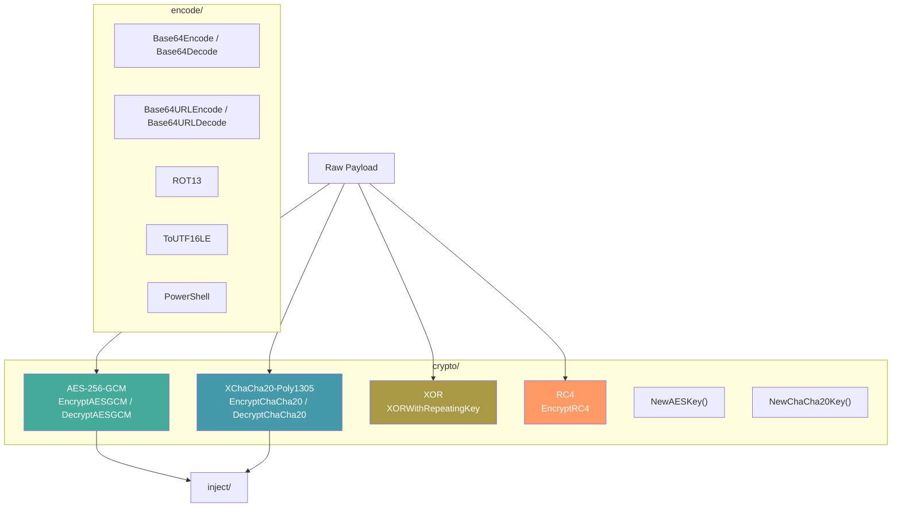

# Cryptography & Encoding

[<- Back to README](../../../README.md)

The `crypto/` and `encode/` packages provide payload encryption and encoding: AES-256-GCM, XChaCha20-Poly1305, XOR, RC4, Base64, ROT13, and UTF-16LE encoding for PowerShell.

---

## Architecture Overview



## Documentation

| Document | Description |
|----------|-------------|
| [Payload Encryption](payload-encryption.md) | AES-GCM, ChaCha20, XOR, RC4, Base64, ROT13 |
| [Fuzzy Hashing](fuzzy-hashing.md) | ssdeep + TLSH similarity hashing for payload comparison |

## API Quick-Reference

```go
// === crypto/ — confidentiality + obfuscation ===========================

// AEAD ciphers (recommended for payload encryption).
func NewAESKey() ([]byte, error)
func EncryptAESGCM(key, plaintext []byte)  ([]byte, error)
func DecryptAESGCM(key, ciphertext []byte) ([]byte, error)

func NewChaCha20Key() ([]byte, error)
func EncryptChaCha20(key, plaintext []byte)  ([]byte, error)
func DecryptChaCha20(key, ciphertext []byte) ([]byte, error)

// Stream + obfuscation (no authentication — for byte-pattern breaking).
func EncryptRC4(key, data []byte)         ([]byte, error)
func XORWithRepeatingKey(data, key []byte) ([]byte, error)

// Sub-cipher / S-box / matrix / arith primitives — building blocks for
// custom multi-stage obfuscation chains.
func EncryptTEA(key [16]byte, data []byte)  ([]byte, error)
func DecryptTEA(key [16]byte, data []byte)  ([]byte, error)
func EncryptXTEA(key [16]byte, data []byte) ([]byte, error)
func DecryptXTEA(key [16]byte, data []byte) ([]byte, error)
func NewSBox() (sbox [256]byte, inverse [256]byte, err error)
func SubstituteBytes(data []byte, sbox [256]byte) []byte
func ReverseSubstituteBytes(data []byte, inverse [256]byte) []byte
func NewMatrixKey(n int) (key, inverse [][]byte, err error)
func MatrixTransform(data []byte, key [][]byte)        ([]byte, error)
func ReverseMatrixTransform(data []byte, inv [][]byte) ([]byte, error)
func ArithShift(data, key []byte)        ([]byte, error)
func ReverseArithShift(data, key []byte) ([]byte, error)

// === encode/ — transport-safe representations =========================

func Base64Encode(data []byte) string
func Base64Decode(s string) ([]byte, error)
func Base64URLEncode(data []byte) string
func Base64URLDecode(s string) ([]byte, error)
func ToUTF16LE(s string) []byte
func PowerShell(script string) string  // Base64(UTF16LE(script))
func ROT13(s string) string

// === hash/ — integrity + similarity ===================================

func MD5(data []byte) string
func SHA1(data []byte) string
func SHA256(data []byte) string
func SHA512(data []byte) string
func ROR13(name string) uint32
func Ssdeep(data []byte) (string, error)
func TLSH(data []byte)   (string, error)
```

See [Payload Encryption](payload-encryption.md), [Fuzzy Hashing](fuzzy-hashing.md), and [`encode/README.md`](../encode/README.md) for the full per-symbol surface and usage examples.

## MITRE ATT&CK

| Technique | ID | Description |
|-----------|-----|-------------|
| Obfuscated Files or Information | [T1027](https://attack.mitre.org/techniques/T1027/) | Payload encryption and encoding |

## D3FEND Countermeasures

| Countermeasure | ID | Description |
|----------------|-----|-------------|
| Static Executable Analysis | [D3-SEA](https://d3fend.mitre.org/technique/d3f:StaticExecutableAnalysis/) | Detect encrypted/encoded payloads |

## Security Levels

| Algorithm | Security | Use Case |
|-----------|----------|----------|
| AES-256-GCM | Cryptographic | Primary payload encryption |
| XChaCha20-Poly1305 | Cryptographic | Alternative to AES (no AES-NI needed) |
| XOR | Obfuscation only | Quick payload obfuscation, not security |
| RC4 | Broken | Compatibility with legacy tools only |
| Base64 | Encoding (no security) | Transport encoding |
| ROT13 | Trivial | String obfuscation |
