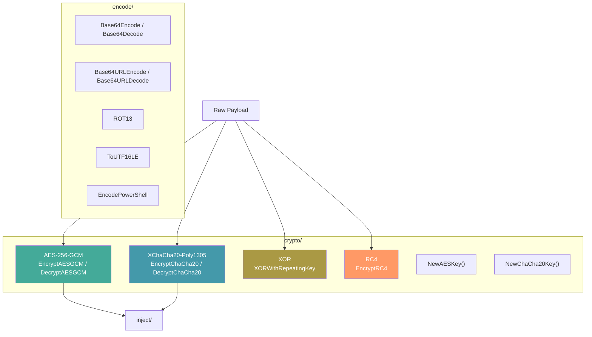

# Cryptography & Encoding

[<- Back to README](../../../README.md)

The `crypto/` and `encode/` packages provide payload encryption and encoding: AES-256-GCM, XChaCha20-Poly1305, XOR, RC4, Base64, ROT13, and UTF-16LE encoding for PowerShell.

---

## Architecture Overview

## Documentation

| Document | Description |
|----------|-------------|
| [Payload Encryption](payload-encryption.md) | AES-GCM, ChaCha20, XOR, RC4, Base64, ROT13 |

## MITRE ATT&CK

| Technique | ID | Description |
|-----------|-----|-------------|
| Obfuscated Files or Information | [T1027](https://attack.mitre.org/techniques/T1027/) | Payload encryption and encoding |

## D3FEND Countermeasures

| Countermeasure | ID | Description |
|----------------|-----|-------------|
| Static Executable Analysis | [D3-SEA](https://d3fend.mitre.org/technique/d3f:StaticExecutableAnalysis/) | Detect encrypted/encoded payloads |

## Security Levels

| Algorithm | Security | Use Case |
|-----------|----------|----------|
| AES-256-GCM | Cryptographic | Primary payload encryption |
| XChaCha20-Poly1305 | Cryptographic | Alternative to AES (no AES-NI needed) |
| XOR | Obfuscation only | Quick payload obfuscation, not security |
| RC4 | Broken | Compatibility with legacy tools only |
| Base64 | Encoding (no security) | Transport encoding |
| ROT13 | Trivial | String obfuscation |
