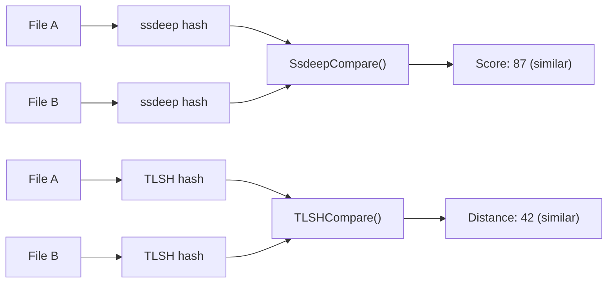

# Fuzzy Hashing (ssdeep + TLSH)

[<- Back to Crypto Overview](README.md)

**Package:** `hash`
**Platform:** Cross-platform
**Detection:** N/A (analysis tool)

---

## Primer

Traditional hashes (MD5, SHA256) change completely when even one byte is modified. **Fuzzy hashes** produce similar outputs for similar inputs, making them useful for detecting malware variants, comparing payloads, and measuring how different two files are.

- **ssdeep** — context-triggered piecewise hashing. Score 0-100 (100 = identical).
- **TLSH** — trend locality sensitive hashing. Distance 0 = identical, lower = more similar.

---

## How It Works



**Minimum input sizes:**
- ssdeep: works on any input, but very short inputs produce unreliable hashes
- TLSH: 50 bytes minimum (library enforced), 256+ bytes recommended for reliable results

---

## Usage

```go
import "github.com/oioio-space/maldev/hash"

// Compute hashes
s, _ := hash.SsdeepFile("payload_v1.exe")
t, _ := hash.TLSHFile("payload_v1.exe")

// Compare two files
s1, _ := hash.SsdeepFile("payload_v1.exe")
s2, _ := hash.SsdeepFile("payload_v2.exe")
score, _ := hash.SsdeepCompare(s1, s2) // 0-100, higher = more similar

t1, _ := hash.TLSHFile("payload_v1.exe")
t2, _ := hash.TLSHFile("payload_v2.exe")
dist, _ := hash.TLSHCompare(t1, t2) // 0+, lower = more similar
```

---

## Advanced — Batch Similarity Scan

Screen a directory of candidate PEs against a known-malicious baseline.
Files that score ≥ 70 on ssdeep or ≤ 100 distance on TLSH are probably
variants of the same family.

```go
import (
    "fmt"
    "os"
    "path/filepath"

    "github.com/oioio-space/maldev/hash"
)

func scanVariants(baseline, dir string, ssdeepThreshold, tlshMax int) error {
    bSS, _ := hash.SsdeepFile(baseline)
    bTL, _ := hash.TLSHFile(baseline)

    return filepath.WalkDir(dir, func(path string, d os.DirEntry, err error) error {
        if err != nil || d.IsDir() {
            return err
        }
        score, _ := hash.SsdeepCompare(bSS, func() string { h, _ := hash.SsdeepFile(path); return h }())
        dist, _ := hash.TLSHCompare(bTL, func() string { h, _ := hash.TLSHFile(path); return h }())

        if score >= ssdeepThreshold || (dist >= 0 && dist <= tlshMax) {
            fmt.Printf("variant  ssdeep=%d tlsh=%d  %s\n", score, dist, path)
        }
        return nil
    })
}

func main() {
    _ = scanVariants("known_bad.exe", `C:\Samples`, 70, 100)
}
```

---

## Combined Example — UPXMorph vs SHA256 vs Fuzzy Hashing

This example is the core demonstration of **why fuzzy hashing exists**.

`UPXMorph` replaces the eight-byte section names (`UPX0`, `UPX1`, `UPX2`)
with random strings. That tiny change flips the SHA256 completely — the
blocklist entry for the original hash is now useless. But 8 bytes out of
hundreds of kilobytes is nothing structurally: ssdeep and TLSH see
essentially the same binary and report high similarity.

```go
package main

import (
    "fmt"
    "os"

    "github.com/oioio-space/maldev/hash"
    "github.com/oioio-space/maldev/pe/morph"
)

func main() {
    packed, err := os.ReadFile("implant-upx.exe")
    if err != nil {
        fmt.Fprintln(os.Stderr, err)
        os.Exit(1)
    }

    // --- Before morphing ---
    sha256Before := hash.SHA256(packed)
    ssBefore, _  := hash.Ssdeep(packed)
    tlBefore, _  := hash.TLSH(packed)

    // --- Apply morph (only 8 bytes of section names change) ---
    morphed, err := morph.UPXMorph(packed)
    if err != nil {
        fmt.Fprintln(os.Stderr, "morph:", err)
        os.Exit(1)
    }

    // --- After morphing ---
    sha256After := hash.SHA256(morphed)
    ssAfter, _  := hash.Ssdeep(morphed)
    tlAfter, _  := hash.TLSH(morphed)

    // --- Compare ---
    ssScore, _ := hash.SsdeepCompare(ssBefore, ssAfter)
    tlDist, _  := hash.TLSHCompare(tlBefore, tlAfter)

    fmt.Println("=== SHA-256 (traditional hash) ===")
    fmt.Println(" before:", sha256Before)
    fmt.Println(" after: ", sha256After)
    fmt.Println(" same?  ", sha256Before == sha256After) // false — hash-based blocklist evaded

    fmt.Println()
    fmt.Println("=== ssdeep (fuzzy) ===")
    fmt.Printf(" score: %d / 100  (100 = identical, >70 = same family)\n", ssScore)

    fmt.Println()
    fmt.Println("=== TLSH (fuzzy) ===")
    fmt.Printf(" distance: %d  (0 = identical, <50 = very close, >200 = unrelated)\n", tlDist)

    // Typical output for a morphed UPX binary:
    //
    //   SHA-256 before: 3a7f2c...e91b
    //   SHA-256 after:  d84c10...5f02   ← completely different → blocklist miss
    //   same?           false
    //
    //   ssdeep score:   97 / 100        ← near-identical → variant detected
    //   TLSH distance:  12              ← negligible neighbourhood change
    //
    // Conclusion: a defender relying solely on SHA-256 is blind to the morphed
    // copy. A defender running ssdeep/TLSH catches it immediately.
    _ = os.WriteFile("implant-morphed.exe", morphed, 0o644)
}
```

The comment block at the end shows realistic numbers. A UPX morph changes
**24 bytes** (three 8-byte section name fields) out of a binary that is
typically 200 KB+. SHA256 treats that as a brand-new file. ssdeep's
piecewise blocks and TLSH's locality-sensitive bucketing both see the
99.99 % of the binary that did not change.

---

## API Reference

```go
// Cryptographic hashes (one-shot, no streaming variant).
func MD5(data []byte) string
func SHA1(data []byte) string
func SHA256(data []byte) string
func SHA512(data []byte) string

// ROR13 — the per-name hash used by classic API-hashing payloads.
// ROR13Module is the module-name variant (case-insensitive after
// uppercasing).
func ROR13(name string) uint32
func ROR13Module(name string) uint32

// ssdeep — context-triggered piecewise hashing. The hash string
// looks like "12:abcd…:efgh…"; the leading number is the block-size
// magnitude.
func Ssdeep(data []byte) (string, error)
func SsdeepFile(path string) (string, error)

// SsdeepCompare returns a similarity score in [0, 100]; higher = more
// similar. Comparison only works when both hashes share an adjacent
// block-size magnitude.
func SsdeepCompare(hash1, hash2 string) (int, error)

// TLSH — locality-sensitive hash, fixed 70-byte hex strings.
// Trend Micro's algorithm; works on any input >= 50 bytes.
func TLSH(data []byte) (string, error)
func TLSHFile(path string) (string, error)

// TLSHCompare returns the TLSH distance: 0 = identical, lower =
// more similar. Roughly: <30 high similarity, <70 same family,
// >100 unrelated.
func TLSHCompare(hash1, hash2 string) (int, error)
```

See also [crypto.md](../../crypto.md) for the area-doc summary.
