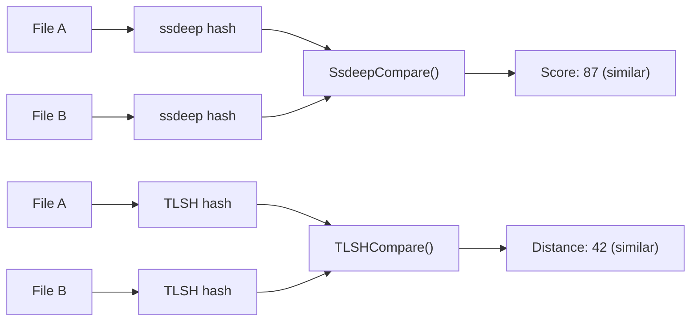

# Fuzzy Hashing (ssdeep + TLSH)

[<- Back to Crypto Overview](README.md)

**Package:** `hash`
**Platform:** Cross-platform
**Detection:** N/A (analysis tool)

---

## For Beginners

Traditional hashes (MD5, SHA256) change completely when even one byte is modified. **Fuzzy hashes** produce similar outputs for similar inputs, making them useful for detecting malware variants, comparing payloads, and measuring how different two files are.

- **ssdeep** — context-triggered piecewise hashing. Score 0-100 (100 = identical).
- **TLSH** — trend locality sensitive hashing. Distance 0 = identical, lower = more similar.

---

## How It Works



**Minimum input sizes:**
- ssdeep: works on any input, but very short inputs produce unreliable hashes
- TLSH: 50 bytes minimum (library enforced), 256+ bytes recommended for reliable results

---

## Usage

```go
import "github.com/oioio-space/maldev/hash"

// Compute hashes
s, _ := hash.SsdeepFile("payload_v1.exe")
t, _ := hash.TLSHFile("payload_v1.exe")

// Compare two files
s1, _ := hash.SsdeepFile("payload_v1.exe")
s2, _ := hash.SsdeepFile("payload_v2.exe")
score, _ := hash.SsdeepCompare(s1, s2) // 0-100, higher = more similar

t1, _ := hash.TLSHFile("payload_v1.exe")
t2, _ := hash.TLSHFile("payload_v2.exe")
dist, _ := hash.TLSHCompare(t1, t2) // 0+, lower = more similar
```

---

## API Reference

See [crypto.md](../../crypto.md)
