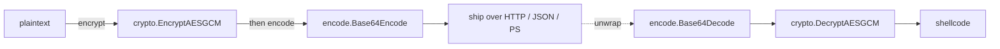

# Encode techniques

[← maldev README](../../../README.md) · [docs/index](../../index.md)

The `encode/` package provides **transport-safe** byte transformations:
Base64 (standard + URL-safe), UTF-16LE, ROT13, and the
PowerShell `-EncodedCommand` format. Encoding is never confidentiality —
it survives channels that mangle arbitrary bytes (HTTP headers, JSON
strings, PowerShell command lines, stdin pipes).

## TL;DR

Encrypt first, then encode. Decode last, then decrypt.

## Packages

| Package | Tech page | Detection | One-liner |
|---|---|---|---|
| [`encode`](https://pkg.go.dev/github.com/oioio-space/maldev/encode) | [encode.md](encode.md) | very-quiet | Base64 (std + URL), UTF-16LE, ROT13, PowerShell `-EncodedCommand` |

## Quick decision tree

| You want to… | Use |
|---|---|
| …embed a binary blob in Go source / JSON / HTTP header | [`encode.Base64Encode`](encode.md#base64encodedata-byte-string) |
| …pass a payload through a URL or filename | [`encode.Base64URLEncode`](encode.md#base64urlencodedata-byte-string) |
| …feed a Windows API that takes UTF-16 LPWSTR | [`encode.ToUTF16LE`](encode.md#toutf16les-string-byte) |
| …run a PowerShell script via `-EncodedCommand` | [`encode.PowerShell`](encode.md#powershellscript-string-string) |
| …break a static string signature on Win32 API names | [`encode.ROT13`](encode.md#rot13s-string-string) (novelty) |

## MITRE ATT&CK

| T-ID | Name | Packages | D3FEND counter |
|---|---|---|---|
| [T1027](https://attack.mitre.org/techniques/T1027/) | Obfuscated Files or Information | `encode` (PowerShell, Base64) | D3-SEA |
| [T1027.013](https://attack.mitre.org/techniques/T1027/013/) | Encrypted/Encoded File | `encode` (Base64 wrapper for ciphertext) | D3-FCR |
| [T1140](https://attack.mitre.org/techniques/T1140/) | Deobfuscate/Decode Files or Information | `encode.Base64Decode`, `encode.Base64URLDecode` | D3-FCR |

## See also

- [`crypto`](../crypto/README.md) — confidentiality layer (encrypt
  before encoding).
- [Operator path: stagers and encoders](../../by-role/operator.md)
- [Detection eng path: `-EncodedCommand` hunting](../../by-role/detection-eng.md)
